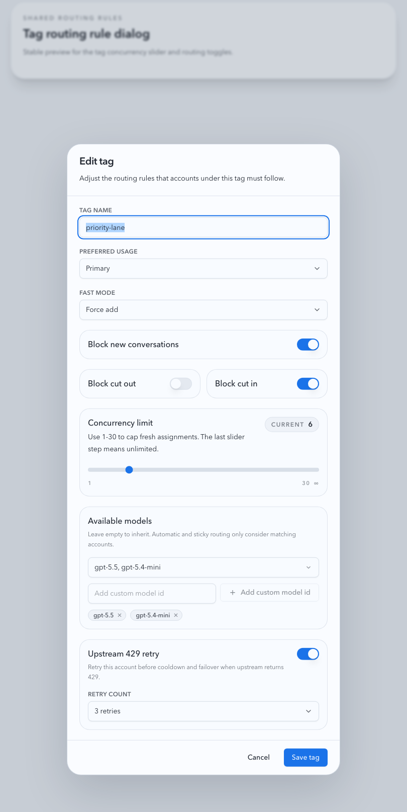
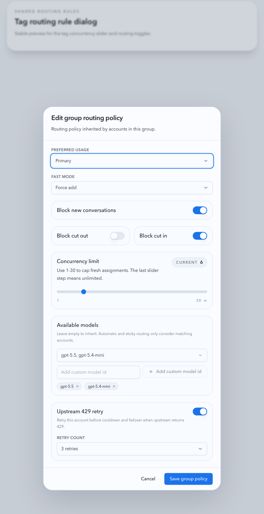
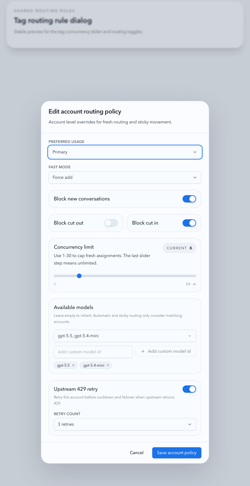
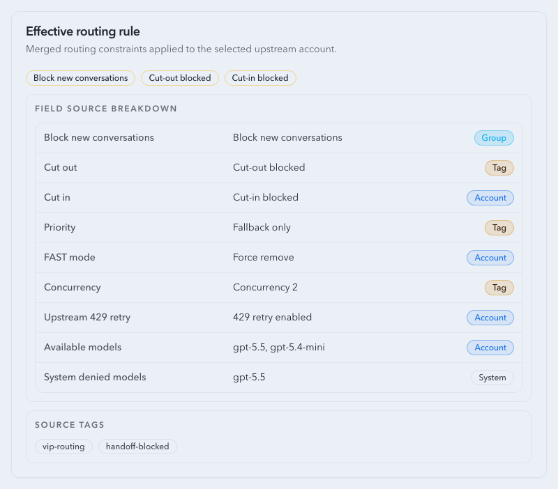
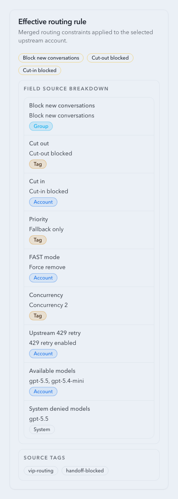

# Upstream Account Policy Inheritance

Spec ID: r4p9x

## Goal

Upstream account routing policy is resolved through three layers:

1. Group policy
2. Tag policy
3. Account policy

Each layer can override inherited values for the account-pool routing surface. The final effective policy is used by account selection, sticky cut-in/cut-out, FAST mode rewriting, concurrency limiting, and upstream 429 retry.

## Policy Surface

The inherited policy covers:

- priority tier
- FAST mode rewrite mode
- block new conversations
- allow cut-out
- allow cut-in
- concurrency limit
- upstream 429 retry enabled
- upstream 429 max retries
- available models
- system denied models

Root defaults preserve existing behavior:

- priority tier: normal
- FAST mode rewrite mode: keep original
- block new conversations: disabled
- allow cut-out: enabled
- allow cut-in: enabled
- concurrency limit: unlimited
- upstream 429 retry: disabled
- upstream 429 max retries: 0
- available models: unrestricted
- system denied models: none

## Resolution

Effective account policy is computed in this order:

1. Start with root defaults.
2. Apply group policy.
3. Merge all account tags conservatively and apply the merged tag layer.
4. Apply account policy.

When an account has multiple tags, the tag layer keeps the existing conservative semantics:

- stricter priority wins toward fallback
- stricter FAST rewrite wins toward force remove
- cut-in and cut-out are allowed only if every tag allows them
- block new conversations is enabled if any group, tag, or account layer enables it
- the smallest non-zero concurrency limit wins
- upstream 429 retry is enabled if any tag enables it, with the highest retry count
- available models intersect across every tag that defines a non-empty list

`availableModels` follows inheritance semantics across group, tag, and account policy:

- missing or empty means inherit the upstream layer
- there is no fourth state for “explicitly clear to unrestricted”
- a tag without `availableModels` does not widen a sibling tag’s constraint
- account policy may replace the inherited/tag-intersected model set with its own non-empty list

System deny tags are merged into the same effective model policy but remain non-editable:

- tags with `system_key=unsupported_model:<model>` append `<model>` to `systemDeniedModels`
- `systemDeniedModels` always behave as a deny layer, regardless of group/tag/account allowlists
- system-discovered deny state is shown in effective policy sources as `system`, but is not written back into editable `availableModels`

## Sticky Transfer Policy

`allow cut-out` is an automatic-routing boundary for the sticky source account. When the effective source policy forbids cut-out, the resolver must keep the conversation assigned to that account and fail there rather than automatically selecting another account, even when the sticky account has a transport failure, first-byte timeout, temporary route-key exclusion, cooldown, or other failover pressure.

The only supported exception is an explicit Prompt Cache conversation binding written by an operator. A manual upstream-account or group binding may move the conversation out of a no-cut-out sticky source; the target side still honors the binding contract and its existing target eligibility rules.

HTTP 4xx responses are not route-health successes for sticky routing. They remain recorded as failed invocations and upstream attempts with the real account, status, and error details, but they must not update `pool_sticky_routes`.

`blockNewConversations` / `block_new_conversations` is a hard fresh-routing gate. If a group, tag, or account layer sets it to true, the final effective rule is true and lower layers cannot clear the inherited block. It only excludes the account from new routing candidates, including requests without a sticky key. Existing sticky reuse can still resolve to that account, and sticky migration continues to be controlled by `allowCutIn`.

Legacy rolling guard fields (`guardEnabled`, `lookbackHours`, `maxConversations`, and `guardRules`) are not part of the policy surface. Existing stored rolling guard data is ignored rather than migrated into the hard block.

## API Contract

Group summaries expose `routingRule`. Group update payloads accept `routingRule`.

Tag create/update payloads accept the full policy surface.

Account update payloads accept `routingRule`. Missing `routingRule` preserves account-level overrides; present fields override the inherited effective policy for that account.

Effective account responses expose field-level sources so the UI can show whether each final value came from the root default, group, merged tag layer, account override, or system deny.

Automatic candidate selection and sticky reuse must filter by the final model policy before scoring candidates:

- explicit account or group bindings still bypass automatic candidate filtering as they do today
- unconstrained routing first checks exact model ID matches
- if exact match fails, dated aliases may fall back to the existing base-model alias rule
- accounts denied for the requested model must be excluded from automatic and sticky migration candidates before retry/failover scoring

Legacy `unsupported_model:gpt-5.5` handling is treated as one instance of the generic system deny rule rather than a special-case routing branch.

## Non-Goals

- Proxy binding, node shunt, and notes are not part of inherited routing policy.
- Tag explicit ordering is not introduced.
- OAuth/API key credential behavior is unchanged.
- Global reverse-proxy `/v1/*` settings are unchanged.

## Visual Evidence

Visual evidence is captured from stable Storybook scenarios for:

- tag policy dialog with shared available-model editing and custom model chips
- group routing policy editor reusing the same available-model editor
- account routing policy editor reusing the same available-model editor
- effective routing rule card showing available-model source and system deny state on desktop and narrow mobile widths

PR: include

PR: include

PR: include

PR: include

PR: include

