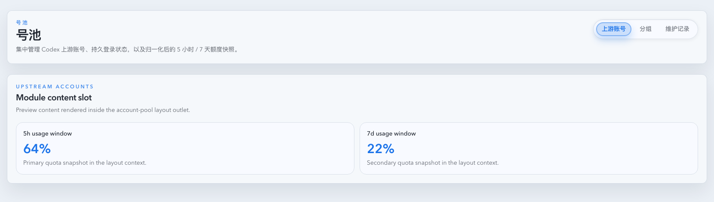
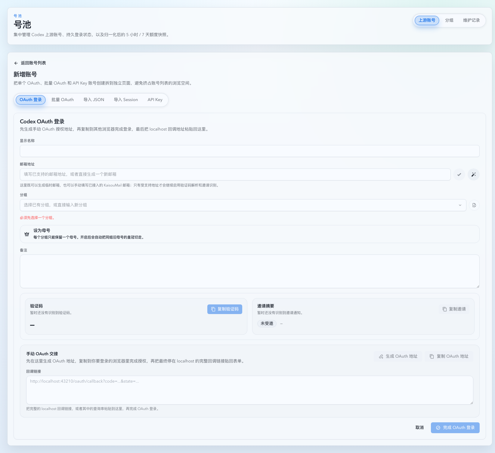
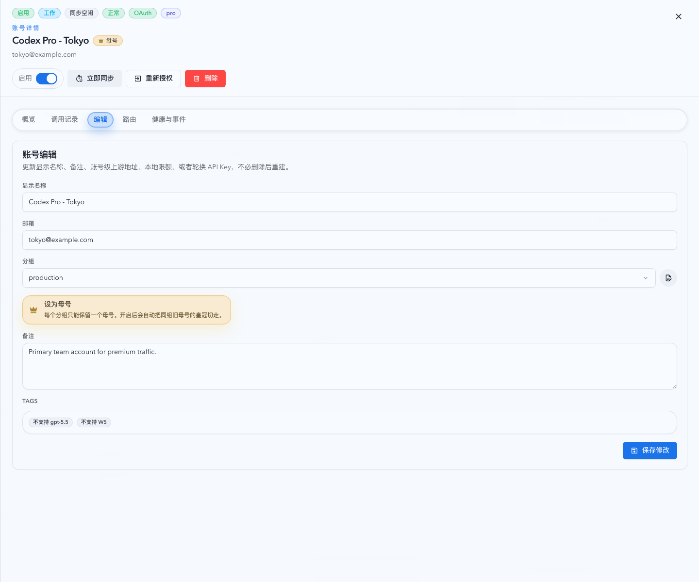
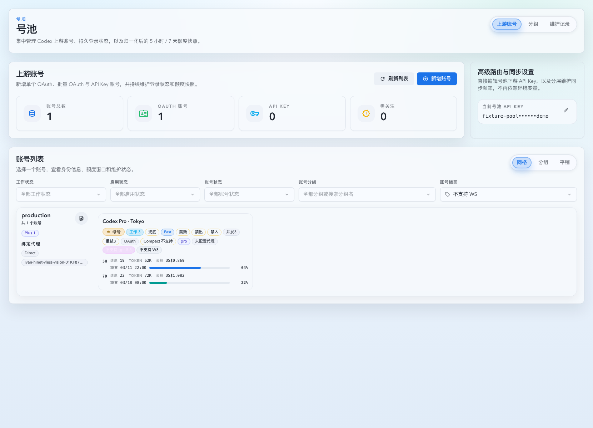
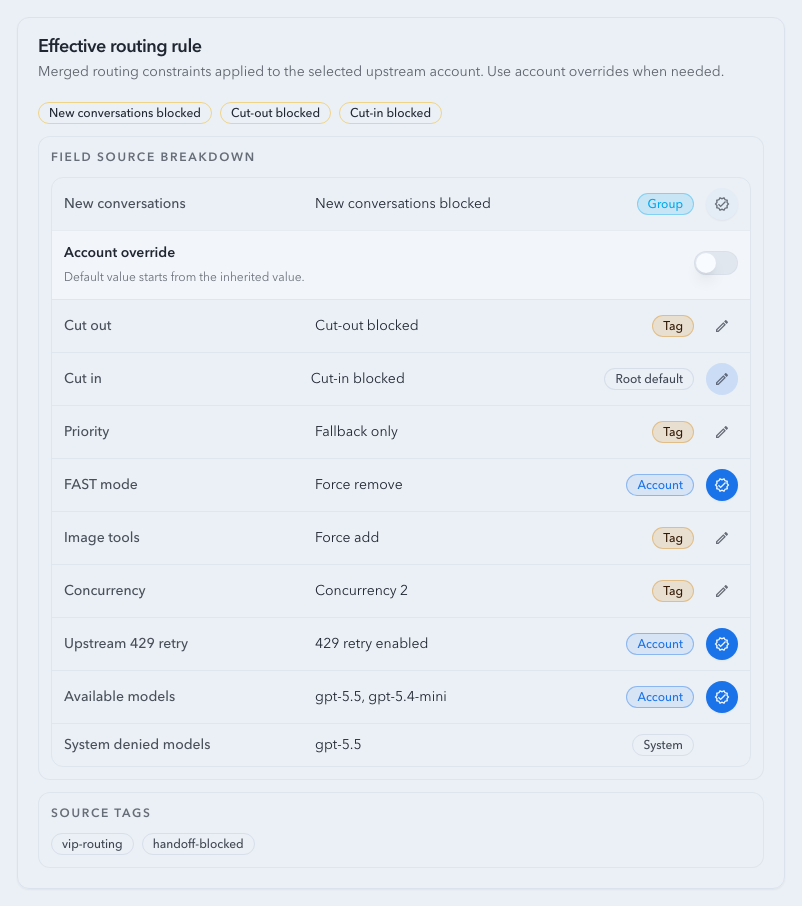

# Upstream Account Policy Inheritance

Spec ID: r4p9x

## Goal

Upstream account routing policy is resolved through three layers:

1. Group policy
2. Read-only system tag signals
3. Account policy

Only group and account policy are operator-editable. Tags are no longer a user-managed policy layer. The account-pool UI may display and filter system tags, but tag creation, editing, deletion, manual attach/detach, and tag-based policy authoring are not supported.

## Policy Surface

The editable inherited policy covers:

- priority tier
- FAST mode rewrite mode
- image tool rewrite mode
- new conversations
- cut-out
- cut-in
- concurrency limit
- upstream 429 retry enabled
- upstream 429 max retries
- available models

Root defaults preserve existing behavior:

- priority tier: normal
- FAST mode rewrite mode: keep original
- new conversations: allowed
- cut-out: allowed
- cut-in: allowed
- concurrency limit: unlimited
- upstream 429 retry: disabled
- upstream 429 max retries: 0
- image tool rewrite mode: keep original
- available models: unrestricted

Accounts also track read-only system signals alongside editable policy:

- `systemDeniedModels`
- observed image capability
- transport capability badges such as `unsupported_transport:websocket`

## Resolution

Effective account policy is computed in this order:

1. Start with root defaults.
2. Apply group policy.
3. Merge system tag signals.
4. Apply account policy.

System tags are not an editable routing authoring surface. Their current contract is:

- `unsupported_model:<model>` appends `<model>` to `systemDeniedModels`
- `unsupported_transport:websocket` remains a read-only transport signal for display and filtering
- future system tags may add internal signals, but they must remain operator read-only

`availableModels` follows only group/account inheritance semantics:

- missing or `null` means inherit the upstream layer
- there is no tag-level allowlist editing
- account policy may replace the inherited group/root model set with its own list
- an explicit empty account or group list means no models are allowed

## Image Tool Routing

The image-tool layer remains separate from the system-tag signal model:

- `imageToolRewriteMode` exists on group and account routing rules only
- account records persist a read-only `imageToolCapability`
- `image intent` classification is runtime four-state: `yes`, `direct_image`, `no`, or `unknown`
- `yes` routes only to image-compatible accounts
- `direct_image` represents direct image endpoints such as `/v1/images/generations|edits`; it also routes only to image-compatible accounts
- `unknown` keeps ordinary routing semantics and does not force image filtering
- `keep_original` treats `supported` and `unknown` accounts as image-compatible, and excludes `unsupported`
- `fill_missing` and `force_add` make the account image-compatible for routing
- `force_remove` makes the account image-incompatible for routing
- `fill_missing` only injects image tools when image intent is confirmed
- `force_add` always injects image tools
- `force_remove` always strips image tools
- `/v1/responses` and `/v1/responses/compact` may rewrite request bodies to satisfy the final account's rewrite mode
- `/v1/images/generations` and `/v1/images/edits` classify as `direct_image`, only filter by capability, and do not rewrite the body
- successful image-intent requests learn `imageToolCapability=supported`
- explicit unsupported image responses learn `imageToolCapability=unsupported`

## Sticky Transfer Policy

`allow cut-out` is an automatic-routing boundary for the sticky source account. When the effective source policy forbids cut-out, the resolver must keep the conversation assigned to that account and fail there rather than automatically selecting another account, even when the sticky account has a transport failure, first-byte timeout, temporary route-key exclusion, cooldown, or other failover pressure.

The only supported exception is an explicit Prompt Cache conversation binding written by an operator. A manual upstream-account or group binding may move the conversation out of a no-cut-out sticky source; the target side still honors the binding contract and its existing target eligibility rules.

HTTP 4xx responses are not route-health successes for sticky routing. They remain recorded as failed invocations and upstream attempts with the real account, status, and error details, but they must not update `pool_sticky_routes`.

`new conversations` is stored as positive nullable policy in `policy_allow_new_conversations`. An enabled switch means new conversations are allowed and stores `true`; a disabled switch means new conversations are forbidden and stores `false`. Legacy `policy_block_new_conversations` and `blockNewConversations` API response fields are compatibility surfaces only; new writes use `allowNewConversations`.

`new conversations`, `cut-out`, and `cut-in` are direct group/account overrides, not most-conservative merges. A lower editable layer that stores either `true` or `false` replaces the inherited value for that field. System tags may only add read-only deny/signal state; they are not a user-editable escape hatch.

Legacy rolling guard fields (`guardEnabled`, `lookbackHours`, `maxConversations`, and `guardRules`) are not part of the policy surface. Existing stored rolling guard data is ignored rather than migrated into the hard block.

## Tag Lifecycle Contract

The upstream-account module now treats tags as internal-only system data:

- application startup must delete every `pool_tags` row where `system_key IS NULL`
- startup cleanup must also delete matching `pool_upstream_account_tags` rows
- startup cleanup must clear any historical `pool_oauth_login_sessions.tag_ids_json` payloads
- account create, edit, relink, imported OAuth, external OAuth upsert, and batch account mutation requests must reject non-empty `tagIds` with a 4xx
- `GET /api/pool/tags` remains available only as a read-only system tag directory for list filtering and badge display

No migration, export, or policy flattening is performed for deleted custom tags.

## API Contract

Group summaries expose `routingRule`. Group update payloads accept `routingRule`.

Account summaries and detail responses expose:

- read-only `tags` for system badge display
- read-only `imageToolCapability`
- effective-rule field sources including `systemDeniedModels`

Account update payloads accept `routingRule`. Missing `routingRule` preserves account-level overrides. Inside a present `routingRule`, every account-policy field is tri-state:

- missing field: preserve that account override as stored
- `null`: clear that account override and inherit the upstream effective value
- value: store that value as the account override

The same tri-state semantics apply to group policy updates for nullable policy fields. Boolean `false` is a stored override value and must not be treated as absent.

`GET /api/pool/tags` returns only system tags and reports the directory as non-writable.

Automatic candidate selection and sticky reuse must filter by the final model policy before scoring candidates:

- explicit account or group bindings still bypass automatic candidate filtering as they do today
- unconstrained routing first checks exact model ID matches
- if exact match fails, dated aliases may fall back to the existing base-model alias rule
- accounts denied for the requested model must be excluded from automatic and sticky migration candidates before retry/failover scoring

Legacy `unsupported_model:gpt-5.5` handling is treated as one instance of the generic system deny rule rather than a special-case routing branch.

## Non-Goals

- Proxy binding, node shunt, and notes are not part of system tag policy.
- User-maintained tag policies, tag ordering, or tag routing dialogs are not reintroduced.
- Historical custom tag strategies are not migrated onto groups or accounts.
- Image capability is not an editable account control.
- There is no separate image-only pool or tag-level image-tool field.
- `/v1/chat/completions` image intent detection is not covered.
- Splitting text reasoning and image generation across two upstreams in the same Responses request is not introduced.
- OAuth/API key credential behavior is unchanged apart from rejecting manual `tagIds`.
- Global reverse-proxy `/v1/*` settings are unchanged.

## Visual Evidence

Visual evidence is captured from stable Storybook scenarios for:

- account-pool layout with the tag navigation entry removed
- upstream account create page without any tag editing controls
- upstream account detail edit view showing system tags as read-only badges
- upstream account list filtering by system tags while keeping system badges visible
- effective routing rule card inherited state, account override state, expanded inline editor state, field-level saving/error state, and explicit empty available-model override

PR: include

PR: include

PR: include

PR: include

PR: include

