# Upstream Account Policy Inheritance

Spec ID: r4p9x

## Goal

Upstream account routing policy is resolved through three layers:

1. Group policy
2. Read-only system tag signals
3. Account policy

Only group and account policy are operator-editable. Tags are no longer a user-managed policy layer. The account-pool UI may display and filter system tags, but tag creation, editing, deletion, manual attach/detach, and tag-based policy authoring are not supported.

## Policy Surface

The editable inherited policy covers:

- priority tier
- FAST mode rewrite mode
- image tool rewrite mode
- new conversations
- cut-out
- cut-in
- concurrency limit
- upstream 429 retry count (`0..5`)
- available models
- status-change trigger reasons for:
  - `upstream_http_401`
  - `upstream_http_402`
  - `upstream_http_403`
  - `reauth_required`
  - `upstream_http_429_rate_limit`
  - `upstream_http_429_quota_exhausted`
  - `usage_snapshot_exhausted`
  - `quota_still_exhausted`
  - `transport_failure`
  - `upstream_server_overloaded`
  - `upstream_http_5xx`
- request-path timeout overrides for:
  - `responsesFirstByteTimeoutSecs`
  - `compactFirstByteTimeoutSecs`
  - `responsesStreamTimeoutSecs`
  - `compactStreamTimeoutSecs`

Root defaults preserve existing behavior:

- priority tier: normal
- FAST mode rewrite mode: keep original
- new conversations: allowed
- cut-out: allowed
- cut-in: allowed
- concurrency limit: unlimited
- upstream 429 retry: disabled
- upstream 429 max retries: 0
- image tool rewrite mode: keep original
- available models: unrestricted
- every status-change reason toggle: enabled
- request-path timeouts continue to use the existing global pool defaults

Accounts also track read-only system signals alongside editable policy:

- `systemDeniedModels`
- observed image capability
- transport capability badges such as `unsupported_transport:websocket`

## Resolution

Effective account policy is computed in this order:

1. Start with root defaults.
2. Apply group policy.
3. Merge system tag signals.
4. Apply account policy.

Status-change reason toggles follow the same `group -> system -> account` resolution envelope with one restriction:

1. Start with root defaults where every listed reason is enabled.
2. Apply group per-reason overrides.
3. Ignore the system tag layer for this policy family.
4. Apply account per-reason overrides.

`conversation` overrides do not participate in this policy family.

Request-path timeouts are resolved per field through a separate inheritance chain:

1. Start with the global/root pool timeout defaults.
2. Apply group timeout overrides.
3. Apply account timeout overrides.
4. Apply conversation timeout overrides.

Timeout inheritance is field-local:

- missing or unset means inherit
- a positive integer stores an explicit override
- clearing one timeout field only clears that field

Tags and system-tag signals never contribute timeout values or timeout sources.

Forward-proxy bindings are resolved independently from routing policy and timeout inheritance:

1. Conversation proxy override
2. Account proxy override
3. Group proxy binding

Each layer may store a list of existing forward-proxy binding keys, including `__direct__`. An empty account list means inherit the group list; an empty conversation list means inherit the selected account/group scope.

An explicit proxy list is a hard constraint. Runtime must select only from the configured list, keep the current selected node sticky for that scope, and switch to the next best selectable node from the same list only after the existing consecutive network-failure threshold is reached. If every explicit node is unavailable, routing fails with the existing proxy/account readiness error instead of falling back to an upstream layer or automatic proxy routing.

System tags are not an editable routing authoring surface. Their current contract is:

- `unsupported_model:<model>` appends `<model>` to `systemDeniedModels`
- `unsupported_transport:websocket` remains a read-only transport signal for display and filtering
- future system tags may add internal signals, but they must remain operator read-only

`availableModels` follows only group/account inheritance semantics:

- missing or `null` means inherit the upstream layer
- there is no tag-level allowlist editing
- account policy may replace the inherited group/root model set with its own list
- an explicit empty account or group list means no models are allowed

## Image Tool Routing

The image-tool layer remains separate from the system-tag signal model:

- `imageToolRewriteMode` exists on group and account routing rules only
- account records persist a read-only `imageToolCapability`
- `image intent` classification is runtime four-state: `yes`, `direct_image`, `no`, or `unknown`
- `yes` routes only to image-compatible accounts
- `direct_image` represents direct image endpoints such as `/v1/images/generations|edits`; it also routes only to image-compatible accounts
- `unknown` keeps ordinary routing semantics and does not force image filtering
- `keep_original` treats `supported` and `unknown` accounts as image-compatible, and excludes `unsupported`
- `fill_missing` and `force_add` make the account image-compatible for routing
- `force_remove` makes the account image-incompatible for routing
- `fill_missing` only injects image tools when image intent is confirmed
- `force_add` always injects image tools
- `force_remove` always strips image tools
- `/v1/responses` and `/v1/responses/compact` may rewrite request bodies to satisfy the final account's rewrite mode
- `/v1/images/generations` and `/v1/images/edits` classify as `direct_image`, only filter by capability, and do not rewrite the body
- successful image-intent requests learn `imageToolCapability=supported`
- explicit unsupported image responses learn `imageToolCapability=unsupported`

## Sticky Transfer Policy

`allow cut-out` is an automatic-routing boundary for the sticky source account. When the effective source policy forbids cut-out, the resolver must keep the conversation assigned to that account and fail there rather than automatically selecting another account, even when the sticky account has a transport failure, first-byte timeout, temporary route-key exclusion, cooldown, or other failover pressure.

The only supported exception is an explicit Prompt Cache conversation binding written by an operator. A manual upstream-account or group binding may move the conversation out of a no-cut-out sticky source; the target side still honors the binding contract and its existing target eligibility rules.

HTTP 4xx responses are not route-health successes for sticky routing. They remain recorded as failed invocations and upstream attempts with the real account, status, and error details, but they must not update `pool_sticky_routes`.

`new conversations` is stored as positive nullable policy in `policy_allow_new_conversations`. An enabled switch means new conversations are allowed and stores `true`; a disabled switch means new conversations are forbidden and stores `false`. Legacy `policy_block_new_conversations` and `blockNewConversations` API response fields are compatibility surfaces only; new writes use `allowNewConversations`.

`new conversations`, `cut-out`, and `cut-in` are direct group/account overrides, not most-conservative merges. A lower editable layer that stores either `true` or `false` replaces the inherited value for that field. System tags may only add read-only deny/signal state; they are not a user-editable escape hatch.

Legacy rolling guard fields (`guardEnabled`, `lookbackHours`, `maxConversations`, and `guardRules`) are not part of the policy surface. Existing stored rolling guard data is ignored rather than migrated into the hard block.

## Tag Lifecycle Contract

The upstream-account module now treats tags as internal-only system data:

- application startup must delete every `pool_tags` row where `system_key IS NULL`
- startup cleanup must also delete matching `pool_upstream_account_tags` rows
- startup cleanup must clear any historical `pool_oauth_login_sessions.tag_ids_json` payloads
- account create, edit, relink, imported OAuth, external OAuth upsert, and batch account mutation requests must reject non-empty `tagIds` with a 4xx
- `GET /api/pool/tags` remains available only as a read-only system tag directory for list filtering and badge display

No migration, export, or policy flattening is performed for deleted custom tags.

## API Contract

Group summaries expose `routingRule`. Group update payloads accept `routingRule`.

Account summaries and detail responses expose:

- read-only `tags` for system badge display
- read-only `imageToolCapability`
- account-level `boundProxyKeys`
- effective-rule field sources including `systemDeniedModels`
- effective request-path `timeouts`
- request-path `timeoutFieldSources`

Account update payloads accept `routingRule` and `boundProxyKeys`. Missing `boundProxyKeys` preserves account-level proxy overrides; `null` or an empty list clears the account override and inherits the group proxy binding; a non-empty list stores an account-level hard proxy list after canonicalization and selectable-node validation.

Missing `routingRule` preserves account-level overrides. Inside a present `routingRule`, every account-policy field is tri-state:

- missing field: preserve that account override as stored
- `null`: clear that account override and inherit the upstream effective value
- value: store that value as the account override

`statusChangeReasons` uses the same nested tri-state semantics per reason key:

- missing object: preserve all stored per-reason overrides
- missing reason key inside a present object: preserve that stored reason override
- `null`: clear that reason override and inherit
- `true|false`: store that reason override

The same tri-state semantics apply to group policy updates for nullable policy fields. Boolean `false` is a stored override value and must not be treated as absent.

Timeout writes use the same preserve / clear / set contract, but per timeout field:

- missing field: preserve the stored timeout override
- `null`: clear that timeout override and inherit
- positive integer: store that timeout override

UI may render `root` as `global`, but the wire/source token remains `root`.

Legacy `upstream_rejected` remains read-compatible only. Runtime must resolve it through the `upstream_http_402` toggle and must not expose a separate editable reason key.

When a listed reason resolves to `false`, runtime still records invocation and upstream-attempt evidence and must add a neutral account event carrying the original `reasonCode`, `httpStatus`, and message. Suppressed reasons must not mutate account status, cooldown, route-failure bookkeeping, failure counters, or latest-action fields that feed health/work derivation. Sync bookkeeping may still advance the non-health `lastSyncedAt` timestamp so maintenance cadence remains stable.

`GET /api/pool/tags` returns only system tags and reports the directory as non-writable.

Automatic candidate selection and sticky reuse must filter by the final model policy before scoring candidates:

- explicit account or group bindings still bypass automatic candidate filtering as they do today
- unconstrained routing first checks exact model ID matches
- if exact match fails, dated aliases may fall back to the existing base-model alias rule
- accounts denied for the requested model must be excluded from automatic and sticky migration candidates before retry/failover scoring

## Owner-Facing UI Contract

Status-change trigger reasons use the same flattened reason list on every owner-facing surface.

- reason controls render as pressed/unpressed button-style tiles with icon + name only
- they do not use slider switches, category headers, or separate batch-toggle rows
- group policy surfaces keep per-reason editing only
- the account detail Routing tab exposes one panel-level reset action that clears just the account-layer reason overrides for this policy family
- per-reason account edits still happen by pressing the individual tiles; reset is the only bulk clear affordance on the account detail surface

Legacy `unsupported_model:gpt-5.5` handling is treated as one instance of the generic system deny rule rather than a special-case routing branch.

## Non-Goals

- Forward-proxy binding, node shunt, and notes are not part of system tag policy.
- User-maintained tag policies, tag ordering, or tag routing dialogs are not reintroduced.
- Historical custom tag strategies are not migrated onto groups or accounts.
- Image capability is not an editable account control.
- There is no separate image-only pool or tag-level image-tool field.
- `/v1/chat/completions` image intent detection is not covered.
- Splitting text reasoning and image generation across two upstreams in the same Responses request is not introduced.
- OAuth/API key credential behavior is unchanged apart from rejecting manual `tagIds`.
- Global reverse-proxy `/v1/*` settings are unchanged.

## Visual Evidence

Visual evidence is captured from stable Storybook scenarios for:

- account-pool layout with the tag navigation entry removed
- upstream account create page without any tag editing controls
- upstream account detail edit view showing system tags as read-only badges
- upstream account list filtering by system tags while keeping system badges visible
- effective routing rule card inherited state, account override state, expanded inline editor state, field-level saving/error state, and explicit empty available-model override
- effective routing rule card opening every existing account override panel by default
- effective routing rule card rendering available-model overrides as a tag selector
- effective routing rule card rendering upstream 429 retry as a `0..5` inline count selector without a separate toggle
- group/account routing dialogs showing mixed inherited/global timeout defaults with timeout rows collapsed until the current layer explicitly overrides a field
- account effective-rule card showing timeout source badges, inherited timeout rows collapsed by default, account-owned timeout rows expanded by default, and single-field clear-to-inherit rollback
- account detail Routing tab showing account-level forward-proxy bindings, inherited group bindings, and sticky failover semantics without the old "edit account policy" button
- Groups page opening the shared group routing policy dialog with flat status-change reason toggle tiles
- Upstream Accounts grouped roster opening the shared group routing policy dialog with the same flat status-change reason toggle tiles
- Upstream account detail Routing tab showing page-level status-change reason toggle tiles plus the panel-level account reset action inside the full drawer context
- Group settings Routing tab showing the embedded routing-policy upstream 429 retry count as the same integrated `0..5` selector used by account detail, with `0` representing no retry, in both desktop and narrow layouts
- Dashboard upstream-account quick policy chips showing explicit Fast rewrite labels for `force_add` and `keep_original`

PR: include

PR: include

PR: include

PR: include

PR: include

PR: include
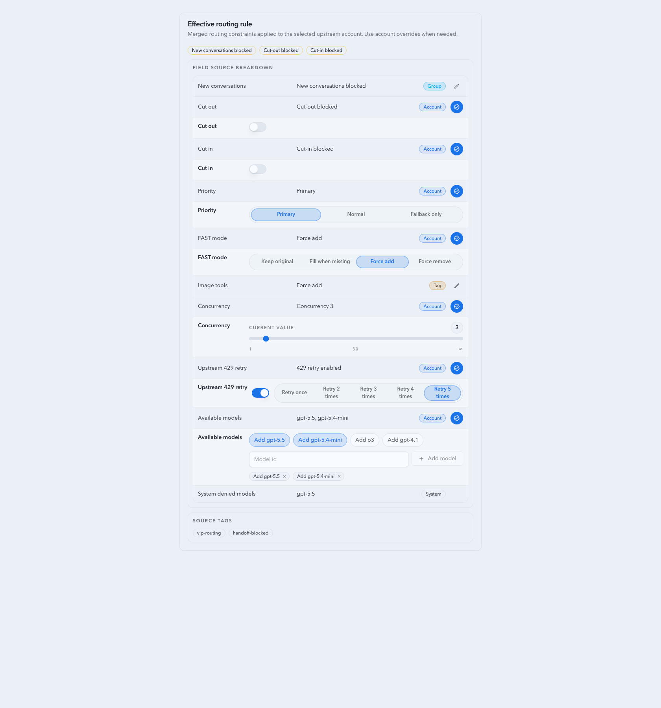

PR: include
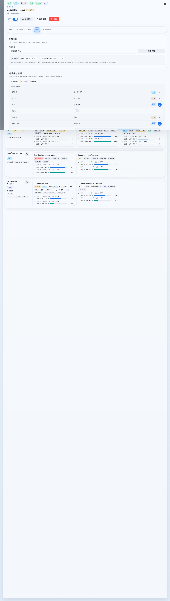

PR: include
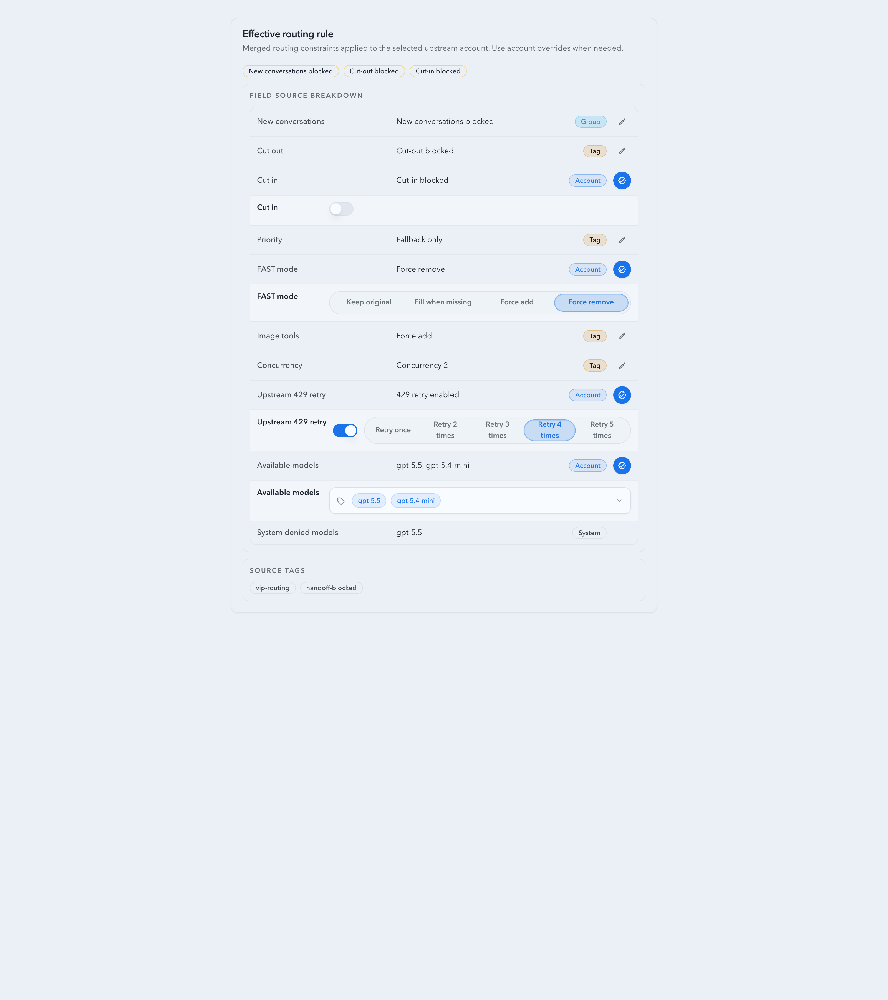

PR: include
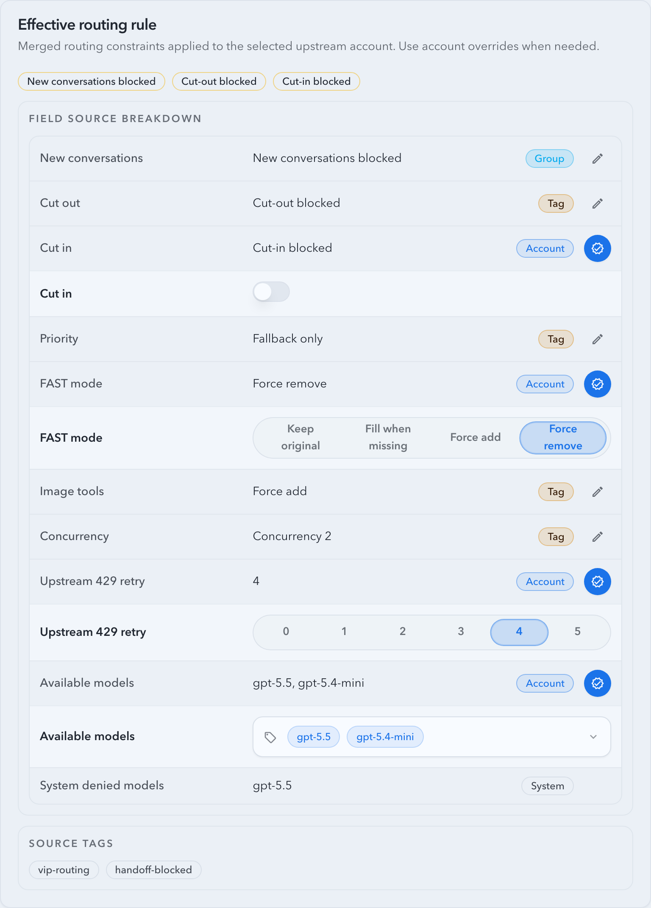

PR: include
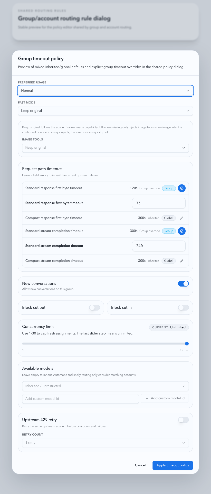

PR: include
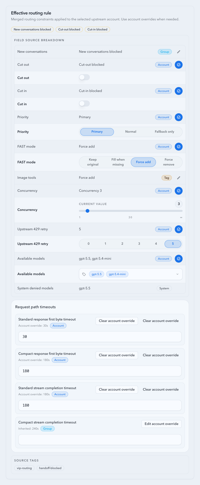

PR: include
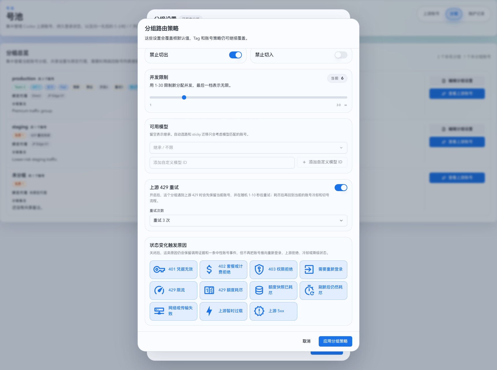

PR: include
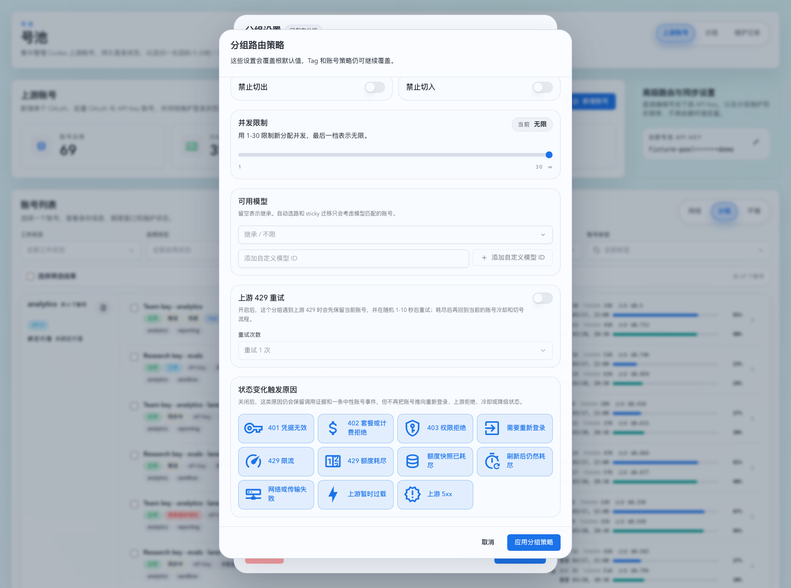

PR: include
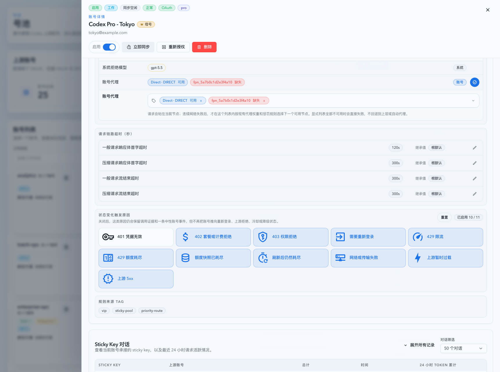

PR: include
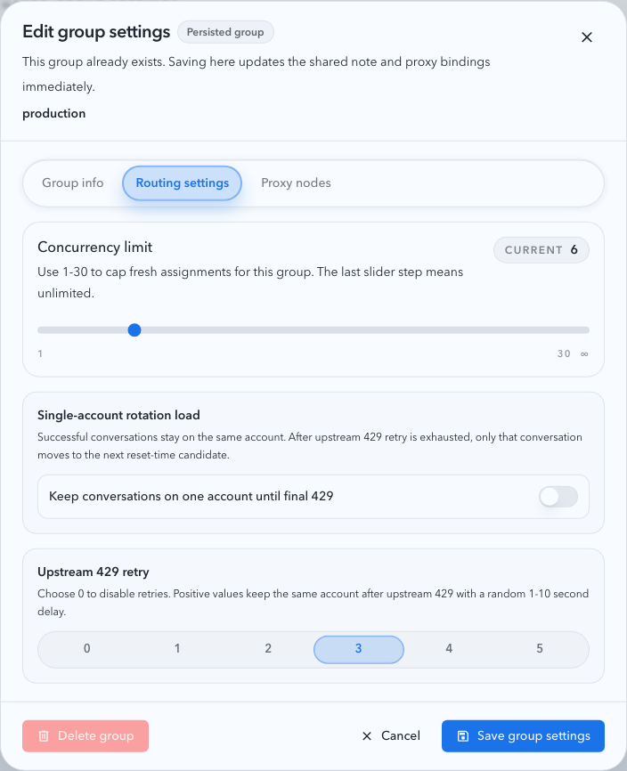

PR: include
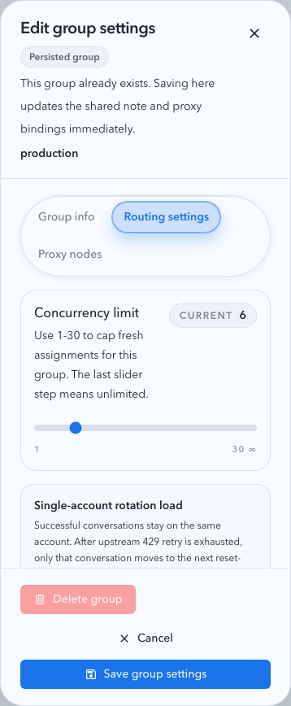

PR: include

PR: include

