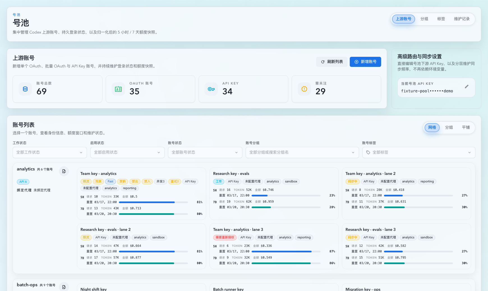
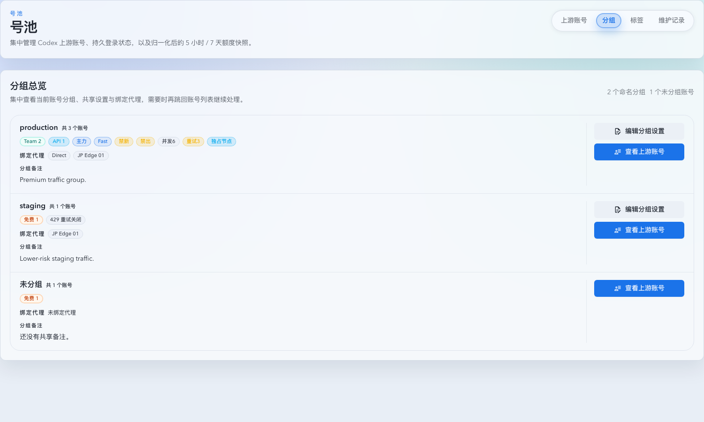
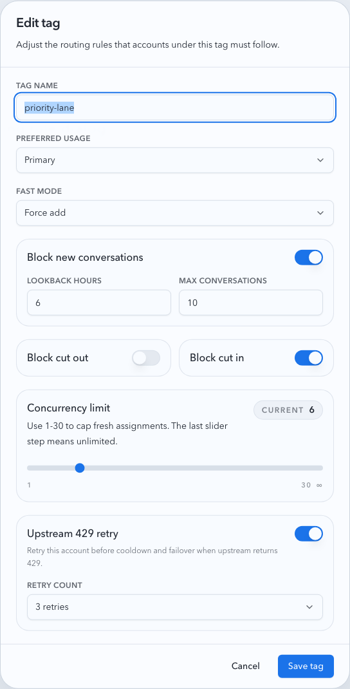
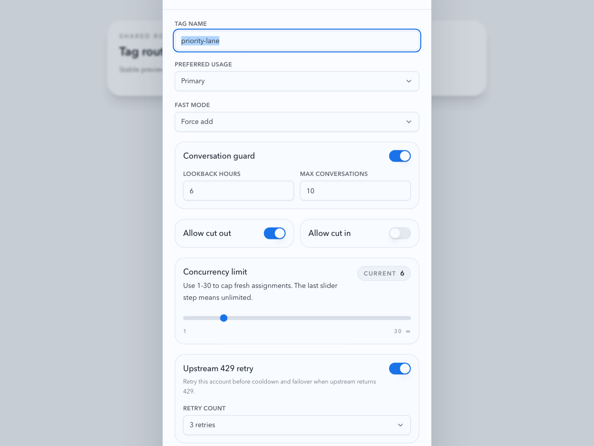
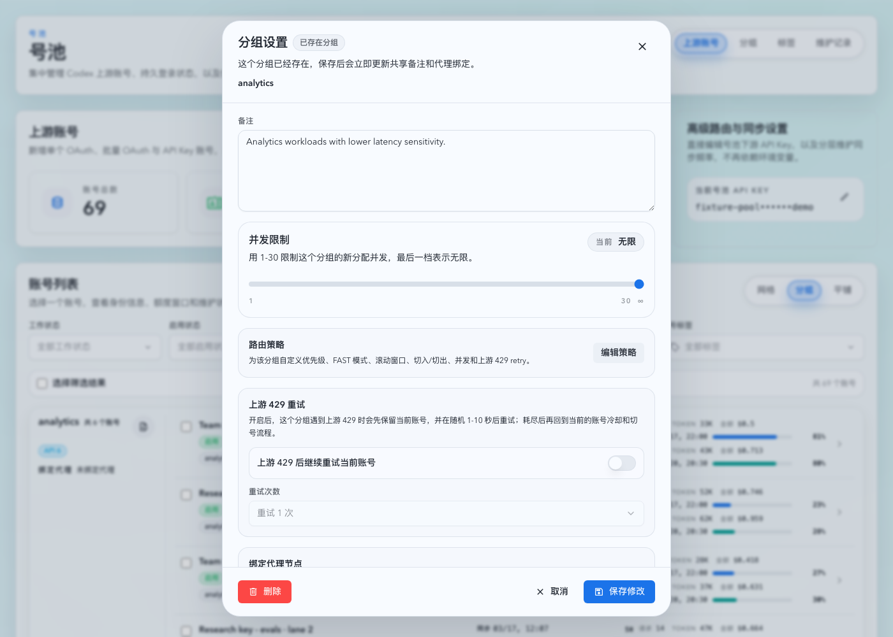
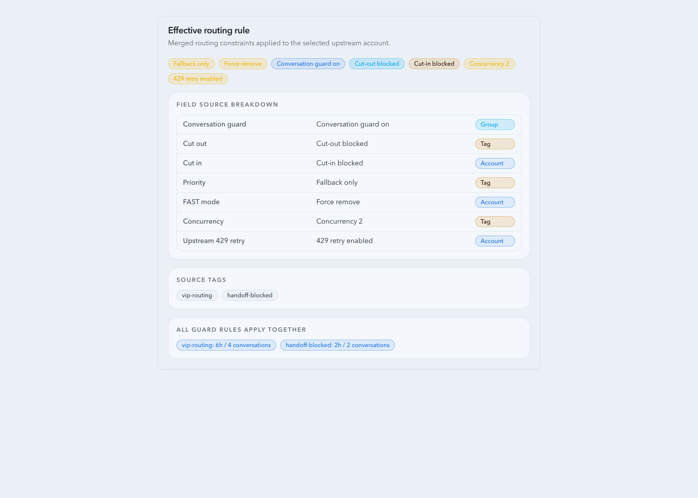
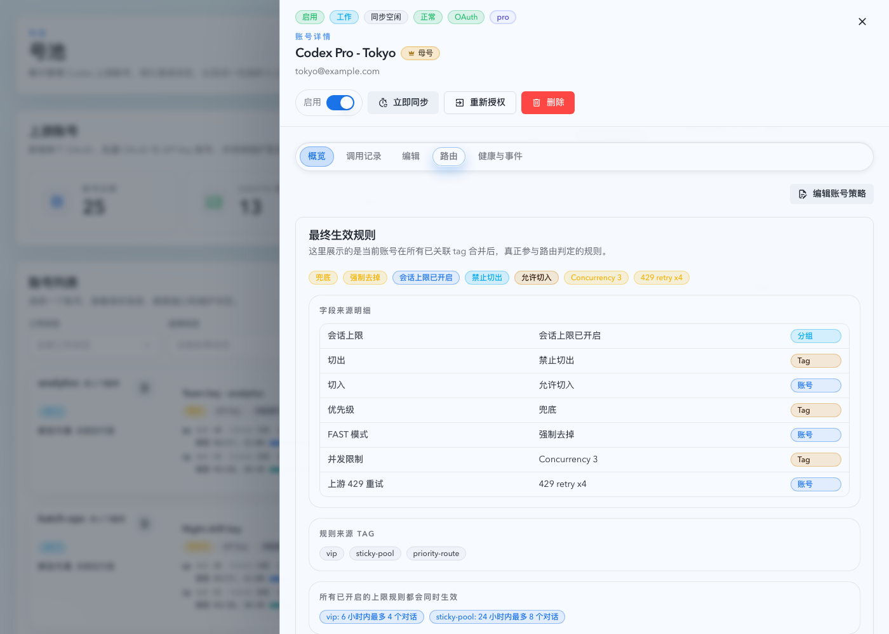
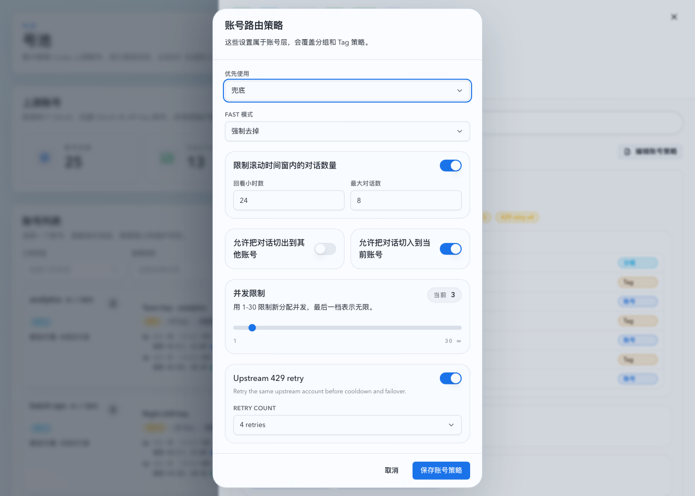
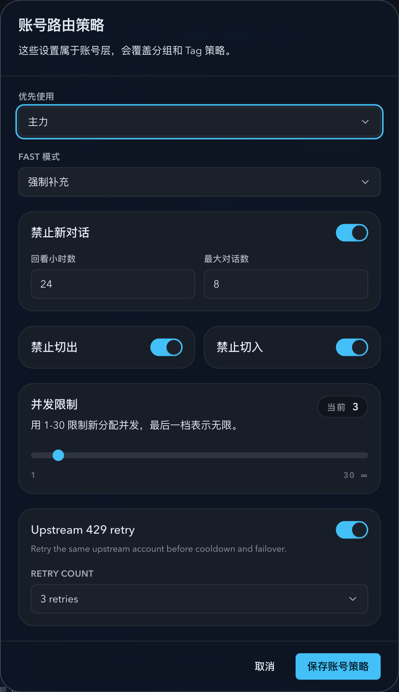

# Upstream Account Policy Inheritance

Spec ID: r4p9x

## Goal

Upstream account routing policy is resolved through three layers:

1. Group policy
2. Tag policy
3. Account policy

Each layer can override inherited values for the account-pool routing surface. The final effective policy is used by account selection, sticky cut-in/cut-out, FAST mode rewriting, concurrency limiting, and upstream 429 retry.

## Policy Surface

The inherited policy covers:

- priority tier
- FAST mode rewrite mode
- rolling conversation guard
- allow cut-out
- allow cut-in
- concurrency limit
- upstream 429 retry enabled
- upstream 429 max retries

Root defaults preserve existing behavior:

- priority tier: normal
- FAST mode rewrite mode: keep original
- conversation guard: disabled
- allow cut-out: enabled
- allow cut-in: enabled
- concurrency limit: unlimited
- upstream 429 retry: disabled
- upstream 429 max retries: 0

## Resolution

Effective account policy is computed in this order:

1. Start with root defaults.
2. Apply group policy.
3. Merge all account tags conservatively and apply the merged tag layer.
4. Apply account policy.

When an account has multiple tags, the tag layer keeps the existing conservative semantics:

- stricter priority wins toward fallback
- stricter FAST rewrite wins toward force remove
- cut-in and cut-out are allowed only if every tag allows them
- all guard rules remain active
- the smallest non-zero concurrency limit wins
- upstream 429 retry is enabled if any tag enables it, with the highest retry count

## Sticky Transfer Policy

`allow cut-out` is an automatic-routing boundary for the sticky source account. When the effective source policy forbids cut-out, the resolver must keep the conversation assigned to that account and fail there rather than automatically selecting another account, even when the sticky account has a transport failure, first-byte timeout, temporary route-key exclusion, cooldown, or other failover pressure.

The only supported exception is an explicit Prompt Cache conversation binding written by an operator. A manual upstream-account or group binding may move the conversation out of a no-cut-out sticky source; the target side still honors the binding contract and its existing target eligibility rules.

HTTP 4xx responses are not route-health successes for sticky routing. They remain recorded as failed invocations and upstream attempts with the real account, status, and error details, but they must not update `pool_sticky_routes`.

## API Contract

Group summaries expose `routingRule`. Group update payloads accept `routingRule`.

Tag create/update payloads accept the full policy surface.

Account update payloads accept `routingRule`. Missing `routingRule` preserves account-level overrides; present fields override the inherited effective policy for that account.

Effective account responses expose field-level sources so the UI can show whether each final value came from the root default, group, merged tag layer, or account override.

## Non-Goals

- Proxy binding, node shunt, and notes are not part of inherited routing policy.
- Tag explicit ordering is not introduced.
- OAuth/API key credential behavior is unchanged.
- Global reverse-proxy `/v1/*` settings are unchanged.

## Visual Evidence

Visual evidence is captured from stable Storybook scenarios for:

- active account card policy badges
- active group policy badges
- tag policy dialog with forbid-style switches
- tag policy dialog
- group policy settings with routing policy editor entry
- account detail routing tab with field-level source breakdown
- account routing policy editor
- account routing policy editor retaining a local draft through background refresh

PR: include

PR: include

PR: include

