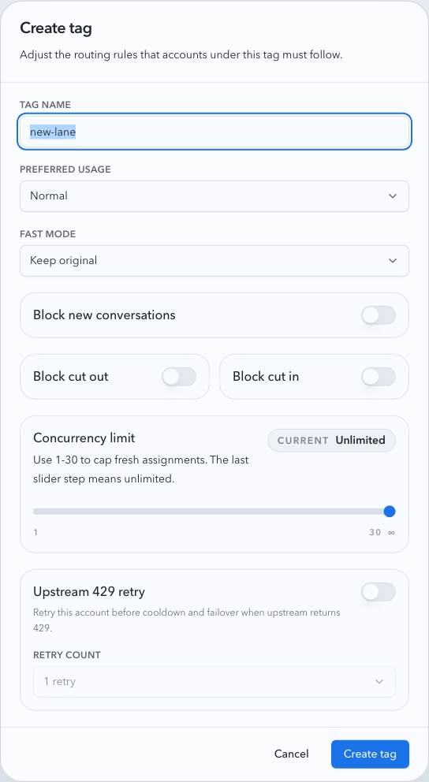
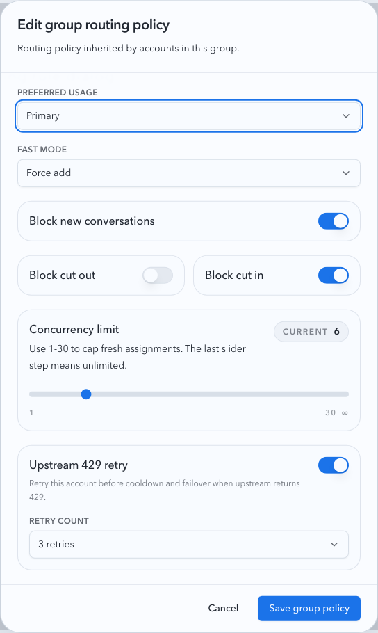
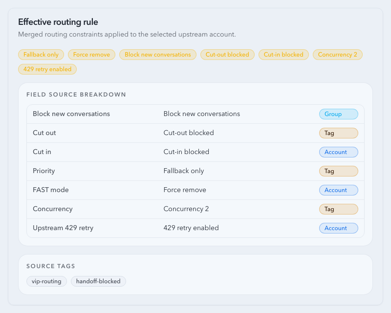

# Upstream Account Policy Inheritance

Spec ID: r4p9x

## Goal

Upstream account routing policy is resolved through three layers:

1. Group policy
2. Tag policy
3. Account policy

Each layer can override inherited values for the account-pool routing surface. The final effective policy is used by account selection, sticky cut-in/cut-out, FAST mode rewriting, concurrency limiting, and upstream 429 retry.

## Policy Surface

The inherited policy covers:

- priority tier
- FAST mode rewrite mode
- block new conversations
- allow cut-out
- allow cut-in
- concurrency limit
- upstream 429 retry enabled
- upstream 429 max retries

Root defaults preserve existing behavior:

- priority tier: normal
- FAST mode rewrite mode: keep original
- block new conversations: disabled
- allow cut-out: enabled
- allow cut-in: enabled
- concurrency limit: unlimited
- upstream 429 retry: disabled
- upstream 429 max retries: 0

## Resolution

Effective account policy is computed in this order:

1. Start with root defaults.
2. Apply group policy.
3. Merge all account tags conservatively and apply the merged tag layer.
4. Apply account policy.

When an account has multiple tags, the tag layer keeps the existing conservative semantics:

- stricter priority wins toward fallback
- stricter FAST rewrite wins toward force remove
- cut-in and cut-out are allowed only if every tag allows them
- block new conversations is enabled if any group, tag, or account layer enables it
- the smallest non-zero concurrency limit wins
- upstream 429 retry is enabled if any tag enables it, with the highest retry count

`blockNewConversations` / `block_new_conversations` is a hard fresh-routing gate. If a group, tag, or account layer sets it to true, the final effective rule is true and lower layers cannot clear the inherited block. It only excludes the account from new routing candidates, including requests without a sticky key. Existing sticky reuse can still resolve to that account, and sticky migration continues to be controlled by `allowCutIn`.

Legacy rolling guard fields (`guardEnabled`, `lookbackHours`, `maxConversations`, and `guardRules`) are not part of the policy surface. Existing stored rolling guard data is ignored rather than migrated into the hard block.

## API Contract

Group summaries expose `routingRule`. Group update payloads accept `routingRule`.

Tag create/update payloads accept the full policy surface.

Account update payloads accept `routingRule`. Missing `routingRule` preserves account-level overrides; present fields override the inherited effective policy for that account.

Effective account responses expose field-level sources so the UI can show whether each final value came from the root default, group, merged tag layer, or account override.

## Non-Goals

- Proxy binding, node shunt, and notes are not part of inherited routing policy.
- Tag explicit ordering is not introduced.
- OAuth/API key credential behavior is unchanged.
- Global reverse-proxy `/v1/*` settings are unchanged.

## Visual Evidence

Visual evidence is captured from stable Storybook scenarios for:

- tag policy dialog with the hard block-new-conversations switch
- group routing policy editor using the same hard switch
- account routing policy editor using the same hard switch
- effective routing rule card showing block-new-conversations and field-level source

PR: include

PR: include

PR: include

PR: include

