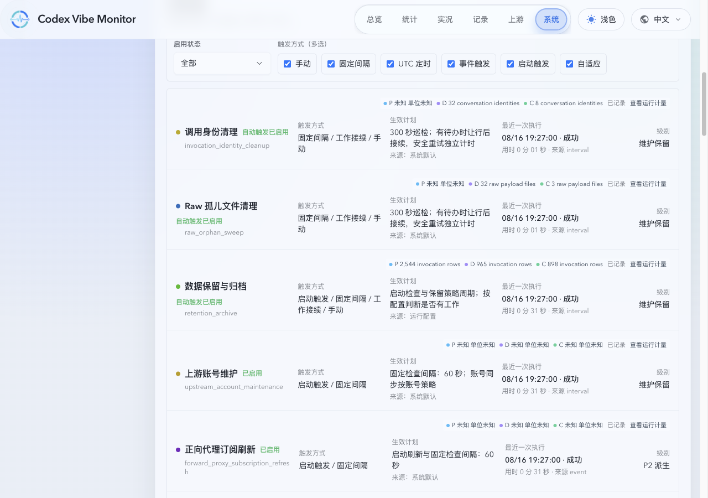
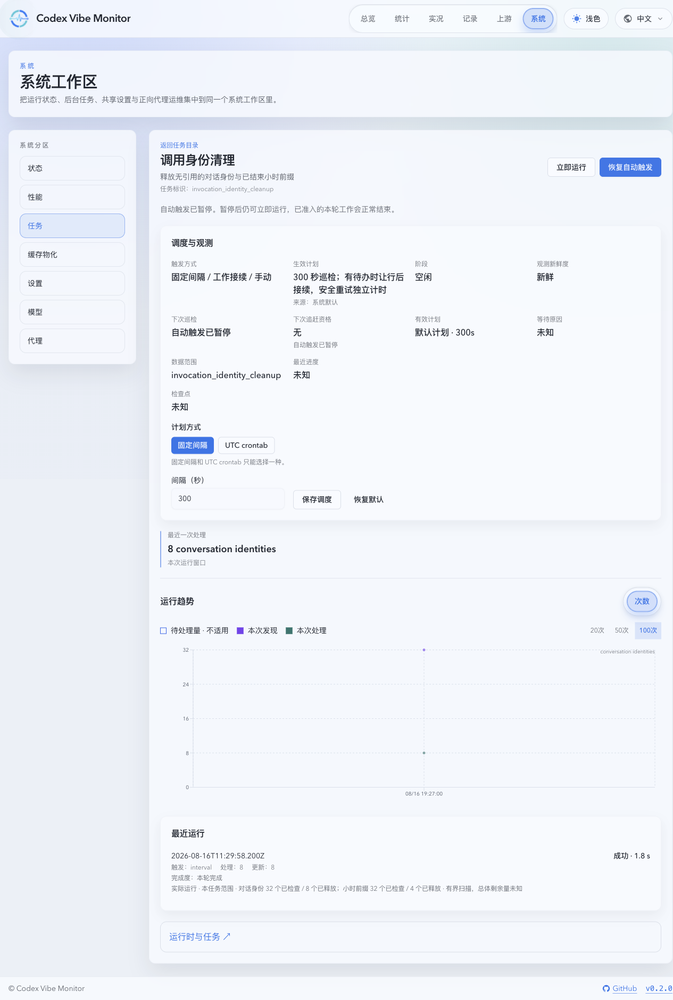
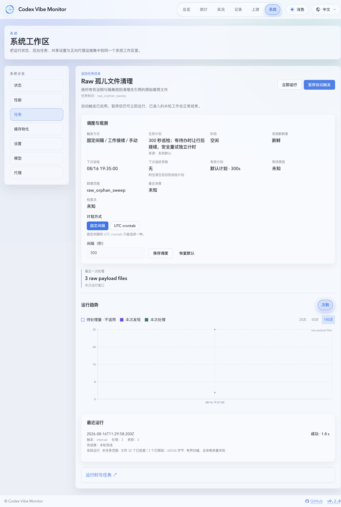
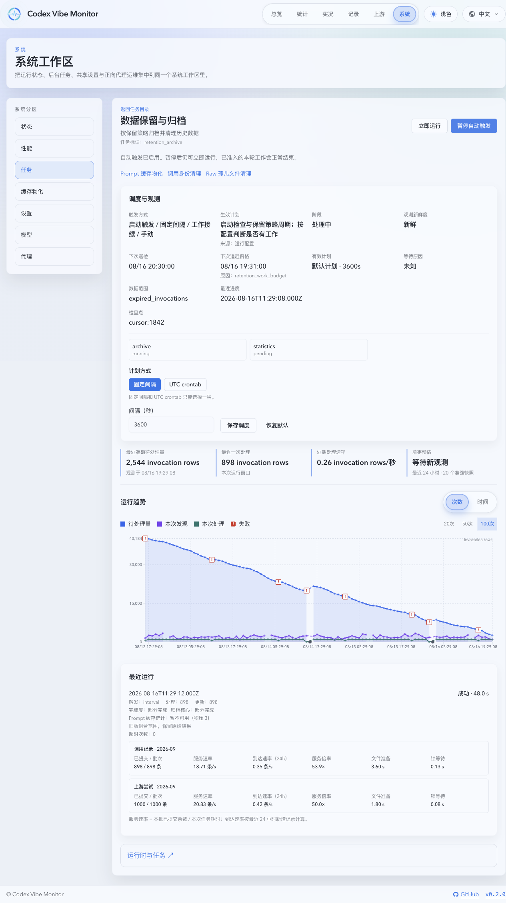
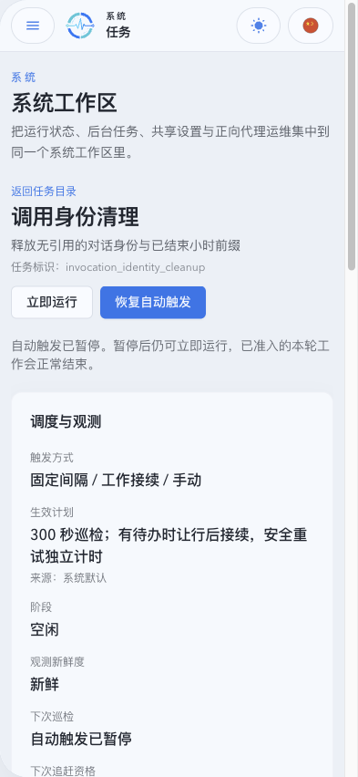
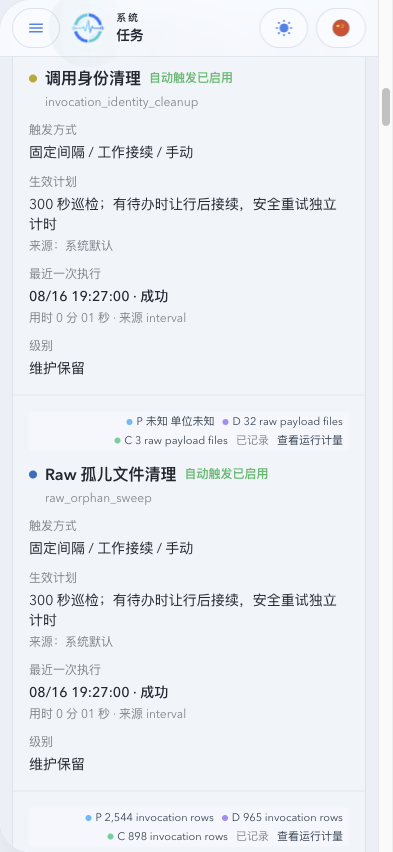

# 数据保留维护任务归属实现状态

## Current Status

- Implementation: 已实现；数据库替换竞态已修复，当前候选的 Linux 工程、十四来源升级和进程验证已通过；PR #1092 的最终 Tier 4 审查与当前 head CI 尚未完成。
- Lifecycle: active。
- 需求与 ADR 已确认；当前工作分支按批准计划实现同一 PR，交付停在 merge-ready。

## Implementation Coverage

- `REQ-RMO-001`, `REQ-RMO-005`, `REQ-RMO-006`：归档移除身份清理和 raw 孤儿预演，两个清理使用共享请求／执行入口；raw 自主 worker 与旧归档 worker 已退出。身份每轮检查最多 32 个对话和 32 个小时前缀，共享独立 2 秒工作预算；raw 保留原候选上限、遍历和释放协议。巡检、工作接续与安全重试独立记录。
- `REQ-RMO-002`, `REQ-RMO-003`, `REQ-RMO-004`：移除两项环境输入；新增控制默认启用与 300 秒巡检，事务初始化使用 `retention_maintenance_ownership_v1`，保留已有控制与计划。四项开关只控制自动请求准入，已接受手动请求与已准入有界执行保留，恢复从当前时间排期。物化在轮次准入固定控制，保留源代际和提交围栏。
- `REQ-RMO-007`, `REQ-RMO-008`, `REQ-RMO-009`：沿用归档源转换／统计失效／刷新入队事务；身份使用实际运行管理器和资源准入，新增小时 scope 以删除与游标同事务提交。查询超时后 SQLite 连接关闭完成前保留身份围栏；raw 保留隔离、文件身份、库存与 release-pending 保护。
- `REQ-RMO-010`：CLI 在业务初始化和启动恢复前选择在线请求或离线独占路由。运行态锁同时绑定规范化数据库路径对、当前数据库 inode 对与两个数据库文件本身；在线请求保留服务就绪标记文件和数据库描述符证明，使用同一受保护 VFS 打开维护库，并在请求写入及轮询期间持续复核，路径替换或服务锁释放均在 SQLite 写入前拒绝。初始化、离线 CLI、混配数据库对、替换 inode 与 hard-link 别名均在打开 SQLite 前拒绝。离线多链接数据库返回不可用，避免不同日志路径写同一数据库。在线不初始化控制或回收活跃运行，离线只执行指定任务并在释放锁前关闭连接池。三个预演使用局部扫描状态，不改业务删除、正式游标或释放事实。
- SQLite 连接固定到持锁文件的规范化路径，在原生 Unix VFS 的路径解析和实际打开边界重查路径／描述符身份及单链接证明，并使用 `SQLITE_FCNTL_HAS_MOVED` 检查 SQLite 打开的真实文件。校验发生在 journal／schema 初始化前；连接池后续连接继承同一 VFS 入口。归档 ATTACH 沿用原生实现。VFS 注册对象随进程保留以满足 SQLite 指针寿命，正确性证明使用弱引用，不延长数据库锁寿命；连接池关闭后才能释放运行态锁。
- `REQ-RMO-011`, `REQ-RMO-012`：新记录包含职责版本、scope 与 dry-run，计量分离调用行、对话、小时、文件及字节，缺测保持未知。新增目录和详情、自动触发文案、暂停时立即运行、归档关联入口及旧组合历史标识。资源等待与实际开始分开记录，保留旧历史口径。
- `REQ-RMO-013`：新增维护库重试状态表及业务小时清理 scope；既有迁移保持不变。直接升级来源逐一覆盖 v4.0.0 至 v4.0.6、v4.1.0 至 v4.1.3、v4.2.0 至 v4.2.2，不以版本等价假设共用来源。最终 Linux 二进制的十四来源升级和进程安全验证已通过，Tier 4 复审待完成。

## Verification

- 验证代码候选为 `cbd51fab0c4f63935fc4be9c91d076bbc3d6d2ea`，主干基线为 `ed00c68fed0975aaf0617981db8ad7fd75ce1a1f`。Rust 树为 `9088a6fc3916d465b2df61d1a77c9741450c9b77`，Web 树为 `343c2bcbfd8cc034a8576ce446acf62df098f189`；261 个 Rust／构建输入、644 个 Web 输入及验证脚本／配置／依赖清单已在会话 Linux VM 逐项核对，指纹见验证卡。随后的证据提交只修改文档，实际二进制和程序输入保持对应关系。
- 后端共享 runner 三个资源组按顺序通过：lightweight 1302/1302、stateful-sqlite 1457/1457、archive-file-io 334/334。五项原生 SQLite 打开回归通过；Rust fmt、`cargo check --locked --all-targets --all-features`、`cargo clippy --locked --all-targets --all-features -- -D warnings`、源码质量与质量／后端测试脚本合同通过。
- 文档首页、部署与排查说明已对齐默认自动启用；会话 VM 的文档站构建及文档 lint 通过。Web 类型检查、lint 与构建通过；完整单测 179 文件／1838 通过／6 跳过，相关组件 Storybook 3 文件／14 状态通过，mock-only demo 的桌面／移动端与路由 Playwright 12/12 通过且未启用重试。lint 退出成功，保留 92 项 warning 事实，不宣称无诊断。
- 真实 Linux 程序使用 `cargo build --locked`、单编译进程和 `CARGO_PROFILE_DEV_DEBUG=0`，保留默认 hotpath features。二进制 SHA-256 为 `896b9e782aff17e65d0d9e89ff779852a79decd9c6d54e237d94092bb78c833e`，取回后再次核对一致。十四个独立发布来源全部完成升级、重复初始化、只读预演、暂停时真实手动入口、归档职责隔离、受保护身份及中断后的前向重入；[升级结果](../../adr/assets/retention-maintenance-task-ownership/released-state-upgrade-results.json) 的所有来源绑定该摘要。
- [实际进程验证](../../adr/assets/retention-maintenance-task-ownership/runtime-validation-results.json) 使用 v4.2.2 来源及同一二进制，八项声明全部通过：在线 CLI 不初始化不可用维护库、三种只读职责、归档独占范围、四项暂停后的手动运行、CLI／页面竞争、无启动恢复、无手动自动接续及优雅关闭后的锁释放。Linux 命名运行态锁与 raw 预演释放计量回归包含在通过的 archive/file-I/O 组中。
- Linux 计时诊断保留原失败日志与断言。轻量组把共享 runner 及其进程树固定到一个来宾 CPU；SQLite 与归档组维持原 profile 并行度，通过标准 Cargo target runner 为每个真实测试进程租用独立来宾 CPU，保留原二进制、argv 和退出状态。projection 与统计检查点的真实时限夹具配置独占执行槽；短暂存活的子进程仍持有 CPU 槽时，在测试计时开始前最多等待 30 秒。第四批的三个资源组均通过；随后仅修正 VFS 注册的不可变字段复制并增加归档组并发回归，归档组刷新至 334/334。最后一处 Clippy 测试条件写法修正不改变语义，五项原生打开回归再次通过；lightweight／stateful 不调用该入口，保留证据的范围与 Git 差异可核对。生产阈值未放宽。
- 主干的公平统计队列、分页、实时 overlay、单样本 workload marker 与整页 Storybook 清理均已保留。整页状态与交互由 mock-only demo 覆盖，吞吐、时间线及 workload marker 由组件 Storybook 覆盖。六张页面图片已获主人确认；主干同步后核对相关产品组件、路由、样式和 demo 输入，当前视觉比较一致。
- `VER-RMO-001` 至 `VER-RMO-008` 的证据映射、各输入指纹与日志摘要见 [当前候选验证卡](../../adr/assets/retention-maintenance-task-ownership/current-candidate-validation.json)。第五批修复新增在线路由证明传递和替换窗口回归；六项原生打开回归、归档文件组与实际进程验证均通过。正式 Tier 4 审查和同一 PR 最终 head CI 在证据快照时仍待完成，不将旧 PR head 的成功结果视为当前交付证明。

## Visual Evidence

来源：mock-only `ui_demo`；桌面 1280 CSS px，移动端由 demo iframe 固定为 393×852 CSS px。六张图片在锁定基线不存在同路径旧图，按 current-only 比较展示后已获主人明确确认；无需裁剪，不使用生产数据或真实程序截图。

## Rollout and Remaining Gaps

- 公开配置移除、一次性入口范围及自动触发控制语义按 breaking／major 记录；持久状态影响单独评估，不由公开合同的 Major 自动决定。
- 直接来源逐一为 v4.0.0 至 v4.0.6、v4.1.0 至 v4.1.3、v4.2.0 至 v4.2.2；各来源由对应发布镜像独立生成，来源与镜像摘要保存在 [released-state-sources.json](../../adr/assets/retention-maintenance-task-ownership/released-state-sources.json)。更早 Major 必须先中间升级，不支持多版本同时写入。
- 实现从计划基线 `130c357c043a3449512a25cd82643fc5a8ca02df` 开始，按已授权同步合同保留备份并对齐主干；已发布后仅使用签名合并提交，当前基线为 `ed00c68fed0975aaf0617981db8ad7fd75ce1a1f`，保留主干统计公平队列及其回归，不重写已发布历史。
- 最终候选工程检查、十四来源升级与进程验证已完成；必须完成 Tier 4 只读审查及同一 PR 当前 head 的必要 CI，才可宣告 Step 5C Ready。

## References

- [Requirements](SPEC.md)
- [Background](HISTORY.md)
- [Ownership decision](../../adr/0034-retention-maintenance-task-ownership.md)
