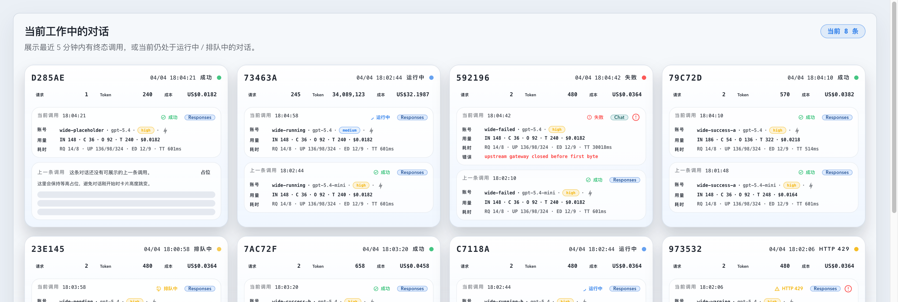
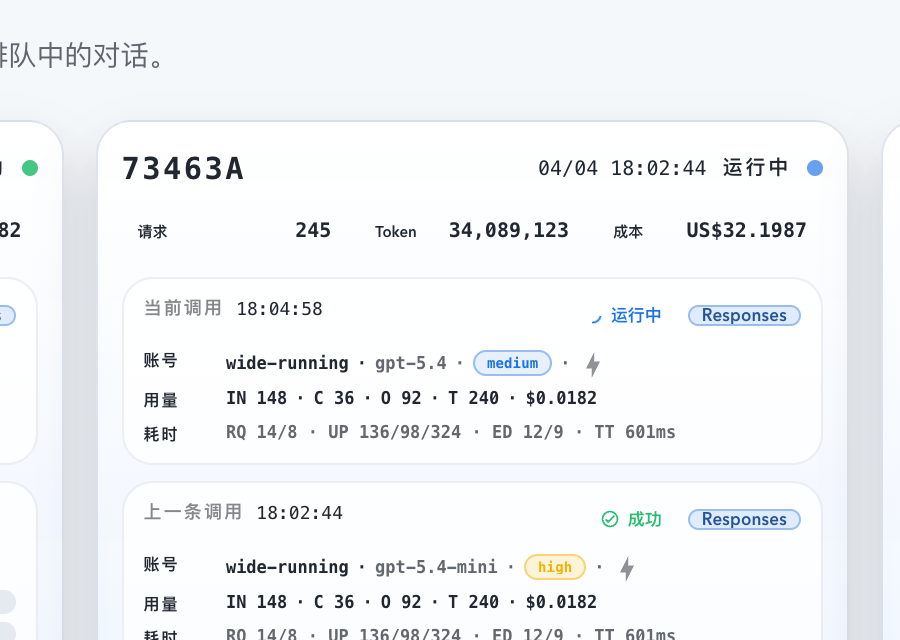

# Dashboard 工作中对话卡片头部压缩（#s8zhn）

## 状态

- Status: 已完成（5/5）
- Created: 2026-04-08
- Last: 2026-04-08

## 背景 / 问题陈述

- Dashboard 工作中对话卡片当前把状态 + 时间放在第一行、`WC-` 短号与 raw Prompt Cache Key 放在第二行；对高密度监控卡来说，这组信息占了两行高度，但其中 `WC-` 前缀和 raw key 的卡片级可见展示价值都偏低。
- 当前抽屉 header 也直接沿用带 `WC-` 的短号；如果卡片改成 bare hash，而抽屉仍保留旧写法，会造成同一对话在摘要层和详情层的身份标签不一致。
- 本轮目标是只压缩展示层，不动后端、hash 生成规则、selection payload 或 Prompt Cache Key 的诊断用途。

## 目标 / 非目标

### Goals

- 把工作中对话卡片头部压成单行：左侧只保留 bare hash ID，右侧从左到右固定为 `时间 → 状态标签 → 状态点`。
- 从卡片头部移除 raw Prompt Cache Key 的可见文本与 tooltip，减少无效信息密度。
- 保持 `conversationSequenceId` 原始值不变，只新增统一 formatter，让可见序列号去掉 `WC-` 前缀。
- Dashboard 调用详情抽屉同步使用无 `WC-` 的可见 hash 标签，但继续保留 Prompt Cache Key 诊断字段。
- 补齐 Vitest、Storybook 与视觉证据链路，并在截图真正写回 spec / PR 前继续遵守主人确认门禁。

### Non-goals

- 不修改后端 API、Prompt Cache 聚合逻辑、hash / collision 生成规则。
- 不重排当前 / 上一条调用槽、底部三项摘要指标或调用详情抽屉正文结构。
- 不移除调用详情抽屉中的 Prompt Cache Key 字段。
- 不调整 Live 页 Prompt Cache Conversation 表格或其它页面的短号展示方式。

## 范围（Scope）

### In scope

- `web/src/lib/dashboardWorkingConversations.ts`：新增可复用的工作中对话序列号展示 formatter。
- `web/src/components/DashboardWorkingConversationsSection.tsx`：压缩卡片头部布局，移除头部 raw key，并在测试/Storybook 需要时用非可见属性保留识别能力。
- `web/src/components/DashboardInvocationDetailDrawer.tsx`：抽屉 header 改用 bare hash 标签，保留 Prompt Cache Key 诊断字段。
- `web/src/lib/dashboardWorkingConversations.test.ts`、`web/src/components/DashboardWorkingConversationsSection.test.tsx`、`web/src/components/DashboardInvocationDetailDrawer.test.tsx`、`web/src/components/DashboardWorkingConversationsSection.stories.tsx`：补齐展示与行为回归。
- `docs/specs/README.md` 与本 spec：登记 follow-up 状态与后续视觉证据资产。

### Out of scope

- 后端、SSE、数据库、`activityMinutes=5` 工作集逻辑。
- `web/src/pages/Live.tsx`、`PromptCacheConversationTable`、`Records` 页、共享账号抽屉本体。
- PR 合并与 merge 后 cleanup。

## 验收标准（Acceptance Criteria）

- Given 390 / 768 / 1440 / 1660 视口，When 渲染工作中对话卡片，Then 头部保持单行，不出现 raw Prompt Cache Key，也不产生横向溢出。
- Given 任一工作中对话卡片，When 查看头部，Then 左侧只显示无 `WC-` 的 bare hash；右侧从左到右固定为时间、状态标签、状态点。
- Given 打开 Dashboard 调用详情抽屉，When 查看 header，Then 对话序列标签与卡片一致地显示 bare hash，但 Prompt Cache Key 仍可在详情诊断区读取。
- Given 现有账号点击、调用槽打开、placeholder 非交互语义，When 本轮改动完成，Then 这些交互不回退。
- Given 使用 Storybook `StateGallery`、`WideDesktop1660`、`InvocationDrawerOpen`，When 作为证据源复核，Then 能稳定证明卡片头部压缩后的密度与可读性。
- Given 视觉证据截图需要写回 spec 或进入 PR，When 尚未获得主人明确许可，Then 相关截图只允许本地回图，不得先 push。

## 非功能性验收 / 质量门槛（Quality Gates）

### Visual / UX

- 头部信息层级必须比当前双行版本更紧凑，但不允许靠减小到不可读字号换取单行。
- 状态仍需保留文字 + 彩色状态点的双通道提示，不能退化成只靠颜色识别。
- raw Prompt Cache Key 从卡片头部完全移除，不再保留 hover title。
- 宽屏四栏与窄屏单列合同保持不变。

### Testing

- `cd /Users/ivan/.codex/worktrees/4aa2/codex-vibe-monitor/web && bun run lint`
- `cd /Users/ivan/.codex/worktrees/4aa2/codex-vibe-monitor/web && bunx vitest run src/lib/dashboardWorkingConversations.test.ts src/components/DashboardWorkingConversationsSection.test.tsx src/components/DashboardInvocationDetailDrawer.test.tsx src/pages/Dashboard.test.tsx`
- `cd /Users/ivan/.codex/worktrees/4aa2/codex-vibe-monitor/web && bun run build`
- `cd /Users/ivan/.codex/worktrees/4aa2/codex-vibe-monitor/web && bun run storybook:build`

## 文档更新（Docs to Update）

- `docs/specs/README.md`
- `docs/specs/s8zhn-dashboard-working-conversations-header-compact/SPEC.md`

## 计划资产（Plan assets）

- Directory: `docs/specs/s8zhn-dashboard-working-conversations-header-compact/assets/`
- Visual evidence source: Storybook canvas (`StateGallery` / `WideDesktop1660` / `InvocationDrawerOpen`)

## 实现里程碑（Milestones / Delivery checklist）

- [x] M1: 新建 follow-up spec 并登记 `docs/specs/README.md`。
- [x] M2: 工作中对话卡片头部压成单行，bare hash formatter 复用到卡片与抽屉 header。
- [x] M3: 补齐 Vitest 与 Storybook 覆盖，锁定“无 raw key 可见文本、无 `WC-` 前缀、交互不回退”。
- [x] M4: 完成 lint / targeted Vitest / build / Storybook build，并生成本地视觉证据。
- [x] M5: 在主人确认截图可提交后，把最终视觉证据写回 spec，并继续推进 PR 到 merge-ready。

## 方案概述（Approach, high-level）

- 保持 `conversationSequenceId` 作为内部真相源，只在展示层派生 bare hash，避免改动 selection payload、抽屉查找或碰撞处理。
- 卡片头部改成左右双区：左侧 hash 固定占位，右侧用紧凑 inline stack 展示时间 / 状态标签 / 状态点，从而消掉原来专门给状态占的一整行。
- 为了不把 raw Prompt Cache Key 暴露给终端用户，同时仍能让测试与 Storybook 稳定断言顺序，可在卡片节点上保留非可见测试属性，而不恢复任何用户可见 key 文本。
- 视觉证据继续走 Storybook canvas，先本地回图，再按主人许可决定是否落盘 / push。

## 风险 / 开放问题 / 假设（Risks, Open Questions, Assumptions）

- 风险：如果 bare hash formatter 分散写在多个组件里，后续 follow-up 容易再次出现卡片 / 抽屉标签不一致；本轮要求抽到共享 formatter。
- 风险：若仅删除 raw Prompt Cache Key 文本而不补充非可见识别锚点，现有 Storybook / Vitest 顺序断言会退化成脆弱的文案匹配。
- 假设：raw Prompt Cache Key 在卡片摘要层不再需要任何 hover 或次级暴露，详情抽屉已足够承担诊断入口。
- 假设：本轮视觉证据以 Storybook canvas 为主，不额外要求真实 Dashboard 页面截图。

## Visual Evidence

- Storybook canvas / `WideDesktop1660`：摘要标签压缩为 `请求 / Token / 成本`，并验证长数值仍可留在单行摘要区域。

  

- Storybook canvas / summary focus crop：聚焦长数值卡片，验证 `245 / 34,089,123 / US$32.1987` 与 `gpt-5.4 · medium · ⚡` 共存时仍保持可读。

  
