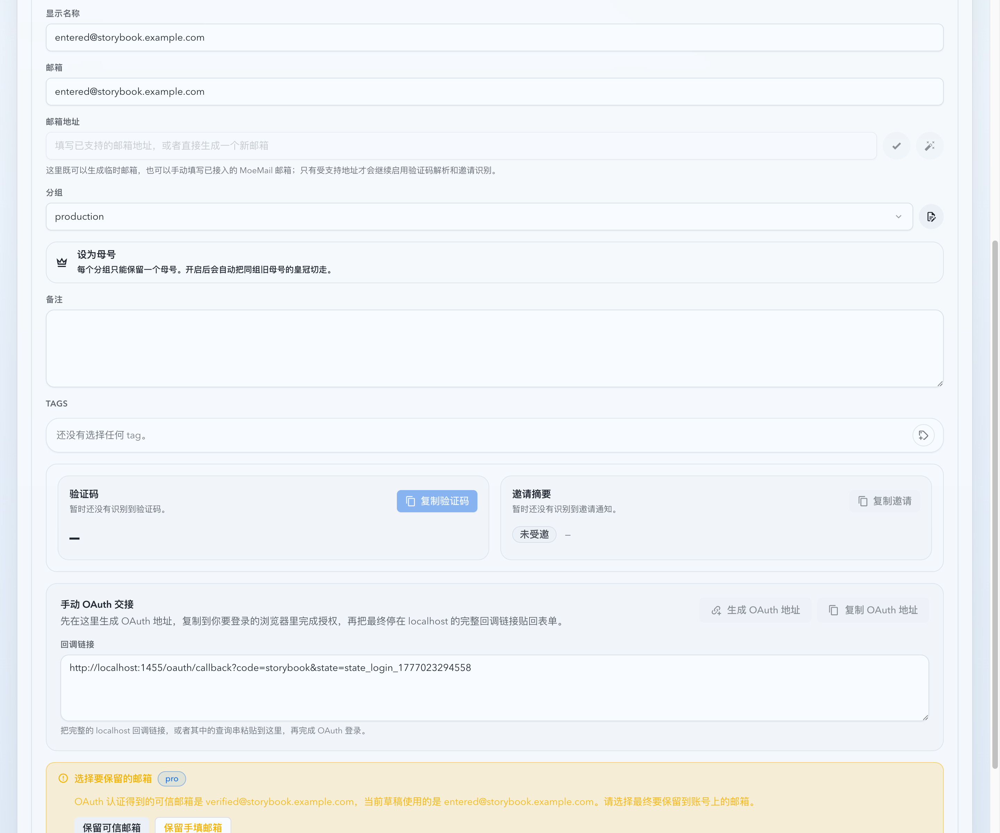
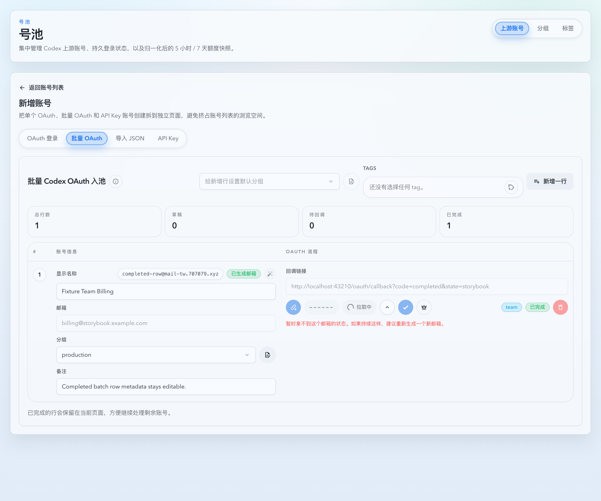
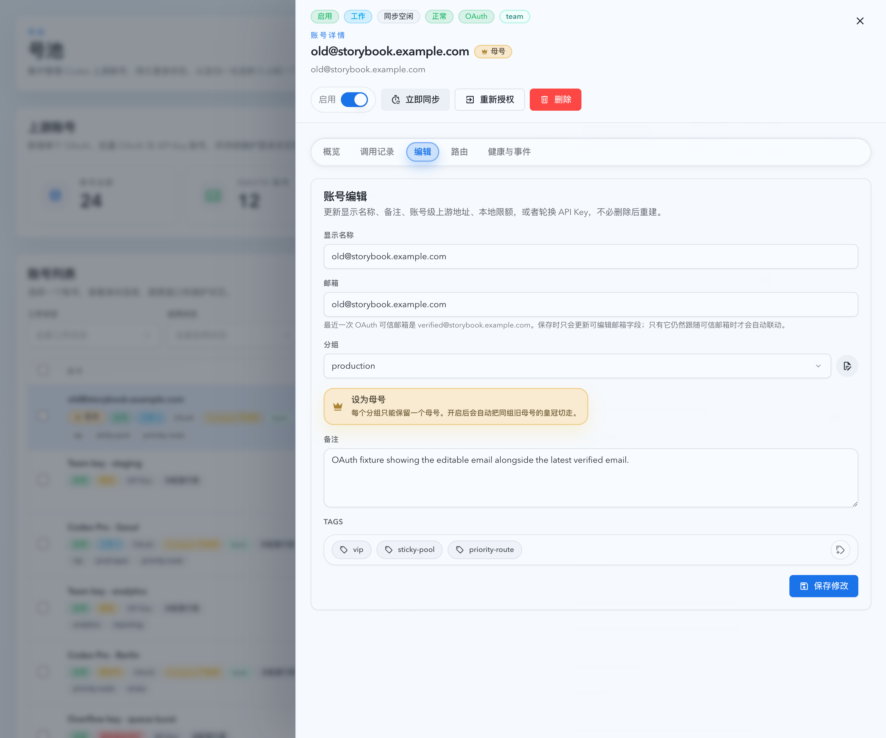
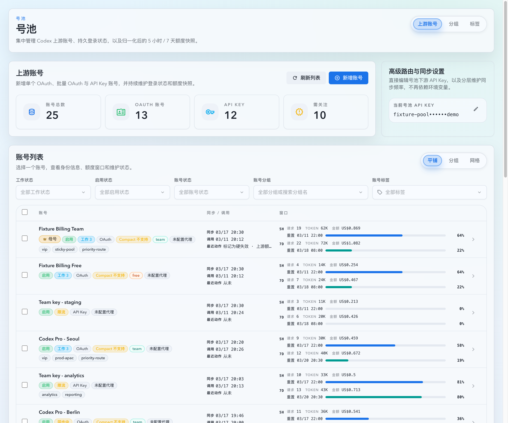

# 号池账号邮箱 / 名称联动 / mixed-plan 同名放宽 / OAuth 计划徽章优化（#swze7）

## 状态

- Status: 已实现，待 PR / CI / review-proof 收敛
- Created: 2026-04-24
- Last: 2026-04-24

## 背景 / 问题陈述

- 号池新增与编辑流程目前没有把 `email` 当成可维护字段，运营无法在 OAuth / API Key 账号上显式修正邮箱。
- 现有“邮箱 -> 显示名称”的行为不稳定：邮箱变化、临时邮箱、手填邮箱与 OAuth 返回邮箱之间没有明确联动规则，容易把手工名称覆盖错或留下过期名称。
- OAuth 完成后若认证邮箱与手填邮箱不一致，当前流程没有让用户做最终选择，后台 refresh 也可能直接覆盖运营手工邮箱。
- `displayName` 目前对 OAuth 账号仍近似全局唯一，导致同一真实上游账号的 `team / plus / free` 等 mixed-plan 组合无法稳定共存；同时又必须避免把整个 Team 组织误当成“同一账号”。
- 新增 OAuth 成功态虽然已有计划信息，但创建流程第一时间没有直接展示计划 badge，运营无法快速确认当前拿到的到底是什么计划。

## 目标 / 非目标

### Goals

- 为单 OAuth、批量 OAuth、API Key 新增与账号详情编辑补齐 `email` 输入，并把 `email` 纳入 API / DB / 草稿恢复 / Storybook mock 全链路。
- 固定“邮箱变化时是否自动改显示名称”的规则：仅当名称为空，或名称仍等于旧邮箱 / 旧邮箱生成名时，才自动切到新邮箱生成名。
- 为 OAuth 账号新增 `verifiedEmail` 概念：`email` 表示运营最终选定值，`verifiedEmail` 表示最近一次 OAuth 可信邮箱；两者允许不同。
- OAuth 完成 / relogin 后，若 `verifiedEmail` 与当前草稿邮箱不同，必须先展示二选一 UI，再根据用户选择决定最终 `email`。
- `displayName` 默认保持唯一，但允许“同一真实上游账号 + 有效计划都已知且不同”的 OAuth mixed-plan 组合同名；共享 Team 组织不能直接视为同一账号。
- 在 OAuth 创建成功态、批量完成行、duplicate/detail 弹层等关键位置直接显示计划 badge。

### Non-goals

- 不重做账号列表的信息架构或 duplicate warning taxonomy。
- 不引入“同 Team 组织成员自动视为同一账号”的新规则。
- 不改变 API Key 账号的认证语义；API Key 的 `email` 只作为运营 metadata。

## 范围（Scope）

### In scope

- `POST /api/pool/upstream-accounts/api-keys`、`PATCH /api/pool/upstream-accounts/:id` 的 `email` 字段。
- `POST/PATCH /api/pool/upstream-accounts/oauth/login-sessions*` 的草稿 `email` 字段与 `LoginSessionStatusResponse.email`。
- `UpstreamAccountDetail.verifiedEmail` 字段、SQLite schema 增量迁移与兼容回填。
- OAuth callback / relogin / background refresh 的 `email` 与 `verifiedEmail` 同步规则。
- mixed-plan same-upstream displayName uniqueness exemption。
- Web create/edit flows、Vitest、Storybook、视觉证据与 fast-track PR 收敛。

### Out of scope

- 账号列表大改版。
- 新的 duplicate reason 枚举或新筛选器。
- 非号池模块的邮箱字段能力。

## 需求（Requirements）

### MUST

- 新增 / 编辑 / relogin / pending OAuth session 都必须支持 `email`。
- `displayName` 仅在名称为空，或当前名称等于旧邮箱 / 旧邮箱生成名（忽略大小写与首尾空格）时，才随邮箱变化自动更新；自定义名称保持不动。
- OAuth 完成或 relogin 后，如果 `verifiedEmail` 与用户当前 `email` 不同，页面必须先提供“保留认证邮箱 / 保留手填邮箱”二选一，再落库。
- OAuth background refresh / usage sync 更新 `verifiedEmail` 时，不得无条件覆盖手工 `email`；只有当前 `email` 仍跟随旧 `verifiedEmail` 时才允许联动更新。
- `displayName` 默认全局唯一；只有 OAuth + 同一真实上游身份 + 双方计划类型都已知且不同，才允许同名。
- team-shared-org 只能作为“共享组织”辅助信号，不能直接构成 same-upstream 豁免。
- OAuth 创建成功态必须立即显示计划 badge。

### SHOULD

- duplicate 详情弹层与批量 OAuth 完成行复用统一的计划 badge recipe。
- Storybook 提供稳定的单 OAuth 完成态、批量完成态、详情编辑态与 mixed-plan 同名成功态。

## 接口契约（Interfaces & Contracts）

### HTTP / TS contract delta

- `CreateOauthLoginSessionPayload.email?: string`
- `UpdateOauthLoginSessionPayload.email?: string | null`
- `LoginSessionStatusResponse.email?: string | null`
- `CreateApiKeyAccountPayload.email?: string`
- `UpdateUpstreamAccountPayload.email?: string | null`
- `UpstreamAccountDetail.verifiedEmail?: string | null`

### DB contract delta

- `pool_upstream_accounts.verified_email TEXT NULL`
- `pool_oauth_login_sessions.email TEXT NULL`

## 验收标准（Acceptance Criteria）

- Given 单 OAuth / 批量 OAuth / API Key 创建页与详情编辑页，When 用户修改 `email`，Then 页面允许保存，且名称联动只发生在空名称或旧邮箱生成名场景。
- Given OAuth 完成或 relogin 返回的 `verifiedEmail` 与手填 `email` 不同，When 用户完成流程，Then 页面必须先让用户显式选择保留哪一个邮箱，最终详情与保存结果一致。
- Given OAuth background refresh 发现新的可信邮箱，When 当前 `email` 是运营手工改过的值，Then refresh 只更新 `verifiedEmail`，不覆盖当前 `email`。
- Given 两个 OAuth 账号属于同一真实上游身份且计划分别为 `team` 与 `free/pro/plus`，When 两者 display name 相同，Then 服务端允许同名且前端不做硬阻断。
- Given 两个账号仅共享 Team 组织或计划未知，When display name 相同，Then 服务端继续返回 `409`。
- Given OAuth 新增成功，When 完成态渲染，Then 页面直接显示计划 badge，且 duplicate detail / batch row 的 badge 不回退。

## 质量门槛（Quality Gates）

- `cargo fmt`
- `cargo check`
- `cargo test`
- `cd web && bun run test`
- `cd web && bun run build`
- `cd web && bun run build-storybook`

## 文档更新（Docs to Update）

- `docs/specs/README.md`
- `docs/specs/swze7-account-pool-email-name-plan-badge/SPEC.md`
- `docs/specs/swze7-account-pool-email-name-plan-badge/IMPLEMENTATION.md`
- `docs/specs/swze7-account-pool-email-name-plan-badge/HISTORY.md`

## Visual Evidence

- source_type: storybook_canvas
  target_program: mock-only
  capture_scope: browser-viewport
  requested_viewport: 1440x1200
  viewport_strategy: devtools-emulate
  sensitive_exclusion: N/A
  submission_gate: pending-owner-approval
  story_id_or_title: Account Pool/Pages/Upstream Account Create/OAuth/CompletedEmailChoice
  state: completed email choice
  evidence_note: 验证单账号 OAuth 完成后立即出现计划 badge，并要求在可信邮箱与手填邮箱之间做最终选择。
  image:
  

- source_type: storybook_canvas
  target_program: mock-only
  capture_scope: browser-viewport
  requested_viewport: 1440x1200
  viewport_strategy: devtools-emulate
  sensitive_exclusion: N/A
  submission_gate: pending-owner-approval
  story_id_or_title: Account Pool/Pages/Upstream Account Create/Batch OAuth/CompletedWithPlanBadge
  state: completed batch row
  evidence_note: 验证批量 OAuth 完成行直接显示计划 badge，且保留邮箱字段与完成态说明。
  image:
  

- source_type: storybook_canvas
  target_program: mock-only
  capture_scope: browser-viewport
  requested_viewport: 1440x1200
  viewport_strategy: devtools-emulate
  sensitive_exclusion: N/A
  submission_gate: pending-owner-approval
  story_id_or_title: Account Pool/Pages/Upstream Accounts/Overlays/OauthEditEmailHint
  state: oauth detail edit
  evidence_note: 验证详情编辑页同时展示可编辑 email 与最新 verifiedEmail 提示。
  image:
  

- source_type: storybook_canvas
  target_program: mock-only
  capture_scope: browser-viewport
  requested_viewport: 1440x1200
  viewport_strategy: devtools-emulate
  sensitive_exclusion: N/A
  submission_gate: pending-owner-approval
  story_id_or_title: Account Pool/Pages/Upstream Accounts/List/MixedPlanCoexistence
  state: same-upstream mixed-plan coexistence
  evidence_note: 验证同一真实上游身份的 team / free 账号可以同名共存，列表中不再出现 duplicate 标记。
  image:
  

## 方案概述（Approach, high-level）

- 后端先补 schema、runtime types 与 session/account email persistence，固定 email/displayName 联动规则，再把 OAuth uniqueness 检查切到 same-upstream mixed-plan exemption。
- 前端统一把 `email` 放入 create/edit draft 与 pending OAuth session payload，OAuth 完成后引入 email chooser，中间态不再用本地 display name 冲突做 OAuth 硬阻断。
- 关键成功态与 duplicate detail 统一复用 `upstreamPlanBadgeRecipe`，避免新增新的计划视觉体系。

## 风险 / 假设

- 风险：若前端继续保留旧的 mailbox->displayName 自动填充逻辑，会与新的 email->displayName 联动冲突。
- 风险：计划未知时必须保守返回冲突，可能让少量 mixed-plan 账号在 plan 未探测前仍暂时被阻断；这是有意保守策略。
- 假设：现有 same-upstream identity 判断已能区分真实共享身份与 team-shared-org，仅需在 displayName uniqueness 侧复用。

## 参考（References）

- `docs/specs/96qgn-oauth-mixed-plan-duplicate-warning/SPEC.md`
- `docs/specs/p4y7m-upstream-team-shared-org-auto-mother/SPEC.md`
- `docs/specs/m7a9k-oauth-manual-mailbox-attach/SPEC.md`
- `docs/specs/e5w9m-batch-oauth-mailbox-popover-edit/SPEC.md`
