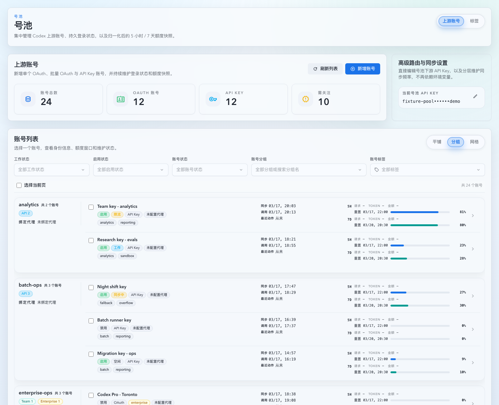
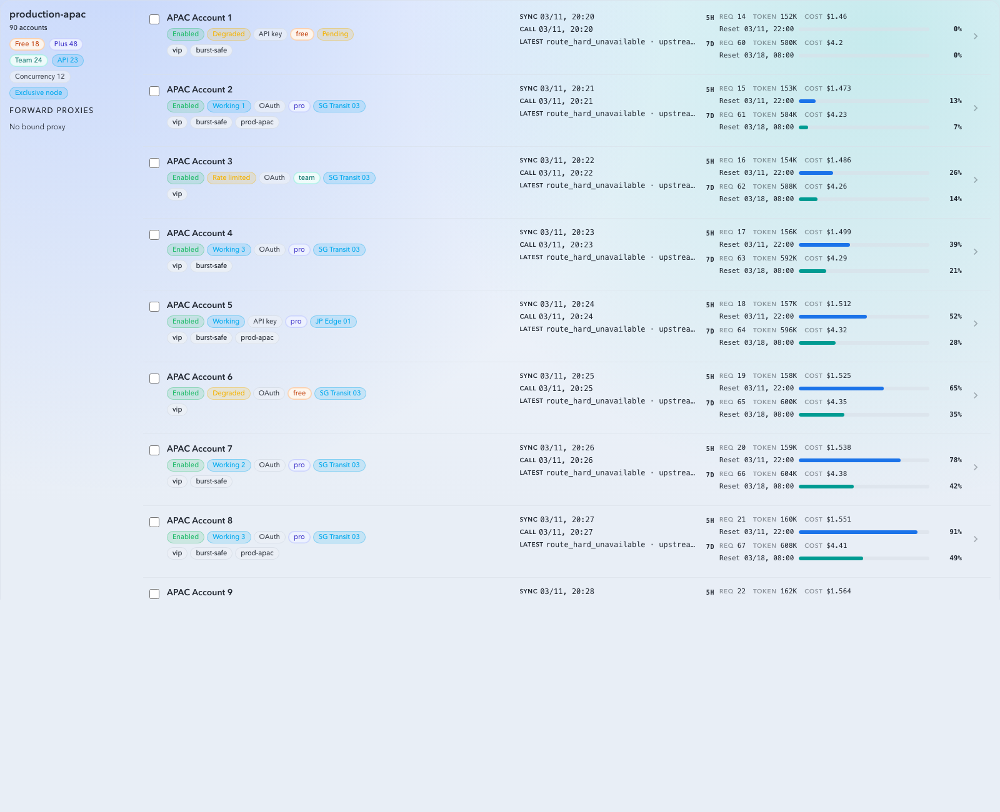
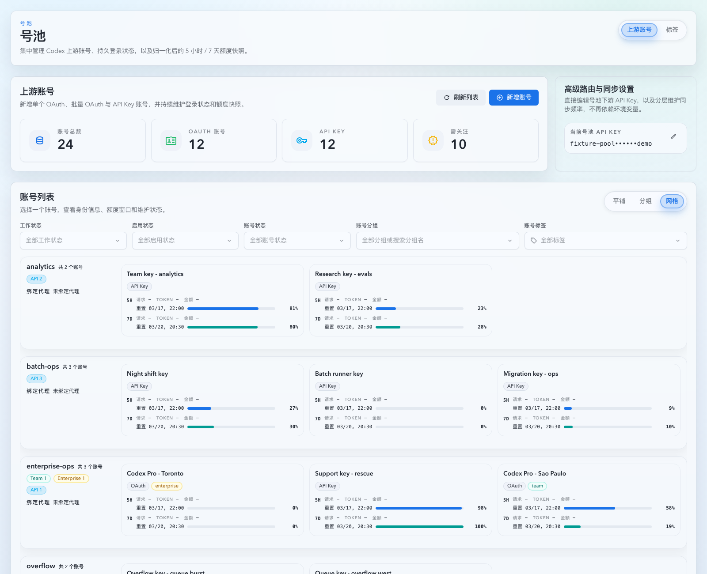

# 上游账号列表分组视图与代理徽章（#sy7a9）

## 背景 / 问题陈述

- 当前上游账号列表只有平铺分页表格；当主人需要按分组查看账号与节点排班关系时，必须手动依次筛选分组，无法直接得到“每组有哪些账号、每个账号当前挂在哪个正向代理”的全貌。
- 既有平铺列表也没有导出当前正向代理信息；对于启用 group-bound proxy / node shunt 的场景，只看工作态与阻断原因，仍不足以判断账号实际命中了哪个节点，或为什么还在候补。
- 现有分页表格已经解决了平铺模式的大列表首屏成本，但新的“分组 -> 组内账号”视图会把数据放大成双层列表；若直接完整渲染所有组卡片与所有成员行，前端会在大数据量下明显变慢。
- 账号列表响应里的 `forwardProxyNodes` 目前仍是空占位，组摘要与代理 badge 还没有一个统一可复用的 roster catalog 真相源。

## 目标 / 非目标

### Goals

- 在 `/account-pool/upstream-accounts` 列表标题区新增 `平铺 / 分组 / 网格` 切换，默认保持平铺。
- 分组模式下按当前筛选结果聚合为“每组一张卡片”，卡片纵向排布且不分页；组内成员继续复用现有账号列表行信息密度与交互。
- 网格模式下继续按分组聚合为“每组一张卡片”，左侧固定显示分组信息，右侧改为账号卡片网格；网格模式不提供批量选择。
- 分组卡片左侧固定展示：组名、账号数、非零 Free/Plus/Team 计数 badge、并发数、`独占节点` badge（仅 `nodeShuntEnabled=true` 时显示）。
- 平铺行与分组成员行统一新增当前正向代理 badge：已分配显示代理名，分组有可用节点但该账号未排到节点显示 `候补中`，没有可用代理显示 `未配置代理`。
- 网格成员卡片只展示高价值信息：账号名称、账号类型/套餐 badge、额度使用情况；误导性低价值信息（如 `planType=local` badge）不展示。
- 为 grouped roster 提供稳定性能边界：外层组卡片虚拟化，内层组成员列表虚拟化；大数据量下 DOM 挂载数量必须显著低于总组数/总账号数。
- 扩展 `GET /api/pool/upstream-accounts`：支持 `includeAll=1` 跳过分页切片，并把当前代理状态与真实 `forwardProxyNodes` catalog 一并返回。

### Non-goals

- 不改造账号创建/编辑流程、详情抽屉字段排布或分组设置弹窗交互。
- 不把平铺模式改成虚拟列表；平铺继续沿用现有分页表格，只补代理 badge。
- 不改变 forward proxy 选择算法、node shunt 分配策略或 shared bound group 的切换规则。
- 不把 view mode 写入现有筛选持久化 payload。

## 范围（Scope）

### In scope

- `src/upstream_accounts/**`：账号列表 query 扩展、当前代理读模型、roster 级 forward-proxy catalog。
- `src/forward_proxy/**`：只读 helper，暴露 bound-group 当前 binding / 绑定节点 catalog 查询所需运行时状态。
- `web/src/lib/api/**`、`web/src/hooks/useUpstreamAccounts.ts`：`includeAll` 查询、代理字段与 grouped-mode 数据路径。
- `web/src/pages/account-pool/UpstreamAccounts.page-impl.tsx`
- `web/src/components/UpstreamAccountsTable.tsx` 与新增 grouped roster 相关组件
- `web/src/components/UpstreamAccountsPage*.stories.tsx`
- `web/src/components/UpstreamAccountsTable.test.tsx`
- `web/src/pages/account-pool/UpstreamAccounts.test.tsx`
- `web/src/hooks/useUpstreamAccounts.test.tsx`
- 相关 i18n 文案与 Rust tests

### Out of scope

- OAuth / API Key 新建页与批量导入页的代理展示。
- Settings 页 forward proxy 管理 UI。
- invocation / records 页面代理 badge 风格对齐。

## 接口契约（Interfaces & Contracts）

### `GET /api/pool/upstream-accounts`

- 新增 query 参数：`includeAll`
  - `includeAll=1` 时，继续应用当前筛选语义，但不做 `page/pageSize` 分页切片。
  - `includeAll` 缺省或为假时，继续保持现有服务端分页语义。
- `UpstreamAccountSummary` 新增字段：
  - `currentForwardProxyKey?: string | null`
  - `currentForwardProxyDisplayName?: string | null`
  - `currentForwardProxyState: "assigned" | "pending" | "unconfigured"`
- `currentForwardProxyState` 口径固定为：
  - `assigned`：当前 live routing truth 已能定位到具体绑定代理。
  - `pending`：分组存在可用 bound proxy，但当前账号在 node shunt / live reservation 语义下尚未分配到节点。
  - `unconfigured`：账号/分组当前没有任何可用代理。
- `forwardProxyNodes` 必须返回与当前 roster 相关分组的真实 binding node catalog；缺失历史 key 继续复用现有 metadata 恢复语义。

## 功能规格

### 视图切换

- 列表标题区右上角新增 `SegmentedControl`，提供 `平铺`、`分组` 与 `网格` 三个选项。
- 默认进入 `平铺`。
- 切到 `分组` 或 `网格` 后：
  - 使用 `includeAll=1` 拉取当前筛选结果的全量账号。
  - 隐藏分页 footer。
  - 不清空既有筛选。
- 仅 `分组` 视图保留 bulk selection 语义；`网格` 视图不显示“选择当前页”、不显示批量操作工具条，也不在成员卡片里显示 checkbox。
- 切回 `平铺` 后：
  - 恢复此前的 `page/pageSize` 状态。
  - 继续显示分页 footer。

### 分组卡片

- 分组顺序沿用 `groups[]` catalog 顺序；未分组账号聚合成单独“未分组”伪卡片并追加在末尾。
- 每张卡片左侧显示：
  - 组名
  - 非零 `free / plus / team / enterprise / api` 计数 badge
  - `并发 <n>`
  - `独占节点` badge（仅 `nodeShuntEnabled=true`）
- 左侧统计 badge 不显示 `local`；`API Key` 账号数量统一以 `API` badge 表达。
- 每张卡片右侧显示当前分组全部成员，信息层级与平铺行保持一致，并额外带出代理 badge。
- 分组列表视图采用“单层组卡 + 左侧摘要栏 + 右侧扁平成员列表”样式：
  - 每个分组只保留一层主卡片外壳；
  - 左侧摘要栏与右侧成员列表直接集成在同一张主卡片内；
  - 不允许再额外包一层独立的“摘要子卡片”或“成员容器子卡片”；
  - 左侧摘要栏必须采用紧凑布局：组名与账号数同一行、套餐/并发/独占信息并入同一块、绑定代理保持单行信息流；摘要栏按内容高度收缩，不再被强制拉伸到与右侧成员区等高。
- 分组列表成员行应采用扁平列表风格，而不是独立小卡片堆叠：
  - 行与行之间通过分隔线或轻量 hover 背景区分；
  - 仅在选中态允许出现轻量强调，不使用厚描边和重复圆角边框；
  - 单账号分组应尽量让左侧摘要高度与右侧单行成员高度接近，不再通过备注或冗余留白把整组撑高。

### 虚拟化

- 分组模式采用双层虚拟化：
  - 外层：组卡片虚拟列表
  - 内层：每张卡片中的账号成员虚拟列表
- 分组列表视图的成员区高度规则：
  - 最小高度 = 按实际成员数收缩；仅 1 个成员时不得预留第 2 条的空白高度
  - 当成员数达到 2 条及以上时，基准高度按 2 条成员行控制，且该基准必须跟随当前扁平列表行高同步收敛，不能沿用旧卡片样式的过高估算
  - 最大高度 = 恰好容纳 10 条成员行
  - 超过 10 条后，成员区转为内部滚动容器，继续由内层虚拟列表承载
- 网格视图的成员区高度规则：
  - 最小高度 = 恰好容纳 1 行成员卡片
  - 最大高度 = 恰好容纳 5 行成员卡片
  - 超过 5 行后，成员区转为内部滚动容器
- 网格视图中，右侧成员区不得因为左侧分组信息更高而被强制拉伸；右侧滚动容器应按自身内容高度钳制，避免在卡片底部留下大块空白。
- 虚拟化不得破坏现有整行点击、checkbox、chevron、detail drawer route、bulk selection 语义。

### 网格视图布局

- 网格视图沿用分组卡片外壳：左侧为分组信息，右侧为账号成员卡片网格。
- 当前桌面视口下，右侧成员区应优先呈现 3 列网格；当可用宽度不足时允许按响应式规则退化为 2 列。
- 网格视图为了把整卡高度压到“右侧 1~5 行”的范围内，左侧分组信息采用紧凑版，不显示分组备注。
- 单个账号卡片展示：
  - 账号名称
  - 账号类型 badge（如 `OAuth` / `API Key`）
  - 套餐 badge（如 `Free` / `Plus` / `Team` / `Enterprise`；`local` 不展示）
  - 5h / 7d 额度使用情况
- 网格成员卡片继续保留点击打开详情抽屉的行为。

### 代理 badge

- 平铺表格行与 grouped 成员行统一显示代理 badge。
- badge 文案优先级：
  1. `assigned` => `currentForwardProxyDisplayName`
  2. `pending` => `候补中`
  3. `unconfigured` => `未配置代理`
- 代理 badge 必须来自后端 live routing 读模型，不允许前端根据 `routingBlockReasonMessage` 或历史调用记录自行推断。

## 验收标准（Acceptance Criteria）

- Given 账号页打开，When 查看列表标题区，Then 可见 `平铺 / 分组 / 网格` 切换，且默认激活 `平铺`。
- Given 切到分组模式，When 当前筛选结果包含多个分组，Then 页面展示为一列组卡片且不再显示分页 footer。
- Given 切到网格模式，When 当前筛选结果包含多个分组，Then 页面展示为一列组卡片、右侧为账号卡片网格、且不再显示分页 footer。
- Given 某组存在 `free/team` 账号且 `plus=0`，When 渲染组卡片，Then 左侧只显示 `free/team` 计数 badge，不显示 `plus`。
- Given 某组包含 `API Key` 账号，When 渲染组卡片左侧统计，Then 显示 `API <n>` 而不是 `local <n>`。
- Given 某组开启 `nodeShuntEnabled`，When 渲染组卡片，Then 左侧出现 `独占节点` badge；关闭时不显示。
- Given 某账号已命中具体代理，When 在平铺或分组模式查看该账号行，Then 显示对应代理名 badge。
- Given 某账号所在分组有可用节点但当前未排到节点，When 查看该账号行，Then 代理 badge 显示 `候补中`。
- Given 某账号/分组没有任何可用代理，When 查看该账号行，Then 代理 badge 显示 `未配置代理`。
- Given 处于分组列表视图，When 查看单个分组卡片，Then 主视觉层级应为“一张组卡片 + 一列扁平成员行”，而不是多层嵌套子卡片。
- Given 处于分组列表视图，When 查看左侧摘要栏，Then 不显示分组备注，且组名/账号数/统计/绑定代理采用紧凑信息流，避免把单账号分组撑成明显高于右侧单行成员的卡片。
- Given 某个分组在分组列表视图中只有 1 个成员，When 渲染该组，Then 右侧成员区不得再强制预留第二行的最小高度。
- Given 某个分组在分组列表视图中只有 2 个较短成员行，When 渲染该组，Then 成员区最小高度应与当前扁平行密度对齐，而不是继续保留旧卡片时代的 300px+ 空白容器。
- Given 处于网格模式且某组只有 1~少量成员，When 渲染组卡片，Then 卡片右侧成员区高度最小仅为 1 行成员卡片，不得因为左栏更高而出现右侧大块空白。
- Given 处于网格模式，When 查看左侧分组信息，Then 不显示分组备注，以避免分组卡高度被左栏文本拉高。
- Given 处于网格模式且某组成员很多，When 渲染组卡片，Then 卡片右侧成员区高度上限为 5 行成员卡片，超出内容在右侧区域内部滚动。
- Given 处于当前桌面视口，When 查看网格模式右侧成员区，Then 优先呈现 3 列成员卡片。
- Given 分组模式加载大数据 Storybook 场景，When 检查 DOM，Then 已挂载的组卡片数与账号行数显著少于总数据量，且滚动后内容继续正确测量与交互。
- Given 用户在任一视图勾选账号、点击整行或 chevron 打开详情，When 来回切换视图，Then 现有 bulk selection 与 detail drawer route 行为保持一致。

## 质量门槛（Quality Gates）

- `cargo check`
- `cargo test upstream_accounts -- --nocapture`
- `cd web && bunx vitest run src/hooks/useUpstreamAccounts.test.tsx src/components/UpstreamAccountsTable.test.tsx src/pages/account-pool/UpstreamAccounts.test.tsx`
- `cd web && bun run build`
- `cd web && bun run build-storybook`
- Storybook + 浏览器 smoke：验证 `平铺 / 分组` 切换、代理 badge 三态、虚拟化大数据场景。

## 里程碑（Milestones）

- [ ] M1: 新建增量 spec，冻结视图切换、代理 badge 与 grouped roster 契约。
- [ ] M2: 后端补齐 `includeAll`、当前代理读模型与 roster `forwardProxyNodes` catalog。
- [ ] M3: 前端落地平铺/分组切换、分组卡片与双层虚拟化。
- [ ] M4: 补齐 Storybook 场景、Vitest/Rust 回归与视觉证据。
- [ ] M5: 快车道收敛到 merge-ready。

## Visual Evidence

- source_type: storybook_canvas
  target_program: mock-only
  capture_scope: browser-viewport
  sensitive_exclusion: N/A
  submission_gate: pending-owner-approval
  story_id_or_title: Account Pool/Pages/Upstream Accounts/List — Grouped View
  state: grouped roster integration view
  evidence_note: 验证账号页标题区的 `平铺 / 分组` 切换、单层分组主卡片、左侧不显示备注且不会被强制拉满高度的紧凑摘要栏、右侧扁平成员行，以及短成员组不再保留旧卡片时代的过高最小高度。

- source_type: storybook_canvas
  target_program: mock-only
  capture_scope: browser-viewport
  sensitive_exclusion: N/A
  submission_gate: pending-owner-approval
  story_id_or_title: Account Pool/Components/UpstreamAccountsGroupedRoster — Virtualized Large Roster
  state: grouped roster virtualization stress case
  evidence_note: 验证大数据量分组卡片 + 组内扁平成员列表的双层虚拟化，在稳定 mock 数据下仍保持数据密度与滚动性能。

- source_type: storybook_canvas
  target_program: mock-only
  capture_scope: browser-viewport
  sensitive_exclusion: N/A
  submission_gate: pending-owner-approval
  story_id_or_title: Account Pool/Pages/Upstream Accounts/List — 网格态
  state: grouped roster compact grid layout
  evidence_note: 验证网格视图在当前桌面视口下优先呈现 3 列，左侧分组信息隐藏分组备注，右侧成员区收敛到单行高度而不出现额外的底部留白。

## 风险 / 假设

- 假设：共享 bound-group 的“当前代理”以当前 group runtime `current_binding_key` 作为真相源；若组从未发生 live selection，则可退化为 `unconfigured`，而不是伪造一个默认代理。
- 假设：分组模式下的全量查询只用于当前筛选结果，不扩展为跨筛选的全局一次性加载。
- 风险：双层虚拟化若测量策略不稳定，容易造成卡片高度抖动或滚动锚点漂移，需要优先复用仓库现有 `@tanstack/react-virtual` 模式。
- 风险：若 bulk selection 与 detail route 直接绑定平铺表格 DOM 结构，分组模式可能需要补额外桥接层保证行为一致。
