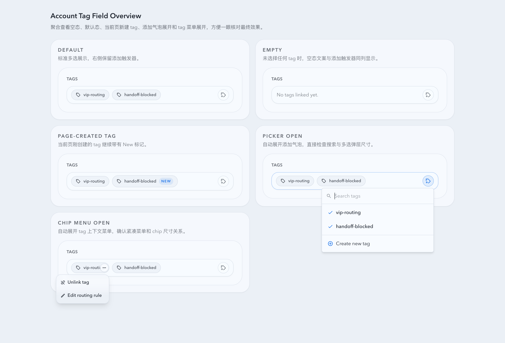
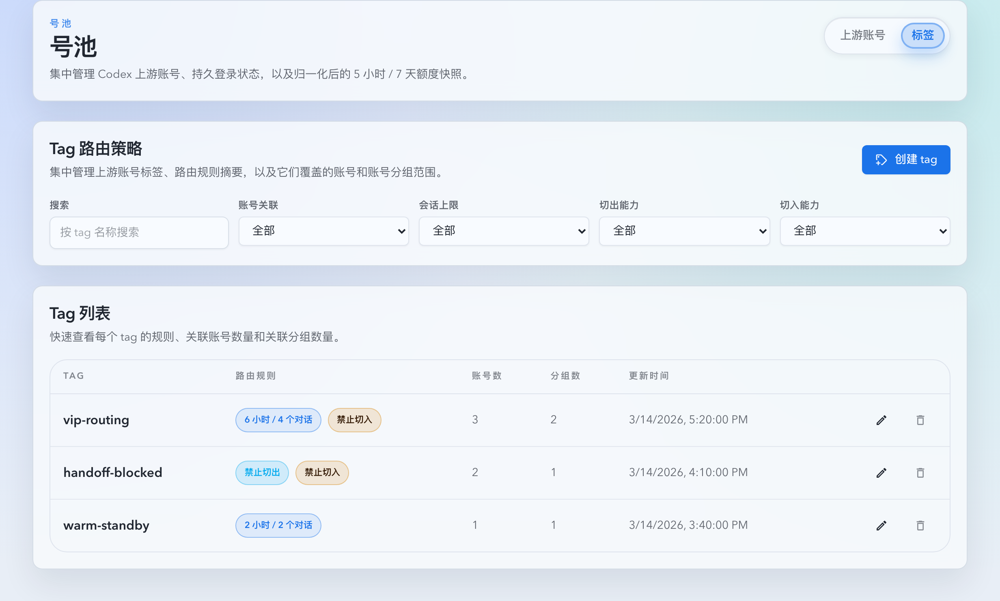
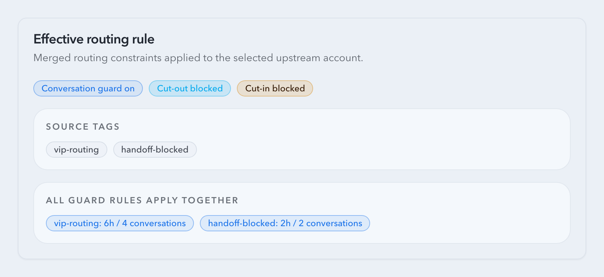
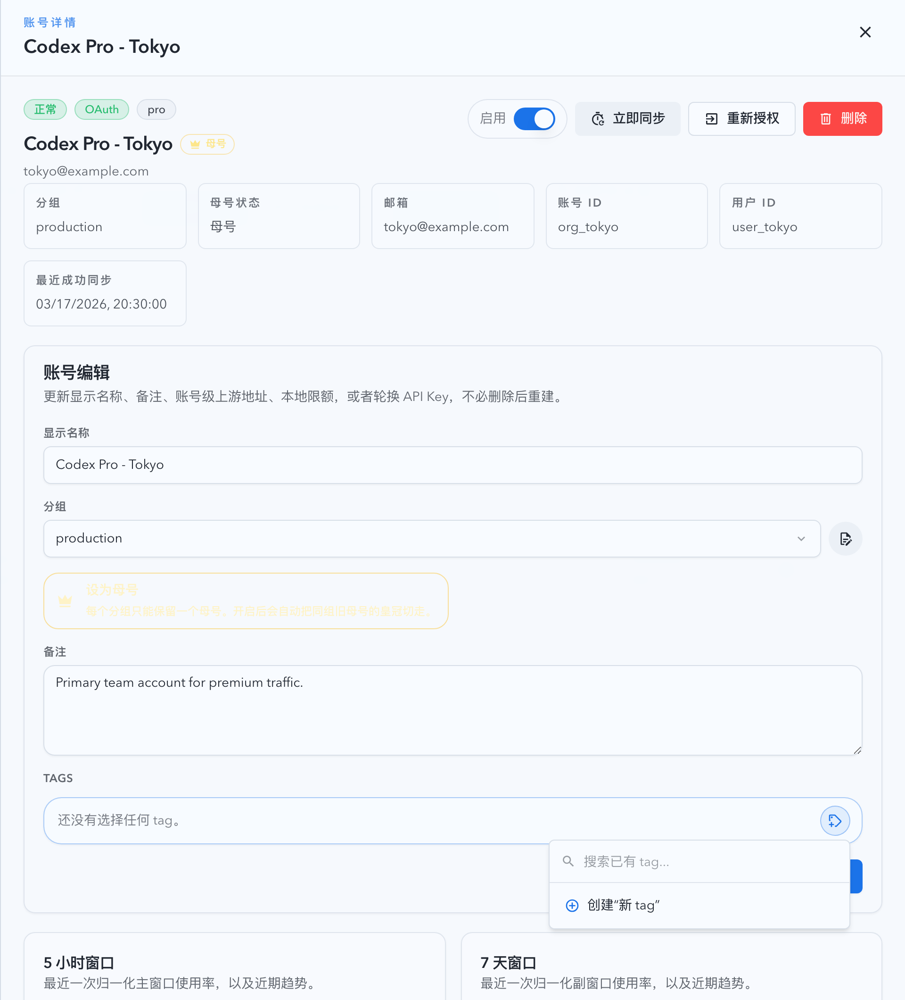

# 号池 Tag 路由与管理扩展（#t3rdp）

## 状态

- Status: 已完成
- Created: 2026-03-14
- Last: 2026-03-22

## 背景 / 问题陈述

- 当前号池只支持按账号状态、配额窗口与 sticky route 做路由，缺少能表达业务分层与迁移约束的标签体系。
- 上游账号新增与详情编辑目前只能维护名称、分组和限额，无法给账号打标，也无法在界面上看见“最终实际生效”的路由规则。
- 现有 sticky failover 只基于账号健康与排序，没有“禁止切出 / 禁止切入 / 最近 X 小时最多关联 Y 个对话”的约束，无法满足更细粒度的池内调度需求。

## 目标 / 非目标

### Goals

- 为上游账号引入可复用的 tag 实体，支持创建、编辑、删除、搜索、筛选和多账号关联。
- 在新增上游账号与账号详情编辑时支持多选 tag，并为已选 tag 提供悬浮/长按上下文菜单，支持反关联、删除（仅当前页新建 tag 且无其他引用时）与规则编辑。
- 新增 `号池 -> Tags` 列表页，在号池首页提供稳定入口，并展示 tag 的规则摘要、关联账号数、关联账号分组数与更新时间。
- 在服务端统一计算账号的最终生效规则并回传给前端，在账号详情中直接展示合并后的最终规则与来源 tag。
- 在现有 stickyKey / promptCacheKey 路由体系内加入 tag 路由约束，且无 tag 账号继续沿用现有候选排序。

### Non-goals

- 不新增请求侧 `tag` / `tags` 字段，也不改为通过请求头传 tag。
- 不重写 usage 同步、账号健康状态机或全局候选排序公式。
- 不引入默认 tag 或“未打标账号禁止路由”的强制策略。

## 范围（Scope）

### In scope

- `src/upstream_accounts/mod.rs`：tag schema、CRUD、账号-tag 多对多关系、OAuth session tag 持久化、effective routing rule 计算与路由约束实现。
- `src/main.rs`：接入新的 tag API 路由。
- `web/src/pages/account-pool/**`、`web/src/components/**`、`web/src/hooks/**`、`web/src/lib/api.ts`、`web/src/i18n/translations.ts`：tag 列表页、账号页 tag 交互、tag 规则抽屉、最终规则展示。
- `docs/specs/README.md`：登记本工作项状态。

### Out of scope

- 改造请求协议来显式携带 tag。
- 引入新的 conversation identity 字段；继续沿用 stickyKey / promptCacheKey。
- 更改无 tag 账号的路由排序结果。

## 需求（Requirements）

### MUST

- tag 需支持名称、会话上限守卫（开关 + `lookbackHours` + `maxConversations`）、`allowCutOut`、`allowCutIn` 三类规则。
- 一个账号可关联多个 tag；路由时多个 tag 规则同时生效，并按“最严格优先”合并。
- 新增 OAuth / API Key 账号、编辑账号详情时都必须支持 tag 关联；OAuth 登录完成后不能丢失创建阶段选中的 tag。
- 新增 OAuth / API Key 账号、编辑账号详情时的 tag 字段必须表现为单个输入式容器：已选 tag 内联展示为 chips，尾部固定添加触发器，触发后以 anchored popover 提供搜索、多选与创建。
- 账号详情必须直接显示“最终生效规则”，包括合并后的结果以及来源 tag。
- `Tags` 列表页必须至少展示：tag 名称、规则摘要、关联账号数量、关联账号分组数量、更新时间，并支持搜索与规则筛选。
- 若 sticky 当前绑定账号禁止 `cut-out` 且该账号无法继续服务，则请求直接失败，不迁移到其他账号。
- 若候选目标账号禁止 `cut-in`，则它不能接收来自其他账号迁移来的 sticky 会话。
- 会话上限守卫仅对“首次分配新 sticky 会话”或“将已有 sticky 会话迁移到新账号”生效；已在当前账号上的会话可继续留在原账号。

### SHOULD

- 标签编辑优先使用抽屉，保证在账号页与 tags 列表页之间复用同一编辑表单。
- tag chip 的上下文菜单在桌面端支持 hover / focus，在触屏端支持长按触发。
- tag 选择器在账号页与新增页应维持同一交互模型：选择/取消选择多个 tag 时 popover 不自动关闭，只有主动关闭或转入创建/编辑对话才退出当前选择上下文。
- 服务端统一产出 `effectiveRoutingRule`，前端仅展示不重复实现合并逻辑。

## 功能与行为规格（Functional/Behavior Spec）

### Core flows

- 用户在新增账号页打开 tag 选择器时，会看到同一个输入式容器内的已选 chips 与尾部添加触发器；打开 popover 后可搜索已有 tag、连续多选/反选、立即创建新 tag，并在保存账号时把 `tagIds` 一起提交。
- 用户在账号详情页可查看已关联 tag 与最终生效规则，并可直接在内联 chips 容器里增删关联、编辑 tag 规则。
- 用户进入 `号池 -> Tags` 页后，可按搜索词和规则开关过滤 tag 列表，并查看每个 tag 影响的账号与分组规模。
- 路由收到带 stickyKey / promptCacheKey 的请求时，若已有 sticky route，优先尝试原账号；若原账号不可继续且其最终规则禁止 `cut-out`，则立即失败；否则再从候选池中筛掉不满足 `cut-in` 或会话上限守卫的账号。
- 没有 tag 的账号仍按现有 `secondary -> primary -> last_selected -> id` 排序参与候选选择。
- 至少配置了一个本地 `5 小时` 或 `7 天` 限额的账号，在 sticky 新分配或迁移时会额外受“最近 30 分钟活跃 sticky 对话数是否超过 2”的软降权影响；两个本地限额都为空的账号不受这条软降权影响，继续沿用既有候选排序。

### Edge cases / errors

- 删除 tag 时，若该 tag 仍被其他账号或待完成 OAuth session 引用，后端返回冲突；前端在账号页上下文菜单里退化为仅反关联当前账号/草稿。
- 若账号关联多个启用会话守卫的 tag，则所有守卫都必须满足；详情页需明确展示“全部守卫同时生效”的状态，而不是只显示单个值。
- 若请求没有 stickyKey / promptCacheKey，则不应用会话上限守卫，也不触发 cut-in / cut-out 迁移判定。

## 接口契约（Interfaces & Contracts）

- `GET/POST /api/pool/tags`
- `GET/PATCH/DELETE /api/pool/tags/:id`
- `CreateOauthLoginSessionRequest.tagIds`
- `CreateApiKeyAccountRequest.tagIds`
- `UpdateUpstreamAccountRequest.tagIds`
- `UpstreamAccountSummary.tags`
- `UpstreamAccountDetail.tags`
- `UpstreamAccountDetail.effectiveRoutingRule`

## 验收标准（Acceptance Criteria）

- Given 用户在新增账号页选中多个 tag，When 保存 OAuth 或 API Key 账号，Then 列表与详情都会显示这些 tag，且 OAuth 完成后不会丢失关联。
- Given 账号页或新增页的 tag 字段为空或已有已选项，When 用户查看该字段，Then 已选 tag 与空态提示都位于同一个输入式容器内，添加触发器固定在容器尾部，不再拆成独立的按钮区和展示区。
- Given 用户在 tag popover 中连续选择或取消多个 tag，When 每次点击某个 tag，Then 当前 popover 保持打开，并即时反映选中状态。
- Given 一个账号关联多个 tag，When 打开账号详情，Then 页面会展示最终生效规则，并清楚标注由哪些 tag 共同决定。
- Given 某 tag 禁止 `allowCutOut`，When sticky 绑定账号无法继续服务，Then 该会话不会迁移到其他账号，而是直接返回无可用账号/上游失败。
- Given 某目标账号禁止 `allowCutIn`，When 需要接收其他账号迁移来的 sticky 会话，Then 该候选会被跳过。
- Given 某账号未配置本地 `5 小时` 与 `7 天` 限额，When 它最近 30 分钟已有超过 2 个活跃 sticky 对话并参与新的 sticky 候选选择，Then 它仍按既有 `secondary -> primary -> last_selected -> id` 排序参与比较，不会被半小时 sticky 软降权降到回退桶。
- Given 进入 `号池 -> Tags` 页，When 搜索或筛选 tag，Then 列表会更新并显示关联账号数量、关联分组数量与规则摘要。

## 非功能性验收 / 质量门槛（Quality Gates）

- `cargo fmt`
- `cargo check`
- `cargo test`
- `cd web && bun run test`
- `cd web && bun run build`

## 风险 / 假设

- 假设：`allowCutIn` 只影响“已有 sticky 会话迁入当前账号”，不影响首次分配新会话。
- 假设：会话上限守卫按 `pool_sticky_routes.last_seen_at` 的滚动窗口 distinct sticky key 计数实现，无需额外会话统计表。
- 风险：多 tag 会话守卫属于“全部满足”语义，单个 `lookbackHours/maxConversations` 无法完整表达全部规则，因此详情页与 API 需要额外返回逐条守卫明细。

## Change log

- 2026-03-22：补充半小时活跃 sticky 软降权的适用范围，明确该软降权只作用于至少配置了一个本地 `5 小时` 或 `7 天` 限额的账号；两个本地限额都为空的账号继续沿用既有候选排序，不受该软降权影响。
- 2026-03-18：补充账号页与新增页的 tag 字段交互契约，明确必须收敛为“内联 chips + 尾部添加触发器 + anchored popover 搜索/多选/创建”的单控件模型，并要求多选过程保持 popover 打开；本轮 PR 视觉证据继续限定为 Storybook mock-only。

## Visual Evidence (PR)

- source_type: storybook_canvas
  target_program: mock-only
  capture_scope: browser-viewport
  sensitive_exclusion: N/A
  submission_gate: approved
  story_id_or_title: Account Pool/Components/Account Tag Field/Overview
  state: overview-gallery
  evidence_note: 验证账号页 tag 字段已聚合展示默认态、空态、当前页新建 tag、添加气泡展开与 tag 上下文菜单展开，便于一次性核对最终交互与布局结果。
  image:
  

- source_type: storybook_canvas
  target_program: mock-only
  capture_scope: element
  sensitive_exclusion: N/A
  submission_gate: pending-owner-approval
  story_id_or_title: Account Pool/Pages/Tags/Default
  state: list-and-filters
  evidence_note: 验证号池首页已增加标签入口，标签列表页能够展示筛选器、规则摘要、账号数量与分组数量。
  image:
  

- source_type: storybook_canvas
  target_program: mock-only
  capture_scope: element
  sensitive_exclusion: N/A
  submission_gate: pending-owner-approval
  story_id_or_title: Account Pool/Components/Effective Routing Rule Card/Strict Merged Rule
  state: strict-merged-rule
  evidence_note: 验证账号详情页能够直接展示多 tag 合并后的最终生效规则，并标出来源 tag 与逐条守卫约束。
  image:
  

- source_type: storybook_canvas
  target_program: mock-only
  capture_scope: element
  sensitive_exclusion: N/A
  submission_gate: approved
  story_id_or_title: Account Pool/Pages/Upstream Accounts/DetailDrawer
  state: detail-drawer-tag-picker-open
  evidence_note: 验证账号详情抽屉中的 tag 添加面板展开后仍保持可见并停留在抽屉语义层内，证明嵌套 overlay 已继承最近宿主而不再被抽屉层级压住。
  image:
  
