# 账号详情统计 read-model 与 3 秒准确展示 SLA（#t6d9r）

## 背景 / 问题陈述

- 账号详情抽屉的统计面长期依赖在线重算：`/api/pool/upstream-accounts/window-usage`、账号维度 `/api/stats/summary`、`/api/stats/timeseries`、概览页账号活动总览都会在读路径上混合 live rows、archive overlap、hourly rollup 与内存聚合。
- 该读路径在生产数据量下已经退化为秒级到十秒级响应；现网日志已出现单次 20 个账号批量统计约 12 秒，直接导致详情抽屉打开后长时间空白。
- 现有 `upstream_account_usage_hourly` 只能覆盖部分数量类指标，不足以支撑详情页全部精确字段，尤其无法可靠承接 `firstResponseByteTotalP95Ms`。

## 目标 / 非目标

### Goals

- 为账号详情页所有统计面建立精确 read-model 读路径，避免在线扫描大段 `codex_invocations`、大 OR 窗口条件与 archive/live 回补拼装。
- 将准确性与时效性前移到写入、archive materialization 与启动追平阶段，确保统计面一旦触发加载，就在 3 秒内展示准确结果。
- 收紧前端详情抽屉的数据编排：保留懒加载，但禁止 roster 刷新、SSE、tab 切换与选中账号变化重复触发重型统计。
- 把账号详情统计的启动追平、接口预算与前端状态流转固定为可回归验证的契约。

### Non-goals

- 不改调用记录表正文的分页、排序与筛选语义。
- 不使用 stale cache、近似值或“先展示旧值再纠正”的首屏兜底。
- 不把全站 dashboard 统计统一重构为同一套 read-model，只修账号详情链路。
- 不变更 upstream account roster、分组、标签、路由与限流语义。

## 范围（Scope）

### In scope

- `actualUsage` 卡片的自然窗口汇总。
- `DashboardActivityOverview` 的账号维度 summary 与 trend / heatmap timeseries。
- 概览页账号活动总览。
- 账号统计 read-model 的 schema、增量维护、archive 重放、启动追平与 readiness 语义。
- 详情抽屉前端懒加载、请求去重、取消旧请求与 SSE / roster refresh 编排。

### Out of scope

- 记录表正文行数据本身的预物化。
- 非账号维度的全局统计面。
- archived 明细在线检索能力。

## Read-model 契约

### 数据模型

- 新增 `upstream_account_stats_hourly`，用于小时级范围聚合与长周期回读。
- 新增 `upstream_account_stats_minute`，用于自然窗口、详情页近端时间范围与边界精确拼装。
- 两层表都必须覆盖详情页实际消费的精确字段：
  - `total_count`
  - `success_count`
  - `failure_count`
  - `in_flight_count`
  - `total_tokens`
  - `input_tokens`
  - `output_tokens`
  - `cache_input_tokens`
  - `total_cost`
  - `first_byte_*`
  - `first_response_byte_total_*`
- `firstResponseByteTotalP95Ms` 不能退化成均值或最大值；bucket 内必须保留可重建该分位数的样本表示。

### 写入与补齐

- invocation 持久化成功后，同步通过 `INVOCATION_HOURLY_ROLLUP_TARGETS` 更新账号 minute/hourly read-model。
- archive materialization 与 live replay 必须通过同一套 `upsert_invocation_hourly_rollups_tx(...)` 目标集合写入账号统计层，禁止并行维护两套口径。
- 历史重建使用 `rebuild_upstream_account_stats_rollups_from_sources(...)`，先回放 archive，再回放 live rows，并将最终 live cursor 写回 `hourly_rollup_live_progress`。
- 任何重建或 replay 都必须幂等；重复执行不得双计数。

### 启动追平与 readiness

- 冷启动阻塞阶段必须先完成 schema ensure、账号统计表存在性修复、hourly/minute read-model bootstrap，再进入 HTTP ready。
- 若账号统计表缺失、为空或 live cursor 丢失，启动阶段必须先重建并保存 cursor，之后 readiness 才能通过。
- readiness 通过后的账号详情统计读取不得再依赖“在线全量回补”作为正确性来源；允许的 live tail 仅限基于已冻结 cursor 的有界补尾。

## 读路径契约

### Summary / timeseries

- 账号维度 summary 与 timeseries 默认只读 `upstream_account_stats_hourly` / `upstream_account_stats_minute`。
- 读路径允许的 raw invocation 补读只限两类：
  - bucket 边界上的精确补齐。
  - `hourly_rollup_live_progress` 之后的有界 live tail。
- 不允许再用“当前 retention cutoff 之后所以 live-only 足够”这种推断替代 read-model。

### Window usage

- `/api/pool/upstream-accounts/window-usage` 优先读取 minute read-model，再合并缺失 hourly usage rows 与 cursor 之后的 live raw tail。
- partial bucket 不得丢失，也不得因为 archive/live overlap 被双计数。
- 不允许按账号窗口构造大型 live SQL + 内存重算作为常规路径。

## 前端编排契约

- 详情抽屉允许懒加载 skeleton，但任何统计面一旦触发加载，展示出来的第一份数据必须是准确值。
- 首次打开详情时，统计面按需加载；不再因为 roster 首屏拉取、include-all、SSE 或列表刷新去 hydrate 当前页所有账号的 `window-usage`。
- invocation `records` SSE 只用于 records/live surfaces 的实时补丁；不得再作为账号池 roster、详情或 `window-usage` 的通用刷新触发器。
- 同账号重复请求必须去重。
- 切换账号、关闭抽屉或 query key 失效时，旧请求必须被取消或结果丢弃。
- SSE 与列表刷新最多触发一次受控详情刷新，不能叠加出重复重型请求。
- 调用 ID 历史定位必须由后端返回目标所在固定页窗口；前端以该页为锚点向新、旧两个方向按需加载，不得逐页扫描目标或预取无关页。
- 锚点窗口必须冻结到定位响应的 `snapshotId + anchorId` 并暂停 records SSE；`anchorId` 负责让双向分页复现定位时的 runtime overlay，用户返回最新记录后才恢复第一页与实时订阅。

## 验收标准（Acceptance Criteria）

- 打开账号详情抽屉后，`actualUsage`、概览页活动总览 summary 与活动趋势都必须在 3 秒内完成准确渲染。
- `/api/pool/upstream-accounts/window-usage` 不再走按账号批量 live 重算热路径；批量账号统计恢复到现有性能预算内，不再出现 10 秒级响应。
- 账号维度 summary / timeseries 对 success / failure / in-flight、tokens、cost、`firstResponseByteTotalAvgMs`、`firstResponseByteTotalP95Ms` 的结果，与既有精确口径逐项一致。
- 冷启动或 archive 回放后，read-model 未追平时 readiness 不得通过。
- 前端必须覆盖：首次懒加载、切换账号取消旧请求、SSE / roster refresh 不重复触发重型统计。
- 后端必须覆盖：增量维护、历史补齐幂等、boundary + live tail 精确性、cursor 恢复、接口只读 read-model 行为。
- 前端必须覆盖：锚点页虚拟定位、向上 prepend 保持视口、向下 append、稳定去重、返回最新恢复 SSE，以及定位 `404`/请求失败提示。
- 后端必须覆盖：账号作用域首/中/末页定位、runtime overlay、固定快照、账号不匹配和 retention 后未找到语义，且定位响应不得包含全量历史。

## Visual Evidence

- 账号详情调用 ID 锚点定位成功态（mock Storybook；冻结历史窗口、返回最新入口、目标行居中聚焦与非布局型高亮）

PR: include
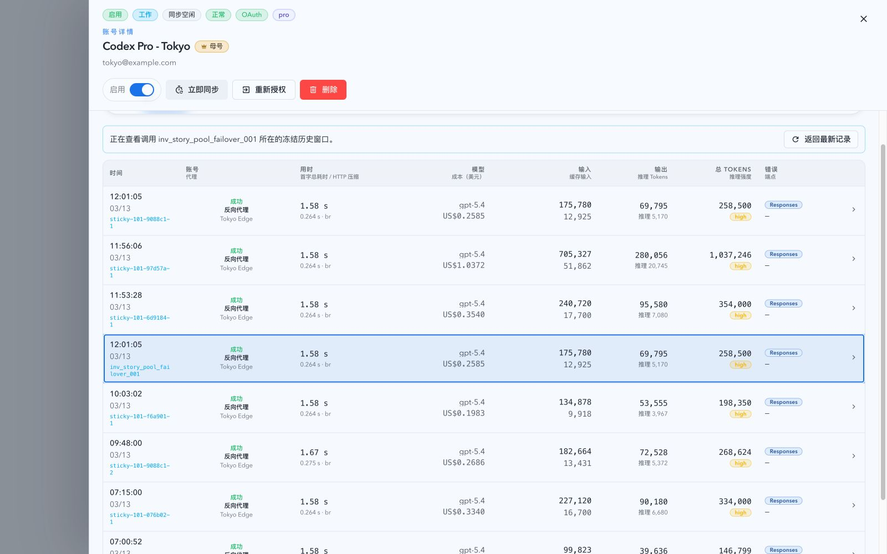

- 账号详情调用 ID 未找到态（mock Storybook；停留调用记录 tab，警告包含目标 ID 且获得焦点）

PR: include
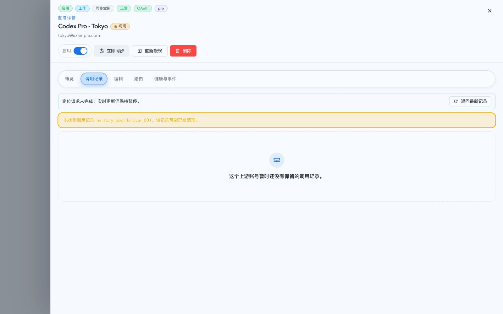

- 账号详情调用 ID 移动端定位态（mock Storybook；完整 ID 在卡片内安全换行，抽屉无横向溢出）

PR: include

- 详情抽屉概览页活动总览（mock Storybook；账号活动总览已归属概览页，记录页不再承载统计图表）

PR: include
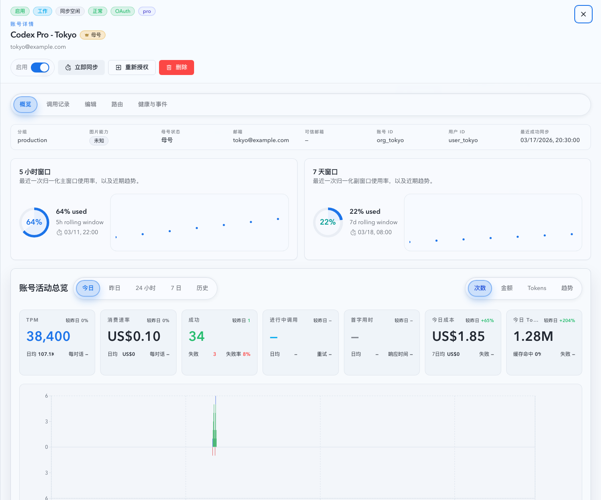

- 详情抽屉 records tab 表格本体（mock Storybook；records tab 移除外层 records 卡片、标题说明与记录数量选择，只保留调用表格）

PR: include
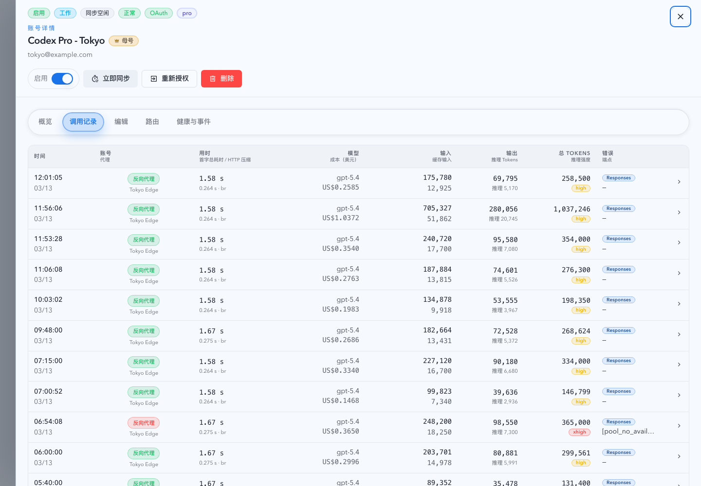

- 详情抽屉 records tab 无限滚动（mock Storybook；固定页大小加载后滚动追加下一页，保留记录表格本体）

PR: include
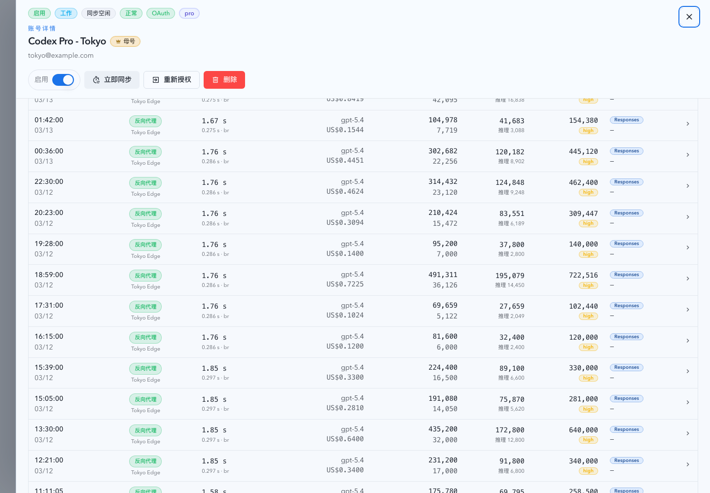

- 详情抽屉记录页默认态（mock Storybook，记录页 tab 已选中；右上角请求日志证明此时只读取详情与账号 stats，不再额外预取 roster `/api/pool/upstream-accounts` 或 sticky `/sticky-keys`）

PR: include
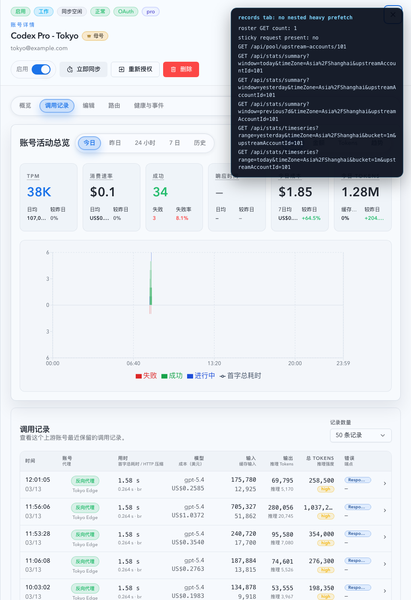

- 详情抽屉路由页按需加载（mock Storybook，从记录页切到路由页后才触发 roster、sticky keys 与 window usage 的受控请求）

PR: include
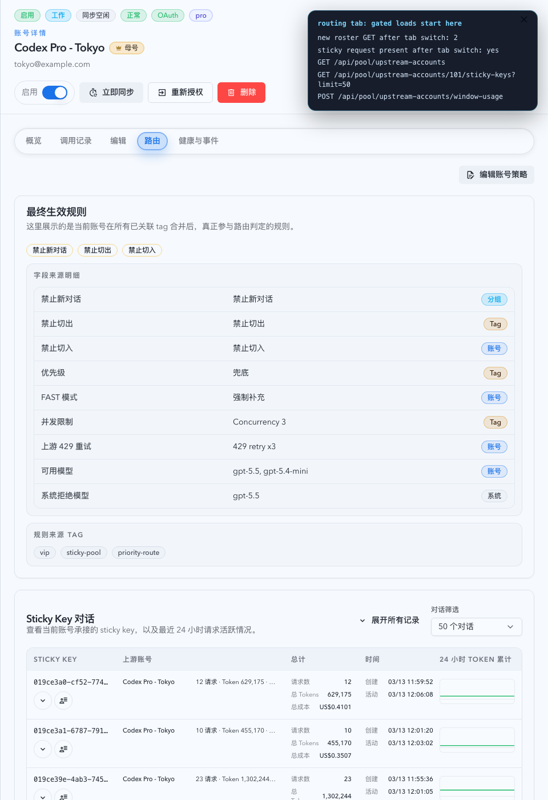

- 详情抽屉 records tab 稳定态（mock Storybook；记录列表已进入 settled state，records tab 只保留调用表格本体，不再承载账号活动总览）

PR: include
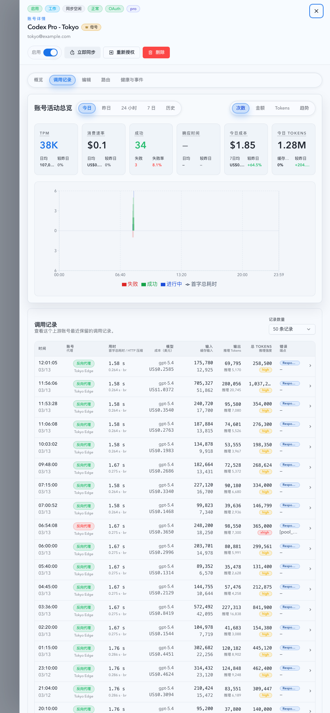

- 详情抽屉 records tab 宽屏放宽态（mock Storybook；共享抽屉桌面宽度提升到 `90rem` 后，记录表格横向空间更充足，不再被旧的 `60rem` 壳层过早压缩）

PR: include
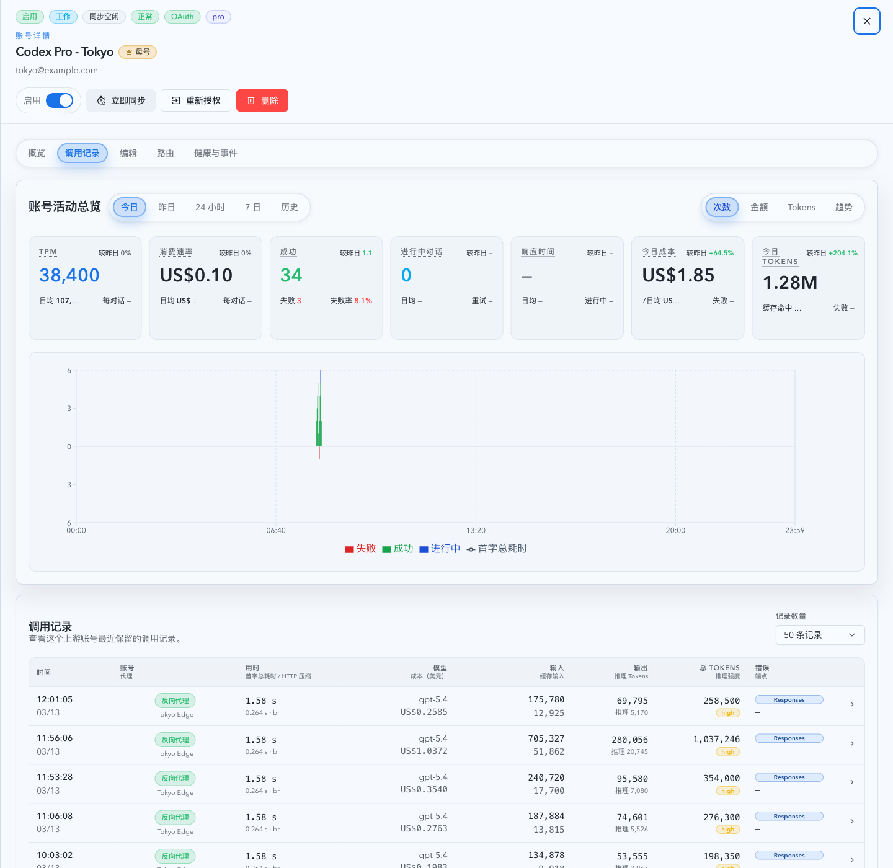

- 详情抽屉概览页活动总览窄宽度 token 标签稳定态（mock Storybook；总 token 指标标题从 `今日 Tokens` 缩短为 `今日 Token`，并保持单行显示，不再在窄卡片里被拆成两行）

PR: include
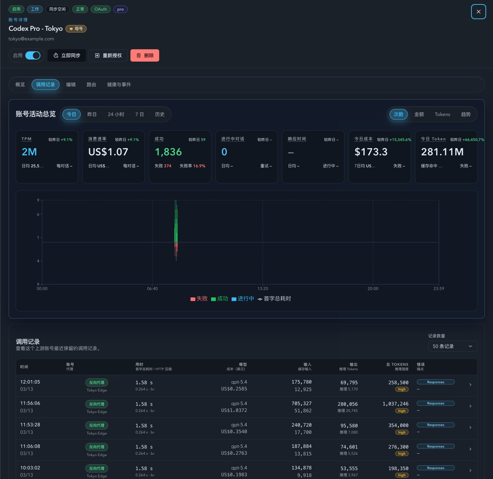

- 全站列表 body 初始错误态（mock Storybook；首屏无已有数据时，错误信息和重试入口展示在列表 body 内，而不是漂在列表外层）

PR: include
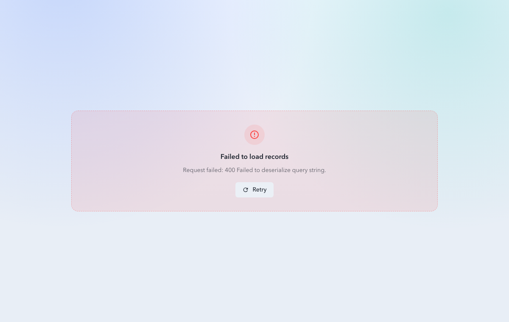

## 参考

- `docs/specs/9aucy-db-retention-archive/SPEC.md`
- `docs/solutions/performance/rollup-backed-summary-window-consistency.md`
- `src/api/slices/prompt_cache_and_timeseries/summary_queries.rs`
- `src/api/slices/prompt_cache_and_timeseries/timeseries.rs`
- `src/upstream_accounts/sync_account_imports_tags.rs`
- `src/upstream_accounts/sync_group_sessions.rs`
- `web/src/hooks/useUpstreamAccounts.ts`
