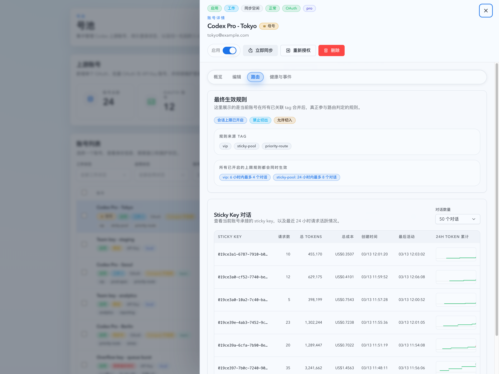
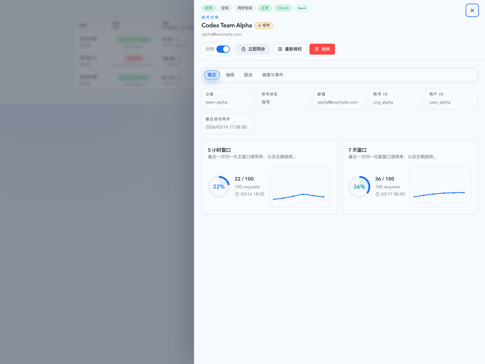

# 上游账号详情改为 URL / ID 驱动并跨页面统一（#t9wwm）

## 状态

- Status: 已实现
- Created: 2026-03-28
- Last: 2026-03-28

## 背景 / 问题陈述

- 当前号池页的账号详情抽屉仍然跟着列表当前项走：列表刷新、分页、筛选或删除当前账号后，详情会自动漂移到别的账号，和“我正在看哪个账号”这一用户心智不一致。
- 当前账号详情没有稳定的 URL 表达。刷新、分享链接或浏览器前进后退都无法可靠复原“当前打开的是哪个账号详情”。
- Dashboard / Live / Records 仍保留一套只读 `InvocationAccountDetailDrawer`，内容和交互都与号池页详情抽屉分叉，用户从监控面打开详情时还需要跳到号池页才能看到完整信息。

## 目标 / 非目标

### Goals

- 把“当前打开哪个上游账号详情”统一收口到当前页面 URL 的 `?upstreamAccountId=<number>`。
- 让号池页详情抽屉只由账号 ID 决定内容，不再因为列表当前页、筛选或删除 fallback 而漂移到其它账号。
- 当当前账号被删除，或详情请求明确返回 `404 / account not found` 时，直接清掉 URL 并关闭抽屉。
- 让 Dashboard / Live / Records 复用号池同款详情抽屉，并保持在当前页面打开，不再跳转号池页查看完整详情。
- 补齐 Storybook、Vitest 与 spec 视觉证据，按 fast-track 收口到 merge-ready PR。

### Non-goals

- 不改后端 API、数据库 schema、`/api/pool/upstream-accounts/:id` 返回结构或账号状态机。
- 不把 active tab、删除确认气泡、warning 等瞬时 UI 状态写入 URL。
- 不新增一套新的详情视觉语言，统一复用号池现有详情抽屉布局、tabs 和账号动作。

## 范围（Scope）

### In scope

- 新增 `upstreamAccountId` query param 契约，并用于 `/account-pool/upstream-accounts`、`/dashboard`、`/live`、`/records`。
- 号池页详情抽屉身份源从“列表当前选中项”改为 URL / accountId。
- 提取共享上游账号详情抽屉，统一号池页与监控页的详情内容、tabs、动作与关闭语义。
- `InvocationTable`、`InvocationRecordsTable`、`PromptCacheConversationTable` 改为透传 `onOpenUpstreamAccount(accountId, accountLabel)`，由页面层持有唯一抽屉实例。
- 更新 Storybook stories、Vitest 场景、spec `## Visual Evidence` 与 PR 事实。

### Out of scope

- 不修改号池列表本身的筛选器、批量操作或分页样式。
- 不新增详情抽屉之外的新页面路由。
- 不扩展到 `settings`、`stats` 或其它当前没有账号详情入口的页面。

## 需求（Requirements）

### MUST

- URL 中的 `upstreamAccountId` 必须成为账号详情抽屉开关状态与账号身份的唯一真相源。
- 号池页刷新、分页、筛选、列表重新加载时，不得因为当前页列表不含该账号而把详情切到别的账号。
- 当前账号删除成功后，必须立即移除 `upstreamAccountId` 并关闭抽屉；若列表刷新失败，也不得保留被删账号的幽灵详情。
- 详情请求或详情相关动作明确返回 `404 / account not found` 时，必须移除 `upstreamAccountId` 并关闭抽屉。
- 其它详情错误必须保留在抽屉内部，不得自动关闭抽屉。
- Dashboard / Live / Records 必须在原页打开共享详情抽屉，不跳转到号池页。
- `Live` 页面只允许存在一个共享账号详情抽屉实例；Invocation 列表与 Prompt Cache 对话表都必须复用这一实例。
- 手动关闭抽屉时，只移除 `upstreamAccountId`，必须保留当前 URL 上的其它 search params。
- 浏览器 back / forward 必须能回放抽屉开关状态。

### SHOULD

- `location.state.selectedAccountId/openDetail` 兼容入口应在进入页面后被改写为 query param，避免继续扩散旧的详情状态模型。
- Storybook 应提供稳定的 URL 打开态和共享抽屉态，作为视觉证据与回归检查来源。

## 功能与行为规格（Functional / Behavior Spec）

### Core flows

- 用户在号池页点击某个账号行后，页面写入 `?upstreamAccountId=<id>` 并打开详情抽屉。
- 用户在 Dashboard / Live / Records 中点击账号名后，当前页 URL 写入 `?upstreamAccountId=<id>`，页面内打开共享详情抽屉。
- 用户刷新当前页面或直接访问带 `upstreamAccountId` 的 URL 时，页面应直接展示对应账号详情抽屉。
- 用户关闭抽屉时，当前页 URL 的 `upstreamAccountId` 被移除，其余 query params 保持不变。

### Edge cases / errors

- 当前详情账号因筛选、分页或列表刷新不在当前列表页时，抽屉仍继续展示该账号详情，直到用户主动关闭或账号真实失效。
- 当前详情账号已被删除，或深链打开一个已删除账号时，详情请求若返回 `404 / account not found`，页面直接关闭抽屉并清理 URL。
- 若详情接口返回其它错误，抽屉保留在当前页，继续显示错误内容，用户可手动关闭。
- Live 页的 Prompt Cache 历史抽屉内嵌 InvocationTable 时，点击账号名仍应打开同一个页面级共享详情抽屉，而不是再次挂载局部抽屉。

## 接口契约（Interfaces & Contracts）

### 接口清单（Inventory）

| 接口（Name） | 类型（Kind） | 范围（Scope） | 变更（Change） | 契约文档（Contract Doc） | 负责人（Owner） | 使用方（Consumers） | 备注（Notes） |
| --- | --- | --- | --- | --- | --- | --- | --- |
| `?upstreamAccountId=<number>` | route query | internal | New | None | web | account pool + monitoring pages | 详情抽屉开关与身份源 |
| `/api/pool/upstream-accounts/:id` | HTTP API | internal | Reuse | None | backend | shared upstream account drawer | 不改返回字段 |
| `UpstreamAccountDetail` | TS type | internal | Reuse | None | backend + web | shared upstream account drawer | 不改 shape |

### 契约文档（按 Kind 拆分）

- None

## 验收标准（Acceptance Criteria）

- Given 用户在号池页点开账号 A 的详情，When 列表刷新、分页或筛选导致当前页不再包含 A，Then 抽屉仍继续显示 A，而不会切到别的账号。
- Given 当前打开账号 A，When 用户删除 A，Then 抽屉立即关闭，URL 中的 `upstreamAccountId` 被移除。
- Given 当前 URL 深链到一个不存在的 `upstreamAccountId`，When 详情请求返回 `404 / account not found`，Then 抽屉关闭且页面不再显示其它账号详情。
- Given 当前详情请求返回非 `404` 错误，When 用户停留在抽屉内，Then 抽屉保留错误态，不自动关闭。
- Given 用户在 Dashboard / Live / Records 点击账号名，When 详情打开，Then 当前页 URL 包含 `upstreamAccountId`，且页面不跳转到号池页。
- Given Live 页的 Invocation 列表与 Prompt Cache 对话表都存在账号详情入口，When 用户分别点击两处账号名，Then 页面只复用同一个共享详情抽屉实例。
- Given 当前页面已有其它 query params，When 用户关闭详情抽屉，Then 只有 `upstreamAccountId` 被移除，其它 query params 保持不变。
- Given 用户通过浏览器 back / forward 切换历史记录，When 历史记录中包含账号详情打开态，Then 抽屉开关与账号 ID 和 URL 保持一致。

## 实现前置条件（Definition of Ready / Preconditions）

- 现有号池详情抽屉 tabs / 关闭语义已由 `#qdyfv` 冻结，可直接复用为共享详情实现。
- 监控侧详情抽屉与号池详情抽屉的差异边界已明确：这轮统一为号池同款，而非继续保留只读阉割版。
- URL query 只承载 `upstreamAccountId`，其余瞬时 overlay 状态保持本地 UI 状态。

## 非功能性验收 / 质量门槛（Quality Gates）

### Testing

- `cd web && bun run test -- src/pages/account-pool/UpstreamAccounts.test.tsx`
- `cd web && bun run test -- src/components/InvocationTable.test.tsx`
- `cd web && bun run test -- src/components/InvocationRecordsTable.test.tsx`
- `cd web && bun run test -- src/components/PromptCacheConversationTable.test.tsx`
- `cd web && bun run build`
- `cd web && bun run build-storybook`

### UI / Storybook

- Stories to add/update: `web/src/components/UpstreamAccountsPage.overlays.stories.tsx`、`web/src/components/InvocationTable.stories.tsx`、`web/src/components/PromptCacheConversationTable.stories.tsx`
- Docs pages / state galleries to add/update: 复用现有 autodocs / canvas stories，不新增独立 MDX
- `play` / interaction coverage to add/update: URL 打开态、跨页面共享抽屉态、删除关闭与 not-found 关闭语义
- Visual regression baseline changes (if any): 号池页 URL 打开态、监控页共享详情抽屉态

## 文档更新（Docs to Update）

- `docs/specs/README.md`: 新增本 spec 索引并记录 fast-track follow-up
- `docs/specs/t9wwm-upstream-account-detail-url-state/SPEC.md`: 维护范围、验收、视觉证据与 PR 事实

## 计划资产（Plan assets）

- Directory: `docs/specs/t9wwm-upstream-account-detail-url-state/assets/`
- In-plan references: ``

## Visual Evidence

- 号池页 URL 打开态（Storybook canvas）

  

  - 验证点：详情抽屉由 `?upstreamAccountId=21` 直接打开，抽屉内容与列表当前页解耦。
- 监控页共享详情抽屉（Storybook canvas）

  

  - 验证点：监控页在原页内打开号池同款详情抽屉，URL 写入 `upstreamAccountId`，不跳转号池页。

## 实现里程碑（Milestones / Delivery checklist）

- [x] M1: 新建 follow-up spec、索引与视觉证据落点
- [x] M2: 号池详情改为 URL / accountId 驱动，删除 fallback 漂移语义
- [x] M3: Dashboard / Live / Records 统一为页面级共享详情抽屉
- [x] M4: 补齐 Vitest、Storybook、视觉证据与 spec sync

## 方案概述（Approach, high-level）

- 新增页面级 query controller，把详情抽屉状态从列表局部 state 提升到当前页面 URL。
- 共享详情抽屉直接复用号池现有 tabs 与账号动作，监控页只替换入口，不再维护独立只读实现。
- 号池页详情逻辑与列表当前项彻底解耦，列表只负责展示当前页 roster，不再决定详情身份。

## 风险 / 开放问题 / 假设（Risks, Open Questions, Assumptions）

- 风险：若旧的 `location.state` 兼容入口与新的 query controller 处理顺序不当，可能导致首次进入时重复开关抽屉或遗留 warning state。
- 风险：Live 页存在 Invocation 列表与 Prompt Cache 历史抽屉嵌套表格，若 callback 透传不彻底，容易出现双抽屉回归。
- 假设：监控页复用号池同款详情时，允许展示同样的账号动作入口；“不跳转号池页”只约束详情查看链路，不限制用户主动触发其它账号动作。

## 变更记录（Change log）

- 2026-03-28: 创建 follow-up spec，冻结 URL / accountId 驱动、删除 / not-found 关闭语义、监控页共享详情抽屉与视觉证据口径。
- 2026-03-28: 完成号池与监控页共享详情抽屉改造，补齐 Storybook / Vitest 与最终视觉证据。
