# 任务运维运行观测与生效计划

> This file is the durable topic requirements contract. Current implementation facts belong in `IMPLEMENTATION.md`; lifecycle and change references belong in `HISTORY.md`.

## Context and Scope

- Context: 任务运维页面需要同时表达真实当前执行、等待执行、最近 12 小时执行区间、任务让行状态、worker 的实际调度策略、详情最近 100 次运行的工作量趋势、目录最近执行摘要与最近 24 小时工作量背景，以及可安全修改的运行配置。
- In scope: 维护任务目录、目录最近执行摘要与懒加载工作量背景、可靠工作量采集补齐、运行与等待观测、执行时间线、任务标识色、任务让行时间线、集中任务能力目录、计划覆盖控制、详情工作量趋势及条件性进度估计、详情页和响应式筛选交互。
- Out of scope: 跨任务优先级队列、多实例聚合、任务业务数据归属和生产周期调整。

## Terms and Interfaces

- `运行快照`: 进程内有界登记器提供的当前执行实例；维护库只保存历史记录。
- `生效计划`: worker 默认规则与维护库自定义覆盖合并后的可展示策略，包含来源、触发机制和编辑能力。
- 待执行请求、准入延后任务、任务执行区间、任务标识色和任务让行状态采用 [CONTEXT.md](../../../CONTEXT.md) 的定义。
- 任务工作量趋势、任务待处理量、本次发现量、本次处理量、任务计量范围和固定清理存量采用 [CONTEXT.md](../../../CONTEXT.md) 的定义。页面图例统一使用“待处理量 / 本次发现 / 本次处理”。
- Interface: `GET /api/system/managed-tasks/runtime` returns process-local executions plus separately available FIFO requests and admission waits; task catalog responses add persisted light/dark identity colors and bounded latest-run summaries. `GET /api/system/managed-tasks/timeline` reads RFC 3339 windows up to 24 hours, with fixed-watermark pages of at most 500 segments and `afterRevision` incremental updates; an expired cursor returns `resetRequired` so the client can resynchronize. `GET /api/system/managed-tasks/{task_key}/workload?windowHours=24&limit=200` reads the task-scoped workload window with limit validation and shared HTTP/SSE semantics. `system.managed-tasks.catalog/v1` and `system.managed-tasks.workload/v1` publish the list and visible-row revisions. Existing task detail interfaces and control `PATCH` retain their prior fields and behavior.

## Requirements

### REQ-TASK-OPS-001

- The system MUST expose only actual work intervals in the runtime snapshot, with a stable execution identity, task identity, actual start time, monotonic elapsed time, trigger, phase, and evidence-backed execution class.
- Inputs: legacy workers and the managed dispatcher enter the shared observation boundary after admission and before work; parent backfill work may publish the active child identity.
- Outputs: `GET /api/system/managed-tasks/runtime` returns `observedAt` and `activeRuns`; normal, failed, cancelled, and unwound work removes its in-memory observation without depending on history persistence.

### REQ-TASK-OPS-002

- The system MUST provide a typed capability catalog for all root and startup-backfill tasks, including trigger mechanisms, effective policy, policy source, edit capability, and execution class.
- Reading the catalog MUST NOT write default values into schedule override columns or synthesize an authoritative next trigger for worker-only policies.

### REQ-TASK-OPS-003

- The system MUST distinguish omitted, `null`, and value schedule fields in task-control PATCH requests.
- New interval/UTC cron overrides MUST be accepted only for the six catalog-approved tasks, with a minimum interval of 60 seconds and five-field UTC cron validation. Existing unsupported overrides MUST remain readable and explicitly resettable.
- Resetting a schedule MUST clear both override fields and the derived next trigger while preserving `enabled`.

### REQ-TASK-OPS-004

- The web task workspace MUST show all active runtime instances above a compact task catalog, support enabled-state and multi-trigger filters with OR within triggers and AND across filter groups, and keep the runtime section independent from catalog filtering.
- Current execution and wait state MUST come from the runtime SSE snapshot and subsequent events; visible elapsed time MUST advance locally every second between events. Returning to the foreground MUST immediately re-establish or resume the SSE subscription, and stale or unavailable observations MUST be shown as unknown rather than treated as an empty state.

### REQ-TASK-OPS-005 — 当前等待任务

- 页面 MUST 在当前执行实例之外列出两类等待，分别标为“已入队”和“等待准入／压力延后”。等待任务 MUST 来自实际请求队列或当前调度边界的权威观测；等待下次正常定时、事件或启动的任务不得因此列入等待列表。
- 已入队请求 MUST 显示任务身份、触发来源、请求时间和等待用时；队列顺序仅在对应 dispatcher 有权威顺序时展示，不得将独立 worker 合成为跨任务 FIFO 或可编辑优先级队列。
- 准入延后任务 MUST 显示观测到的等待原因、观测时间，以及有权威依据时的重试或下次资格时间。不得根据历史延期记录或一般系统告警推测任务仍在等待。
- 当前执行与两类等待 MUST 独立于目录筛选刷新，明确区分空结果、观测过期与观测未知；父子任务共享实例时不得重复计数。

### REQ-TASK-OPS-006 — 固定任务配色

- 每个纳管任务 MUST 拥有固化在任务元数据中的任务标识色；已分配的颜色不得因排序、筛选、启停、触发方式、再次运行或服务重启而改变。既有任务须一次性补齐，新任务的分配不得重排旧任务颜色。
- 任务目录名称左侧 MUST 显示该颜色的 Dot；当前任务列表、等待列表、时间图色条与其任务标识 MUST 使用一致配色。不同任务须分配不同颜色，并在深浅主题下保持可见。
- 颜色 MUST 只表达任务身份；运行结果、等待类别与压力状态须有独立的文字、图标或条纹表达。任务名称与悬停详情须能支撑不依赖颜色的识别。

### REQ-TASK-OPS-007 — 最近 12 小时执行总览

- 时间图 MUST 展示滚动最近 12 小时内与窗口相交的实际任务执行区间，包括已经结束的运行和当前执行实例。跨越窗口边界的区间须裁剪显示并保留真实起止信息；不得将计划检查或排队时间画为实际执行。后端查询和持久历史可保留更长窗口，以支持分页、增量读取和恢复。
- 时间图 MUST 使用紧凑多泳道，按执行区间的重叠关系分配行；行不固定归属某个任务。同一任务的多次运行使用同色独立区间，同时发生的运行不得互相遮蔽。
- 前端 MUST 每秒本地推进时间轴、当前时间标记和仍在执行的色条终点；执行状态以后台观测为准，本地计时不得制造结束结果或继续延伸已知过期的运行观测。页面恢复前台时立即校准，图表的每秒更新不得要求每秒重新获取目录或整段历史。
- 当前执行、dispatcher 队列与准入等待 MUST 通过 SSE 主题传输：连接时提供当前快照，后续运行边界和等待变化通过事件推送；它们不得依赖固定周期的 HTTP 轮询。任务目录是静态配置，可独立按需通过 HTTP 读取。
- 执行时间线区间 MUST 通过 `GET /api/system/managed-tasks/timeline` 的固定水位游标分页加载，每页最多 500 条；后续修订 MUST 通过 `afterRevision` 分页读取。一次基线或增量遍历的所有页 MUST 共用固定的 RFC 3339 `from` / `to`，并只在整轮完整后提交。已过期游标 MUST 丢弃未完成遍历并重启基线。
- `system.managed-tasks.timeline` SSE MUST 使用 `/v2` schema epoch，且只发送维护库 `watermark` 与 `observedAt`，作为 HTTP 增量读取通知；SSE MUST NOT 包含或聚合区间数据。客户端 MUST 先建立 SSE 订阅，再读取完整基线；基线期间及增量读取期间到达的修订通知 MUST 合并至目标水位，按 `segmentId` 保留最高 `revision`，并在追平通知水位前继续读取。SSE 重连后的水位通知 MUST 补回断线期间错过的修订。
- 基线和增量页在完整提交前 MUST 保持暂存状态；HTTP 失败 MUST 保留最后一次完整时间线并标记为过期，不得显示成空数据或观测缺口。任务执行时间线不得依赖固定周期 HTTP 轮询。
- SSE 静默期间，前端 MUST 继续推进可见当前时间以及连接仍有效的运行/等待时长，不得把“没有新事件”误判为无任务或失联。SSE 断开时 MUST 显示连接状态与最后确认时间；短暂重连窗口后冻结开放状态的外推并标记为未知，重连快照恢复后立即校准。
- 色条详情 MUST 提供任务名称、触发来源、真实起止时间、实际执行用时与结果；缺少的历史字段保持未知。短于实时刷新周期的任务也须能由执行边界记录进入历史；极短区间的可见标记不得改变原始耗时。
- 已结束区间 MUST 保留成功、失败、取消或其他已观测结果的区别，不得只展示成功记录。共享一个执行实例的父子任务不得画成两个并行任务；当前子任务身份须在对应实例详情中可辨认。
- 密集区间 MAY 采用像素级聚合标记，但 MUST 展示聚合数量并支持查阅其包含的实际运行；聚合不得改写真实起止、合并运行身份或静默丢弃记录。
- 目录筛选 MUST 保持当前执行和等待区的完整性；时间图默认展示全部任务的窗口内执行，色条须可关联到对应任务详情。窄屏 MUST 隐藏冗余文字泳道标签，时间图 MUST 适配可用宽度且不得引入横向滚动；泳道含义须通过无障碍名称保留。

### REQ-TASK-OPS-008 — 任务让行状态行

- 时间图 MUST 保留一行与执行区间共用时间轴的任务让行状态，以不同颜色横条表达正常准入、资源占用让行、压力延后与观测未知等实际状态。
- 此行 MUST 聚焦会延后任务的压力、资源占用和准入限制；系统总体健康或与任务等待无关的告警不得直接作为让行状态。悬停须展示对应时间范围、原因、可确认的受影响任务以及可确认的恢复资格时间。
- 相邻且状态与原因一致的区间 SHOULD 合并。同一时段存在多种限制时须保留原因集合，不得在汇总为单条横条后丢失具体让行原因；未观测的时段不得标为正常。
- 当前状态 MUST 随后台观测刷新，前端每秒推进仍有效的开放区间；一般累计压力计数或性能时间桶不得冒充精确的状态起止区间。

### REQ-TASK-OPS-009 — 持久区间与观测覆盖

- 后端 MUST 独立于 HTTP 请求和页面打开持续采集实际执行边界及任务让行状态变化，并保留可恢复的至少 48 小时历史缓冲。服务重启后须读取已有区间，记录窗口之前开始、但仍与窗口相交的执行或状态也不得因保留策略丢失。
- 请求时间、实际执行开始、实际执行结束与实际执行用时 MUST 分别表达。当前快照和持久历史 MUST 通过同一执行身份关联并去重；跨重启不得复用一个身份将不同运行合并。
- 历史写入和采集 MUST 有界、异步、可合并且不会阻塞任务工作；新增执行区间、让行区间和覆盖诊断归维护库，性能指标库继续保存聚合指标。观测不可用不得回退为业务主库同步写入，也不得改变任务准入、启停、调度周期或无追赶规则。
- 停机、采集失败、丢弃、维护库不可用及功能启用前的无证据时段 MUST 显示缺失或未知覆盖。重启前未确认结束的运行须标明中断／结束未知，不得延伸至当前或伪造成功；已知记录不因部分缺口而消失。
- 旧历史记录中含入队含义的 `started_at` 和可能包含排队的 `duration_ms` MUST 保留原有兼容含义；不得重命名为实际执行起点，也不得通过旧耗时反推起点。新的字段或区间记录须通过前向、幂等且有界的维护库迁移安装，已有配置与任务颜色不被覆盖。
- 时间线读取 MUST 使用有界、可续取的窗口查询与增量刷新；高频刷新不得每次加载完整历史、扫描业务表或以静默数量截断冒充完整请求窗口的覆盖。压力区间保留须满足请求窗口覆盖，并合并相同状态及原因的相邻区间，不能为了前端一秒动画每秒写入相同状态。

### REQ-TASK-OPS-010 — 有证据的任务计量

- 每项纳管任务 MUST 声明待处理量、发现量和处理量各自的支持能力、单位与范围。每个运行样本 MUST 分别保留指标值、实际观测时间和覆盖性质：完整准确值、有限窗口值、下界或未知。能力支持不表示当前运行一定有值。
- 运行图中的“待处理量” MUST 使用本轮开始时对完整适用范围的准确观测；未完成全量发现的任务 MUST 保持此值未知。分页条数、LIMIT 截断结果、扫描预算或存在更多候选的布尔提示不得作为全量待处理量；下界可在说明中标为“至少”，不得画成准确总量。
- “本次发现” MUST 计本轮实际确认符合处理条件的不同候选，允许多页或边扫描边处理累计。扫描过但不符合条件的项目不得计入；重复扫描和重试不得重复累计。读取既有队列并确认本轮候选也属于本轮发现，不能把它误称为跨轮新增。
- “本次处理” MUST 计到达任务专属成功完成边界的不同工作项；对事务任务以成功提交为准。运行失败、中断或部分完成 MUST 保留已有确认成果；未执行、失败尝试和未提交批次不得计入。
- Retention 主计量范围 MUST 使用待归档 invocation 行；裁剪详情、上游尝试、会话、文件、字节和归档批次分别计量。不得把混合处理总数放到 invocation 积压轴上。归档回填中的扫描批次数与更新行数或账号数不得合成为同单位的子集关系。
- 采集 MUST 在既有工作边界记录事实并异步进入维护库，独立于页面打开。页面读取不得补做全量 COUNT、文件遍历或业务重建以填充图表；任务预算、业务正确性、启停与调度规则保持原有边界。

### REQ-TASK-OPS-011 — 最近 100 次运行样本

- 每个任务详情 MUST 展示最近最多 100 次具有权威运行身份的尝试，包括成功、部分完成、失败、确认跳过和正在运行的尝试，按运行顺序从旧到新呈现。当前运行的已有计数标为进行中，不伪装为终态；待执行请求和没有实际运行尝试的常规计划检查不占样本位置。
- 手动、启动、定时、事件和追赶等实际执行入口 MUST 进入同一工作量观测契约；共享一个执行实例的父子身份不得在同一任务序列重复计数。确认跳过的尝试须保留时间、身份和原因，但不伪造实际执行起点或用时。
- 维护库 MUST 保留每项任务最近至少 100 个已记录样本，日龄清理不得提前删除这些样本。升级前缺少的指标、采集失败或历史不足 100 次 MUST 保持未知并展示实际覆盖；不得从当前业务数据重建旧发现量或处理量。
- 查询与刷新 MUST 有界并支持稳定的运行身份去重，沿用已有 SSE 运行边界和修订信号及时刷新工作量；图表不得仅随初次打开或控制操作更新。旧接口中缺少新计量字段时也须正常渲染。
- 横轴 MUST 表达运行顺序并在 Tooltip 中显示实际时间与触发来源，不把间隔不同的 100 次运行宣称为固定时长窗口。相邻跳过、失败或缺测记录不得因没有数值而从横轴消失。

### REQ-TASK-OPS-012 — 重叠面积与包含关系

- 最近运行工作量 MUST 使用三条共用零基线的重叠面积序列，分别表示待处理量、本次发现和本次处理。三者使用不同且在深浅主题下可辨认的稳定颜色、边界线和透明填充；颜色只表示指标。不得将三个原始数值相加后堆叠，或把面积顶边标为它们的合计。
- 对同一单位、相容范围且已证实“处理候选 ⊆ 发现候选 ⊆ 本轮起点待处理存量”的样本，边界分别落在原始 P、D、C。若以差值色带实现，底层为 C，中层为 D−C，顶层为 P−D；总高度仍为 P。Tooltip 和图例 MUST 使用原始三项数值；差值只描述已证实的集合分区。
- 例如 P=1,000、D=100、C=60，边界为 1,000、100、60，可见分区为未发现 900、已发现未处理 40、已处理 60，总高度不得变为 1,160。发现量只是本轮候选，不得解释为新增积压。
- 三项图例 MUST 始终存在。某项整段缺失或不支持时，不绘制该项面积，图例注明“暂无观测”或“不适用”；某个点缺失时只留该项缺口。缺失项不得补零、由另两项推测、或通过差值运算造成已有序列一起消失。准确观测的零值须落在基线。
- 单位不同的序列 MUST 在同一 Tab 内分成共用运行横轴、独立纵轴且单位明确的图面，三项图例仍保留。不得将批次、行、账号、文件或字节通过任意缩放叠在一根数量轴上。
- 同单位但范围不相容、仅有窗口值、运行中有范围外新增或无法证明包含关系时，MUST 只按原始值重叠展示并标明范围限制，不派生差值分区或百分比。违反 C≤D≤P 时不得裁剪数值强造子集关系；须保留事实并显示范围不相容或计量异常。
- 图形 MUST 使用不会在已满足包含关系的相邻样本间制造交叉或负分区的连接方式；单个有效样本也须以可见点表达。不得用平滑曲线制造数据未支持的峰值或阶段反转。

### REQ-TASK-OPS-013 — Tabs 与完整空图表

- 所有任务详情 MUST 保留“运行趋势”图表区域，默认“次数”Tab 展示最近最多 100 次运行。Retention 详情在同一区域增加“时间”Tab，展示最近 7 天归档积压；该 Tab 的待归档数量与最长逾期图继续使用独立单位、共用时间轴，并遵循 Retention 主题的小时观测契约。Tabs MUST 复用项目共用分段控件并保持单行，不因命名调整增加独立的运行小时筛选模式。
- “运行趋势”标题与视图 Tabs MUST 位于同一标题行并两端对齐：标题靠图表区域左端，Tabs 靠右端，二者垂直居中。宽屏与窄屏均不得把 Tabs 换到标题下一行；标题行及 Tabs 内的标签不得换行或造成横向溢出。
- 加载中、全空、指标不支持、接口字段缺失和读取失败时，选中 Tab MUST 仍渲染固定高度的图面、坐标轴、网格、单位或未知单位标记、图例及图内状态提示。可以使用明确的参考刻度，不能把参考刻度或占位数据当作实测零；不得只剩“暂无观测数据”等文本或隐藏整张图。
- Tab 切换 MUST 保持图表区域高度稳定，容器按两个 Tab 中图面数量较多的响应式布局预留高度；未选中的 Tab 不挂载图表画布，预留区域不显示数据。图面窄屏固定 280px 高、宽屏至少 300px 高；摘要在窄屏采用双列布局。最多 100 个样本均可查看，窄屏默认聚焦最近 20 次，宽屏默认显示 100 次，并可切换 20、50、100 次。Tab 支持键盘选择，图面在窄屏适配可用宽度。Tooltip 须支持指针、键盘与触屏查看运行身份、时间、状态、三项原始值、单位、观测性质和跳过或失败原因。
- 运行图中跨越确认跳过且没有该项数值的样本，MUST 使用不带面积填充的虚线连接两侧有效边界，并保留跳过位置；首尾跳过无两侧端点时只保留状态标记。虚线不形成实测样本，也不用于估计。不得在图表内展示设计规则或实现说明。
- 普通采集缺口、失败但无计量证据、单位或范围切换 MUST 中断面积与实线，不泛化为跳过虚线；失败运行有已确认计量时继续绘制真实值并独立标明失败。7 天小时积压缺测继续留空，不因运行图的跳过规则而插值连接。

### REQ-TASK-OPS-014 — 条件性摘要、进度与清零预估

- 详情页 MUST 移除所有任务强制展示的“总量 / 已完成 / 当前进度 / 预计剩余 / 计量单位”五张通用 Stat。单位属于图轴和 Tooltip；摘要按任务能力与有效证据展示最近准确待处理快照、本次处理、处理速率和可成立的清零预估，附观测时间。数据不足的解释放在图内，不建立一排无意义占位卡。
- 百分比仅在已捕获固定清理存量、且能确认该存量中不同工作项的累计成功完成量时展示。滚动待处理量不是固定分母，“本次处理 / 本次发现”只是本轮候选处理比例；不得标为总体进度，也不得将最近 100 轮计数简单累加后除以最新积压。未确认目标范围全部完成时不显示总体 100%。
- 未取得完整待处理量的有限扫描任务 MUST 展示已知发现量、处理量及其范围，并保持总体进度与清零预估未知；扫描到页尾或本页完成不等于全量清空。
- 清零预估 MUST 使用近期、同口径且有足够覆盖的样本，并公开估计窗口和样本覆盖。不得在图表或摘要中展示需求、设计规则或实现说明。耗时使用真实墙钟时间，包含轮间等待、计划间隔和压力让行；只用成功轮的活跃处理秒数不得推算实际清空时刻。
- 固定清理存量可以使用已确认的存量剩余量和持续处理速度估算。持续补充的积压还须有准确且可比较的积压观测或新增速率，以确认净消化速度；“本次发现”不能作为跨轮新增速率。净消化不为正时显示“积压未下降，暂无法估算清零”，不输出有限 ETA。
- 过期、缺测覆盖不足、单位或资格策略变化、估计条件不成立时 MUST 说明暂无法估算。准确观测为零时显示“已清空”；估计中的零与待办未知不得伪装为已清空。任务停用时不得沿用此前速率预测任务继续处理。

### REQ-TASK-OPS-015 — 目录最近执行摘要

- 每个目录条目 MUST 展示最近一次有证据的运行尝试的触发时间、实际执行用时和结果，包括失败、部分完成、取消、中断、确认跳过及运行中状态，不得只选最近成功运行。摘要 MUST 独立于背景图的 24 小时窗口及懒加载状态，窗口外的最近运行仍须可见。
- 最近触发时间 MUST 来自权威运行尝试记录；已入队但没有运行尝试的请求和常规计划检查不得冒充一次实际运行。请求时间与实际开始时间均已知时，详情须保留二者的区别。
- 执行用时 MUST 使用实际执行边界的用时，排除入队等待；旧记录无法证明实际用时、确认跳过没有实际执行时 MUST 保持未知。当前运行用时使用有效运行观测并在本地推进；失联后遵守既有冻结与未知状态规则。
- 摘要 MUST 使用有界的目录批量读取与既有运行修订信号更新，不得为了展示摘要逐项加载完整任务详情。当前与持久记录须通过稳定身份去重；观测不可用、历史未知与尚无已记录运行须分别说明。

### REQ-TASK-OPS-016 — 目录 24 小时工作量背景

- 每个任务目录条目的行背景 MUST 使用待处理量、本次发现、本次处理的工作量计数，遵守 `REQ-TASK-OPS-010` 和 `REQ-TASK-OPS-012` 的原始数值、单位、范围、覆盖性质及重叠面积规则。执行用时属于摘要与点详情，不得替换背景图纵轴；触发次数不得作为缺失工作量的替代值。
- 横轴 MUST 固定为滚动最近 24 小时，并将各次尝试放在真实尝试时间位置。每任务最多显示最后 200 个运行身份，包含当前尝试、确认跳过及没有数值的已记录尝试；先去重再限制数量。超过 200 个时较早区域留空，保留完整 24 小时域，不将最后 200 点拉伸铺满整行。
- 被数量上限省略的早期区域 MUST 与无运行、功能启用前无计量和采集缺口可区分；不得把显示截断解释为零工作量或没有触发。单个有效样本和真实零值须可辨认，缺失指标不补零，不跨采集缺口或单位／范围变化连接面积。
- 面积颜色 MUST 表示工作量指标；目录 Dot 继续表示任务身份，结果采用独立文字或标记。不同单位不得合成同一数量轴或通过任意缩放相加，点详情须注明单位与范围，跨任务数量不得暗示同一尺度。
- 背景 MUST 保持目录文字、链接和筛选可用，不降低文字对比度，不因加载改变行高或引入窄屏横向滚动。点详情须支持指针、键盘与触屏查看时间、触发来源、结果、三项原始值、单位、观测性质及有界原因。

### REQ-TASK-OPS-017 — 目录工作量数据与保留

- 维护库 MUST 保留每任务最近至少 200 个已记录终态工作量样本及当前尝试，采集独立于页面打开并继续采用有界异步观测。初始化和日常清理不得再提前删除第 101 至 200 个样本。
- 目录背景读取 MUST 按任务与 24 小时窗口有界选择最近尝试，提供稳定身份、观测时间、修订、指标能力、覆盖及截断信息。全任务时间线中的前 200 个区间或详情最近 100 个样本不得冒充该任务最近 24 小时的最后 200 次尝试。
- 新目录窗口 MUST 与详情最近 100 次运行顺序视图分别表达。详情仍保留 20／50／100 控件，现有字段与顺序含义保持兼容；目录不得将详情运行序号直接作为固定时间轴。
- 已被旧保留策略删除的计数和升级前未采集的历史 MUST 保持未知，不从当前业务存量或混合旧计数重建。维护库不可用不得回退为主库同步补写或页面请求期间的业务扫描。

### REQ-TASK-OPS-018 — 背景图懒加载与刷新

- 背景的历史获取和图表挂载 MUST 在目录行进入可见范围后按需执行。未显示、被筛掉或尚未进入可见范围的行不得预先读取完整历史、挂载画布或订阅完整任务详情；不得只延迟绘图而提前读取全部任务历史。
- 请求和订阅 MUST 有界，重复进入可见范围复用仍有效的缓存，同一任务相同窗口的并发读取去重；离开可见范围或卸载后不得继续无意义的逐行刷新。
- 可见背景及最近执行摘要 MUST 沿用已有运行边界、计量修订和 SSE 重连信号及时更新，不引入逐行固定周期 HTTP 轮询。恢复前台后校准时间窗、观测与缓存；缓存过期、失联和请求失败不得伪装为新鲜空结果。
- 前端时间推进不得要求每秒重新读取目录或完整背景历史；懒加载错误须限于对应背景，已知摘要、目录筛选与跳转继续可用。

### REQ-TASK-OPS-019 — 工作量空值原因与成功记录

- 目录与详情 MUST 明确区分指标不适用、支持但尚无观测、窗口内无运行、旧历史未知、采集覆盖缺失与读取失败。不得将这些情况统一解释为没有成功运行，已知成功结果也不得因工作量缺失而消失。
- 某些指标不适用时 MUST 继续绘制其他有证据的指标；全部指标不适用时明确说明该任务不提供工作量计数，保留已知运行摘要与尝试详情，不伪造零值或面积。详情继续遵守 `REQ-TASK-OPS-013` 的固定图面契约。
- 支持项中已记录的有效计数丢失、真实零被当作未知或执行入口漏采 MUST 在真实采集与读取链路修复，不能仅更改空值文案。失败后的已提交成果须保留；没有确认完成边界的缺值不得因状态为成功或失败而自动补零。

### REQ-TASK-OPS-020 — 逐任务补齐可靠计量

- 系统 MUST 逐项核对当前未提供工作量指标的纳管任务，并为有真实工作项、能在现有执行边界可靠统计的指标补齐能力声明及采集。先复用已有结果、循环累计和提交回调；无法成立的指标继续明确标为不适用。
- 每个新增指标 MUST 定义单位、资格范围、观测边界、成功完成边界以及手动／定时／事件／启动入口的一致含义。入队计划不是已完成账号同步，下载不是已应用订阅，扫描不是符合条件的发现，提交前累计不是已完成处理；混合单位的父任务不得直接累加子任务数量。
- 补齐 MUST 不增加只为图表服务的业务全量 COUNT、文件遍历或历史重建，不改变任务预算、生产调度、准入或启停行为。部分提交后失败、重试和父子共享身份须保留确认成果并去重。
- 正常完成并有充分观测证明本次没有成功处理项时 MUST 记录真实零；没有完成观测、提交前失败、采集中断或未确认结束时仍保持未知。采集与声明须同时覆盖实际入口，不得把能力开关改为支持却持续不记录相应事实。

## Verification

### VER-TASK-OPS-001

- Method: Rust unit tests for the observation registry and a controlled worker boundary.
- covers: `REQ-TASK-OPS-001`
- Pass condition: elapsed time is monotonic, child identity is attached, clones share one execution identity, and dropping the last guard removes the snapshot.

### VER-TASK-OPS-002

- Method: maintenance-store catalog and schedule-control tests plus HTTP contract tests.
- covers: `REQ-TASK-OPS-002`, `REQ-TASK-OPS-003`
- Pass condition: all 37 catalog rows have real policy metadata; unsupported additions fail; explicit null clears a legacy override and leaves `enabled` unchanged.

### VER-TASK-OPS-003

- Method: `SystemTasksPage` unit tests, Storybook interaction states, and a controlled local service/browser run.
- covers: `REQ-TASK-OPS-004`
- Pass condition: running/empty/unknown states render, combined filters produce the expected count, and desktop/mobile layouts preserve task identity and policy values.

### VER-TASK-OPS-004

- Method: controlled dispatcher queue, independent worker admission rejection, release, cancellation, and observation-failure fixtures; frontend state tests.
- covers: `REQ-TASK-OPS-005`
- Pass condition: queued requests and admission-deferred tasks remain distinct; normal future schedules stay out of the waiting list; observed release removes waiting; filtering cannot hide current work; missing evidence never appears as an empty healthy queue.

### VER-TASK-OPS-005

- Method: task-metadata initialization and upgrade fixtures, restart, new-task insertion, sorting/filtering, and light/dark rendered states.
- covers: `REQ-TASK-OPS-006`
- Pass condition: every task has a distinct stable identity color; existing colors survive initialization, restart and catalog growth; dots and execution bars agree, and textual identity remains available.

### VER-TASK-OPS-006

- Method: deterministic frontend clock and execution fixtures covering repeated, concurrent, very short, cross-window, ongoing, failed, stale and unknown runs; controlled desktop/mobile UI evidence.
- covers: `REQ-TASK-OPS-007`
- Pass condition: lanes avoid overlap, repeated runs retain task color, each local tick advances the rolling window and valid ongoing bars, finished runs stop, actual time excludes queuing, and short executions remain discoverable without one-second history requests.

### VER-TASK-OPS-007

- Method: task-admission transition fixtures with pressure cooldown, occupied resources, concurrent reasons, recovery, unrelated health degradation, and missing observation coverage.
- covers: `REQ-TASK-OPS-008`
- Pass condition: the dedicated row aligns with task execution time, exposes actual deferral reasons, retains concurrent causes, merges equivalent adjacent states, ignores unrelated alerts, and represents missing coverage as unknown.

### VER-TASK-OPS-008

- Method: restart, page-closed collection, migration, delayed/dropped history writes, queue-wait, parent/child, retention-boundary and dense-window fixtures; API pagination and frontend clock checks.
- covers: `REQ-TASK-OPS-007`, `REQ-TASK-OPS-008`, `REQ-TASK-OPS-009`
- Pass condition: history survives restart without live-run resurrection or duplicate bars; short runs appear while no page is open; actual execution time excludes request waiting; legacy unknowns and downtime remain visible; intersecting boundary intervals survive retention; dense groups retain inspectable run identities; reads remain bounded and observations never add synchronous main-database writes.

### VER-TASK-OPS-009

- Method: per-task metric fixtures covering complete backlog, bounded candidate selection, ineligible inspected items, retries, queue consumption, partial commit followed by failure, incompatible units, truncated lower bounds and every actual trigger path.
- covers: `REQ-TASK-OPS-010`, `REQ-TASK-OPS-011`
- Pass condition: metrics preserve their meaning, unit, scope and coverage; partial scans do not become full totals; committed items are counted once; failures preserve commits; at most 100 ordered identities are returned while retention preserves the latest 100 per task; queued-only requests are excluded and skipped attempts remain visible; collection does not depend on an open page or add synchronous main-database writes.

### VER-TASK-OPS-010

- Method: frontend fixtures plus controlled desktop/mobile Demo or Storybook rendering for P=1,000/D=100/C=60, missing each series, one valid sample, real zeros, all-empty/loading/error states, skipped segments at the beginning/middle/end, failure with commits, incompatible scope and mixed-unit tasks.
- covers: `REQ-TASK-OPS-012`, `REQ-TASK-OPS-013`
- Pass condition: original boundaries are 1,000/100/60 with no additive total of 1,160; all three legends remain; absent series do not erase present series; incompatible units use separate axes; skipped bridges are dashed and unfilled, missing observations remain gaps; both Tabs render real chart frames in empty states; the heading and shared segmented Tabs stay on one vertically centered row, aligned to the left and right edges respectively, in desktop and mobile layouts without wrapping or horizontal overflow; keyboard and touch access work without horizontal scrolling. Retention hourly gaps retain the separate no-connection rule.

### VER-TASK-OPS-011

- Method: fixed-cohort, replenished-backlog and partial-scan fixtures with changing eligibility policies, duplicate retry counts, stopped tasks, zero or negative net drain, missing samples and long intervals between successful runs.
- covers: `REQ-TASK-OPS-014`
- Pass condition: no blanket empty Stat row; bounded discovery never establishes overall completion; cohort completion excludes later arrivals and duplicates; ETA uses wall-clock drain and includes waits; stale/unsupported/no-drain/stopped cases do not report finite clearance time; only an accurate zero confirms cleared backlog.

### VER-TASK-OPS-012

- Method: latest-run API and catalog fixtures for old runs, queued requests, real execution with waiting, every terminal outcome, in-progress runtime overlays, history-write delay, disconnect and unavailable observation.
- covers: `REQ-TASK-OPS-015`
- Pass condition: all rows show the latest known attempt rather than the latest success; summaries remain visible outside 24 hours and before chart loading; durations exclude waiting and unknowns remain unknown; reading summaries is bounded and never loads every full detail.

### VER-TASK-OPS-013

- Method: task-scoped window/store fixtures and controlled desktop/mobile rendering for 0, 1, 199, 200 and 201 attempts, irregular intervals, window boundaries, running/terminal identity overlap, zeros, skips, coverage gaps, incompatible units and previous 100-sample history.
- covers: `REQ-TASK-OPS-016`, `REQ-TASK-OPS-017`
- Pass condition: at most the latest 200 unique task attempts are returned and positioned within a fixed 24-hour domain; earlier omitted space is preserved and identified; initialization and cleanup preserve the latest 200 terminal samples; valid raw counts render without additive stacking or fabricated zeros; detail recent-100 behavior remains compatible and lost historical measurements are not reconstructed.

### VER-TASK-OPS-014

- Method: viewport/request/subscription fixtures for initial offscreen rows, filtering, scroll exit/re-entry, duplicate reads, foreground recovery, SSE revisions, stale cache, loading and per-row request failures; controlled responsive light/dark evidence.
- covers: `REQ-TASK-OPS-018`
- Pass condition: only visible backgrounds fetch and mount, caching and bounded concurrency work, offscreen work stops, visible data refreshes through revisions without per-row polling, text and links remain usable, and loading does not change row height or introduce horizontal overflow.

### VER-TASK-OPS-015

- Method: actual supported/unsupported capability and collector fixtures for successful counterless attempts, observed zero, partial commit followed by failure, no eligible work, cancelled observation, malformed/legacy samples and every relevant trigger path; task-specific work-item and unit checks.
- covers: `REQ-TASK-OPS-019`, `REQ-TASK-OPS-020`
- Pass condition: unsupported, unobserved, no-run, legacy-unknown, gap and error states are distinct; known outcomes remain visible; supported observations survive persistence and rendering; reliable per-task collectors reuse real work boundaries, preserve committed work once, record zero only with proof, and do not introduce chart-only scans or fabricate mixed-unit counts.

### VER-TASK-OPS-016

- Method: Rust HTTP/SSE transport tests, frontend timeline synchronization tests, and an isolated local service/browser run with at least 13,120 intervals.
- covers: `REQ-TASK-OPS-007`, `REQ-TASK-OPS-009`
- Pass condition: all baseline rows load in 500-row fixed-watermark pages; SSE `/v2` contains only `watermark` and `observedAt`; revisions arriving during paging and after reconnect are applied once; expired cursors restart the baseline; HTTP failure retains the last complete timeline and marks it stale; more than 10,000 intervals do not produce an unavailable timeline.

## Related ADRs

- [Task Runtime Observation and Effective Schedules](../../adr/0024-task-runtime-observation-and-effective-schedules.md)
- [Durable Task Execution and Deferral Timelines](../../adr/0026-durable-task-execution-and-deferral-timelines.md)
- [Task Timeline HTTP Pages and SSE Revision Notifications](../../adr/0029-managed-task-timeline-http-pagination-and-sse-revision.md)

## Visual Evidence

- source_type: `ui_demo`
- target_program: `vite_web_demo`
- viewport_strategy: `ui-demo-source + devtools-emulate`
- desktop_viewport: `1440x900`
- mobile_viewport: `393x852`
- state: 12-hour task timeline with one shared pressure row and a localized overflow gap; mobile row labels are hidden; desktop dark disconnected, mobile light disconnected, and desktop light connecting states
- comparison_base: `7037e63e6eb69d9ac1daf3e131c3d98b6ece3184`
- rendered_candidate: `ac3ba9acefc8f85afb431e9f1f602c7ce3aea2d1`
- owner_confirmation: confirmed in chat for the displayed baseline, desktop/mobile candidates, heatmaps, and connecting state on 2026-10-02
- assets:
  - `./assets/task-operations-runtime-desktop.png`
  - `./assets/task-operations-runtime-mobile-393x852.png`
  - `./assets/task-operations-sse-connecting-desktop.png`
- `docs/solutions/maintenance/task-schedule-and-running-observation.md`

### Managed Task Timeline — 13,120 Interval Regression

- source_type: `ui_demo`
- target_program: `vite_web_demo`
- capture_scope: `browser-viewport`
- viewport_strategy: `ui-demo-source + devtools-emulate`
- requested_viewport: `1440x900` and `393x852`
- margin_policy: `trim_only`
- evidence_surface: `page`
- sensitive_exclusion: `N/A`
- comparison_base: `130c357c043a3449512a25cd82643fc5a8ca02df`
- comparison: `current-only`; the locked baseline has no images at the new exact destination paths
- rendered_candidate: `123e11086c804050bb9dc4241d8157e6a54283e0`
- owner_confirmation: confirmed in chat on 2026-10-07 ("确认。")
- submission_gate: `approved`
- state: demo timeline rendered 13,120 intervals across 27 pages with no unavailable warning; desktop dark, mobile light, and an expanded 94-run dense group with inspectable run IDs
- validation: `web/src/demo/event-handlers.test.ts` asserts 13,120 unique intervals across 27 fixed-watermark pages
- images:
  - 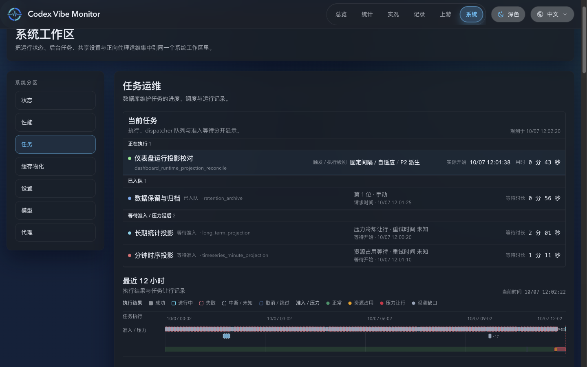
  - 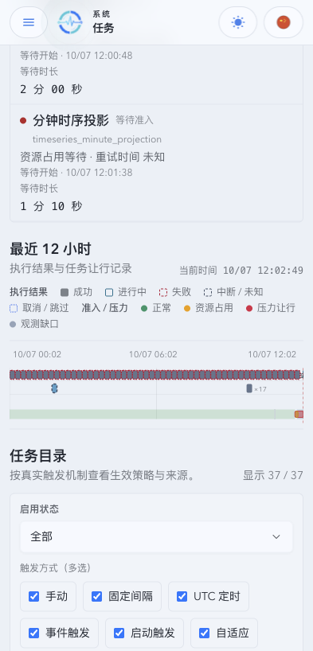
  - 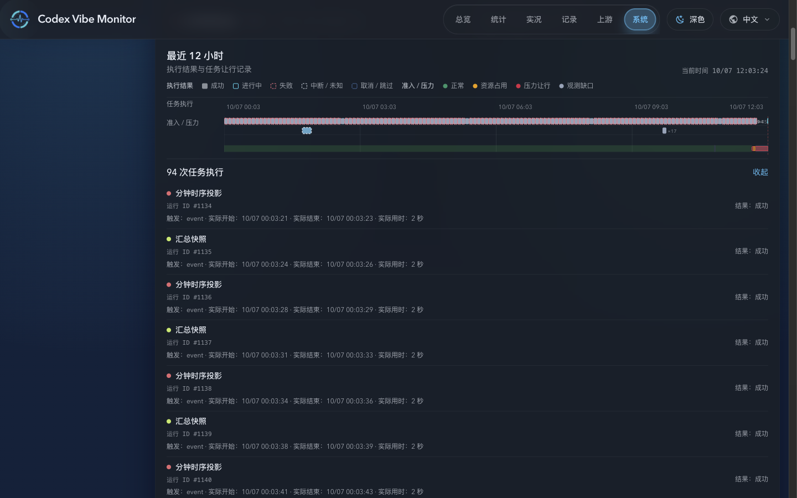

### Task Workload Trend Charts — Desktop

- source_type: `storybook_canvas`
- story_group: `System/TaskWorkloadTrend`
- target_program: `mock-only`
- capture_scope: `element`
- viewport_strategy: `storybook-viewport`
- requested_viewport: `1440x900`
- margin_policy: `require_margin`
- evidence_surface: `component`
- surface_selector: `[data-visual-evidence-surface]`
- target_selector: `[data-visual-evidence-target]`
- sensitive_exclusion: `N/A`
- comparison_base: `179275c0b44ca8515aff1871c8fcfd37b268186c`
- comparison: `current-only`; the locked baseline contains no workload image at these exact paths
- rendered_candidate: `d981c0b1a584a9232855f11ac57b9bae3a9877ab`
- owner_confirmation: confirmed in chat for the six displayed rectification screenshots on 2026-10-04 (“准确。”)
- submission_gate: `approved`
- stories:
  - `system-taskworkloadtrend--dark-theme`
  - `system-taskworkloadtrend--overview`
- images:
  - 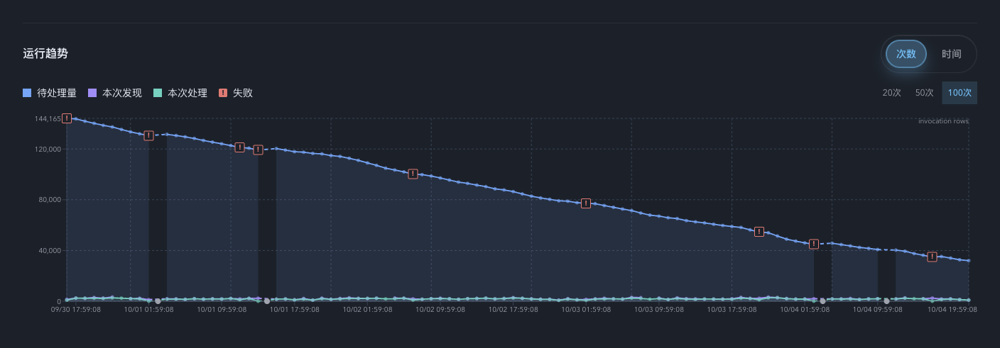
  - 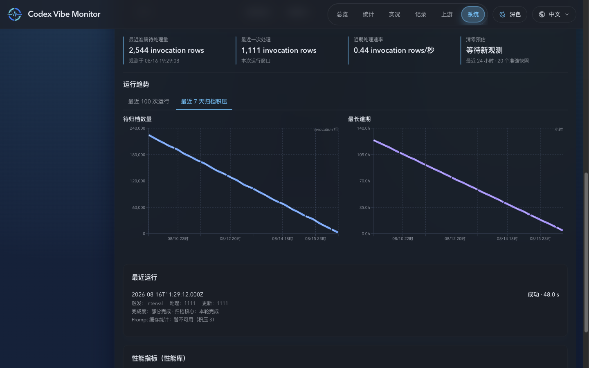

### Task Workload Trend Charts — Mobile

- source_type: `storybook_canvas`
- story_group: `System/TaskWorkloadTrend`
- target_program: `mock-only`
- capture_scope: `element`
- viewport_strategy: `storybook-viewport`
- requested_viewport: `393x852`
- margin_policy: `require_margin`
- evidence_surface: `component`
- surface_selector: `[data-visual-evidence-surface]`
- target_selector: `[data-visual-evidence-target]`
- sensitive_exclusion: `N/A`
- comparison_base: `179275c0b44ca8515aff1871c8fcfd37b268186c`
- comparison: `current-only`; the locked baseline contains no workload image at these exact paths
- rendered_candidate: `d981c0b1a584a9232855f11ac57b9bae3a9877ab`
- owner_confirmation: confirmed in chat for the six displayed rectification screenshots on 2026-10-04 (“准确。”)
- submission_gate: `approved`
- stories:
  - `system-taskworkloadtrend--mobile-dark`
  - `system-taskworkloadtrend--mobile-light-backlog`
  - `system-taskworkloadtrend--mobile-light-candidates`
  - `system-taskworkloadtrend--mobile-running-without-counters`
- images:
  - 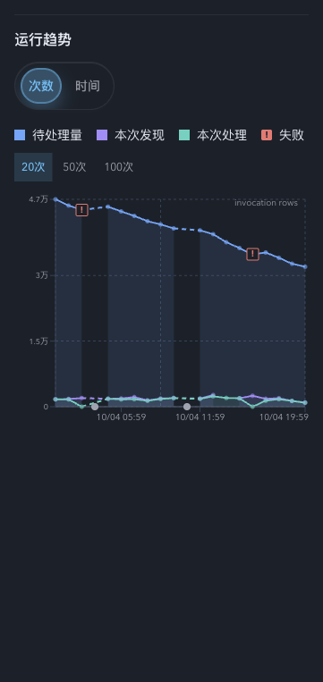
  - 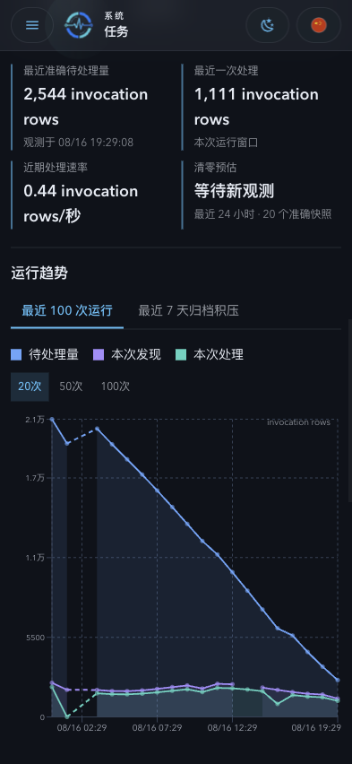
  - 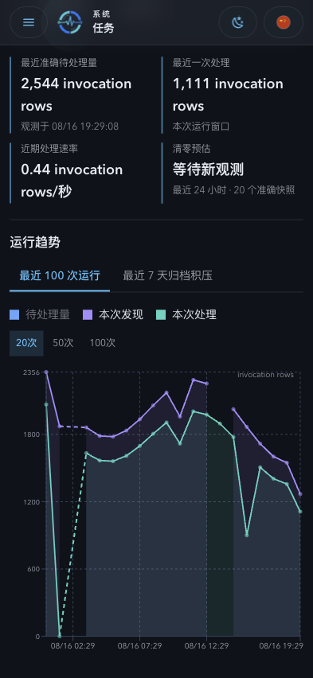
  - 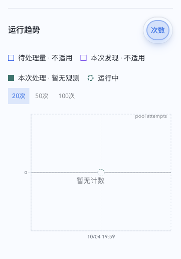

### Task Catalog Workload Background — Desktop and Mobile

- source_type: `storybook_canvas`
- story_id_or_title: `System/SystemWorkspace/Tasks`
- target_program: `mock-only`
- capture_scope: `browser-viewport` for desktop, `element` for row and mobile
- viewport_strategy: `storybook-viewport`
- requested_viewport: `1440x900` and `393x852`
- margin_policy: `trim_only`
- evidence_surface: `page`
- sensitive_exclusion: `N/A`
- comparison_base: `1b5a4056391b5e7fbdcd66d44655907747173ac0`
- comparison: `current-only`; the locked baseline contains no catalog-background image at these exact paths
- rendered_candidate: `d4299e32`
- owner_confirmation: confirmed in chat on 2026-10-06 ("看起来没问题了，允许提交视觉证据。")
- submission_gate: `approved`
- state: 37-task catalog with visible-row lazy-loaded P/D/C background, corrected area closure, and workload detail inspection
- images:
  - 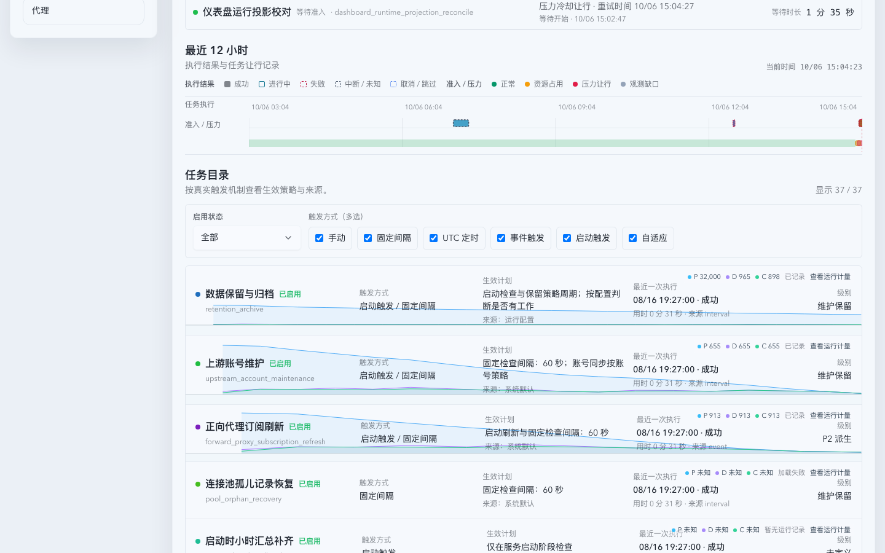
  - 
  - 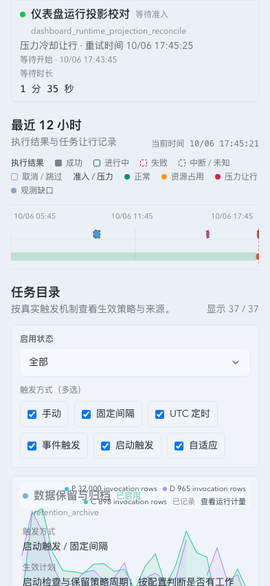

## References

- `./IMPLEMENTATION.md`
- `./HISTORY.md`
