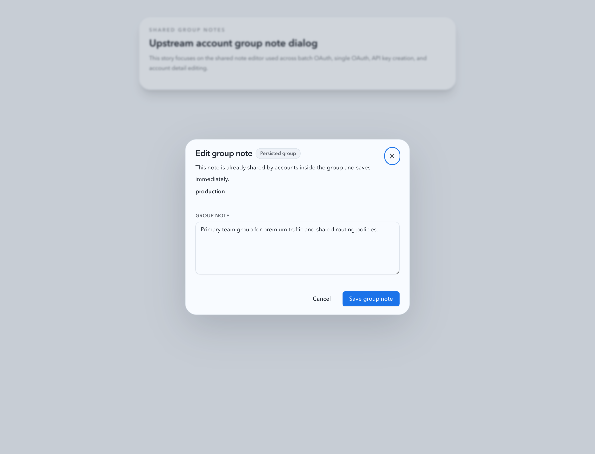
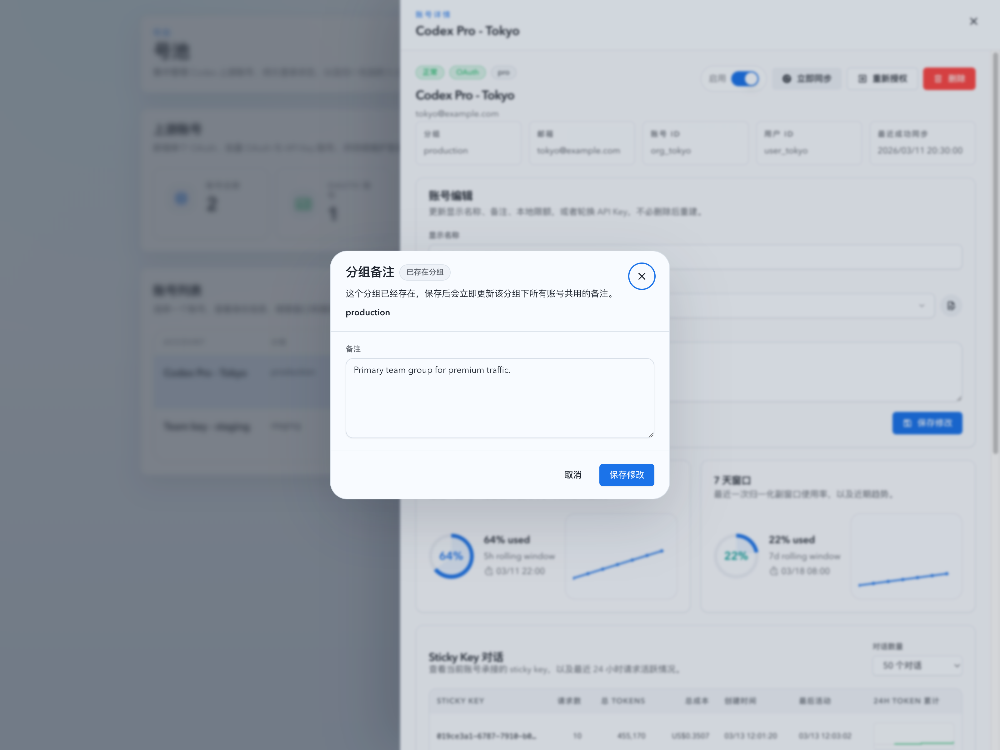
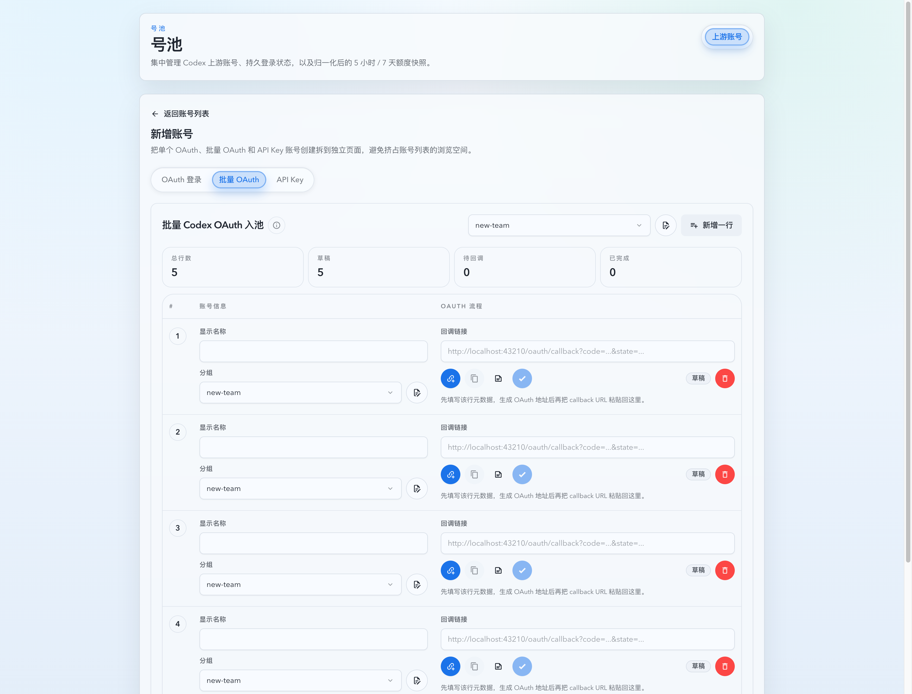

# 上游账号分组共享备注（#thyxm）

## 状态

- Status: 已实现
- Created: 2026-03-14
- Last: 2026-03-14

## 背景

- 当前上游账号只有账号级 `note`，同一分组缺少共享备注，导致“这是一组账号的共性说明”只能重复写在单账号备注里。
- 批量 OAuth 表格已经有行级备注折叠按钮，但没有组级备注入口；单账号 OAuth、API Key、新建页默认分组与详情编辑页也无法维护分组的公共备注。
- 分组本身不是独立资源，只有实际账号落到该分组时才应持久化，因此组备注不能通过“空分组占位记录”提前落库。

## 目标 / 非目标

### Goals

- 为上游账号分组增加共享备注模型，与账号级备注并存且互不覆盖。
- 在批量 OAuth、单账号 OAuth、API Key、新建页默认分组、详情编辑页的分组输入旁提供统一的组备注编辑入口。
- 允许“已有分组立即保存组备注”，同时允许“新分组先在前端暂存，直到首个账号真正落库时再持久化”。
- 扩展前后端契约：列表返回分组元数据，创建 / 更新 / OAuth 登录会话接口可携带 `groupNote`。

### Non-goals

- 不新增独立的分组管理页、分组重命名或批量分组迁移。
- 不把组备注增加为列表列、详情只读卡片或额外统计视图。
- 不更改现有账号级 `note` 的含义或写入规则。

## 功能规格

### 数据与接口

- 新增独立分组备注表，按标准化后的 `group_name` 存储共享备注与时间戳；只有存在至少一个账号引用该分组时才允许保留记录。
- `GET /api/pool/upstream-accounts` 响应新增 `groups[]`，每项至少包含 `groupName` 与 `note`。
- `POST /api/pool/upstream-accounts/oauth/login-sessions`、`PATCH /api/pool/upstream-accounts/oauth/login-sessions/:loginId`、`POST /api/pool/upstream-accounts/api-keys`、`PATCH /api/pool/upstream-accounts/:id` 新增可选 `groupNote`，仅用于“当前还不存在实际账号的新分组草稿”随首次落库一起持久化；若提交瞬间分组其实已经存在，后端必须忽略该草稿但继续完成账号操作；已存在分组的显式备注编辑必须使用专门的组备注保存接口。
- 新增 `PUT /api/pool/upstream-account-groups/:groupName`，仅用于已存在分组的即时备注保存；若分组当前没有账号引用则返回明确错误。

### 生命周期

- 新建账号或 OAuth 完成时，如果请求里带 `groupName + groupNote` 且目标分组在请求发起时还没有实际账号，则在首个账号落库成功后写入该分组备注。
- 账号从组 A 改到组 B 时：
  - 若请求携带 `groupNote` 且组 B 仍是一个尚未落库的新分组，则把备注应用到目标组 B；
  - 若组 A 变成无账号引用，则清理组 A 的孤儿备注记录。
- 删除账号后，若其所属分组已无其他账号引用，则同步清理对应组备注。
- 新分组仅在前端保持页面级草稿；只有首个账号真正进入该分组后，后端才持久化该备注；若 OAuth 会话创建后该分组先被其他账号占用，则旧草稿不得覆盖现有共享备注，且账号创建 / 更新 / OAuth 完成流程本身不能因为该陈旧草稿而失败。

### 前端交互

- 统一提供“组备注编辑器”弹窗，显示当前分组名、备注输入框、保存按钮与状态提示。
- 对已存在分组：保存动作立即调用组备注保存接口，并刷新共享分组元数据。
- 对新分组：保存动作仅写入当前页面的共享草稿映射，并在相关账号创建/更新时自动带上 `groupNote`。
- 批量 OAuth 行操作区新增 `mdi:file-document-edit-outline` 按钮，位置在当前行备注按钮左侧，不改变现有生成/复制/完成/删除按钮行为。

## 验收标准

- Given 批量 OAuth 行已填写 `groupName`，When 查看该行操作区，Then 能看到新的组备注按钮，且点击后打开组备注编辑器。
- Given 某分组已存在账号，When 在任一入口保存该组备注，Then 备注立即持久化，刷新页面后其他入口可读到同一内容。
- Given 用户输入一个当前不存在账号的新分组，When 在编辑器里保存备注但尚未创建账号，Then 备注只保存在前端草稿中；当首个账号成功创建到该组后，刷新列表可以在 `groups[]` 中看到该备注。
- Given 账号从组 A 改到组 B 或删除了组 A 的最后一个账号，When 操作完成，Then 组 A 的孤儿组备注会被清理。
- Given 账号详情页同时编辑账号备注与组备注，When 保存后重新打开，Then 两类备注互不覆盖、互不串写。

## 质量门槛

- `cargo fmt`
- `cargo check`
- `cargo test`
- `cd web && bun run test`
- `cd web && bun run build`
- 浏览器 smoke：批量 OAuth、单账号 OAuth、API Key、详情编辑中的组备注入口与保存路径

## Visual Evidence (PR)

- source_type: storybook_canvas
  target_program: mock-only
  capture_scope: browser-viewport
  sensitive_exclusion: N/A
  submission_gate: pending-owner-approval
  story_id_or_title: Account Pool / Components / Upstream Account Group Note Dialog / Existing Group
  state: existing-group
  evidence_note: 验证复用的组备注弹窗在“已存在分组”场景下展示共享备注说明、分组名与立即保存动作。
  image:
  

- source_type: storybook_canvas
  target_program: mock-only
  capture_scope: browser-viewport
  sensitive_exclusion: N/A
  submission_gate: pending-owner-approval
  story_id_or_title: Account Pool / Pages / Upstream Accounts / Detail Drawer Group Notes
  state: detail-drawer-dialog-open
  evidence_note: 验证账号详情抽屉中的分组备注入口会打开共享备注弹窗，并与账号级备注编辑保持独立。
  image:
  

- source_type: storybook_canvas
  target_program: mock-only
  capture_scope: browser-viewport
  sensitive_exclusion: N/A
  submission_gate: pending-owner-approval
  story_id_or_title: Account Pool / Pages / Upstream Accounts / Create Account Batch Group Note Draft
  state: batch-oauth-inline-action
  evidence_note: 验证批量 OAuth 场景中默认分组入口与每行分组输入框右侧的组备注按钮都已到位，且行级入口位于分组控件旁边。
  image:
  

## 变更记录

- 2026-03-14: 创建增量 spec，冻结上游账号分组共享备注的数据模型、交互边界与验收标准。
- 2026-03-14: 完成后端组备注持久化、前端复用弹窗与批量/单账号/API Key/详情编辑入口接入，并通过本地自动化验证与浏览器 smoke。
- 2026-03-14: 补充 Storybook 视觉证据，覆盖复用组备注弹窗、详情抽屉入口，以及批量 OAuth 行内组备注按钮位置。
- 2026-03-25: `j86ms` 为 pending OAuth login session 补齐 `PATCH` metadata sync，新增账号页中的分组备注草稿编辑不再要求重新生成 OAuth URL。
