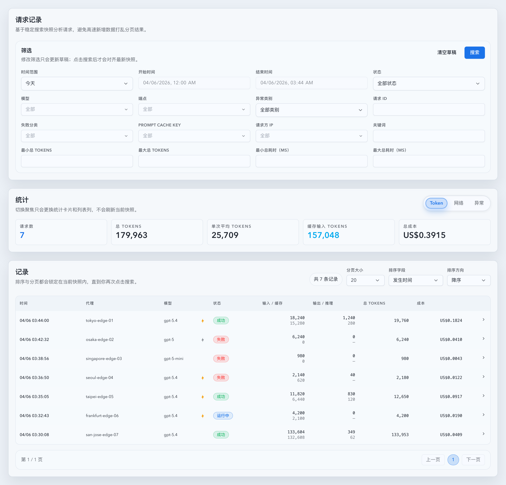

# `/records` 移除代理筛选（#tjgyj）

## 状态

- Status: 已完成（5/5）
- Created: 2026-04-06
- Last: 2026-04-06

## 背景 / 问题陈述

- `/records` 的筛选区仍保留“代理”筛选，但实际业务数据已经不再提供可稳定筛选的代理名集合。
- 本地 `codex_vibe_monitor.db` 中 `payload.proxyDisplayName` 命中为 `0/38860`，按后端当前 `INVOCATION_PROXY_DISPLAY_SQL` 聚合后只剩 `xy` 与空串，无法形成有意义的筛选维度。
- 与此同时，记录列表和详情里的 `proxyDisplayName` 仍然承担展示作用，因此这次需要移除“筛选能力”而不是误删“展示语义”。

## 目标 / 非目标

### Goals

- 从 `/records` 的前端筛选区移除“代理”字段与相关 suggestions 交互。
- 移除 records 相关前后端查询契约中的 `proxy` 参数与 `proxy` suggestions bucket。
- 保持记录表格与详情中的 `proxyDisplayName` 展示不变。
- 兼容历史书签或手写 URL 中的 `?proxy=...`，确保后端静默忽略而不是返回错误。

### Non-goals

- 不移除记录内容里的代理列或详情字段。
- 不修改 `proxyDisplayName` 的持久化、展示或关键词搜索语义。
- 不改动其它页面的 forward proxy 配置、统计或账号绑定能力。

## 范围（Scope）

### In scope

- `web/src/pages/Records.tsx`、`web/src/lib/invocationRecords.ts`、`web/src/lib/api.ts` 的 records 筛选与 suggestions 契约。
- `src/api/mod.rs` 中 `GET /api/invocations`、`/api/invocations/summary`、`/api/invocations/new-count`、`/api/invocations/suggestions` 的 records `proxy` 筛选退场。
- records 相关 Vitest、Rust tests、Storybook 和视觉证据。

### Out of scope

- `ApiInvocation.proxyDisplayName`、记录表格“代理”列、详情中的代理字段展示。
- 非 `/records` 页面上的代理筛选、代理统计或 forward proxy 运行态功能。
- 数据库 schema 迁移或历史数据回填。

## 需求（Requirements）

### MUST

- `/records` 筛选区不再渲染“代理”字段，也不再为该字段保留布局占位。
- 前端 records 查询、summary、new-count、suggestions 请求都不得再发送 `proxy` 参数。
- 前端 `InvocationSuggestionField` 与 `InvocationSuggestionsResponse` 不再包含 `proxy`。
- 后端 records 查询不再消费 `proxy` 过滤条件，suggestions 响应不再生成 `proxy` bucket。
- 历史 `?proxy=...` URL 参数必须被后端静默忽略，不触发 400 或其它错误。
- 记录表格和详情中的代理展示必须保持可见。

### SHOULD

- Storybook 应显式覆盖“无代理筛选，但表格仍展示代理名”的回归场景。
- 增量 spec 应复用 `#6whgx` 与 `#3gvtt` 的 `/records` 语义，不引入新的筛选状态模型。

### COULD

- 后续继续压缩筛选区密度，但不属于本轮。

## 功能与行为规格（Functional/Behavior Spec）

### Core flows

- 用户进入 `/records` 后，筛选区直接显示时间范围、状态、模型、端点、请求 ID 等字段，不再出现“代理”筛选。
- 用户展开记录时，表格里的代理列与详情里的代理字段仍保持原样展示。
- 页面请求 suggestions 时，仅保留模型、端点、失败分类、Prompt Cache Key、请求方 IP 等 bucket。

### Edge cases / errors

- 旧书签若带有 `?proxy=tokyo-edge-01`，页面请求仍然成功，结果集与未传该参数保持一致。
- suggestions 若未指定 `suggestField`，响应体中也不应再出现 `proxy` 键。
- 列表和详情继续允许通过关键词搜索命中代理展示名，因为这是展示/检索语义，不是独立筛选维度。

## 接口契约（Interfaces & Contracts）

### 接口清单（Inventory）

| 接口（Name） | 类型（Kind） | 范围（Scope） | 变更（Change） | 契约文档（Contract Doc） | 负责人（Owner） | 使用方（Consumers） | 备注（Notes） |
| --- | --- | --- | --- | --- | --- | --- | --- |
| `GET /api/invocations` | HTTP API | internal | Modify | None | backend | records page | records 查询不再消费 `proxy` |
| `GET /api/invocations/summary` | HTTP API | internal | Modify | None | backend | records page | summary 不再消费 `proxy` |
| `GET /api/invocations/new-count` | HTTP API | internal | Modify | None | backend | records page | new-count 不再消费 `proxy` |
| `GET /api/invocations/suggestions` | HTTP API | internal | Modify | None | backend | records page | 响应移除 `proxy` bucket |

### 契约文档（按 Kind 拆分）

- None

## 验收标准（Acceptance Criteria）

- Given 用户打开 `/records`，When 筛选区渲染完成，Then 页面中不再出现“代理”筛选控件。
- Given 前端发起 records 列表、summary、new-count 或 suggestions 请求，When 检查 query string，Then 不再包含 `proxy=` 参数。
- Given 用户携带旧的 `?proxy=legacy-edge` 访问相关后端接口，When 请求完成，Then 接口返回成功且结果集不会因该参数被额外过滤。
- Given records 表格与详情渲染成功，When 查看代理相关信息，Then `proxyDisplayName` 仍然可见。
- Given Storybook 渲染 `/records` 页面，When 对应回归故事加载完成，Then 可以同时证明“代理筛选已移除”和“代理展示仍在”。

## 实现前置条件（Definition of Ready / Preconditions）

- `#6whgx` 已经建立 `/records` 的稳定快照查询与筛选模型。
- `#3gvtt` 已经把 `/records` 的筛选区收敛到“移除上游、增加请求 ID”的最新基线。
- 已确认这次需求只移除筛选，不移除展示语义。

## 非功能性验收 / 质量门槛（Quality Gates）

### Testing

- Rust tests: `cargo test build_invocation_filters_ -- --nocapture`
- Rust tests: `cargo test fetch_invocation_suggestions_ -- --nocapture`
- Frontend tests: `cd web && bunx vitest run src/pages/Records.test.tsx src/lib/invocationRecords.test.ts src/lib/api.test.ts src/components/InvocationRecordsTable.test.tsx`

### UI / Storybook (if applicable)

- Stories to add/update: `web/src/components/RecordsPage.stories.tsx`
- `play` / interaction coverage to add/update: 验证“代理筛选已移除、代理展示仍在”的回归故事
- Visual regression baseline changes (if any): `/records` 筛选区布局去掉代理字段后的稳定截图

### Quality checks

- `cargo check`
- `cd web && bun run build`
- `cd web && bun run build-storybook`

## 文档更新（Docs to Update）

- `docs/specs/README.md`: 新增本次 follow-up spec 索引。
- `docs/specs/tjgyj-records-remove-proxy-filter/SPEC.md`: 记录筛选退场范围、契约、验证和视觉证据。

## 计划资产（Plan assets）

- Directory: `docs/specs/tjgyj-records-remove-proxy-filter/assets/`
- In-plan references: ``
- Visual evidence source: maintain `## Visual Evidence` in this spec when owner-facing or PR-facing screenshots are needed.

## Visual Evidence

`/records` 筛选区已移除“代理”字段，同时列表里的代理展示列仍保留可见：

## 资产晋升（Asset promotion）

- None

## 实现里程碑（Milestones / Delivery checklist）

- [x] M1: 移除 `/records` 前端代理筛选控件、draft/query/suggestions 契约。
- [x] M2: 移除后端 records `proxy` 过滤与 suggestions bucket，同时保留兼容输入忽略语义。
- [x] M3: 补齐 Storybook、Vitest 与 Rust 回归，覆盖“筛选移除、展示保留、旧参数忽略”。
- [x] M4: 补充 follow-up spec 与本地视觉证据。
- [x] M5: 完成快车道 PR、截图提交授权、合并与 cleanup。

## 方案概述（Approach, high-level）

- 前端直接删除 `proxy` 相关字段与 bucket，确保不会继续发出 dormant 参数。
- 后端保留 `ListQuery.proxy` 仅作兼容解析，但不再把它装配进 records filters，也不再参与 suggestions 聚合。
- 通过 Storybook 页级故事证明筛选退场后布局稳定，同时表格代理展示仍可见。

## 风险 / 开放问题 / 假设（Risks, Open Questions, Assumptions）

- 风险：若后续又有人尝试恢复 `proxy` bucket，前后端契约可能重新漂移，因此这轮需要显式测试和 spec 落点。
- 假设：用户所说“去掉代理筛选”仅针对 `/records` 筛选区，不影响展示列与详情字段。
- 假设：旧 URL 中的 `proxy` 参数只需要静默忽略，不需要前端迁移提示。

## 变更记录（Change log）

- 2026-04-06: 创建 follow-up spec，冻结 `/records` 代理筛选退场、展示保留与兼容忽略策略。
- 2026-04-06: 完成前后端契约删减、定向回归与本地 Storybook 视觉证据采集，并经主人确认后进入 PR/merge 收尾。

## 参考（References）

- `docs/specs/6whgx-records-stable-snapshot-analytics/SPEC.md`
- `docs/specs/3gvtt-records-request-id-response-details/SPEC.md`
- `web/src/pages/Records.tsx`
- `web/src/lib/invocationRecords.ts`
- `web/src/lib/api.ts`
- `web/src/components/RecordsPage.stories.tsx`
- `src/api/mod.rs`
