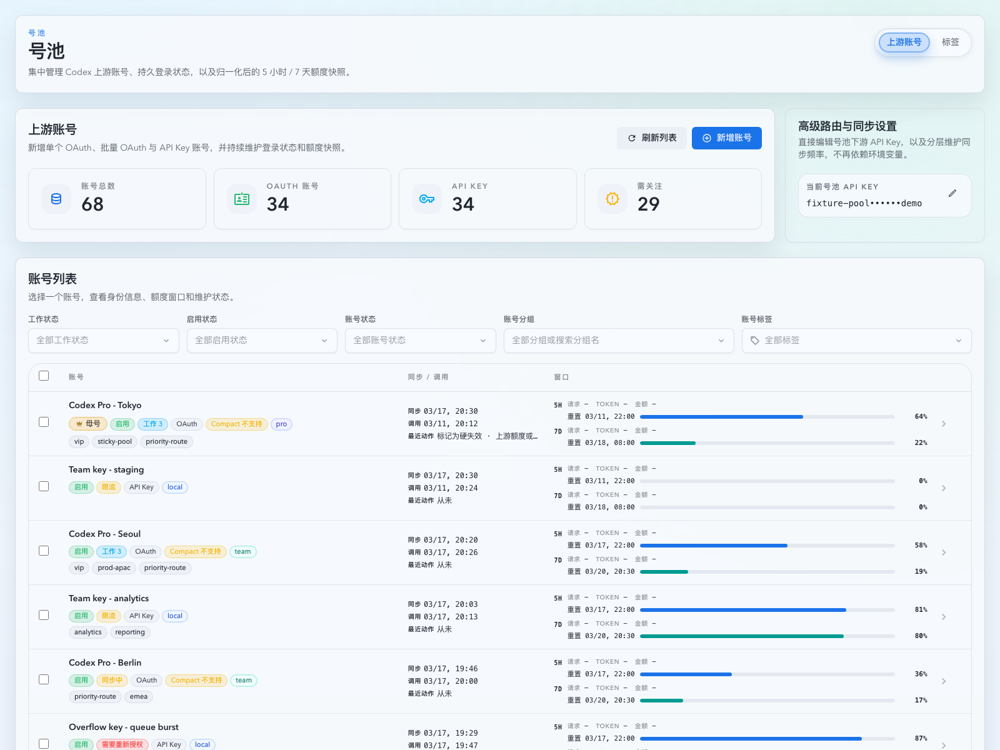
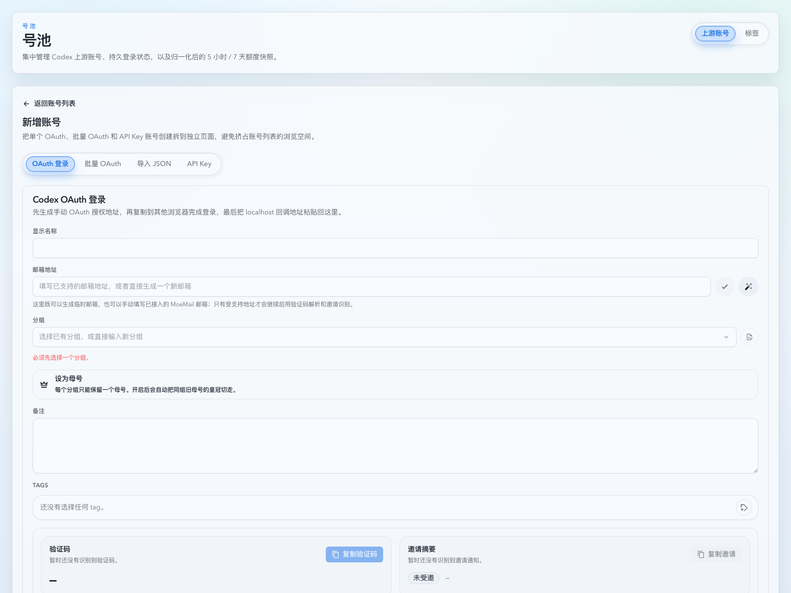

# account-pool 前端类型债清偿（#ts6qp）

## 状态

- Status: 已完成
- Created: 2026-04-12
- Last: 2026-04-12

## 背景 / 问题陈述

- `web/src/pages/account-pool/**` 仍有多处生产代码依赖文件级 `@ts-nocheck`，绕过了仓库现有的 TypeScript `strict` 约束。
- `UpstreamAccounts` 与 `UpstreamAccountCreate` 两组页面仍保留数个 1k~4k 行的大文件，业务状态、渲染组件和工具函数耦合过深。
- 不继续清理这些类型债，会持续抬高后续号池功能开发与回归修复成本，并增加页面状态改动时的静态检查盲区。

## 目标 / 非目标

### Goals

- 移除 `account-pool` 生产代码中的文件级 `@ts-nocheck`。
- 把 `UpstreamAccounts` 与 `UpstreamAccountCreate` 的共享逻辑拆回更清晰的 typed helper / UI 模块。
- 保持现有页面行为、路由、Storybook 入口和 API 契约兼容。

### Non-goals

- 不处理后端 `include!()` / warning 技术债。
- 不把前端 bundle 体积优化纳入本轮目标。
- 不重写整个 `account-pool` 测试体系，只做随迁修复。

## 范围（Scope）

### In scope

- `web/src/pages/account-pool/UpstreamAccounts.page-impl.tsx`
- `web/src/pages/account-pool/UpstreamAccounts.page-local-shared.tsx` 及其拆出的新 typed 子模块
- `web/src/pages/account-pool/UpstreamAccountCreate.*` 生产实现文件及其拆出的新 typed 子模块
- 相关 Storybook / tests 的最小必要同步

### Out of scope

- 后端代码、共享测试机脚本、数据库契约
- `web/src/lib/api/**` 的公开导出形状
- 无关页面（如 `Settings.tsx`、Dashboard 等）

## 需求（Requirements）

### MUST

- 删除本轮范围内生产文件的文件级 `@ts-nocheck`
- 保持 `web/tsconfig.app.json` 的 `strict` 与 `noUnused*` 现状
- 保持 `#/account-pool/upstream-accounts`、`#/account-pool/upstream-accounts/new` 行为兼容
- 补齐/更新对应 Storybook 覆盖，并通过本地 `lint/test/build/build-storybook`

### SHOULD

- 让页面入口文件只保留控制器编排与路由壳层职责
- 把纯工具逻辑从 JSX-heavy 大文件中抽离

### COULD

- 顺带压低局部文件行数，只要不引入额外行为风险

## 功能与行为规格（Functional/Behavior Spec）

### Core flows

- Upstream accounts 列表筛选、持久化、分页、详情抽屉、bulk sync 与路由设置行为保持不变。
- Create 页面四种模式（OAuth / batch OAuth / import / API key）维持现有交互、草稿恢复、重复告警与 mailbox session 行为。
- Storybook 既有入口、故事名与关键 `play` 场景仍可作为稳定验证面。

### Edge cases / errors

- `location.state`、EventSource payload、批量导入校验结果等原先隐式 `any` 路径需补成显式类型或适配器。
- 若某块逻辑无法在单文件内安全类型化，应拆分为更小 helper / UI 模块，而不是恢复 `@ts-nocheck`。

## 接口契约（Interfaces & Contracts）

### 接口清单（Inventory）

| 接口（Name） | 类型（Kind） | 范围（Scope） | 变更（Change） | 契约文档（Contract Doc） | 负责人（Owner） | 使用方（Consumers） | 备注（Notes） |
| --- | --- | --- | --- | --- | --- | --- | --- |
| account-pool page internals | internal | internal | Modify | None | frontend | account-pool pages + stories + tests | 仅内部模块边界与类型改善 |

### 契约文档（按 Kind 拆分）

None

## 验收标准（Acceptance Criteria）

- Given `account-pool` 生产实现文件  
  When 运行 TypeScript 严格构建  
  Then 本轮范围内生产文件不再依赖文件级 `@ts-nocheck`

- Given `UpstreamAccounts` 与 `UpstreamAccountCreate` 页面  
  When 运行既有单元测试、Storybook 构建与本地构建  
  Then 页面行为、Storybook 入口和公开 API 调用语义保持兼容

- Given 本轮改动命中 Web UI  
  When 收口到普通流程的本地 PR-ready  
  Then 已回传一组基于 Storybook 的视觉证据并落盘到本 spec

## 实现前置条件（Definition of Ready / Preconditions）

- 目标、非目标与兼容边界已明确
- 不新增外部接口或 schema 变更
- 本地验证清单固定为 `lint/test/build/build-storybook`

## 非功能性验收 / 质量门槛（Quality Gates）

### Testing

- Unit tests: `cd web && bun run test`
- Integration tests: none
- E2E tests (if applicable): none

### UI / Storybook (if applicable)

- Stories to add/update: account-pool 相关 stories
- Docs pages / state galleries to add/update: 复用现有 autodocs/story 结构
- `play` / interaction coverage to add/update: 只在改动影响现有 story 行为时同步调整

### Quality checks

- Lint / typecheck / formatting: `cd web && bun run lint && bun run build && bun run build-storybook`

## 文档更新（Docs to Update）

- `docs/specs/README.md`: 新增本 spec 并在完成后更新状态

## 计划资产（Plan assets）

- Directory: `docs/specs/ts6qp-account-pool-typing-debt/assets/`
- In-plan references: ``
- Visual evidence source: maintain `## Visual Evidence` in this spec when owner-facing or PR-facing screenshots are needed.

## Visual Evidence

Account Pool / Upstream Accounts / Operational（storybook canvas）

Account Pool / Upstream Account Create / Overview / Default（storybook canvas）

## 资产晋升（Asset promotion）

None

## 实现里程碑（Milestones / Delivery checklist）

- [x] M1: 拆分 `UpstreamAccounts` 共享逻辑并移除生产文件级 `@ts-nocheck`
- [x] M2: 拆分 `UpstreamAccountCreate` 共享逻辑并移除生产文件级 `@ts-nocheck`
- [x] M3: Storybook / tests / lint / build 通过，并补齐视觉证据

## 方案概述（Approach, high-level）

- 先处理 `UpstreamAccounts`：将筛选持久化、bulk sync 状态、routing draft 与详情抽屉 UI 分离成 typed 模块。
- 再处理 `UpstreamAccountCreate`：将 shared utilities 按常量/类型、OAuth/session、batch/import、duplicate UI 分层。
- 最后同步 Storybook / tests，生成基于 Storybook 的视觉证据，并完成 spec 状态回写。

## 风险 / 开放问题 / 假设（Risks, Open Questions, Assumptions）

- 风险：移除 `@ts-nocheck` 可能暴露多条历史隐式 `any` 路径，需要靠逐步拆模块收敛。
- 需要决策的问题：None
- 假设（需主人确认）：现有 Storybook stories 足以作为本轮稳定视觉证据来源。

## 变更记录（Change log）

- 2026-04-12: 初始化本轮前端类型债清偿 spec。
- 2026-04-12: 完成 account-pool 生产代码 `@ts-nocheck` 清理、`UpstreamAccounts` helper 模块拆分、Create 页面严格类型化与 Storybook 视觉证据归档。

## 参考（References）

- `docs/specs/huzqt-frontend-structure-convergence-followup/SPEC.md`
