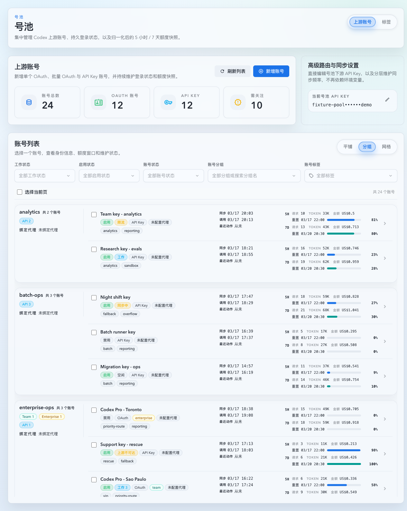
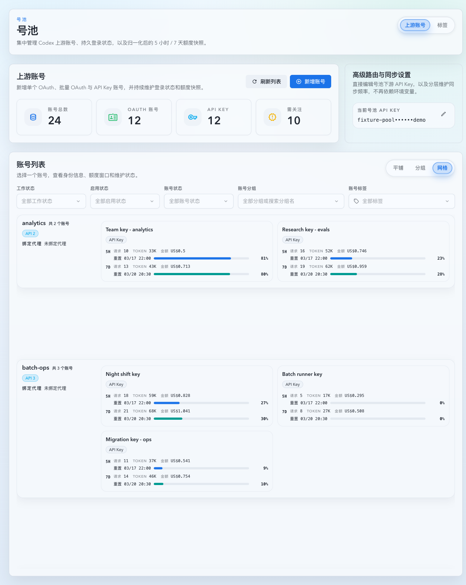

# 上游账号列表 100ms / 10ms 延迟治理（#uhn89）

## 状态

- Status: 已实现，待 PR / CI / review-proof 收敛
- Created: 2026-04-22
- Last: 2026-04-22

## 背景 / 问题陈述

- 当前 `/api/pool/upstream-accounts` 在列表请求内同步计算窗口 `actualUsage`，会把 `#43bpp` 的窗口统计直接串进号池首屏链路。
- 平铺模式虽然只请求当前页，但仍会在请求内做 usage enrich；分组 / 网格模式会使用 `includeAll=true` 拉全量账号，导致 usage enrich 随账号数线性放大。
- 旧 usage enrich 在跨 retention 边界时会回查历史 archive，最差路径需要在线解压归档 sqlite，导致 grouped / grid 视图出现秒级到十秒级阻塞。
- `#sy7a9` 引入 grouped / grid 之后，列表首屏与 usage hydrate 没有拆分；`#h9r2m` 已把在线统计主源迁到 hourly rollup，但上游账号列表仍在走 archive-sensitive 的旧查询链路。

## 目标 / 非目标

### Goals

- 将默认列表接口收敛为轻量 roster：列表本体不再同步计算窗口 `actualUsage`。
- 新增按账号批量 usage hydrate 接口，只对当前页 / 当前可见账号 / 当前详情账号补 usage。
- 为 `upstream_account_id` 建立永久在线 hourly rollup 真相源，让 usage 查询不再在线解压 archive。
- 将 roster 读路径改成 SQL 级分页 / 最新 sample 批量 join，消除当前全量拉取 + N+1 latest sample 的额外开销。
- 将 grouped / grid 视图调整为“列表先出来，usage 后补齐”，以满足服务端 `100ms` 硬门槛，并为 `roster_core_ms` 冲击 `10ms` 级目标提供可观测埋点。

### Non-goals

- 不改变窗口额度口径；`actualUsage` 仍需保持与 `#43bpp` 一致。
- 不改变分组、标签、批量操作、详情抽屉业务语义。
- 不保留“列表请求在线回查 archive 明细”的兼容慢路径。
- 不在本次任务中直接执行生产部署、生产重启或 merge 收尾。

## 范围（Scope）

### In scope

- `src/upstream_accounts/**`：轻量 roster、批量 window usage 接口、usage hydrate 查询 helper、日志埋点。
- `src/maintenance/**`、`src/schema.rs`：`upstream_account_usage_hourly` schema、live/archive materialization、historical backfill。
- `web/src/hooks/useUpstreamAccounts.ts`：roster / usage hydrate 两段式状态机。
- `web/src/pages/account-pool/UpstreamAccounts.page-impl.tsx`：flat / grouped / grid 的 visible-account hydrate 编排。
- `web/src/components/UpstreamAccountsGroupedRoster.tsx`：虚拟可见账号回传。
- `web/src/lib/api/**`：`window-usage` client 与类型导出。
- 相关 Rust tests、Vitest、Storybook stories、性能验证与文档沉淀。

### Out of scope

- 详情抽屉 UI 重做。
- Tag / group 设置语义变更。
- 第三方客户端兼容层或旧接口双写。

## 接口契约（Interfaces & Contracts）

### `GET /api/pool/upstream-accounts`

- 默认返回轻量 roster。
- 响应继续包含列表渲染需要的账号摘要、分组 catalog、forward proxy catalog、分页信息与 metrics。
- `primaryWindow.actualUsage` 与 `secondaryWindow.actualUsage` 在 roster 响应里允许为 `null`，不再阻塞列表首屏。
- `includeAll=true` 继续保留给 grouped / grid，但必须与平铺模式一样走轻量路径，不得触发同步 usage 聚合。

### `POST /api/pool/upstream-accounts/window-usage`

- 请求体：`{ accountIds: number[] }`
- 响应体：`{ items: [{ accountId, primaryActualUsage, secondaryActualUsage }] }`
- 服务端默认优先依赖 `upstream_account_usage_hourly`；若 deploy / upgrade 期间存在未 materialize 的 bucket，则只允许按未覆盖 bucket 回补 raw rows，避免整窗口重扫与重复计数。

### `upstream_account_usage_hourly`

- 主键：`(bucket_start_epoch, upstream_account_id)`
- 聚合字段至少包含：
  - `request_count`
  - `total_tokens`
  - `total_cost`
  - `input_tokens`
  - `output_tokens`
  - `cache_input_tokens`
- 与 `#h9r2m` 一样复用 live replay + archive materialization，不允许另起一套独立 snapshot 基建。

## 功能规格

### 1. 轻量 roster

- roster handler 必须把 usage enrich 从主请求链路剥离。
- roster 响应默认只做：筛选、分页 / includeAll、分组 catalog、forward proxy catalog、latest sample / duplicate info / tags 批量 join。
- 新埋点至少拆分：
  - `roster_core_ms`
  - `forward_proxy_catalog_ms`
  - `usage_batch_ms`

### 2. usage hydrate

- flat 模式自动 hydrate 当前页账号。
- grouped / grid 模式不再对全量账号做一次性 hydrate，只对当前虚拟可见账号补 usage。
- query 切换、SSE refresh、分页切换、详情切换时必须丢弃旧 hydrate 响应，避免 stale usage 覆盖当前视图。
- 详情账号单独走 detail 请求；列表 hydrate 不得阻塞详情抽屉打开。

### 3. rollup-first usage 查询

- 完整整点区间优先读 `upstream_account_usage_hourly`。
- 若某些 `(upstream_account_id, bucket_start_epoch)` 仍未被 hourly rollup 覆盖，batch usage 必须只回补这些未覆盖 bucket，并按 `(account_id, bucket_epoch)` 去重，避免 double count。
- retention 边界的 partial bucket 允许回读 raw rows 进行边界补齐。
- deploy / upgrade 后即使 live cursor 已前移，缺失小时桶也不能让 full-hour usage 低报。

## 验收标准（Acceptance Criteria）

- Given 默认平铺列表 `pageSize=20`，When 服务端返回当前页 roster，Then `p95 <= 100ms`，且 `actualUsage` 不再阻塞主请求。
- Given grouped / grid 视图触发 `includeAll=true`，When 拉取全量 roster，Then 轻量 roster `p95 <= 100ms`，页面先渲染分组结构，再逐步补 usage。
- Given `POST /api/pool/upstream-accounts/window-usage` 查询 20 个账号，When 服务端返回 batch usage，Then `p95 <= 100ms`。
- Given 账号窗口跨过 raw retention 边界，When 通过 batch usage endpoint 读取 `actualUsage`，Then 结果仍与 `#43bpp` 口径一致，不重算、不缩水、不重复。
- Given grouped / grid 模式切换、SSE refresh 或分页切换，When 旧 usage 请求晚于新 roster 返回，Then 旧结果不会覆盖当前账号列表。
- Given grouped / grid 视图首次进入，When roster 先完成而 usage 仍在 hydrate，Then 号池分组结构立即可见，窗口 metrics 暂时显示稳定 placeholder，hydrate 完成后自动替换为真实指标。

## 质量门槛（Quality Gates）

- `cargo check`
- `cargo test -q enrich_window_actual_usage_for_summaries -- --nocapture`
- `cargo test -q materialize_historical_rollups_populates_upstream_account_usage_hourly_from_archive -- --nocapture`
- `cargo test -q list_upstream_accounts_ -- --nocapture`
- `cargo test -q list_upstream_accounts_keeps_actual_usage_null_until_batch_hydrate -- --nocapture`
- `cargo test -q get_upstream_account_window_usage_returns_batch_actual_usage -- --nocapture`
- `cd web && bunx vitest run src/hooks/useUpstreamAccounts.test.tsx src/components/UpstreamAccountsGroupedRoster.test.tsx src/lib/api.test.ts`
- `cd web && bun run build`
- `cd web && bun run build-storybook`
- `cargo test -q benchmark_upstream_account_roster_prod_sized -- --ignored --nocapture`

## 性能验证（Performance Evidence）

### 2026-04-22 现网基线（机器 101，只读复测）

- 环境：`192.168.31.11` / `ai-codex-vibe-monitor` 容器内直连 `http://127.0.0.1:8080`
- 命令：`curl -sS -o /dev/null -w '%{time_total}'`
- 结果：
  - `GET /api/pool/upstream-accounts?pageSize=20`
    - samples: `77.58ms / 61.73ms / 49.63ms`
    - p95-ish(max of 3): `77.58ms`
  - `GET /api/pool/upstream-accounts?includeAll=true`
    - samples: `13789.55ms / 10048.85ms / 9718.58ms`
    - p95-ish(max of 3): `13789.55ms`

### 2026-04-22 本地改造后基准（prod-sized synthetic fixture）

- 命令：`cargo test -q benchmark_upstream_account_roster_prod_sized -- --ignored --nocapture`
- 数据规模：
  - `159` 个账号
  - `12` 个分组
  - 每个账号 `7d` hourly usage rollup
  - 每个账号 `1` 条 live tail invocation
- 结果：
  - flat roster `pageSize=20`
    - avg `6.77ms`
    - p50 `6.73ms`
    - p95 `7.03ms`
  - `includeAll=true` 轻量 roster
    - avg `6.79ms`
    - p50 `6.75ms`
    - p95 `7.02ms`
  - `POST /api/pool/upstream-accounts/window-usage`（20 个账号）
    - avg `23.72ms`
    - p50 `23.87ms`
    - p95 `24.86ms`
- 结论：
  - 轻量 roster 已进入 `10ms` 级目标范围。
  - visible-account usage hydrate 批次稳定落在 `100ms` 硬门槛内。
  - `includeAll=true` 不再被 archive-backed usage query 放大成秒级阻塞。

## 里程碑（Milestones）

- [x] M1: 冻结轻量 roster + 批量 usage hydrate 契约，明确性能目标与相关 spec 关联。
- [x] M2: 后端落地 `upstream_account_usage_hourly`、batch usage endpoint 与 roster SQL/批量读路径。
- [x] M3: 前端落地 roster / usage hydrate 拆分、visible-account hydrate 与 stale request 防护。
- [x] M4: 补齐 Rust / Vitest / Storybook 回归，并提供视觉证据。
- [ ] M5: 汇总 benchmark、review-proof 与 PR-ready 收口。
  - [x] benchmark 已补齐并记录同口径结果。
  - [x] review-proof 已清零。
  - [ ] PR-ready 仍待收口。

## Visual Evidence

- source_type: storybook_canvas
  target_program: mock-only
  capture_scope: browser-viewport
  sensitive_exclusion: N/A
  submission_gate: pending-owner-approval
  story_id_or_title: Account Pool/Pages/Upstream Accounts/List — Grouped View
  state: light roster first render + grouped visible usage hydrate
  evidence_note: 验证切换到 grouped 后先渲染轻量 roster，再对当前可见成员延迟补齐窗口 usage。
  image:
  

- source_type: storybook_canvas
  target_program: mock-only
  capture_scope: browser-viewport
  sensitive_exclusion: N/A
  submission_gate: pending-owner-approval
  story_id_or_title: Account Pool/Pages/Upstream Accounts/List — Grid View
  state: light roster first render + grid visible usage hydrate
  evidence_note: 验证 grid 视图同样保持 roster 先出、可见账号再 hydrate，且不恢复分页 footer 或 bulk selection。
  image:
  

## 风险 / 假设

- 假设：当前账号窗口 usage 的唯一线上真相源可以迁移为 `upstream_account_usage_hourly + live tail`，无需继续保留 archive 在线精确回查。
- 风险：若 historical / live hourly backfill 尚未收敛，batch hydrate 会临时回补未覆盖 bucket；因此回补路径必须持续保持最小范围与去重约束。
- 风险：grouped / grid 的 visible-account 回调若抖动过多，会放大批量 hydrate 次数；前端必须对 query key、已 hydrate ids 与 pending ids 做去重。
