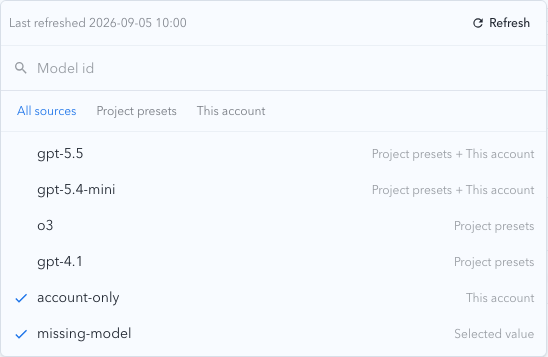
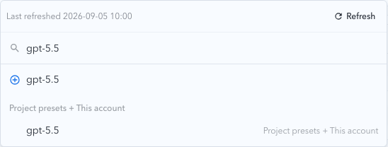
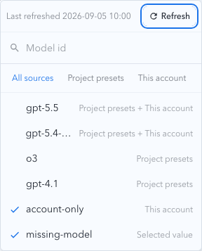
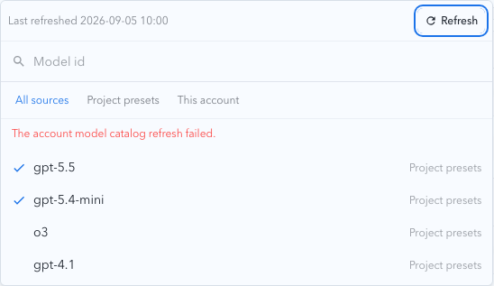

# Upstream Account Model Catalog

## Status

Active. This topic defines the account-owned capability snapshot used by the upstream-account model selector.

## Context and Scope

An upstream account can expose a model set that differs from the project's configured preset models. Operators need an explicit, account-scoped discovery action that makes that capability visible without changing routing policy, model mappings, or the public model endpoint.

## Scope

In scope:

- explicit refresh and read operations for `oauth_codex` and `api_key_codex` accounts;
- account-keyed persistence of the latest successful model ID snapshot and refresh metadata;
- source-aware candidates in the account detail available-model selector.

Out of scope:

- automatic refresh on page load, selector open, or a scheduler;
- changes to allowlist/denylist policy, model mappings, global/group/tag editors, or `/v1/models`;
- support for providers that have not implemented the catalog adapter contract.

## Requirements

### REQ-UAMC-001 Provider discovery isolation

An explicit refresh MUST use the selected account's provider-specific authentication, upstream base URL, forward-proxy scope, bounded timeout/retry policy, and response parser. OAuth Codex and API Key Codex MUST use their respective protocols. Downstream request headers, credentials, and raw upstream response bodies MUST NOT be reused in or persisted to catalog errors.

### REQ-UAMC-002 Snapshot persistence

The catalog MUST be keyed by account ID. A successful refresh MUST atomically replace that account's normalized model IDs and update the last-attempt and last-success timestamps. Normalization MUST trim, discard empty IDs, and deduplicate by exact ID. A failed refresh MUST retain the last successful IDs, record a safe error summary and failed attempt time, and leave routing policy and mappings unchanged.

### REQ-UAMC-003 Staleness and read contract

Account detail MUST expose catalog status, model IDs, last-attempt time, last-success time, and safe error information. A successful snapshot older than 24 hours MUST remain usable but be marked stale. A missing snapshot, in-progress refresh, and failed refresh MUST be distinguishable without exposing secrets.

### REQ-UAMC-004 Selector source semantics

The account detail available-model selector MUST merge project preset IDs and the selected account's catalog IDs by exact ID. Each candidate MUST preserve source metadata (`project`, `account`, or both), support filtering by all/project/account, and keep custom manually entered IDs. Source filtering MUST NOT modify the saved routing policy. A selected ID absent from the latest catalog MUST remain visible and be marked as unmatched.

### REQ-UAMC-005 Explicit-only capability discovery

The product MUST NOT contact an upstream merely because account detail is opened or the selector is opened. Only an operator-triggered refresh may perform discovery. Reading or refreshing the catalog MUST NOT mutate `availableModels`, model mappings, routing rules, or the public `/v1/models` response.

## Verification

- `VER-UAMC-001 covers: REQ-UAMC-001` Provider adapter and refresh API tests verify OAuth/API Key protocol separation, safe errors, and account-level serialization.
- `VER-UAMC-002 covers: REQ-UAMC-002` Stateful SQLite tests verify atomic replacement, failed-refresh retention, normalization, and policy/mapping stability.
- `VER-UAMC-003 covers: REQ-UAMC-003` API and UI tests verify missing, refreshing, failed, stale, and successful catalog states.
- `VER-UAMC-004 covers: REQ-UAMC-004` Selector unit and Storybook tests verify source merging, filters, custom IDs, and unmatched selections.
- `VER-UAMC-005 covers: REQ-UAMC-005` Route and UI tests verify no implicit upstream request and no policy mutation.

## Visual Evidence

- source_type: storybook_canvas
  story_id_or_title: Account Pool/Components/Effective Routing Rule Card/Editable Available Models With Catalog
  requested_viewport: desktop1280
  viewport_strategy: storybook-viewport
  state: source filters, refresh metadata, merged candidates, and unmatched selection
  evidence_note: Verifies the timestamp and refresh action above the search field, source filters below it, and merged source labels.
  

- source_type: storybook_canvas
  story_id_or_title: Account Pool/Components/Effective Routing Rule Card/Editable Available Models With Catalog
  requested_viewport: desktop1280
  viewport_strategy: storybook-viewport
  state: active search with grouped results
  evidence_note: Verifies search ignores source filtering and groups matching results by source combination.
  

- source_type: storybook_canvas
  story_id_or_title: Account Pool/Components/Effective Routing Rule Card/Editable Available Models With Catalog Mobile
  requested_viewport: 393x852
  viewport_strategy: storybook-viewport
  state: responsive source filters and account catalog candidates
  evidence_note: Verifies the compact layout keeps the timestamp left-aligned, refresh action right-aligned, and candidate labels readable.
  

- source_type: storybook_canvas
  story_id_or_title: Account Pool/Components/Effective Routing Rule Card/Editable Available Models Catalog Failure
  requested_viewport: desktop1280
  viewport_strategy: storybook-viewport
  state: refresh failure with retained snapshot
  evidence_note: Verifies the safe error is visible while the last successful timestamp and retained project candidates remain available.
  

## Related ADRs

None

## Related Specs

- [Upstream account model mapping](../upstream-account-model-mapping/SPEC.md)
- [Upstream account policy inheritance](../r4p9x-upstream-account-policy-inheritance/SPEC.md)

## Related Contracts

- [HTTP API](contracts/http-api.md)
