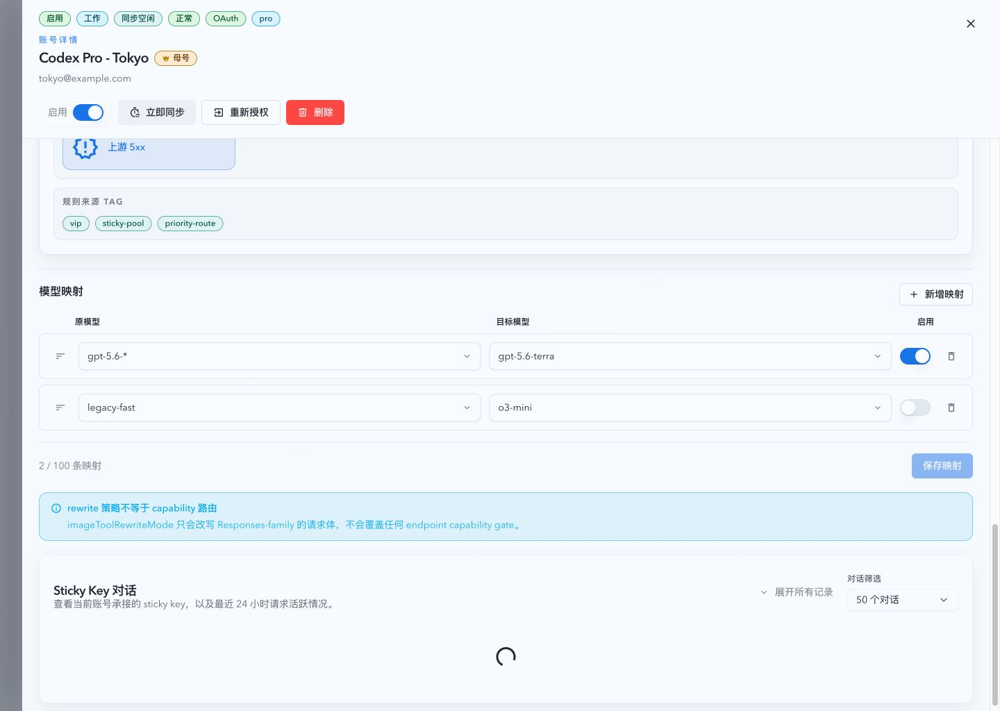
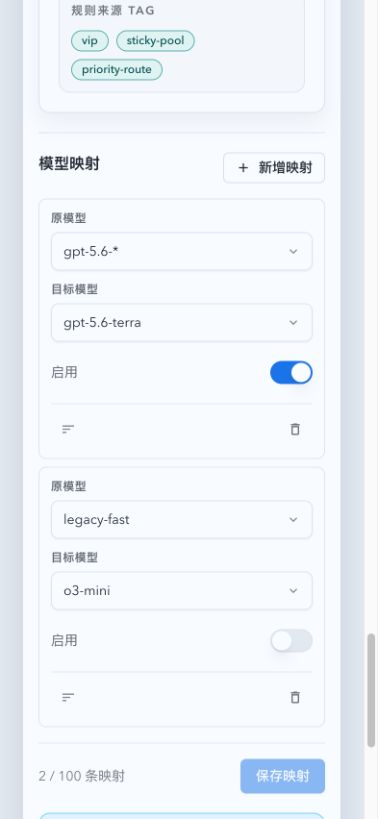

# 上游账号模型映射

> 当前有效规范以本文为准；实现覆盖与当前状态见 `./IMPLEMENTATION.md`，关键演进原因见 `./HISTORY.md`。

## 背景 / 问题陈述

账号池的模型策略只能决定账号是否可接收原始请求模型，不能为不同上游账号指定实际发送的模型名。运营者因此无法把同一客户端模型按账号映射到兼容模型，也无法在故障转移后追踪每次实际发出的目标模型。

本主题定义账号本地模型映射、请求侧改写、原模型健康归属，以及与可用模型资格缓存分离的预热契约。

## 目标 / 非目标

### Goals

- 每个 OAuth 或 API Key 上游账号拥有一个独立、有序、可原子保存的映射列表。
- 将原始请求模型映射为该候选账号实际接收的目标模型，并在 HTTP、流式请求体与 WebSocket 中一致改写。
- 路由、逐模型健康、审计主键保持原始请求模型，同时记录实际目标模型和命中规则。
- 为当前可路由账号的有效 `availableModels` 维护资格快照和最多十项具体模型反向索引；映射缓存与该资格缓存独立。

### Non-goals

- 映射不参与 root、group、tag 或 conversation 的继承链。
- 不支持正则、`?`、捕获替换、目标模板或链式映射。
- 不反向改写响应、`/v1/models` 或其他下游模型名称。
- 保存映射时不探测上游或发现远端模型清单。

## 范围（Scope）

### In scope

- 账号详情路由页签中的映射编辑器、独立保存、脏草稿保护和尝试详情展示。
- SQLite 持久化、详情 API 字段和专用整表替换 API。
- 所有账号池 HTTP、实时请求体和 WebSocket 上游传输路径。
- 候选资格、故障转移、逐模型状态重置、尝试记录和归档记录。

### Out of scope

- 对既有策略继承语义、账号健康语义或响应协议的重构。
- 把映射目标写入全局模型目录或公开为客户端可发现别名。

## 需求（Requirements）

### MUST

- `modelMappings` 是最多 100 条的有序列表；空列表合法。每项为 `sourceModel`、`targetModel` 与 `enabled`，字段在持久化前 trim，源和目标不能为空。
- 源模型仅把 `*` 解释为匹配任意长度文本的通配符；比较是全字符串、ASCII 大小写不敏感。多个 `*` 合法，也可匹配空串。
- 规范化后相同的源规则必须被拒绝，即使其中一条被禁用。
- 先选择无 `*` 的精确规则；否则按非 `*` 字符数降序；再按物理列表顺序。禁用规则不参加匹配。
- 目标模型是字面量。每个候选账号从原始模型独立解析映射，不将前一候选的目标作为下一候选输入。
- 映射命中可替代普通 `availableModels` 的模型拒绝，但系统 deny、端点/能力、绑定、账号状态、并发、route penalty 和其他现有资格门禁继续生效。
- 上游不支持分类应比较最终目标模型；逐模型冷却、降级和不支持状态仍按原始模型键读取和写入。
- 需要改写却无法安全改写时不得把原模型发送给上游。畸形请求体为客户端错误，内部转换失败为网关错误。
- 新尝试记录必须暴露 `upstreamRequestModel` 与可空 `modelMappingPattern`；未映射尝试的实际上游模型等于原模型。尚未发送上游即失败的尝试可为空并在 UI 中显示未发送。
- 映射保存与清除该账号当前逐模型状态必须在同一事务中完成；历史尝试和事件不得删除。
- 缓存 generation 必须在成功提交后原子切换；失败时读者继续看到旧 generation。

### SHOULD

- 资格快照保留全部有限、规范化后的有效模型并集，并把稳定解析顺序中的前十个具体模型预建为账号反向索引。
- 冷模型、denylist、无限模型集合、会话覆盖和反向索引未命中必须回退现有精确资格计算，不能由缓存未命中产生假阴性。
- 映射规则编译为账号本地结构；映射目标不得成为资格缓存键或并集成员。

## 功能与行为规格（Functional/Behavior Spec）

### Core flows

1. 操作员在账号详情的“路由”页签编辑任意数量的映射行，使用建议模型或自定义文本，排序、开关或删除后点击独立保存。
2. 服务端验证整表并写入账号 JSON 列，清除该账号的当前逐模型状态，构建新映射与资格快照 generation，成功后返回更新后的账号详情。
3. 每次路由以原始模型筛选候选。候选命中映射时使用其目标模型完成上游请求改写；失败后下一个候选从同一原始模型重新解析自身映射。
4. 尝试卡片显示原模型到实际上游模型的关系及命中模式；响应模型保持上游原样。

### Edge cases / errors

- 保存无效列表时不修改现有映射或缓存，前端保留草稿并显示字段级错误。
- 保存后的路由只会看到旧或新完整 generation，不会看到半更新的列表或索引。
- WebSocket 需要改写时，查询模型和受控 JSON 请求帧均须处理；无法解析的必需改写帧终止该尝试，不建立原模型上游会话。
- 离开含脏草稿的路由页签、账号、详情抽屉、应用内页面或浏览器历史导航时，用户可继续编辑或明确丢弃；刷新/关闭使用浏览器离开提示。

## 接口契约（Interfaces & Contracts）

### 接口清单（Inventory）

| 接口（Name）                                         | 类型（Kind） | 范围（Scope） | 变更（Change） | 契约文档（Contract Doc）  | 负责人（Owner） | 使用方（Consumers） | 备注（Notes） |
| ---------------------------------------------------- | ------------ | ------------- | -------------- | ------------------------- | --------------- | ------------------- | ------------- |
| `PUT /api/pool/upstream-accounts/:id/model-mappings` | HTTP API     | external      | New            | `./contracts/http-api.md` | account pool    | SPA                 | 原子替换整表  |
| `UpstreamAccountDetail.modelMappings`                | JSON type    | external      | Modify         | `./contracts/http-api.md` | account pool    | SPA                 | 有序映射列表  |
| `upstreamRequestModel` / `modelMappingPattern`       | JSON type    | external      | Modify         | `./contracts/http-api.md` | observability   | SPA                 | 尝试模型审计  |

### 契约文档（按 Kind 拆分）

- `./contracts/http-api.md`

## 验收标准（Acceptance Criteria）

- Given 一个命中映射的账号候选，When 该候选被选中，Then 上游收到目标模型，而路由健康键和审计原模型保持不变。
- Given 两个账号为同一原模型配置不同目标，When 第一个候选失败，Then 后备候选使用自己的目标模型，且每个尝试分别记录。
- Given 映射保存成功，When 后续请求开始，Then 该账号的当前逐模型状态已清除，映射和资格缓存使用新完整 generation。
- Given 可用模型反向索引未命中，When 原模型仍由动态规则或账号映射支持，Then 精确候选计算继续执行且不会错误拒绝请求。
- Given 脏映射草稿，When 用户导航或关闭，Then 未确认丢弃前草稿不会丢失。

## 非功能性验收 / 质量门槛（Quality Gates）

### Testing

- Rust 单元与集成测试覆盖匹配优先级、API 验证、候选资格、缓存 generation、保存事务、HTTP/流式/WS 改写和尝试归档。
- Vitest 覆盖编辑器的自定义输入、重复验证、排序、保存和脏草稿门禁。

### UI / Storybook (if applicable)

- 增加映射编辑器的可浏览状态与交互 Storybook coverage。
- 详情抽屉 Storybook fallback 覆盖路由页签的桌面与 `393x852` 移动场景。

### Quality checks

- `cargo fmt --check`、`cargo check`、`cargo test`、前端 unit/Storybook tests 与 production build。

## Visual Evidence

source_type: storybook_canvas
target_program: mock-only
capture_scope: element
viewport_strategy: storybook-viewport
margin_policy: trim_only
evidence_surface: page
sensitive_exclusion: N/A
submission_gate: approved
story_id_or_title: Account Pool/Upstream Accounts Overlays/Detail Drawer Routing Mappings
state: desktop routing tab with two mapping rows
evidence_note: Owner-approved desktop detail drawer showing the mapping editor, enabled state, delete actions, and independent save control.
PR: include

source_type: storybook_canvas
target_program: mock-only
capture_scope: element
requested_viewport: 393x852
viewport_strategy: storybook-viewport
margin_policy: trim_only
evidence_surface: page
sensitive_exclusion: N/A
submission_gate: approved
story_id_or_title: Account Pool/Upstream Accounts Overlays/Detail Drawer Routing Mappings Mobile
state: mobile routing tab with stacked mapping fields and operation bar
evidence_note: Owner-approved mobile detail drawer showing stacked fields, stable operation controls, and the save action without overflow.
PR: include

## Related PRs

- None

## 风险 / 开放问题 / 假设（Risks, Open Questions, Assumptions）

- 风险：路由热路径不能把十项预热索引当成完整资格来源。
- 风险：实时与 WebSocket 改写必须在已有请求转换路径中复用解析，避免无映射时改变流式性能。
- 假设：预热顺序使用有效模型配置的稳定解析顺序，不增加基于历史流量的数据库查询。

## 参考（References）

- `../r4p9x-upstream-account-policy-inheritance/SPEC.md`
- `../zr9jd-api-key-model-routing-health/SPEC.md`
- `../w5s2x-openai-websocket-proxy/SPEC.md`
