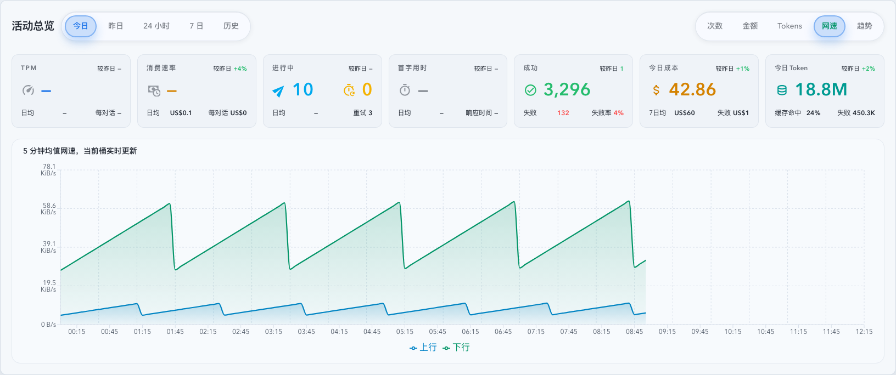
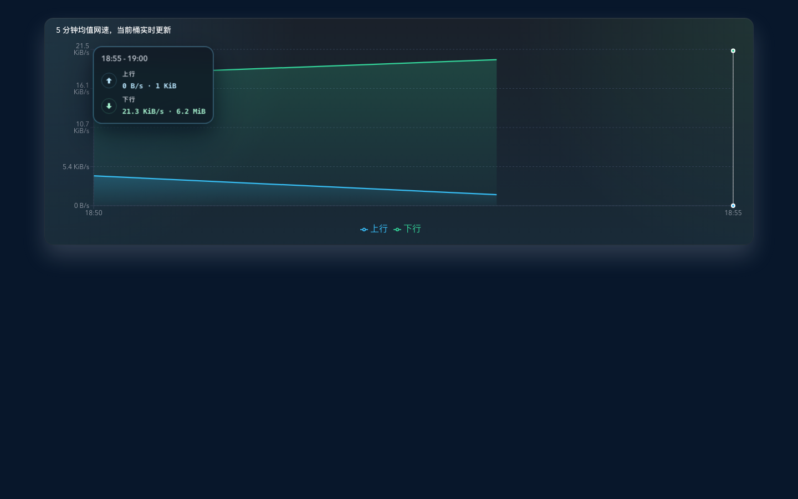
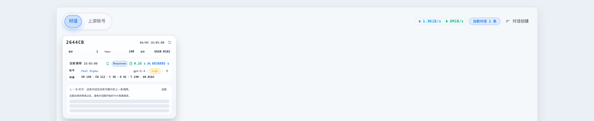
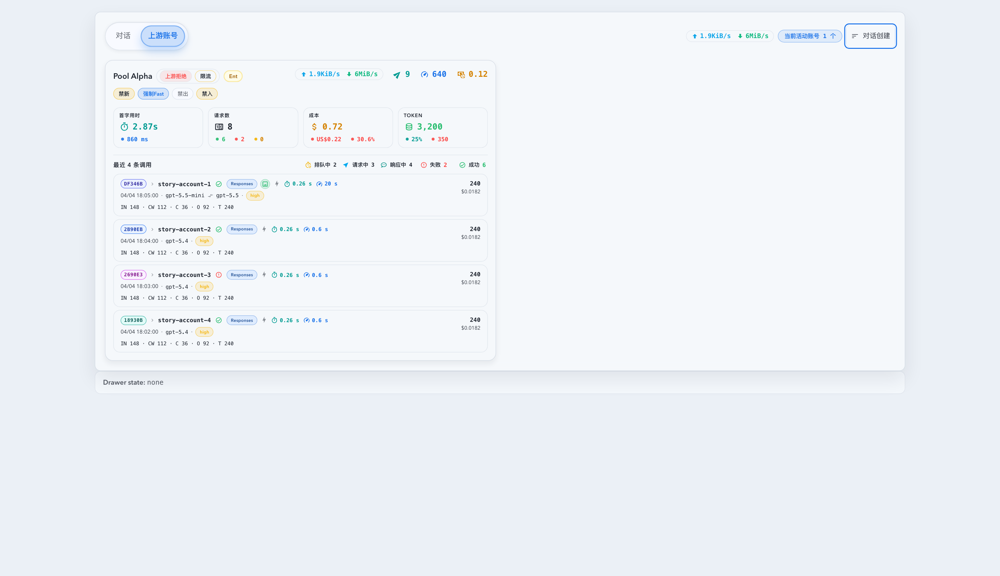

# Dashboard 上游账号网速与活动总览 Network Tab（#v3fum）

> 当前有效规范以本文为准；实现覆盖与当前状态见 `./IMPLEMENTATION.md`，关键演进原因见 `./HISTORY.md`。

## 背景 / 问题陈述

- Dashboard 已经能展示调用量、成本、Token、延迟和进行中调用，但对“当前上游账号到底在跑多少应用层流量”没有 owner-facing 观测面。
- 活动总览的 `今日 / 昨日 / 24 小时` 目前只覆盖请求量类指标，无法把实时上行/下行速率与历史 5 分钟网速走势连到同一块视图里。
- 现有数据库字段能提供应用层请求体与响应转发字节，但如果每秒对整个范围重扫数据库，会把 UI 实时刷新变成不必要的聚合热路径。

## 目标 / 非目标

### Goals

- 在 Dashboard 右侧上游账号卡片标题区新增单行实时网速，左侧上行、右侧下行，图标在数值左边，颜色区分上传与下载。
- 在 `今日 / 昨日 / 24 小时` 的活动总览 metric toggle 中新增 `网速`，用同图双平滑半透明面积展示上传与下载 5 分钟均值。
- 以后端内存缓存承接实时 15 秒窗口和当前开放 5 分钟桶，避免每秒全量扫库或重复聚合。
- 把 Dashboard 顶部网速图能力收敛到 dashboard-only API，不扩展通用 `/api/timeseries` 与 Stats 页面契约。

### Non-goals

- 不做 socket/network-layer、TLS framing 或系统网卡级别的精确带宽统计。
- 不把网速 tab 扩展到 `7 日 / 历史 / Stats 页面 / 账号详情页 / 其它工作区`。
- 不新增长期数据库 rollup 表，也不为网速做 schema migration。

## 范围（Scope）

### In scope

- `src/dashboard_network_speed.rs` 及代理热路径：账号级 15 秒秒桶、当前 5 分钟开放桶、请求/响应字节写入点与终态清理。
- `GET /api/stats/dashboard-activity` live snapshot 与账号活动响应：追加账号级 `upload/download bytes per second`。
- `GET /api/stats/dashboard-network-timeseries`：仅支持 `today | yesterday | 1d`，固定 5 分钟桶，当前开放桶以内存覆盖末桶。
- `web/src/features/dashboard/DashboardActivityOverview.tsx`、`DashboardWorkingConversationsSection.tsx`、新网速图组件与 hook。
- 相关前后端测试、Storybook 场景与视觉证据。

### Out of scope

- 改造自然日七卡 KPI 口径。
- 变更现有请求量 / 成本 / Token / 首字用时 / 响应时间布局。
- 把网速数据暴露给通用 timeseries、账号详情统计页或外部 API 使用方。

## 需求（Requirements）

### MUST

- 账号卡标题区网速必须展示应用层 `uploadBytesPerSecond` 与 `downloadBytesPerSecond`，默认值为 `0 B/s`，不得显示空白。
- 实时速率必须包含进行中的流式请求，并以 15 秒滚动均值每秒更新一次。
- `今日 / 昨日 / 24 小时` 的 metric toggle 必须出现 `网速`；`7 日 / 历史` 不得出现。
- `网速` 图必须使用固定 5 分钟桶，同图展示上传/下载两条平滑半透明面积，保留 tooltip、图例与单位格式化。
- `今日 / 24 小时` 必须显示当前未收口 5 分钟桶，且末桶由内存 current-bucket cache 驱动；`昨日` 只展示闭合历史桶。
- 当前 5 分钟桶与实时 15 秒窗口必须以内存缓存为主；进程重启后只允许对当前开放桶做一次 lazy seed，随后同桶生命周期内不再重复扫库。

### SHOULD

- dashboard-only 网速接口只在 `网速` tab 激活时由前端加载；`today / 1d` 初次 hydrate 后依赖 `dashboardActivityLive` SSE 推送当前桶，只有桶切换或 SSE 重连时才允许静默回补。
- 账号级实时网速与 dashboard live snapshot 保持同一 SSE/HTTP 合并策略，不因较旧 HTTP 响应回退到旧值。
- 上传优先按请求体字节、下载优先按已转发响应字节；缺失字段按 `0` 处理而不是推断。

## 功能与行为规格（Functional/Behavior Spec）

### Core flows

- 代理请求体大小一旦确定，立即写入账号级实时窗口与当前 5 分钟开放桶。
- 代理响应流每次转发 chunk 时，立即写入下载字节并触发 Dashboard live snapshot 刷新预算。
- Dashboard 上游账号卡片激活后，标题区始终显示单行 `上传 / 下载`，与 `进行中调用 / TPM / 消费速率` 并列。
- Dashboard 活动总览在 `today / yesterday` 选择 `网速` 时，顶部七卡保持原样，仅图表区域切换为网速面积图。
- `24 小时` 选择 `网速` 时，用同款面积图替代现有 heatmap；切回其它指标时恢复 heatmap。

### Edge cases / errors

- 账号存在调用但没有字节样本时，网速显示 `0 B/s`，图表对应桶值为 `0`。
- 当前开放桶尚未 lazy seed 命中历史样本时，只展示进程内已观测到的实时字节；不得阻塞请求。
- 网速接口失败时，只影响图表区域错误态，不影响同一 range 的摘要卡与其它 metric。

## 接口契约（Interfaces & Contracts）

### 接口清单（Inventory）

| 接口（Name）                                       | 类型（Kind）        | 范围（Scope） | 变更（Change） | 负责人（Owner） | 使用方（Consumers）         | 备注（Notes）                                 |
| -------------------------------------------------- | ------------------- | ------------- | -------------- | --------------- | --------------------------- | --------------------------------------------- |
| `GET /api/stats/dashboard-network-timeseries`      | http-endpoint       | external      | Add            | backend/stats   | Dashboard activity overview | dashboard-only；固定 5 分钟桶                 |
| `DashboardActivityAccountResponse.*BytesPerSecond` | http-response-field | external      | Add            | backend/stats   | Dashboard upstream cards    | 账号级 15 秒滚动均值                          |
| `DashboardActivityLiveAccount.*BytesPerSecond`     | sse/http-live-field | external      | Add            | backend/stats   | Dashboard live merge        | 与 in-progress live snapshot 同步更新         |
| `DashboardNetworkSpeedCache`                       | runtime-cache       | internal      | Add            | backend/proxy   | proxy dispatch / stats read | 维护秒桶、开放 5 分钟桶、lazy seed 与心跳预算 |
| `useDashboardNetworkTimeseries`                    | ui-hook             | internal      | Add            | web/dashboard   | Dashboard activity overview | 初次 hydrate + SSE 合并当前开放桶             |

## 验收标准（Acceptance Criteria）

- Given 任意一张上游账号卡，When 该账号无流量，Then 标题区仍显示 `上传` 与 `下载`，且值为 `0 B/s`。
- Given 流式响应仍在进行中，When 观察账号卡网速，Then 下载速率会每秒更新，而不是等调用结束后才变化。
- Given 活动总览处于 `今日 / 昨日 / 24 小时`，When 打开 metric toggle，Then 可以看到 `网速`；切到 `7 日 / 历史` 时看不到它。
- Given `今日` 或 `24 小时` 选择 `网速`，When 当前开放 5 分钟桶仍在接收流量，Then 图表末桶会持续更新。
- Given `昨日` 选择 `网速`，When 图表渲染完成，Then 不包含实时开放桶，只显示闭合历史 5 分钟桶。

## 非功能性验收 / 质量门槛（Quality Gates）

### Testing

- Backend tests: runtime speed cache 秒桶/开放桶/lazy seed/心跳预算。
- Frontend tests: SSE live merge、无 steady-state 轮询、网速 metric 可见性、24 小时 heatmap -> network chart 切换、账号卡网速渲染。

### Quality checks

- `cargo check`
- `cargo test dashboard_network_speed`
- `cd web && bun x tsc -b`
- `cd web && bun x vitest run --project=unit src/hooks/useDashboardUpstreamAccountActivity.test.tsx src/features/dashboard/DashboardActivityOverview.test.tsx src/features/dashboard/DashboardWorkingConversationsSection.test.tsx`
- `cd web && bun run build`
- `cd web && bun run build-storybook`

## Visual Evidence

- SHA `worktree`
- source_type: `storybook_canvas`
  story_id_or_title: `dashboard-dashboardactivityoverview--today-network-view`
  scenario: `activity overview today network tab`
  evidence_note: `验证今日活动总览切到网速后，右上 metric toggle 出现 Network，图表切换为双平滑半透明面积，标题提示当前桶实时更新。`
  
- SHA `worktree`
- source_type: `storybook_canvas`
  story_id_or_title: `dashboard-dashboardnetworkactivitychart--tooltip-upload-download`
  scenario: `network tooltip upload/download labels`
  evidence_note: `验证网速 tooltip 按系列 dataKey 正确显示一条上行、一条下行，不再出现重复“下行”；同时保留各自行的速率与桶内累计字节。`
  
- SHA `worktree`
- source_type: `storybook_canvas`
  story_id_or_title: `dashboard-workingconversationssection--conversation-tab-with-upstream-network-speed`
  scenario: `conversation workspace header aggregate network speed`
  evidence_note: `验证对话工作区右上 badge 区新增总上/下行实时网速，位置与当前对话计数并列，图标在左、文本颜色区分上传与下载。`
  
- SHA `worktree`
- source_type: `storybook_canvas`
  story_id_or_title: `dashboard-workingconversationssection--upstream-account-tab`
  scenario: `upstream account header live speed row`
  evidence_note: `验证上游账号卡标题区新增单行实时网速，上传/下载图标在左、颜色区分，且与进行中调用 / TPM / 消费速率同排。`
  

## 参考（References）

- `docs/specs/z6ysw-dashboard-account-activity-tabs/SPEC.md`
- `docs/specs/gz5ns-dashboard-natural-day-kpi-semantics/SPEC.md`
