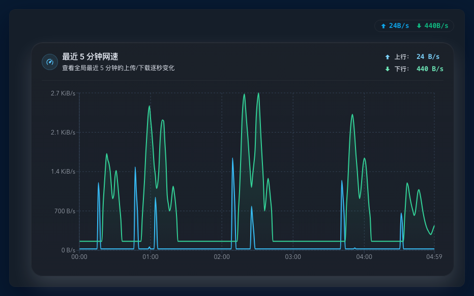
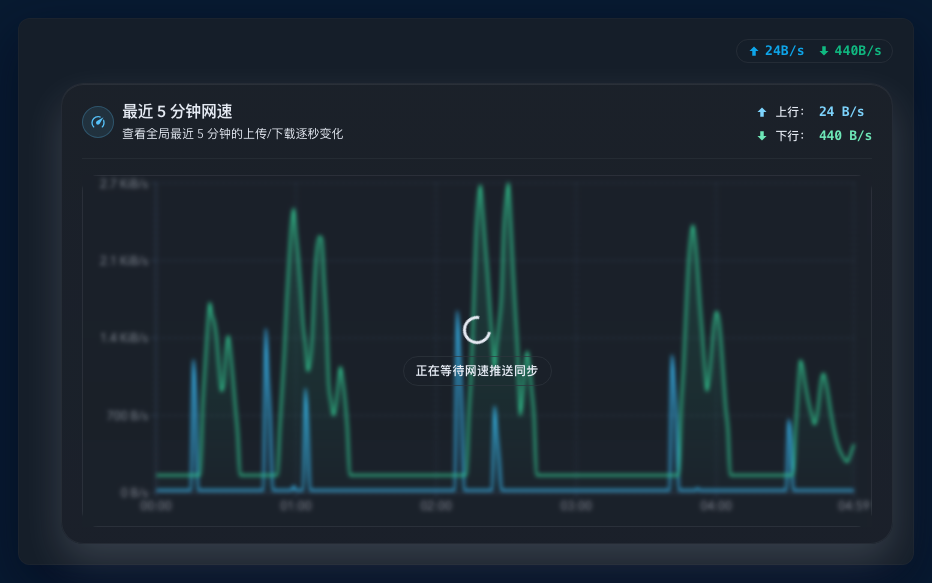
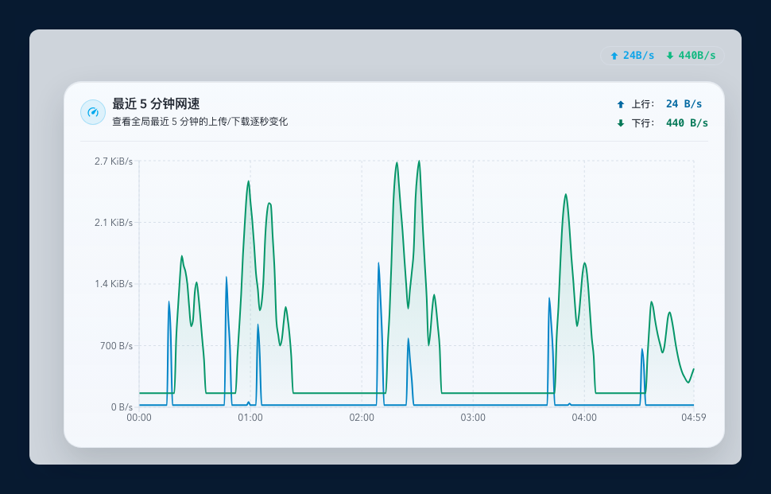
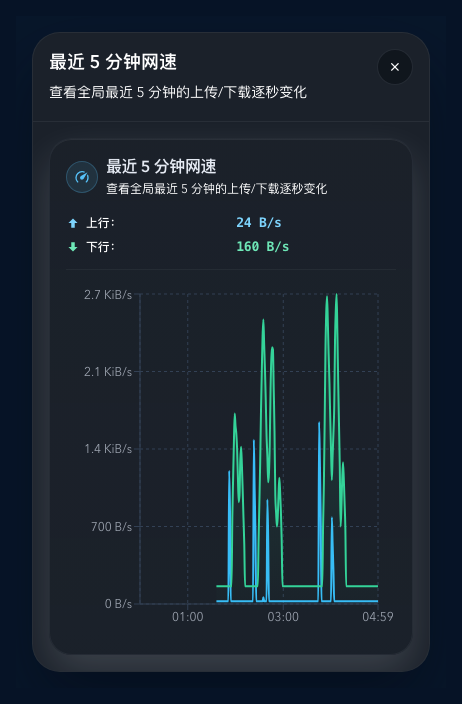
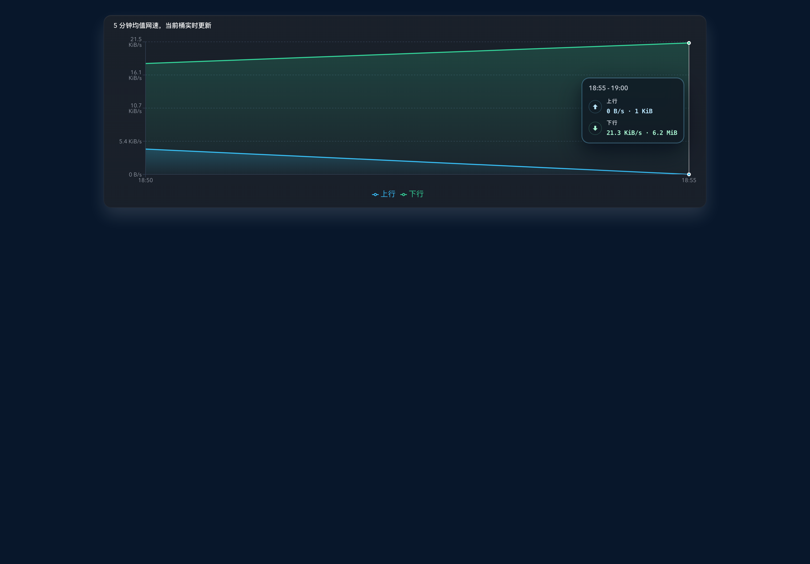
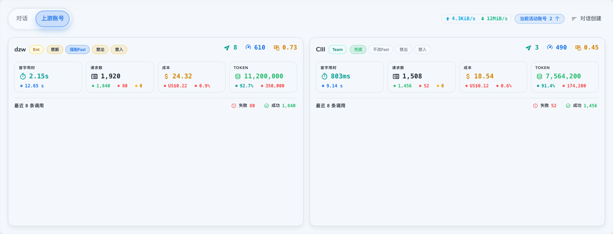
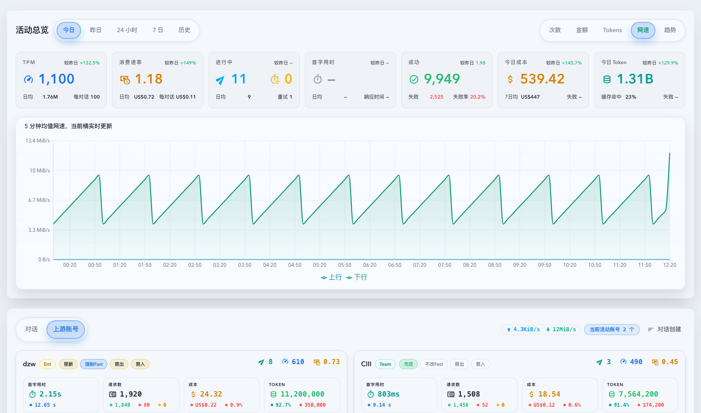

# Dashboard 上游真值网速与活动总览 Network Tab（#v3fum）

> 当前有效规范以本文为准；实现覆盖与当前状态见 `./IMPLEMENTATION.md`，关键演进原因见 `./HISTORY.md`。

## 背景 / 问题陈述

- Dashboard 已经能展示调用量、成本、Token、延迟和进行中调用，但“系统对所有上游的真实带宽占用”仍缺少 owner-facing 观测面。
- 旧版 Dashboard 网速以账号卡 header 展示单账号速率，并让总览图在闭合区间继续扫 invocation 级事实；当 pool invocation 在多个 host 间重试时，这个口径既不是真正的全局总量，也无法稳定承接后续 minute rollup。
- 活动总览的 `今日 / 昨日 / 24 小时` 已具备网速视图，但仍需要把“当前全局 live 速率”和“闭合历史分钟桶”统一到同一套连接级真实 socket 字节口径下，同时避免每秒重扫明细表。
- 工作区顶部总速率胶囊仍缺少诊断异常峰值、假零值与抖动的 owner-facing 近历史窗口；只看“上一完整 1 秒”胶囊和 5 分钟桶图，不足以排查最近数分钟内的逐秒变化。

## 目标 / 非目标

### Goals

- 把 Dashboard 无 scope 网速统一成“系统对所有上游的真实 socket 带宽”，口径固定为代理与上游之间 TCP 连接的实际读写字节。
- 在 `今日 / 昨日 / 24 小时` 的活动总览 metric toggle 中继续提供 `网速`，并让闭合历史桶读取按 host 聚合的分钟 rollup，live 末桶继续显示当前开放 5 分钟桶。
- 保留账号 scoped activity overview 的既有语义，不让这次全局真值切源改坏账号详情页。
- 在工作台上游账号区顶部保留总上传/总下载速率胶囊，但它必须直接显示“上一完整 1 秒”的全局真实 socket 速率，而不是由各账号卡速率求和得到。
- 在现有全局网速胶囊上新增 5 分钟逐秒诊断面板：桌面端支持 `hover 打开 + click 固定`，窄屏端改用 `dialog/sheet`，面板只展示最近 300 秒全局上传/下载真历史并实时右移。

### Non-goals

- 不做宿主机网卡级、eBPF、netlink 或容器外部流量采集。
- 不把 TLS framing、HTTP/2 frame、HPACK 或系统其它进程流量混进 Dashboard 网速。
- 不新增 host 列表、host 详情视图或 host 数量 badge。
- 不在 Dashboard 上游账号卡内继续显示上传/下载速率。
- 不做历史回填；真实 socket minute rollup 只从这次实现落地后开始累计。
- 不把诊断面板扩展成账号级、host 级或可切 scope 的网络分析器。
- 不替换现有 `dashboard-network-timeseries` 5 分钟桶图，也不改变顶部胶囊继续读取 `networkRealtimeRate` 的数值口径。
- 不把逐秒历史写入 SQLite；进程重启后 recent 面板只重新积累运行期窗口。

## 范围（Scope）

### In scope

- `src/dashboard_network_speed.rs` 及代理热路径：global + host + account 三维实时秒桶与开放 5 分钟桶、连接级读写字节写入点与终态清理。
- `pool_upstream_request_attempts.upstream_base_url_host` 与新的 `upstream_socket_network_minute` 分钟表。
- `GET /api/stats/dashboard-activity` 与 `dashboardActivityLive`：追加全局 `networkLiveBucket` 与 `networkRealtimeRate`，并把账号级实时字段统一成上一完整 1 秒语义。
- `GET /api/stats/dashboard-network-timeseries`：无 scope 时切到 host minute rollup + 全局 live bucket；账号 scoped 时保留既有路径。
- `GET /api/stats/dashboard-network-recent` 与 `dashboard.network-recent.current`：提供无 scope 的最近 300 秒、1 秒粒度全局读模型，专供诊断面板消费。
- `web/src/hooks/useDashboardRecentNetworkWindow.ts`、`DashboardNetworkRecentPopover.tsx` 与 `DashboardWorkingConversationsSection.tsx`：新增工作区顶部胶囊诊断入口、桌面浮层 / 窄屏 dialog、前导空档呈现、服务端 push 驱动的 recent window 订阅与 stale 遮罩。
- `web/src/features/dashboard/DashboardActivityOverview.tsx`、`DashboardNetworkActivityChart.tsx`、`DashboardWorkingConversationsSection.tsx`、相关 hook、测试与视觉证据。

### Out of scope

- 改造自然日七卡 KPI 口径。
- 变更现有请求量 / 成本 / Token / 首字用时 / 响应时间布局。
- 把 host 明细暴露给通用 timeseries、Stats 页面或外部 API 使用方。

## 需求（Requirements）

### MUST

- 无 `upstreamAccountId` 的 Dashboard 网速必须展示“系统对所有上游的真实 socket 带宽”，不能再依赖账号级求和。
- 顶部实时速率必须包含进行中的流式请求，并固定显示上一完整 1 秒的原始速率；不得对当前秒 partial bytes 做外推，也不得再做 15 秒滚动均值。
- `今日 / 昨日 / 24 小时` 的 metric toggle 必须出现 `网速`；`7 日 / 历史` 不得出现。
- `网速` 图必须使用固定 5 分钟桶，同图展示上传/下载两条平滑半透明面积，保留 tooltip、图例与单位格式化。
- `今日 / 24 小时` 必须显示当前未收口 5 分钟桶，且末桶由内存 current-bucket cache 驱动；`昨日` 只展示闭合历史桶。
- pool invocation 跨 host 重试时，每个 attempt 的上传/下载都必须累计到全局与对应 host；不能按 invocation 去重。
- HTTP 与 WebSocket 都必须走同一套连接级字节计数；OAuth 路径不能退回 reqwest body 近似值。
- host 归一化固定为 lowercase；缺失 host 写入 `__unknown__`，仍参与全局汇总。
- 工作台顶部总速率胶囊必须直接读取 `networkRealtimeRate`；`networkLiveBucket` 继续表示当前开放 5 分钟桶；账号卡不得继续显示上传/下载速率。
- 当前 5 分钟桶与上一完整 1 秒实时快照必须以内存缓存为主；socket minute rollup 不做历史回填，初次 materialize 时只从当前 live table 尾部开始累计。
- 连接在握手前失败、等待首包超时或流式途中提前 drop 时，已实际发生的 socket 字节仍必须冲刷到 live bucket 与 minute rollup，不能因为 future 被取消而丢样本。
- `GET /api/stats/dashboard-network-recent` 与 `dashboard.network-recent.current` 必须固定返回 `windowSeconds=300`、`sampleSeconds=1`、完整 300 点全局窗口，以及 `rangeStart`、`rangeEnd`、`isWarmingUp` 与每个点的 `isAvailable` 状态。
- `dashboard.network-recent.current` 必须由服务端 SSE live payload 推送；前端不得再用 interval 或 `refresh()` 维持窗口推进。
- recent 面板历史必须直接来自 `DashboardNetworkSpeedCache` 的运行期秒桶真历史；不得从分钟表反推，也不得新增 SQLite 持久化。
- 进程启动不足 5 分钟时，recent 面板前导缺失区间必须通过 `isAvailable=false` 表示空档，数值字段固定归零仅供渲染；前端不得把这些点伪装成真实 `0 B/s` 历史。
- recent 面板只允许展示全局上传/下载两条秒级曲线；顶部胶囊自身继续独立读取 `networkRealtimeRate`，不与 recent 面板共享回退或格式化语义。
- recent 面板的唯一触发器必须是 `NetworkSpeedInline`；桌面端需要支持 `hover 打开 + click 固定 + 再次点击/外点/Esc 关闭`，窄屏端 `<=768px` 必须改为 dialog/sheet。

### SHOULD

- dashboard-only 网速接口只在 `网速` tab 激活时由前端加载；`today / 1d` 初次 hydrate 后依赖 `dashboardActivityLive` SSE 推送当前桶，只有桶切换或 SSE 重连时才允许静默回补。
- 账号级实时网速与 dashboard live snapshot 保持同一 SSE/HTTP 合并策略，不因较旧 HTTP 响应回退到旧值。
- 连接归因优先级固定为 `SNI -> Host/authority -> 配置的 upstream host`；缺失 host 仍写入 `__unknown__`。
- 上传/下载均以 socket 实际读写字节为准；不再从 header/body 近似值反推带宽。
- recent 面板前端只消费 `dashboard.network-recent.current` 这一条 topic；只允许接收服务端 1 秒 push，不保留页面级健康态轮询、open-resync 或第二真相源 fallback。

## 功能与行为规格（Functional/Behavior Spec）

### Core flows

- 代理与上游建立 HTTP / WebSocket 连接后，socket 实际写入字节立即进入 global、host、account 三个实时窗口与当前 5 分钟开放桶。
- 代理从上游 socket 实际读到字节后，立即写入下载字节并触发 Dashboard live snapshot 刷新预算。
- Dashboard 活动总览在 `today / yesterday` 选择 `网速` 时，顶部七卡保持原样，仅图表区域切换为网速面积图。
- `24 小时` 选择 `网速` 时，用同款面积图替代现有 heatmap；切回其它指标时恢复 heatmap。
- 工作台上游账号 tab 始终在右上 badge 区显示总上传/总下载实时速率；账号卡只保留活动账号数量、TPM、消费速率、进行中等摘要信息。
- owner 悬浮工作区顶部网速胶囊时，桌面端弹出最近 5 分钟逐秒诊断面板；点击同一胶囊后面板保持固定打开，直到再次点击、点击外部或按 `Esc` 关闭。面板右上角同步显示最近一帧可用样本的上行/下行摘要，图表区在 topic 超过阈值未收到新 payload 时显示 stale 遮罩。
- 窄屏端点击同一胶囊时，改用 dialog/sheet 承载同一份 recent 面板内容；关闭 overlay 后立即停止 recent topic 订阅。
- recent 面板打开期间每秒由服务端推送同一 topic 的新 snapshot，以便即使当前 1 秒没有新流量，窗口右边界也会继续按 1 秒 cadence 前进。

### Edge cases / errors

- 账号或全局存在调用但没有字节样本时，网速显示 `0 B/s`，图表对应桶值为 `0`。
- 当前开放桶尚未 lazy seed 命中历史样本时，只展示进程内已观测到的实时字节；不得阻塞请求。
- 缺失 host 的 direct/pool 字节样本写入 `__unknown__`；图表与总速率仍必须计入这些样本。
- 网速接口失败时，只影响图表区域错误态，不影响同一 range 的摘要卡与其它 metric。
- 进程启动不足 5 分钟时，recent 面板前导区间必须显示为空档；不得额外显示“正在积累历史”类提示，这些空档不是低速样本，也不代表真实 `0 B/s`。
- recent 面板打开期间即使 1 秒内没有新流量，窗口也必须继续右移；关闭面板后不再继续消费后续 push。
- recent 面板接口或 topic 失败时，只影响诊断浮层 / dialog 自身，不得改变胶囊实时值、badge 排列或活动总览网络图。

## 接口契约（Interfaces & Contracts）

### 接口清单（Inventory）

| 接口（Name）                                       | 类型（Kind）        | 范围（Scope） | 变更（Change） | 负责人（Owner） | 使用方（Consumers）         | 备注（Notes）                                                 |
| -------------------------------------------------- | ------------------- | ------------- | -------------- | --------------- | --------------------------- | ------------------------------------------------------------- |
| `GET /api/stats/dashboard-network-timeseries`      | http-endpoint       | external      | Add            | backend/stats   | Dashboard activity overview | dashboard-only；无 scope 时读 host minute                     |
| `DashboardActivityAccountResponse.*BytesPerSecond` | http-response-field | external      | Add            | backend/stats   | Dashboard upstream cards    | 账号级上一完整 1 秒原始速率                                   |
| `DashboardActivityLiveAccount.*BytesPerSecond`     | sse/http-live-field | external      | Add            | backend/stats   | Dashboard live merge        | 与账号级上一完整 1 秒快照保持同语义                           |
| `DashboardActivityResponse.networkLiveBucket`      | http-response-field | external      | Add            | backend/stats   | Dashboard network chart     | 当前开放 5 分钟桶，用于历史图末桶                             |
| `DashboardActivityResponse.networkRealtimeRate`    | http-response-field | external      | Add            | backend/stats   | Dashboard upstream summary  | 全局上一完整 1 秒实时总速率                                   |
| `GET /api/stats/dashboard-network-recent`          | http-endpoint       | external      | Add            | backend/stats   | Dashboard recent panel      | global only；固定 300 点 / 1 秒窗口                           |
| `dashboard.network-recent.current`                 | sse-topic           | external      | Add            | backend/stats   | Dashboard recent panel      | topic-only 真值读模型；snapshot/replay/live                   |
| `DashboardRecentNetworkWindowResponse`             | http/sse-payload    | external      | Add            | backend/stats   | web/dashboard               | 包含 `isWarmingUp` 与逐点 `isAvailable` 空档                  |
| `DashboardNetworkSpeedCache`                       | runtime-cache       | internal      | Update         | backend/proxy   | proxy dispatch / stats read | 维护 global + host + account 秒桶、开放桶与 recent 300 秒窗口 |
| `upstream_socket_network_minute`                   | sqlite-table        | internal      | Add            | backend/stats   | Dashboard network history   | host + account 维度分钟累计，不存 global 行                   |
| `useDashboardNetworkTimeseries`                    | ui-hook             | internal      | Update         | web/dashboard   | Dashboard activity overview | 初次 hydrate + SSE 合并当前开放桶                             |
| `useDashboardRecentNetworkWindow`                  | ui-hook             | internal      | Add            | web/dashboard   | Dashboard recent panel      | topic-only 订阅 + last payload stale 判断                     |
| `DashboardNetworkRecentPopover`                    | ui-component        | internal      | Add            | web/dashboard   | Dashboard workspace summary | 桌面 hover/click lock；窄屏 dialog/sheet                      |

## 验收标准（Acceptance Criteria）

- Given 任意一个 Dashboard 无 scope 总览，When `网速` tab 激活，Then 图表展示的是系统对所有上游的真实 socket 带宽，而不是账号卡求和或单 invocation 近似值。
- Given 任意一张上游账号卡，When 页面渲染，Then 顶部仍保留总速率胶囊，但账号卡自身不显示上传/下载速率行。
- Given 流式响应仍在进行中，When 观察顶部总速率胶囊，Then 下载速率按上一完整秒逐秒更新，而不是等调用结束后才变化，也不会把当前秒 partial bytes 外推成虚高峰值。
- Given 活动总览处于 `今日 / 昨日 / 24 小时`，When 打开 metric toggle，Then 可以看到 `网速`；切到 `7 日 / 历史` 时看不到它。
- Given `今日` 或 `24 小时` 选择 `网速`，When 当前开放 5 分钟桶仍在接收流量，Then 图表末桶会持续更新。
- Given `昨日` 选择 `网速`，When 图表渲染完成，Then 不包含实时开放桶，只显示闭合历史 5 分钟桶。
- Given 同一 pool invocation 跨多个 host 重试，When 查询 host minute rollup 并查看 Dashboard 总览，Then 每个 host attempt 的上传/下载都会被分别记账，而图表和总速率反映其全量累计。
- Given OAuth HTTP 请求或 `/v1/responses` WebSocket 在握手后超时或提前关闭，When 查看 live bucket 与分钟汇总，Then 已经发生的 socket 读写字节仍会被记账，不会因为 transport future 被取消而掉成 `0 B/s`。
- Given owner 把鼠标移到工作区顶部网速胶囊，When 当前 viewport 为桌面宽度，Then recent 诊断面板立即出现；When owner 点击胶囊，Then 面板保持固定打开，直到再次点击、外点或 `Esc`。
- Given owner 把鼠标移到工作区顶部网速胶囊，When 浏览器判定 hover title，Then 胶囊与子元素不得提供网速 `title`，不会出现浏览器原生 tooltip。
- Given recent 面板已有 pushed payload，When 面板渲染，Then 右上角必须分两行显示最近可用样本的 `上行：<speed>` 与 `下行：<speed>`。
- Given owner 在窄屏设备点击同一网速胶囊，When overlay 打开，Then 以 dialog/sheet 承载同一 recent 面板内容，且图表区域不溢出容器。
- Given 进程运行不足 5 分钟，When recent 面板渲染最近 300 秒窗口，Then 前导缺失区间只显示为空档，不显示 warming 提示，也不伪造 `0 B/s` 历史。
- Given recent 面板处于打开状态但当前 1 秒没有新增流量，When 服务端推送下一个 cadence，Then 时间窗右侧仍会右移；When 面板关闭，Then 前端不再订阅这条 topic。
- Given recent 面板超过 5 秒未收到 `dashboard.network-recent.current` payload，When 图表区域仍保留旧数据，Then 只显示 Loading/Spinner 遮罩，不显示局部“刷新中”文案。

## 非功能性验收 / 质量门槛（Quality Gates）

### Testing

- Backend tests: runtime speed cache 的 global/host/account 秒桶、开放桶、lazy seed、pool retry host split、minute materializer、OAuth HTTP / WebSocket 的连接级字节计数。
- Frontend tests: SSE live merge、无 steady-state 轮询、网速 metric 可见性、24 小时 heatmap -> network chart 切换、顶部总速率胶囊、账号卡速率删除、recent 面板 stale 遮罩与头部摘要。
- Backend tests: recent 300 秒窗口保留、上一完整 1 秒语义、启动不足 5 分钟时的 `isAvailable=false` 前导空档、recent endpoint/topic payload 组装。
- Frontend tests: recent 面板桌面 hover/click 固定、再次点击或 `Esc` 关闭、窄屏 dialog/sheet 打开、前导空档无提示、stale 遮罩、无前端 refresh。

### Quality checks

- `cargo check`
- `cargo test dashboard_network -- --nocapture`
- `cargo test recent_global_window -- --nocapture`
- `cargo test recent_window_response -- --nocapture`
- `cargo test dashboard_network_recent_topic -- --nocapture`
- `cargo test upstream_host_network -- --nocapture`
- `cd web && bun run test DashboardWorkingConversationsSection useDashboardUpstreamAccountActivity DashboardActivityOverview DashboardNetworkActivityChart`
- `cd web && bun run test -- DashboardNetworkRecentPopover useDashboardRecentNetworkWindow DashboardWorkingConversationsSection`
- `cd web && bun run test-storybook`
- `cd web && bun run storybook:build`

## Visual Evidence

- SHA `current-worktree`
- source_type: `storybook_iframe`
  story_id_or_title: `dashboard-dashboardnetworkrecentpopover--desktop-fixed-open`
  scenario: `desktop locked recent diagnostic popover`
  evidence_note: `验证工作区网速胶囊在桌面端以固定展开态展示最近 5 分钟逐秒上传/下载曲线，并在面板右上角显示上行/下行两行摘要。`
  PR: include
  
- SHA `current-worktree`
- source_type: `storybook_iframe`
  story_id_or_title: `dashboard-dashboardnetworkrecentpopover--desktop-stale-overlay`
  scenario: `desktop recent diagnostic stale pushed-data overlay`
  evidence_note: `验证 recent topic 长时间未收到 pushed payload 时，仅图表区域保留旧图并显示 Loading/Spinner stale 遮罩，不再出现局部刷新中文案。`
  PR: include
  
- SHA `current-worktree`
- source_type: `storybook_iframe`
  story_id_or_title: `dashboard-dashboardnetworkrecentpopover--desktop-fixed-open-light`
  scenario: `desktop locked recent diagnostic popover in light theme`
  evidence_note: `验证亮色主题下同一套网速胶囊与副窗头部语汇保持一致，未回到另一套配色/卡片体系。`
  PR: include
  
- SHA `current-worktree`
- source_type: `storybook_iframe`
  story_id_or_title: `dashboard-dashboardnetworkrecentpopover--compact-sheet-partial-history`
  scenario: `compact recent diagnostic sheet with partial-history gap`
  evidence_note: `验证窄屏 dialog/sheet 呈现、右上角两行摘要、前导空档不伪装成 0 B/s，且不显示 warming 提示文案。`
  PR: include
  
- SHA `current-worktree`
- source_type: `storybook_canvas`
  story_id_or_title: `dashboard-dashboardnetworkactivitychart--tooltip-upload-download`
  scenario: `global real-socket network chart`
  evidence_note: `验证活动总览网速图在当前 SHA 下展示真实 socket 上传/下载速率，并继续保持中性 surface 背景。`
  
- SHA `current-worktree`
- source_type: `storybook_canvas`
  story_id_or_title: `pages-dashboardpage--unified-activity-snapshot`
  scenario: `upstream account workspace global network pill and account-card cleanup`
  evidence_note: `验证工作区顶部总速率胶囊使用非零真实 socket live 数据，同时账号卡头部未重新出现单账号上传/下载速率。`
  
- SHA `current-worktree`
- source_type: `storybook_iframe`
  story_id_or_title: `pages-dashboardpage--unified-activity-snapshot`
  scenario: `full dashboard page real-socket network graph plus upstream account live pill`
  evidence_note: `验证整页状态下活动总览网速图与上游账号顶部总速率胶囊同时使用非零真实 socket live 数据，且账号卡头部未重新出现单账号上传/下载速率。`
  

## 参考（References）

- `docs/specs/z6ysw-dashboard-account-activity-tabs/SPEC.md`
- `docs/specs/gz5ns-dashboard-natural-day-kpi-semantics/SPEC.md`
- `docs/solutions/performance/realtime-dashboard-reconcile-budget.md`
