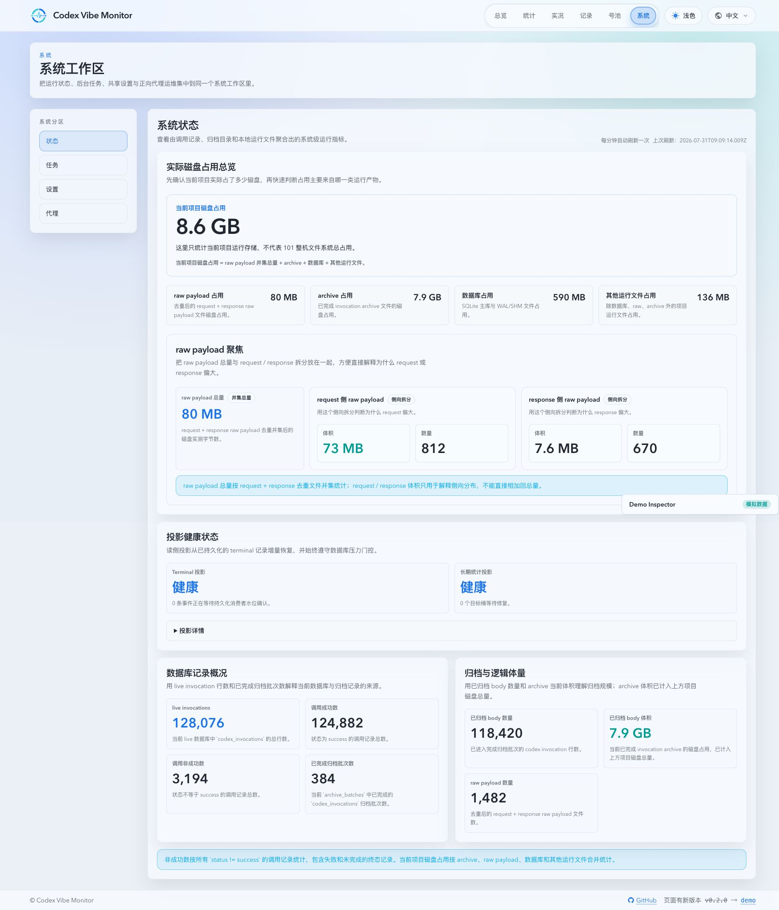
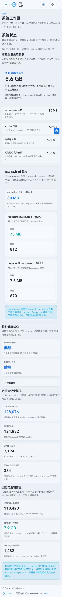

# Terminal Projection 中间层与增量物化（#vmcs3）

> 当前有效规范以本文为准；实现状态见 `./IMPLEMENTATION.md`，关键演进原因见 `./HISTORY.md`。

## 背景

Dashboard 已有受限的实时累计态，但长期统计仍可能由定时任务扫描近两天 `codex_invocations` 后重写 rollup。该生产者与 terminal 写入、派生写和 Dashboard 对账共享 SQLite，造成不必要的读写竞争。

## Goals

- 建立 `TerminalProjectionHub`：terminal ingress 在 P1 journal admission 后注册紧凑事件，P1 成功持久化后以单调 `rowId` 确认；Dashboard 与长期统计作为独立消费者使用自己的 cursor。
- P1 只保证 raw terminal 落库和 journal ACK；任何投影、rollup、repair 都不得延长 P1 锁窗口。
- 长期统计以持久 cursor、持久 rollup 与精确 interval overlay 增量物化。正常 terminal burst 固定 60 秒合并，只 hydrate 新的 terminal row 并 additive upsert 受影响 rollup key；raw 自然日重建仅用于明确 repair，不执行无条件近两天扫描。
- `running/pending -> terminal` 的正常 finalize 只推进 cursor 和增量桶，不得制造自然日 dirty bucket；但若该行已被更大的 terminal `rowId` 跨越，必须标记其自然日精确 repair，不能静默漏记。价格、模型、账号归属、archive rewrite/restore 等会修正已持久化事实的 mutation 同样标记旧/新受影响自然日。
- 墙上时间继续由每个维度的规范化区间并集精确计算；不允许用计数或近似采样替代。
- `/api/stats/long-term/*`、Dashboard HTTP/SSE 的 wire shape 和既有刷新节奏保持不变；`GET /api/system/status` 可新增只读 `projectionHealth`。

## Requirements

- Hub pending event 同时受 `10,000` 条和 `64 MiB` 限制。触限、未知 ACK 或重启恢复不阻塞 P1；对应消费者必须进入 `dirty_last_good`，由持久 cursor 精确补齐。
- long-term projection state 至少持久化 consumer cursor、最近 flush 结果、可恢复的脏桶和区间片段。进程重启后可从 `codex_invocations.id > cursor` 恢复，不依赖内存事件仍然存在。
- 每个 dirty bucket 的重建必须使用半开上海自然日边界，并覆盖跨日/跨小时调用。archive 或 retained-source 覆盖不能证明完整时保留 last-good，不得用局部 live 行覆盖已有完整 rollup。
- P2 flush、repair 和每日低优先级复检必须通过全局 SQLite pressure gate。压力期保留已有长期统计页和 Dashboard 内存快照；只能记录 deferred，不能竞争 P1。
- long-term interval state 以调用为单位 canonical 持久化，日/小时和三维 union 在投影边界派生。interval 迁移、重建、兼容清理和 hourly retention 的每个写事务至多处理 `512` 行，并在事务边界重新检查 pressure 和 shutdown；单次低优先级 maintenance 至多推进一个写批次，剩余工作必须可由持久状态重新发现并在独立 maintenance deadline 续跑，terminal deadline 不得清理历史展开 state；未完成的 repair 必须保留 dirty 和 last-good。
- archive rewrite、价格/归属修正和 archive replay 必须标记对应 target bucket repair；目标重建必须读取所有可验证的 live 与重叠 archive source，任何 source 不可读时保留 last-good。受限微批替换期间，last-good backup 必须持续公开；cursor/state 提交后，dirty marker 清理与该日期 backup pointer 的切换必须在同一短事务完成，随后才可清理私有 backup。中断不得暴露新 rollup 与旧 cursor/dirty marker 的可观察组合。
- telemetry 至少包含 `projection`、`trigger`、`event_count`、`cursor_lag`、`dirty_bucket_count`、`interval_bytes`、`flush_outcome`、`repair_scope`、`gate_outcome` 与 `defer_reason`。

## Non-goals

- 不把非 Dashboard、非长期统计的全部 read path 迁入 Hub。
- 不新增长期统计 SSE、公开查询参数或 owner-facing 操作开关。
- 不绕过 SQLite pressure gate，不扩大连接池，不以近似墙上时间换取吞吐。

## Runtime Data Plane Boundary

Terminal journal 的 durable ACK 只能发生在 P1 SQLite 事务提交后。P1 锁冲突时保留完整未提交批次并指数退避；新 terminal 事件不得提前既有重试 deadline。P2 projection materialization 不参与 P1 ACK，也不得在单事务内无界追赶 cursor。

- `TerminalProjectionHub` 继续拥有 terminal durable cursor；current-state 由 [`RuntimeProjectionHub`](../high-frequency-runtime-data-plane/SPEC.md) 承担，二者不得合并为一个共享可变缓存。
- Dashboard live render 只消费 Runtime/Terminal Projection 的不可变 snapshot，不得从 Terminal Projection 的订阅回调反向调用 SQLite builder。
- Terminal projection ingress 使用 compact typed mutation，并按 durable row cursor 进行恢复；完整 `ApiInvocation` 不得作为 runtime bus event 或 topic work 携带。
- SQLite writer P1 -> P2 派生工作必须通过统一 accounting ownership transfer，不能以裸原子减法跨越队列阶段。

## Verification

- 空闲期不再存在按 60 秒无条件扫描近两天 raw invocation 的长期统计生产任务。
- terminal burst 下，每个长期 projection 最多一次固定 60 秒 P2 flush；P1 ACK 和 Dashboard terminal overlay 不依赖该 flush。
- P2 admission 使用独立固定 250ms deadline。pressure gate 拒绝后按 eligibility/cooldown 事件唤醒，实际 SQLite busy/locked 才进入 250ms 到 5s 的失败退避；pressure defer 不属于 retry。
- 重启、journal replay、重复 terminal、hard limit、跨自然日 interval、unassigned/model/reasoning 分组和 archive rewrite 与 exact builder 对账一致。
- canonical interval 迁移、分批 pressure/cancel 停止、标准 `occurred_at` range seek 与 RFC3339 compatibility fallback 均有确定 SQLite 回归；Summary、路由和 archive replay 保持原有行为。
- System Status 展示只读取内存 health，不增加 status route 的 SQLite 查询数；健康、deferred、dirty-last-good 均可读且详情可展开。

## Visual Evidence

PR: include

PR: include

## Memory Attribution

- Terminal projection 的观测必须区分 `db_invocation_row_count`、`runtime_record_count` 与 pending projection event 数量；数据库行数不得被解释为进程内常驻对象数。
- 进程级诊断每 30 秒读取 `/proc/self/status`、`smaps_rollup` 与可用 cgroup memory 文件，只记录 RSS、匿名内存、文件映射、Swap、峰值 RSS、线程数和已知组件的无克隆估算。
- 已知组件估算至少覆盖 runtime store、terminal projection、Dashboard snapshot、long-term interval index、timeseries staging、raw writer、prompt cache、network/routing cache 与 SQLite writer queue，并同时记录 `managed_bytes` 与 `unattributed_anon_bytes`。
- 诊断只能观察和记录，不得触发数据库查询、清理数据、降低并发或改变 projection cursor。`MEMORY_DIAGNOSTICS=allocator_once` 仅在连续三次匿名内存未归因比例达到 35% 时生成一次受限 allocator 摘要；默认不生成。
- 第一阶段不以 RSS 阈值判定通过，也不因 1 GiB 优化目标而丢弃 terminal、last-good 或可恢复事件。只有连续观测确认主要占用者后，才允许单独进入无损修复阶段。
