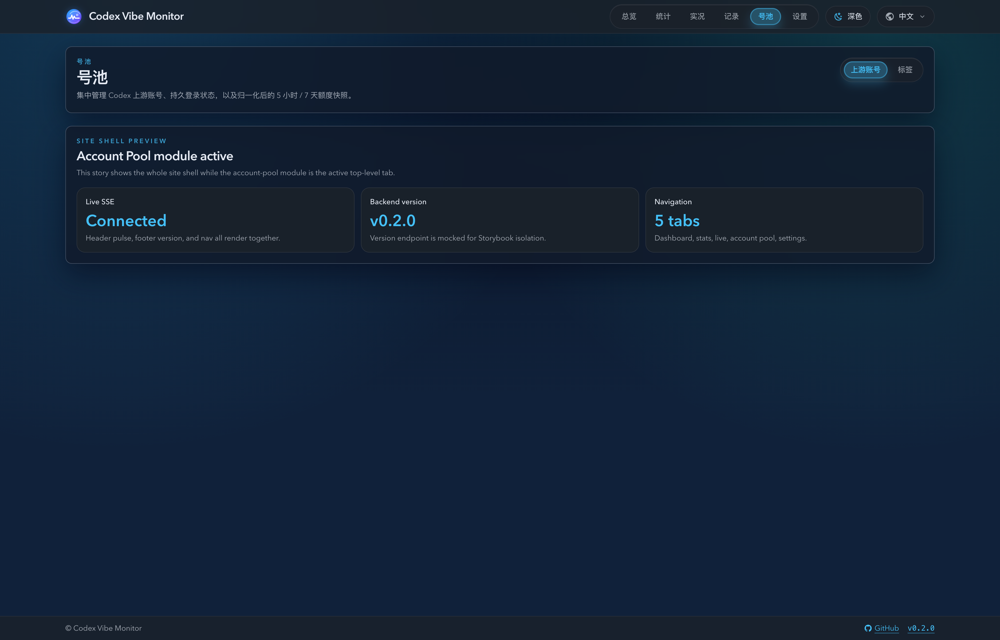
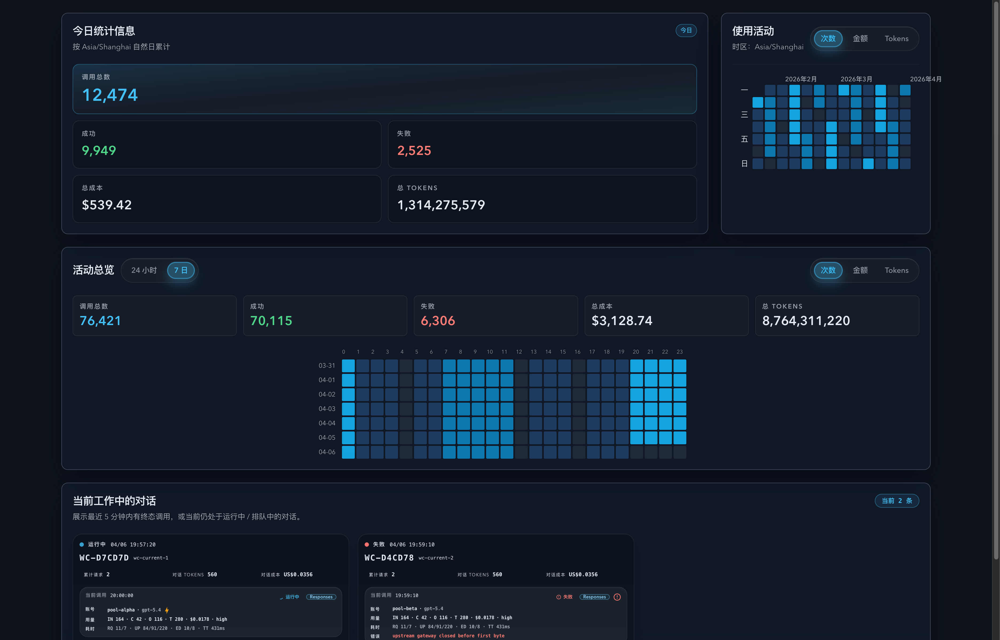
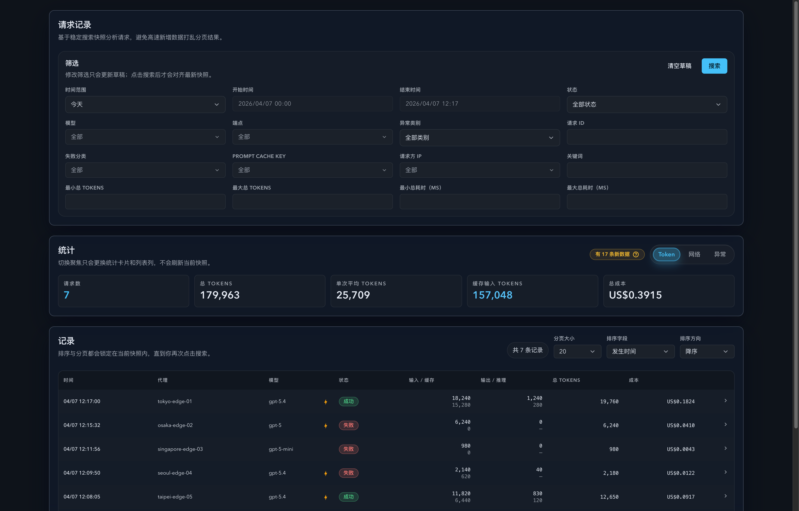
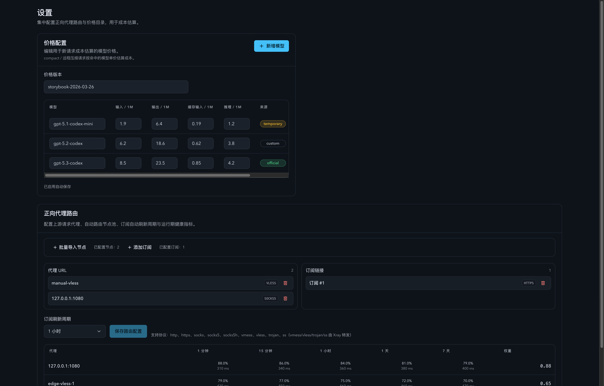
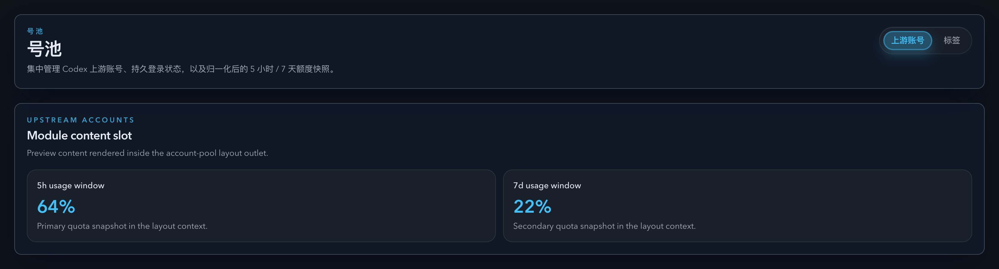

# 全站 1660 宽屏壳层适配（#vn2e9）

## 状态

- Status: 已完成（5/5，PR #298）
- Created: 2026-04-06
- Last: 2026-04-07

## 背景 / 问题陈述

- 当前站点级 shell 仍被 `1200px` 左右的历史容器约束，Header / Main / Footer / Update banner 与页面级容器存在多处宽度真相源，导致宽屏显示时内容过早收缩。
- Dashboard、Stats、Settings、Account Pool 等顶层路由虽然各自有页面容器，但宽度契约不统一，出现“外层壳层放宽不足 + 内层页面继续卡旧 max-width”的双重限制。
- 现有 Storybook 与回归测试还没有把 `1660px` 作为稳定验收口径，导致宽屏回归主要依赖人工观察，缺少统一的视觉证据与自动化护栏。

## 目标 / 非目标

### Goals

- 把站点级 shell 最大内容宽度统一提升到 `1660px`，并让 header / main / footer / update banner 共用同一条宽度契约。
- 移除顶层路由里遗留的 `1200 / 6xl / 1440 / 1560` 页面限制，让 Dashboard、Stats、Live、Records、Account Pool、Settings 在宽屏下按同一壳层对齐。
- 只做内容感知扩展：让数据密集区更稳地利用新增宽度，同时不重做 Settings / 表单类页面的信息架构。
- 补齐稳定 Storybook 宽屏入口、Playwright 宽屏回归与 `## Visual Evidence`，使本轮快车道可以收敛到 merge-ready。

### Non-goals

- 不修改后端 API、数据库、SSE 协议与任何业务口径。
- 不重做移动端 / 平板断点体系，也不为宽屏新增新的产品级布局模式。
- 不重排对话框、Drawer、Toast、系统通知的 ergonomics max-width，除非本轮壳层放宽直接暴露明确回归。

## 范围（Scope）

### In scope

- `web/src/index.css` 与 shell 相关组件：新增共享宽屏布局契约，并统一 Header / Main / Footer / Update banner。
- `web/src/pages/**` 的顶层路由容器：Dashboard、Stats、Live、Records、Settings、Account Pool 根布局。
- 数据密集区的轻量内容感知修正：Dashboard 顶部双卡、Records 过滤/摘要/表格承载区、Live 实况区、Account Pool 模块头部与列表承载区。
- Storybook 宽屏入口与页面 stories：Shell、Dashboard、Stats、Live、Records、Settings、Account Pool。
- `web/tests/e2e/**` 的宽屏回归覆盖与无横向滚动 / 对齐断言。
- `docs/specs/README.md` 与本 spec 的视觉证据归档。

### Out of scope

- 后端服务实现、数据库 schema、SSE 事件负载。
- 非顶层 UI 的信息架构重组（例如把设置页改成多列字段编排）。
- 与本轮壳层适配无关的旧视觉债务、低优先级 spacing 微调或主题语义扩展。

## 需求（Requirements）

### MUST

- 桌面宽度足够时，header / main / footer / update banner 的最大内容宽度一致并对齐到 `1660px`。
- 顶层路由不可再被旧 `max-w-[1200px] / max-w-[1560px] / max-w-6xl` 等历史值偷偷卡住。
- `/#/dashboard`、`/#/stats`、`/#/live`、`/#/records`、`/#/account-pool/*`、`/#/settings` 在 `1660` 与 `1873` 下无页面级横向滚动。
- Storybook 必须提供稳定宽屏入口，并在本 spec 的 `## Visual Evidence` 写入最终截图。

### SHOULD

- 数据密集页在 `1660` 下能明显减少早换行和早收缩，同时保留现有信息层级。
- 现有 `375 / 768 / 1024 / 1440` 表现不回退，尤其是 Dashboard 顶部双卡、Records 过滤区、Settings 卡片区与 Account Pool 模块头部。

### COULD

- 为壳层与页面 story 增加最小必要的 `play` 覆盖，以把宽屏入口变成可复用的诊断面。

## 功能与行为规格（Functional/Behavior Spec）

### Core flows

- 壳层组件使用共享 CSS contract / utility，而不是继续在 JSX 中散落多个硬编码最大宽度。
- 顶层路由容器默认使用 `max-w-full` 接受外层壳层宽度；需要保守可读性的页面仅通过内部内容组织维持阅读体验，而不是再次收紧顶层页面宽度。
- Storybook 提供桌面 `1660px` 视口入口，页面级 stories 能稳定渲染 Shell、Dashboard、Stats、Live、Records、Settings 与 Account Pool 主入口。
- Playwright 回归在 `1660` 与 `1873` 下验证：壳层三段对齐、无横向滚动、关键大块内容不裁切 / 不抖动。

### Edge cases / errors

- 即使某页接口失败或返回空数据，页面也不能因为 alert / empty state 触发横向溢出。
- Dashboard / Live / Records 的图表、热力图与表格在宽屏下可以保留内部滚动或自适应，但不能把整页撑出横向滚动条。
- Settings / Account Pool 即使模块内容偏窄，也必须保持与全局 shell 同一对齐线，不再缩回旧窄容器。

## 接口契约（Interfaces & Contracts）

### 接口清单（Inventory）

| 接口（Name） | 类型（Kind） | 范围（Scope） | 变更（Change） | 契约文档（Contract Doc） | 负责人（Owner） | 使用方（Consumers） | 备注（Notes） |
| --- | --- | --- | --- | --- | --- | --- | --- |
| None | None | internal | Modify | None | web | web UI | 本轮不新增/修改后端或外部接口，只调整前端布局契约与测试证据 |

### 契约文档（按 Kind 拆分）

None

## 验收标准（Acceptance Criteria）

- Given 桌面宽度大于 `1660px`，When 查看任一顶层路由，Then Header / Main / Footer / Update banner 的内容边界保持同宽、同中线对齐。
- Given 打开 Dashboard、Stats、Settings、Account Pool，When 页面进入宽屏，Then 不再出现旧页面容器把内容卡在 `1200 / 1560 / 6xl` 的情况。
- Given 打开 Live、Records 等数据密集页，When 视口为 `1660` 或 `1873`，Then 页面级横向滚动为 0，关键表格/热力图/摘要区不被裁切。
- Given Storybook 页面级宽屏 stories，When 使用 `desktop1660` 视口渲染，Then Shell、Dashboard、Stats、Live、Records、Settings、Account Pool 都有稳定可截图入口。
- Given 运行前端 build / test / Storybook build / 指定 Playwright spec，When 命令执行完成，Then 宽屏相关验证通过，或仅剩与本轮无关的既有阻断被明确记录。

## 实现前置条件（Definition of Ready / Preconditions）

- 宽屏目标锁定为“桌面主内容最大宽度 `1660px`”，不是新产品布局模式。
- 顶层路由清单、视觉证据清单与回归命令已冻结。
- 本轮接口契约为 `None`，前端实现与测试可直接围绕布局契约落地。

## 非功能性验收 / 质量门槛（Quality Gates）

### Testing

- Frontend build: `cd /Users/ivan/.codex/worktrees/7556/codex-vibe-monitor/web && bun run build`
- Frontend unit tests: `cd /Users/ivan/.codex/worktrees/7556/codex-vibe-monitor/web && bun run test`
- Storybook build: `cd /Users/ivan/.codex/worktrees/7556/codex-vibe-monitor/web && bun run build-storybook`
- E2E regression: `cd /Users/ivan/.codex/worktrees/7556/codex-vibe-monitor/web && bun run test:e2e -- tests/e2e/sticky-footer.spec.ts tests/e2e/usage-calendar.spec.ts tests/e2e/invocation-table-layout.spec.ts tests/e2e/wide-shell-layout.spec.ts`

### UI / Storybook (if applicable)

- Stories to add/update: `web/src/components/AppLayout.stories.tsx`, `DashboardPage.stories.tsx`, `StatsPage.stories.tsx`, `LivePage.stories.tsx`, `RecordsPage.stories.tsx`, `SettingsPage.stories.tsx`, `AccountPoolLayout.stories.tsx`
- Docs pages / state galleries to add/update: 依赖 autodocs 与页面级 stories，不额外新增 MDX。
- `play` / interaction coverage to add/update: 壳层默认态、Dashboard happy/degraded、Stats happy/error、Live happy/error、Records 详情态、Settings 默认态、Account Pool 默认态。
- Visual regression baseline changes (if any): 以 Storybook `desktop1660` 和 `desktop1440/1873` 浏览器验证为准，不引入新的截图基线框架。

### Quality checks

- 统一使用仓库既有 `bun run build` / `bun run test` / `bun run build-storybook` / `bun run test:e2e`，不引入新工具链。

## 文档更新（Docs to Update）

- `docs/specs/README.md`: 新增本 spec 索引，并在交付完成后同步状态与备注。
- `docs/specs/vn2e9-wide-shell-1660/SPEC.md`: 更新里程碑、最终状态与视觉证据。

## 计划资产（Plan assets）

- Directory: `docs/specs/vn2e9-wide-shell-1660/assets/`
- In-plan references: ``
- Visual evidence source: maintain `## Visual Evidence` in this spec when owner-facing or PR-facing screenshots are needed.
- If an asset must be used in impl (runtime/test/official docs), list it in `资产晋升（Asset promotion）` and promote it to a stable project path during implementation.

## Visual Evidence

- Storybook Canvas `shell-layout-app-layout--default`，暗色主题，浏览器视口 `1873x1200`。验证 Header / Main / Footer 在宽屏下对齐到同一条 `1660px` 壳层边界；实测 `app-header-inner`、`app-main`、`app-footer-inner` 宽度均为 `1660px`。Update banner 对齐由 `web/tests/e2e/wide-shell-layout.spec.ts` 通过强制显示横幅断言覆盖。

  

- Storybook Canvas `pages-dashboardpage--default`，暗色主题，浏览器视口 `1873x1200`。验证 Dashboard 顶部双卡、活动总览与工作中对话区在宽屏下充分展开且无页面级横向滚动。

  

- Storybook Canvas `records-recordspage--default`，暗色主题，浏览器视口 `1873x1200`。验证筛选区、摘要卡与记录表在宽屏下共享同一壳层边界，并保留稳定表格承载区。

  

- Storybook Canvas `settings-settingspage--default`，暗色主题，浏览器视口 `1873x1200`。验证设置页在保持可读布局的前提下，外层容器已对齐到 `1660px` 壳层，不再退回旧窄容器。

  

- Storybook Canvas `account-pool-layout-module-layout--default`，暗色主题，浏览器视口 `1873x1200`。验证号池模块头部与内容槽位在宽屏下继承全局壳层边界，模块导航不再受历史 `6xl` 容器约束。

  

## 资产晋升（Asset promotion）

None

## 实现里程碑（Milestones / Delivery checklist）

- [x] M1: 新建 spec、登记 `docs/specs/README.md`，并冻结 `1660px` 壳层契约与受影响路由矩阵。
- [x] M2: 建立共享宽屏布局真相源，统一 Header / Main / Footer / Update banner 与顶层页面容器。
- [x] M3: 补齐页面级 Storybook 宽屏入口，并让关键页面 stories 在 `desktop1660` 下稳定渲染。
- [x] M4: 新增 / 扩展宽屏 Playwright 回归，覆盖 `1660` 与 `1873` 的壳层对齐与无横向滚动断言。
- [x] M5: 完成 build / test / Storybook build / Playwright 验证，回填视觉证据并推进到 PR merge-ready。

## 方案概述（Approach, high-level）

- 通过共享 CSS contract 把 `1660px` 变成站点级宽度真相源，让 shell 与页面只保留一层负责最大宽度的边界。
- 顶层页面统一吃外层 shell 宽度，内部按内容类型做轻量感知修正，避免“再套一层旧容器”导致宽屏浪费。
- 以 Storybook 页面级入口作为稳定视觉源，再用 Playwright 宽屏回归证明真实路由在 `1660 / 1873` 下没有页面级横向回退。

## 风险 / 开放问题 / 假设（Risks, Open Questions, Assumptions）

- 风险：局部组件可能仍带历史 `max-width` 或 nowrap 行为，导致宽屏页内某个模块先触发溢出；需要用 Playwright + 浏览器验收逐个清理。
- 风险：若宽屏 story 只覆盖 happy path，真实页面在 error / empty state 下仍可能溢出；因此本轮保留关键降级态故事与断言。
- 假设：现有 Storybook 与 Playwright 基建足以承载本轮宽屏验收，不需要新建额外演示应用。

## 变更记录（Change log）

- 2026-04-06: 新建 spec，冻结 1660 宽屏 shell 契约、路由覆盖范围、Storybook / Playwright 验收门槛与视觉证据归档路径。
- 2026-04-06: 本地实现完成：共享壳层宽度契约落地到 AppLayout / Update banner / 顶层路由；Storybook 页面级宽屏入口、`wide-shell-layout` E2E 与最终视觉证据已补齐，本地 `build + test + build-storybook + targeted e2e` 通过，等待截图提交授权后进入 PR 收敛。
- 2026-04-07: 主人已确认视觉结果可继续，`gpt-5.4` review-loop 未发现可执行阻塞项；本地 `build + test + build-storybook + targeted e2e` 维持通过，PR #298 已打 `type:minor` + `channel:stable` 并收敛到 merge-ready。
- 2026-04-07: 为清除 PR freshness gate，同步 `origin/main` 并重新生成 Storybook 宽屏截图；最新工作树在同步后再次通过 `build + test + build-storybook + targeted e2e`，视觉证据已刷新到当前待推送 head。
- 2026-04-07: fresh review 指出页面级 Storybook surface 外层 gutter 会让 `desktop1660` 少于真实壳层宽度；已把横向 padding 收回 `app-shell-boundary` 内部，并再次重跑 `build + test + build-storybook + targeted e2e`，同时刷新宽屏截图到最新工作树。

## 参考（References）

- `web/src/components/AppLayout.tsx`
- `web/src/components/UpdateAvailableBanner.tsx`
- `web/src/pages/Dashboard.tsx`
- `web/src/pages/Stats.tsx`
- `web/src/pages/Live.tsx`
- `web/src/pages/Records.tsx`
- `web/src/pages/Settings.tsx`
- `web/src/pages/account-pool/AccountPoolLayout.tsx`
