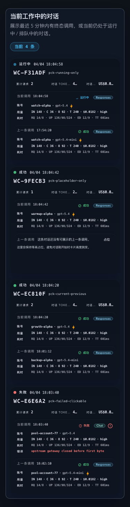
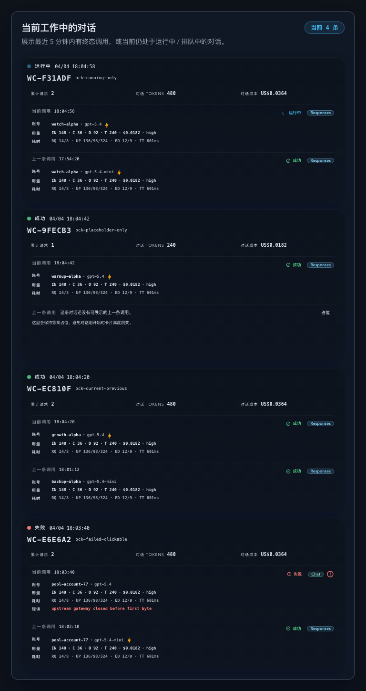
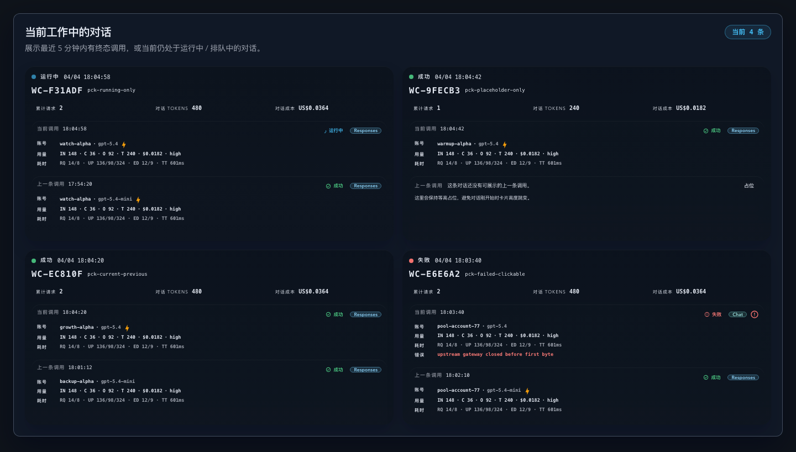
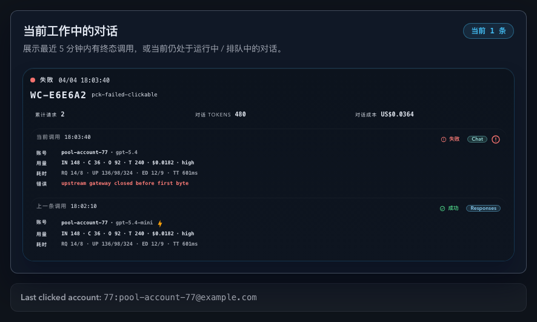

# Dashboard：工作中对话卡片替换（#w3t3w）

## 状态

- Status: 已完成（6/6）
- Created: 2026-04-04
- Last: 2026-04-05

## 背景 / 问题陈述

- Dashboard 底部目前仍展示“最近 20 条实况”表格，和页面其余总览卡片相比，信息组织更偏流水明细，不利于快速扫读“当前有哪些对话仍在工作中”。
- Live 页已经有按 `promptCacheKey` 聚合的对话数据链路，但 Dashboard 需要更窄的“当前工作中”定义：最近 5 分钟内有终态调用，或当前存在 `running/pending` 调用。
- 现有 Prompt Cache 对话接口只支持 `activityHours`，无法精确表达“5 分钟”窗口，也没有为 Dashboard 固化“recent terminal first / in-flight fallback”排序锚点。

## 目标 / 非目标

### Goals

- 将 Dashboard 底部“最近 20 条实况”替换为“当前工作中的对话”卡片区，默认最多展示 20 个对话。
- 扩展 `/api/stats/prompt-cache-conversations` 以支持 `activityMinutes=5`，并显式返回 Dashboard 所需的选择回显字段。
- 固化工作中对话定义与排序：最近终态优先，纯进行中对话按当前调用时间回退排序。
- 每张卡片展示稳定短序列号、当前调用、上一条调用，并在上一条缺失时保持等高占位。
- 复用现有调用展示语义与共享上游账号抽屉，不新增新的明细口径。
- 补齐 Storybook、Vitest、Spec `## Visual Evidence` 与 fast-track merge-ready 收口。

### Non-goals

- 不调整 Live 页现有筛选器、分页、搜索或历史管理交互。
- 不修改 SSE 事件协议、数据库表结构或其它页面的调用记录展示方式。
- 不做全站字体、主题变量或导航层级重构；`ui-ux-pro-max` 只作为 Dashboard 卡片区的局部视觉规则来源。

## 范围（Scope）

### In scope

- `src/api/mod.rs`：扩展 Prompt Cache 对话接口参数解析、缓存选择器和 Dashboard 工作中对话聚合 / 排序语义。
- `web/src/lib/api.ts`、`web/src/hooks/usePromptCacheConversations.ts`、`web/src/lib/promptCacheLive.ts`：支持分钟窗口、响应归一化与 Dashboard 消费。
- `web/src/pages/Dashboard.tsx`：移除 `InvocationTable` 区块，改接工作中对话卡片区。
- `web/src/components/**`：新增 Dashboard 工作中对话卡片区、卡片组件及其 Storybook 入口。
- `web/src/pages/Dashboard.test.tsx`、相关 hook / 组件测试、`src/tests/mod.rs`：补齐排序、占位、联动和 API 选择器回归。
- `docs/specs/README.md`：登记本 spec 并在交付完成后同步状态。

### Out of scope

- `web/src/pages/Live.tsx` 的现有对话筛选控件与表格布局。
- `src/main.rs` 之外的 SSE 事件载荷定义与数据库 migration。
- `InvocationTable` / `PromptCacheConversationTable` 现有页面行为重写。

## 验收标准（Acceptance Criteria）

- Given 打开 Dashboard，When 查看底部监控区，Then 原“最近 20 条实况”标题与表格不再出现，替换为“当前工作中的对话”卡片区。
- Given 当前工作中的对话卡片区，When 默认渲染，Then 最多展示 20 张卡片，并按最近终态调用时间降序排序；若对话仅有进行中调用，则按当前调用时间降序回退。
- Given 某对话只有当前调用，When 渲染卡片，Then “上一条调用”区域仍保留等高占位，卡片高度不因数据缺项变化。
- Given 某对话处于 `running/pending`，When 最近 5 分钟内没有终态调用，Then 该对话仍保留在 Dashboard 可见集合中。
- Given 某对话进入终态，When SSE / 刷新更新卡片，Then 当前调用与上一条调用切换正确，不重复、不串位、不闪跳。
- Given 卡片中存在可解析的上游账号，When 点击账号名称，Then 仍打开共享上游账号抽屉。
- Given 运行本次相关验证命令，When 执行 Rust / Vitest / build / Storybook build，Then 命令通过，或仅剩与本次无关的既有阻断被明确记录。

## 非功能性验收 / 质量门槛（Quality Gates）

### Visual / UX

- 卡片区遵循 `ui-ux-pro-max` 的 `real-time monitoring + dark OLED` 局部规则，但保留仓库既有 navy/cyan 监控语言。
- `running/pending/success/failed/warning` 状态不可只靠颜色表达，必须带文字或图标提示。
- hover / focus 仅允许颜色、阴影、边框等非布局位移反馈，并尊重 `prefers-reduced-motion`。
- 响应式在 `375 / 768 / 1024 / 1440` 下无横向滚动。

### Testing

- Rust targeted tests: `cargo test prompt_cache_conversation`
- Frontend targeted tests: `cd web && bunx vitest run src/pages/Dashboard.test.tsx src/hooks/usePromptCacheConversations.test.tsx`
- Storybook build: `cd web && bun run storybook:build`

### Quality checks

- `cargo test`
- `cd web && bunx vitest run`
- `cd web && bun run build`
- `cd web && bun run storybook:build`

## 文档更新（Docs to Update）

- `docs/specs/README.md`
- `docs/specs/w3t3w-dashboard-working-conversations-cards/SPEC.md`

## 实现里程碑（Milestones / Delivery checklist）

- [x] M1: 新建 spec 并登记 `docs/specs/README.md`。
- [x] M2: Prompt Cache 对话接口支持 `activityMinutes=5` 与 Dashboard 工作中对话排序语义。
- [x] M3: Dashboard 工作中对话 mapper 与卡片区替换现有 `InvocationTable`。
- [x] M4: Storybook 稳定入口覆盖四种关键状态，并作为视觉证据源。
- [x] M5: Rust / Vitest / build / Storybook build 完成，视觉证据写入 spec。
- [x] M6: fast-track 推进到 PR merge-ready，并按授权完成 merge + cleanup。

## 方案概述（Approach, high-level）

- 以后端 Prompt Cache 对话接口作为单一数据源，新增分钟窗口参数与 Dashboard 专用可见性 / 排序锚点，而不是在前端拼装“工作中”集合。
- 前端新增轻量 mapper，把接口返回的对话预览收敛成 `WC-<short-hash>` 稳定短号、当前调用 / 上一条调用双槽模型与展示状态。
- 卡片布局采用高扫描密度监控卡：顶部序列号 + 状态，中央双槽调用摘要，底部补充指标；上一条调用缺失时使用弱化占位而不是条件消失。
- Storybook 采用 mock 数据覆盖“完整双槽 / 缺上一条 / running-only / 失败态 + 可点账号”四个主状态，作为本轮唯一视觉证据源。

## 风险 / 开放问题 / 假设（Risks, Open Questions, Assumptions）

- 风险：若把排序锚点留给前端 SSE 合并层决定，可能导致终态切换瞬间顺序漂移；本轮优先在接口层明确排序字段来源。
- 风险：稳定短号若只依赖可见集合位置，会在刷新时漂移；本轮固定基于规范化 `promptCacheKey` 派生。
- 假设：Dashboard 继续按 `promptCacheKey` 聚合，不改为 `invokeId` 或 sticky key。
- 假设：Live 页仍只保留小时级 activity 选项，本轮不暴露 5 分钟选择器。
- 假设：视觉证据全部使用 Storybook mock 数据，不截取真实线上数据。

## Visual Evidence

- Storybook Canvas `dashboard-workingconversationssection--state-gallery`，视口 `375x900`，验证移动端单列布局与卡片高度不超过宽度。

  

- Storybook Canvas `dashboard-workingconversationssection--state-gallery`，视口 `768x900`，验证中等视口下单列卡片密度与摘要层级。

  

- Storybook Canvas `dashboard-workingconversationssection--state-gallery`，视口 `1440x980`，验证大视口总览下的多卡并排展示。

  

- Storybook Canvas `dashboard-workingconversationssection--failed-with-clickable-account`，视口 `900x900`，验证失败态卡片、账号交互入口与紧凑调用记录布局。

  
