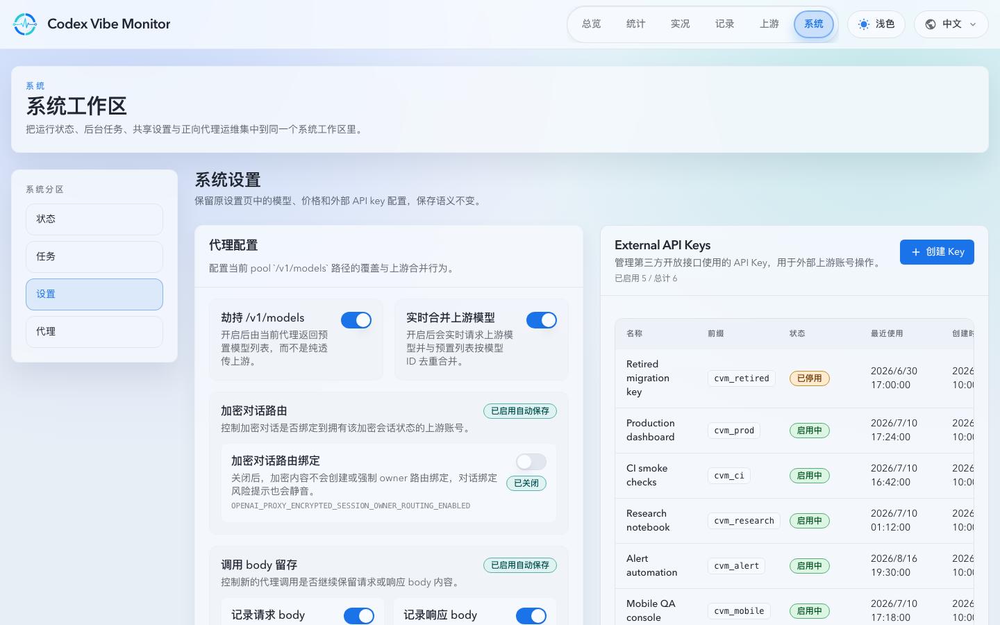
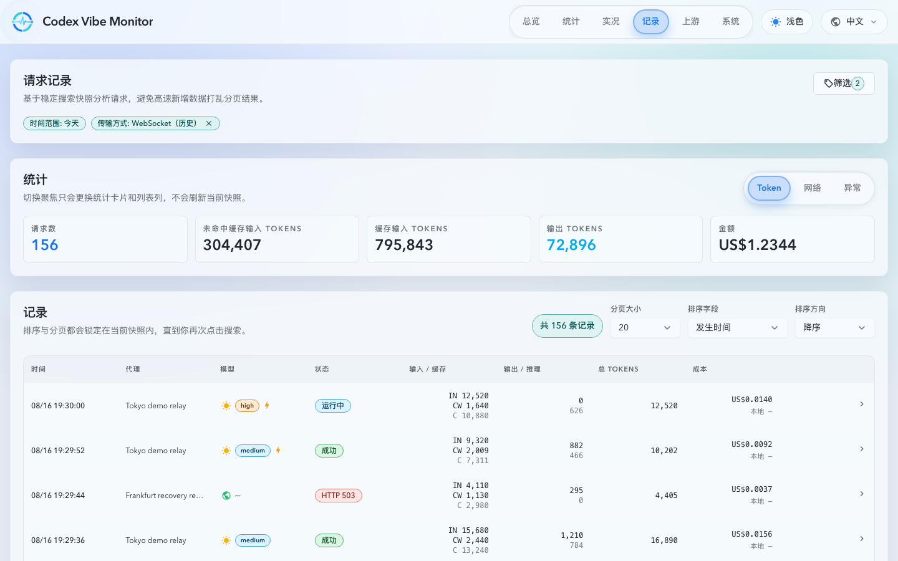
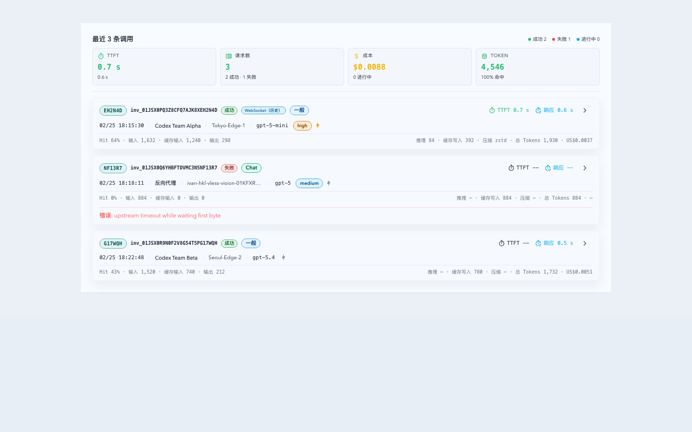

# OpenAI 兼容 WebSocket 代理（#w5s2x）

Spec ID: w5s2x

## 状态

- Status: retired
- Retired: 2026-09-28
- Decision: [ADR 0020: Retire downstream WebSocket proxy support](../../adr/0020-retire-downstream-websocket-proxy.md)

本文保留该主题的长期边界和历史数据契约，不再定义一个 active WebSocket
实现。退役前的完整协议与实现事实保留在
[`docs/archive/specs/w5s2x-openai-websocket-proxy/`](../../archive/specs/w5s2x-openai-websocket-proxy/)，
演进记录见 [`HISTORY.md`](./HISTORY.md)。

## Retired live contract

- `/v1/*` 不再接受下游 WebSocket upgrade，也不再连接上游 `ws`/`wss` endpoint。
- WebSocket upgrade 请求在鉴权、账号路由、上游选择、调用持久化和重试之前被拒绝。
- 拒绝响应使用 HTTP `501` 和现有 JSON envelope：

  ```json
  {"error":"WebSocket proxy support has been removed","code":"websocket_proxy_removed"}
  ```

- 拒绝不生成 `cvmId`、`x-cvm-invoke-id`、Invocation 或 Upstream Attempt；只写入不含 payload、API Key 和账号标识的结构化拒绝遥测。
- 普通 HTTP、HTTP streaming、SSE 和与传输无关的上游网络统计不受该退役边界改变。
- 不存在从 WebSocket upgrade 到普通 HTTP 请求的隐式 fallback。

## Configuration and implementation removal

- 删除 downstream/upstream WebSocket 设置、环境变量、Settings API 字段、Settings UI 控件和 TypeScript 合同；旧 update 请求中的字段可被忽略，新 response 不再返回这些字段。
- 删除 WebSocket relay、上游 WebSocket dialer、WebSocket 专属 failover/capability/usage-refresh 逻辑、Axum `ws` feature 及直接 WebSocket 依赖。
- 保留 HTTP 使用的 socket byte meter、通用网络统计和历史记录读模型。
- 不再创建、学习、确保或展示 `unsupported_transport:websocket` / `不支持 WS` 系统 tag。

## Durable-state contract

- 保留 `proxy_model_settings` 中两个旧 WebSocket 设置列与 `websocket_settings_migrated`，但它们是 inert legacy state，不再是运行时能力真值，也不执行 `DROP COLUMN`。
- 新增命名迁移 `retire_openai_websocket_proxy_v1`，在单事务中将两个旧设置置为 `false`、标记旧初始化完成、从 OAuth 登录会话的标签 JSON 中删除精确 WebSocket 标签 ID、删除精确 WebSocket unsupported tag 的账号关联和 tag 行，再写入迁移完成标记。
- 迁移必须幂等、可重入、失败整体回滚，并只报告脱敏影响计数；不修改其他 tag、历史调用、归档或网络统计。
- 迁移完成后删除旧启动初始化与 tag ensure 路径，避免新版本重新创建退役状态。

## Historical read contract

- 历史 invocation/archive 中的 `transport = "websocket"` 继续可读、可筛选、可序列化。
- 历史记录的用户可见协议标签为 `WebSocket（历史）`，避免暗示当前仍支持 WebSocket。
- 不再产生新的 WebSocket invocation、usage refresh/backfill 或 capability 记录。

## Rollback and release impact

- 迁移只前进，不提供自动逆迁移。旧版本可以读取保留的 schema，但回退不会自动恢复 WebSocket 行为；需要显式使用旧版本 API 重新启用，或恢复迁移前数据库备份。
- `public_api = major`；`persistent_state = minor`；发布单元最高影响为 `major`。详细记录见 `assets/version-impact-record.json` 和 `assets/persistent-state-migration-record.json`。

## Visual Evidence

- `Storybook覆盖=通过`；页面证据来自 `ui_demo`，transport chip 证据来自 `storybook_canvas`。
- Settings 页面移除 WebSocket 控件：
- Records 页面保留历史筛选：
- 历史 transport chip 显示 `WebSocket（历史）`：
- `requested_viewport=1440x900`；页面截图与组件截图均无需裁剪，聊天快照已写入 Codex user-inline-assets。

## Related ADRs

- [ADR 0020: Retire downstream WebSocket proxy support](../../adr/0020-retire-downstream-websocket-proxy.md)
