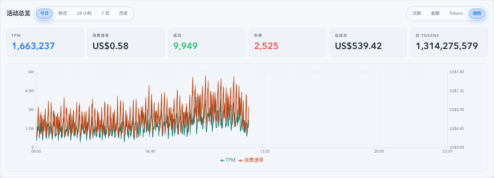
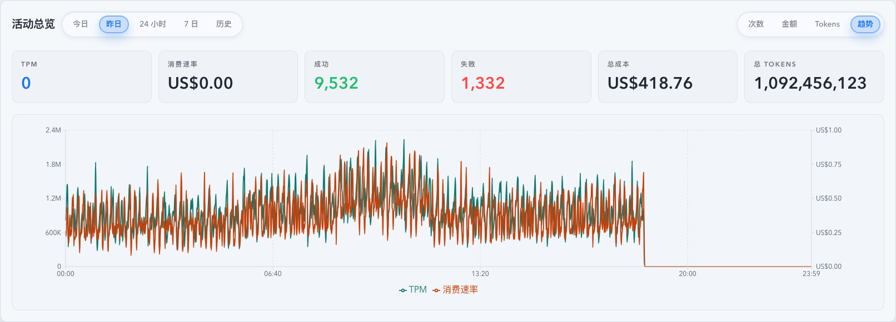
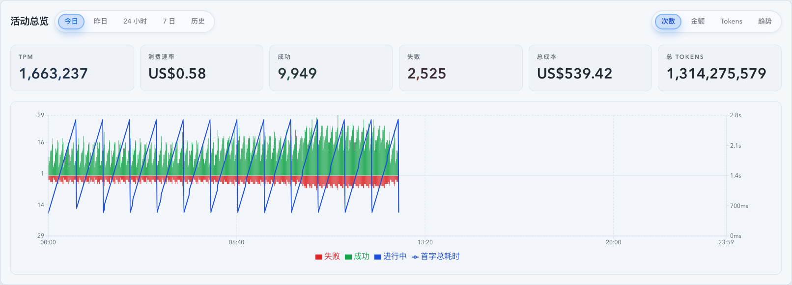

# Dashboard 活动总览自然日趋势增强（#xavhv）

> 当前有效规范以本文为准；实现覆盖与当前状态见 `./IMPLEMENTATION.md`，关键演进原因见 `./HISTORY.md`。

## 背景 / 问题陈述

- 活动总览的 `今日 / 昨日` 自然日分钟图已经覆盖次数、金额与 Tokens，但缺少同屏查看 1 分钟吞吐与消费速率走势的入口。
- 现有 KPI 曾使用金额每分钟与 5m 均值口径，和主人最终确认的 `消费速率`、`1 分钟原值` 口径不一致。
- 次数图只展示成功、失败、进行中数量，无法在活动峰值里直接关联 `首字总耗时` 的分钟级变化。

## 目标 / 非目标

### Goals

- 在活动总览 `今日 / 昨日` 的图表类型切换中新增 `趋势`。
- `趋势` 图同屏展示 1 分钟原值 `TPM` 与 `消费速率`。
- 将 owner-facing 消费速度文案统一改为 `消费速率`；英文采用 `Spend rate`。
- 在 `次数` 图保留成功、失败、进行中柱状结构，并叠加 1 分钟 `首字总耗时` 曲线。
- 为 Dashboard 活动总览更新 Storybook、Vitest 与视觉证据。

### Non-goals

- 不新增后端 API、数据库 schema 或统计口径迁移。
- 不改变 `24 小时 / 7 日 / 历史` 的图表类型集合；这些范围仍仅显示 `次数 / 金额 / Tokens`。
- 不额外做 5m/15m 平滑或移动平均。

## 范围（Scope）

### In scope

- `web/src/components/DashboardActivityOverview.tsx`
- `web/src/components/DashboardTodayActivityChart.tsx`
- `web/src/components/dashboardTodayActivityChartData.ts`
- `web/src/components/TodayStatsOverview.tsx`
- `web/src/components/DashboardActivityOverview.stories.tsx`
- 相关 Vitest、i18n 与本 spec 视觉证据。

### Out of scope

- Rust 后端 timeseries 聚合实现。
- SQLite schema 与历史 rollup 数据迁移。
- Stats 页已有趋势图与成功/失败图。

## 需求（Requirements）

### MUST

- `今日 / 昨日` 的右侧切换包含 `次数 / 金额 / Tokens / 趋势`。
- `24 小时 / 7 日 / 历史` 的右侧切换不显示 `趋势`。
- `今日` 与 `昨日` 各自独立记忆自己的图表类型，且 `趋势` 不污染其它范围的 metric memory。
- `趋势` 图展示每分钟原值 `TPM = totalTokens` 与 `消费速率 = totalCost`，未来分钟保持 `null` 不渲染。
- `次数` 图叠加 `firstResponseByteTotalAvgMs` 的分钟原值曲线；无样本分钟不渲染该点。
- KPI、tooltip 与测试语义中不再出现旧的金额每分钟命名。

### SHOULD

- 图表根节点继续暴露 `data-chart-mode` 与 `data-chart-metric`，方便 Storybook play 与 Vitest 稳定断言。
- Storybook mock 数据应包含 `firstResponseByteTotalAvgMs`，使首字总耗时曲线有可控视觉输入。

### COULD

- 后续可以把 `Trend` 图拆出独立组件，但本次优先保持现有自然日图表组件边界。

## 功能与行为规格（Functional/Behavior Spec）

### Core flows

- 用户打开活动总览 `今日` 或 `昨日` 后，可以在右侧切换到 `趋势`。
- `趋势` 图以同一时间轴渲染 `TPM` 与 `消费速率` 两条线，tooltip 展示时间、TPM 与消费速率。
- 用户切回 `次数` 时，成功、失败、进行中仍按柱状显示，同时显示 `首字总耗时` 曲线，tooltip 增加对应行。
- 用户切到 `24 小时 / 7 日 / 历史` 后，`趋势` 选项消失，当前范围继续使用自身已记忆的 `次数 / 金额 / Tokens`。

### Edge cases / errors

- 未来分钟的 `TPM`、`消费速率` 与 `首字总耗时` 图表值均为 `null`，避免把未来空桶画成 0。
- `firstResponseByteTotalSampleCount=0` 或均值为空时，次数图不连接该分钟的首字总耗时曲线。
- timeseries loading/error 继续沿用现有自然日图表降级行为。

## 接口契约（Interfaces & Contracts）

### 接口清单（Inventory）

| 接口（Name）                     | 类型（Kind）      | 范围（Scope） | 变更（Change） | 契约文档（Contract Doc） | 负责人（Owner） | 使用方（Consumers）                                          | 备注（Notes） |
| -------------------------------- | ----------------- | ------------- | -------------- | ------------------------ | --------------- | ------------------------------------------------------------ | ------------- |
| Dashboard natural-day chart mode | ui-component-prop | internal      | Modify         | None                     | web/dashboard   | `DashboardActivityOverview` -> `DashboardTodayActivityChart` | `MetricKey    |

### 契约文档（按 Kind 拆分）

- None

## 验收标准（Acceptance Criteria）

- Given 当前范围为 `今日` 或 `昨日`, When 查看图表类型切换, Then 可以看到 `趋势`。
- Given 当前范围为 `24 小时 / 7 日 / 历史`, When 查看图表类型切换, Then 不出现 `趋势`。
- Given `趋势` 已选中, When timeseries 返回 1 分钟点, Then 图表显示 TPM 与消费速率两条 1 分钟原值曲线。
- Given `次数` 已选中且 timeseries 返回首字总耗时样本, When 渲染图表, Then 成功/失败/进行中柱状结构保留，并叠加首字总耗时曲线。
- Given KPI 与 tooltip 文案渲染完成, Then 不出现旧的金额每分钟命名，中文固定使用 `消费速率`。

## 验收清单（Acceptance checklist）

- [x] 核心路径的长期行为已被明确描述。
- [x] 关键边界/错误场景已被覆盖。
- [x] 涉及的接口/契约已写清楚或明确为 `None`。
- [x] 相关验收条件已经可以用于实现与 review 对齐。

## 非功能性验收 / 质量门槛（Quality Gates）

### Testing

- Unit tests: `cd web && bunx vitest run src/components/DashboardTodayActivityChart.test.tsx src/components/DashboardActivityOverview.test.tsx src/components/TodayStatsOverview.test.tsx`
- Integration tests: Storybook `play` 覆盖今日趋势、昨日趋势、次数图首字总耗时输入、非自然日隐藏趋势。

### UI / Storybook (if applicable)

- Stories to add/update: `web/src/components/DashboardActivityOverview.stories.tsx`
- Docs pages / state galleries to add/update: 复用 CSF autodocs。
- `play` / interaction coverage to add/update: `TodayTrend`、`YesterdayTrend`、`CountWithFirstResponseByteTotal`、非自然日隐藏趋势断言。
- Visual regression baseline changes (if any): 以本 spec `## Visual Evidence` 为准。

### Quality checks

- `cd web && bunx vitest run src/components/DashboardTodayActivityChart.test.tsx src/components/DashboardActivityOverview.test.tsx src/components/TodayStatsOverview.test.tsx`
- `cd web && bun run build`
- `cd web && bun run build-storybook`

## Visual Evidence

- source_type: storybook_canvas
  target_program: mock-only
  capture_scope: element
  requested_viewport: desktop1660
  viewport_strategy: storybook-viewport
  sensitive_exclusion: N/A
  submission_gate: approved
  story_id_or_title: `dashboard-dashboardactivityoverview--today-trend`
  state: today trend
  evidence_note: 证明 `今日` 支持 `趋势` 图，并以 1 分钟原值同屏渲染 `TPM` 与 `消费速率`。
  image:
  

- source_type: storybook_canvas
  target_program: mock-only
  capture_scope: element
  requested_viewport: desktop1660
  viewport_strategy: storybook-viewport
  sensitive_exclusion: N/A
  submission_gate: approved
  story_id_or_title: `dashboard-dashboardactivityoverview--yesterday-trend`
  state: yesterday trend
  evidence_note: 证明 `昨日` 同样支持自然日 `趋势` 图，且闭合自然日范围可以渲染完整分钟走势。
  image:
  

- source_type: storybook_canvas
  target_program: mock-only
  capture_scope: element
  requested_viewport: desktop1660
  viewport_strategy: storybook-viewport
  sensitive_exclusion: N/A
  submission_gate: approved
  story_id_or_title: `dashboard-dashboardactivityoverview--count-with-first-response-byte-total`
  state: count with first byte total
  evidence_note: 证明 `次数` 图保留成功/失败/进行中柱状结构，并叠加 `首字总耗时` 曲线输入。
  image:
  

## Related PRs

- None

## 风险 / 开放问题 / 假设（Risks, Open Questions, Assumptions）

- 风险：双 Y 轴趋势图可能被误读为同量纲；通过 legend 与 tooltip 明确 `TPM` 与 `消费速率`。
- 风险：次数图叠加首字总耗时后图例拥挤；保持点隐藏与单条线，减少视觉负担。
- 假设：`/api/stats/timeseries` 已返回 `firstResponseByteTotalAvgMs` 与 `firstResponseByteTotalSampleCount`。

## 参考（References）

- `docs/specs/r99mz-dashboard-today-activity-overview/SPEC.md`
- `docs/specs/2qsev-dashboard-tpm-cost-per-minute-kpi/SPEC.md`
- `docs/specs/x2s4h-stats-first-response-byte-total-p95/SPEC.md`
