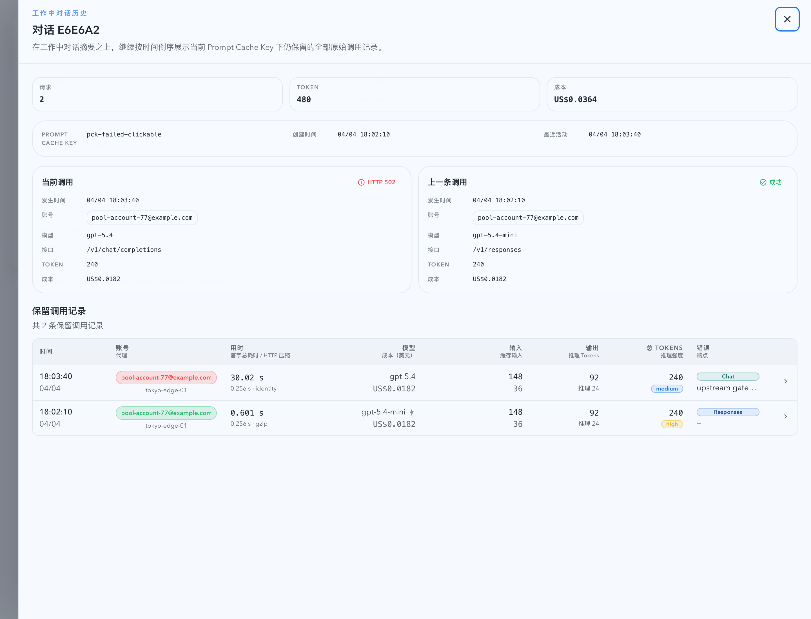
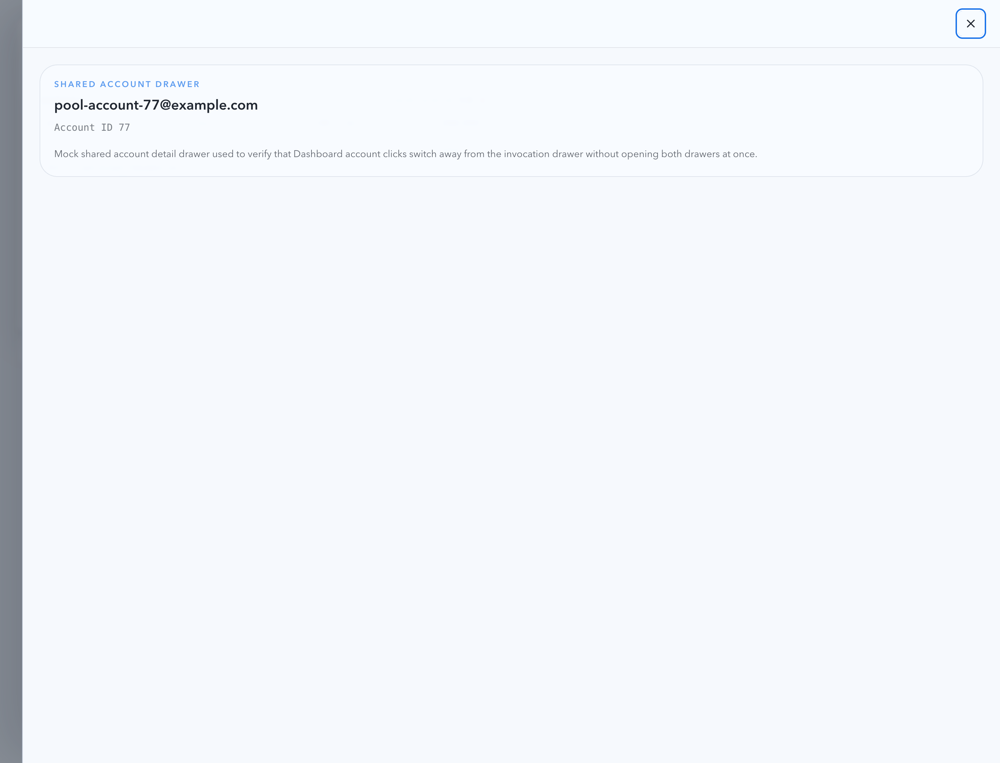

# Dashboard 工作中对话：序列号打开对话信息 / 调用记录抽屉（#y372p）

## 状态

- Status: 已实现，待 PR / CI / review-proof 收敛
- Created: 2026-04-19
- Last: 2026-04-19

## 背景 / 问题陈述

- Dashboard 的“当前工作中的对话”卡片已经提供当前 / 上一条调用槽位，但卡片头部的对话序列号仍然只是静态文本，无法直接进入该对话的完整上下文。
- Live 页已经存在基于 `promptCacheKey` 的保留调用历史抽屉与 SSE 增量补齐逻辑；Dashboard 缺少等价入口，导致用户需要切换页面才能查看同一对话的完整保留调用记录。
- 本轮 follow-up 需要把“对话级摘要 + 完整调用记录”收敛到 Dashboard 右侧抽屉，同时保持已有 invocation drawer / shared account drawer 的交互语义不被稀释。

## 目标 / 非目标

### Goals

- 仅把 Dashboard 工作中对话卡片左上角序列号 / 哈希标签做成可聚焦按钮，点击后打开新的“对话详情抽屉”。
- 抽屉顶部展示稳定对话摘要：序列号、Prompt Cache Key、请求数、总 Token、总成本、创建时间、最近活动时间，以及当前 / 上一条调用摘要。
- 抽屉正文复用现有 `promptCacheKey` 历史查询链路，按 `occurredAt DESC` 自动拉满所有保留调用记录，并继续接收 SSE 增量更新。
- Dashboard 页同一时刻只允许一个右侧抽屉：conversation / invocation / shared account 三者互斥切换。
- 补齐 Storybook、Vitest、视觉证据与 spec，同步收口到 fast-track 的 PR ready。

### Non-goals

- 不改变当前 / 上一条调用槽位打开 invocation drawer 的既有交互。
- 不修改共享上游账号抽屉字段、路由参数或 URL 结构。
- 不新增后端接口、数据库 schema、持久化选择态或新的 Dashboard 路由。
- 不重写 Live 页 Prompt Cache 对话表的既有外部语义。

## 范围（Scope）

### In scope

- `web/src/components/DashboardWorkingConversationsSection.tsx`：序列号按钮化、新增 `onOpenConversation` 回调。
- `web/src/lib/dashboardWorkingConversations.ts`：新增 Dashboard 对话选择态，保证抽屉打开后摘要不依赖当前 working-set 是否仍包含该卡片。
- `web/src/components/prompt-cache-conversation-history-shared.tsx`：抽取 Prompt Cache 历史抽屉的共享 loading / 分页 / SSE 合并逻辑与表格壳层。
- `web/src/components/PromptCacheConversationHistoryDrawer.tsx`：承接 Live 页历史抽屉，复用共享逻辑且保持原行为。
- `web/src/components/DashboardConversationDetailDrawer.tsx` 与 `web/src/pages/Dashboard.tsx`：实现 Dashboard 专用对话抽屉，并与 invocation/account 抽屉做单实例协调。
- `web/src/i18n/translations.ts`、相关 Vitest、Storybook 与本 spec：补齐文案、验证与视觉证据。

### Out of scope

- `web/src/components/DashboardInvocationDetailDrawer.tsx` 的调用详情语义与异常详情接口。
- `web/src/pages/Live.tsx` 的筛选模式、统计口径与 Prompt Cache 表布局。
- 任何新的后端查询参数、分页策略或 SSE 事件类型。

## 需求（Requirements）

### MUST

- 只有卡片左上角序列号 / 哈希按钮能打开新对话抽屉；其余 header 文本与汇总指标保持只读。
- 点击当前 / 上一条调用槽位时，仍然打开 invocation drawer，而不是对话抽屉。
- 对话抽屉 header 必须至少展示：序列号、Prompt Cache Key、请求数、总 Token、总成本、创建时间、最近活动时间。
- 对话抽屉正文必须展示该 `promptCacheKey` 的完整保留调用记录，并按 `occurredAt DESC` 自动翻页直至拉满。
- 抽屉打开期间若 SSE 推来同一 `promptCacheKey` 的新记录，列表必须先乐观并入，再按节流 resync 对账。
- Dashboard 页面任意时刻只允许存在一个右侧抽屉；打开 conversation / invocation / account 任一入口都会关闭其余抽屉。

### SHOULD

- Dashboard 对话抽屉应保留当前 / 上一条调用的紧凑摘要卡，以便用户不离开 Dashboard 就能对照当前 working 状态与完整历史。
- Live 页原有 Prompt Cache 历史抽屉应继续使用同一底层共享逻辑，避免分叉出第二套分页 / SSE 状态机。
- Storybook 入口应使用 mock-only 数据源，确保视觉证据可重复生成。

## 功能与行为规格（Functional / Behavior Spec）

### Core flows

- 用户点击 Dashboard 工作中对话卡片左上角序列号时，右侧打开对话详情抽屉；摘要区先展示冻结的卡片信息，随后历史区自动拉取并呈现该 `promptCacheKey` 的完整保留调用记录。
- 用户点击当前 / 上一条调用槽位时，右侧继续打开 invocation drawer；若此时对话抽屉或账号抽屉已打开，则先关闭其它抽屉再切换到 invocation drawer。
- 用户点击卡片槽位内账号、历史记录表中的账号，或对话摘要卡中的账号时，页面直接切换到共享账号抽屉，并关闭其它右侧抽屉。
- 若该对话后续滑出 5 分钟 working-set，已打开的对话抽屉仍保留原选择态和摘要信息，直到用户主动关闭。

### Edge cases / errors

- 若历史查询返回 0 条记录，对话抽屉摘要仍保留，正文显示明确 empty state。
- 若某页历史请求失败，抽屉保留已加载记录，并展示错误提示而不清空现有表格。
- 若 SSE 推送的 optimistic 记录随后被完整历史刷新覆盖，应去重并以最终记录为准。
- 若对话只有当前调用，没有上一条调用，摘要区应展示稳定占位文案，而不是留空或塌高。

## 接口契约（Interfaces & Contracts）

| 接口（Name） | 类型（Kind） | 范围（Scope） | 变更（Change） | 备注（Notes） |
| --- | --- | --- | --- | --- |
| `GET /api/invocations?promptCacheKey=<key>` | HTTP API | internal | Reuse | 对话抽屉复用现有历史查询，按 `occurredAt DESC` 拉满 |
| `GET /api/invocations?requestId=<invokeId>` | HTTP API | internal | Reuse | 现有 invocation drawer 继续精确回查 full record |
| SSE `records` payload | SSE | internal | Reuse | 共享历史 hook 继续基于 `promptCacheKey` 做 optimistic merge |
| `/api/pool/upstream-accounts/:id` | HTTP API | internal | Reuse | 历史表 / 摘要卡账号点击继续走共享账号抽屉 |

## 验收标准（Acceptance Criteria）

- Given Dashboard 工作中对话卡片已渲染，When 用户点击左上角序列号按钮，Then 当前页右侧打开新的对话详情抽屉，并显示序列号、Prompt Cache Key、请求数、总 Token、总成本、创建时间与最近活动时间。
- Given 同一卡片的当前 / 上一条调用槽位存在，When 用户点击槽位，Then 仍然打开 invocation drawer，且不会误触发对话抽屉。
- Given 对话详情抽屉已打开，When 历史查询跨多页或后续 SSE 推送新记录，Then 调用记录列表会自动补齐并去重，最终仍按 `occurredAt DESC` 展示完整保留记录。
- Given Dashboard 已打开任一种右侧抽屉，When 用户再打开另一种抽屉入口，Then 页面始终只保留一个右侧抽屉。
- Given 历史原始记录已经被裁剪，When 对话详情抽屉渲染，Then 摘要仍在，正文显示“暂无可回放的调用记录”空态。

## 非功能性验收 / 质量门槛（Quality Gates）

### Testing

- `cd /Users/ivan/.codex/worktrees/4fa1/codex-vibe-monitor/web && bunx vitest run src/components/DashboardWorkingConversationsSection.test.tsx src/components/DashboardInvocationDetailDrawer.test.tsx src/pages/Dashboard.test.tsx src/components/PromptCacheConversationTable.test.tsx`
- `cd /Users/ivan/.codex/worktrees/4fa1/codex-vibe-monitor/web && bun run build`
- `cd /Users/ivan/.codex/worktrees/4fa1/codex-vibe-monitor/web && bun run storybook:build`

### UI / Storybook

- Stories to add/update: `web/src/components/DashboardWorkingConversationsSection.stories.tsx`
- Mock-only coverage: sequence label 打开 conversation drawer、slot 继续打开 invocation drawer、account 点击切换 shared account drawer

## 文档更新（Docs to Update）

- `docs/specs/README.md`
- `docs/specs/y372p-dashboard-working-conversation-history-drawer/SPEC.md`

## 计划资产（Plan assets）

- Directory: `docs/specs/y372p-dashboard-working-conversation-history-drawer/assets/`
- In-plan references:
  - ``
  - ``

## Visual Evidence

- Storybook Canvas `dashboard-workingconversationssection--conversation-drawer-open`：验证序列号按钮会打开新的对话详情抽屉，并展示稳定摘要 + 保留调用记录。

  

- Storybook Canvas `dashboard-workingconversationssection--drawer-interaction-flow`：验证 slot 仍打开 invocation drawer，且账号点击会切换到 shared account drawer，始终保持单右抽屉语义。

  

## 实现里程碑（Milestones / Delivery checklist）

- [x] M1: 新建 follow-up spec，并登记 `docs/specs/README.md`。
- [x] M2: 抽取 Prompt Cache 历史抽屉共享逻辑，并让 Live / Dashboard 共用同一套 loading + SSE 语义。
- [x] M3: Dashboard 工作中对话卡片接入序列号按钮、页面级三抽屉互斥状态与新对话抽屉。
- [x] M4: 补齐 Vitest / Storybook / build 验证，并生成视觉证据收口到 PR ready。

## 方案概述（Approach, high-level）

- 先把 Live 页 Prompt Cache 历史抽屉的自动翻页、SSE optimistic merge、节流 resync 与表格外壳抽到共享 hook / helper 中；Live 页继续走原来的历史抽屉 UI，Dashboard 则在同一底层之上叠加摘要区。
- Dashboard 卡片只让序列号按钮触发新抽屉，保持调用槽与账号入口的原始优先级，避免把整张卡片变成多义点击区域。
- Dashboard 页层统一持有 `selectedConversation`、`selectedInvocation` 与 `upstreamAccountId`，通过互斥更新保证任意时刻只有一个抽屉打开。
- 视觉证据全部来自 Storybook mock-only 场景，避免依赖真实服务状态。

## 风险 / 假设（Risks / Assumptions）

- 风险：如果对话摘要直接依赖当前 working-set 卡片对象，用户在抽屉打开后遇到 working-set 刷新时，抽屉头部信息会抖动或丢失；因此需要冻结选择态快照。
- 风险：如果 Dashboard 自己再实现一套历史分页 / SSE 合并逻辑，Live 与 Dashboard 很容易在空态、去重、分页错误处理上漂移。
- 假设：`promptCacheKey` 继续是对话级历史查询与 SSE 记录聚合的稳定 key。
- 假设：Dashboard 工作中对话卡片提供的 current / previous invocation preview 足以支撑抽屉摘要区，无需新增后端摘要接口。

## 参考（References）

- `docs/specs/r4m6v-dashboard-working-conversations-invocation-drawer/SPEC.md`
- `docs/specs/3vm5e-live-prompt-cache-call-record-expansion/SPEC.md`
- `web/src/components/DashboardWorkingConversationsSection.tsx`
- `web/src/components/DashboardConversationDetailDrawer.tsx`
- `web/src/components/PromptCacheConversationHistoryDrawer.tsx`
- `web/src/components/prompt-cache-conversation-history-shared.tsx`
- `web/src/pages/Dashboard.tsx`
