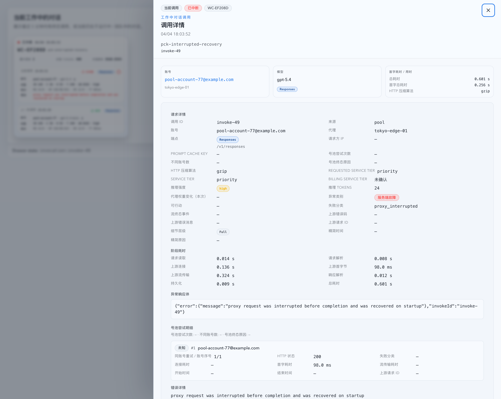

# 运行中调用主记录实时落库与中断恢复修复（#yf3s3）

## 状态

- Status: 已完成
- Created: 2026-04-07
- Last: 2026-04-08

## 背景 / 问题陈述

- Dashboard 与 Live 已经会通过 SSE 展示运行中的调用，但这些运行态记录当前仍可能只是内存中的临时快照，而不是 `codex_invocations` 里的已提交主记录。
- `/api/invocations?requestId=<invokeId>` 只查询 `codex_invocations`；当运行态 SSE 已可见但主记录尚未持久化时，调用详情抽屉会出现“已能点击但查不到详情”的断裂体验。
- 进程异常退出或服务重启时，尚未终态落库的主调用记录无法保证恢复，这与“调用记录是核心功能”的要求冲突。

## 目标 / 非目标

### Goals

- 把“调用已出现在 SSE / Dashboard 上”与“主记录可立即查询、可在重启后恢复”收敛到同一个事实源：`codex_invocations`。
- 在生成 `invokeId` 并完成请求解析后，先插入一条 `running/pending` 主记录并提交，再广播记录级 SSE。
- 终态从“补插新行”改为“更新同一行”，保证同一 `invokeId + occurred_at` 只对应一条主记录。
- 启动时把残留 `running/pending` 主记录恢复成 `interrupted`，并与既有 pool attempt recovery 共同收敛。
- Web 侧显式支持 `interrupted` 状态展示，不再把它显示成 unknown。

### Non-goals

- 不新增新的对外 HTTP endpoint。
- 不通过前端轮询/重试或“伪详情”绕过后端事实源问题。
- 不延迟 SSE，也不降低当前实时性目标。
- 不改造 pool attempts 的既有表结构与在线读取协议。

## 范围（Scope）

### In scope

- `src/proxy.rs`：运行态主记录先落库、运行态增量更新、终态同 row finalize、启动恢复 helper。
- `src/runtime.rs`：启动恢复流程接入主调用记录 recovery。
- `src/main.rs`：新增 `interrupted` / `proxy_interrupted` 相关常量。
- `web/src/components/**`、`web/src/lib/**`、`web/src/pages/Records.tsx`、`web/src/i18n/translations.ts`：共享状态 badge / 文案 / filter 选项对齐。
- 相关 Rust/Vitest/Storybook 覆盖与视觉证据。
- `docs/specs/README.md` 与本 spec。

### Out of scope

- 新增 SSE event type 或新的 records 精确查询 API。
- 改写 Live Prompt Cache 对话表的交互模型。
- 引入新的数据库表或新的 URL 路由状态。

## 需求（Requirements）

### MUST

- 运行中调用一旦被 SSE 广播，`/api/invocations?requestId=<invokeId>` 必须立即可查到同一条主记录。
- 运行态主记录必须使用真实自增 `id`；禁止继续对外广播负数临时 ID 作为主调用记录。
- 终态持久化必须更新同一条已有主记录；数据库中不得出现第二条同 `invokeId + occurred_at` 主记录。
- 启动恢复必须把残留 `running/pending` 主记录收敛为：
  - `status = interrupted`
  - `failure_kind = proxy_interrupted`
  - `failure_class = service_failure`
  - `is_actionable = 1`
  - `error_message = "proxy request was interrupted before completion and was recovered on startup"`
- Web 侧必须显式展示 `interrupted` 状态，不得回退成 unknown。

### SHOULD

- 运行态增量更新仍然复用现有 `BroadcastPayload::Records`，但 payload 必须来自已提交 DB 行。
- 运行态与恢复态更新都应同步 hourly rollup / live progress，避免列表与统计口径分裂。
- 对 Prompt Cache conversation cache 的失效应继续保持最小必要粒度。

## 验收标准（Acceptance Criteria）

- Given 一条长时运行调用已在 SSE 中可见，When 立即按 `requestId=<invokeId>` 查询 `/api/invocations`，Then 返回 1 条 `status=running` 的主记录，且 `id > 0`。
- Given 同一条调用随后进入终态，When 再次查询该 `invokeId`，Then 返回的仍是同一个 `id`，只更新状态、错误与 timing 等字段，不新增第二条主记录。
- Given 服务在调用运行中异常退出，When 下次启动恢复完成，Then 残留主记录显示为 `interrupted / proxy_interrupted / service_failure / actionable`，并且 records 查询、requestId 精确查询与 rollup 统计一致。
- Given Dashboard 工作中对话卡片已经显示某条运行中调用，When 打开调用详情抽屉，Then 不再出现“调用记录不可用”空态。
- Given `interrupted` 记录出现在 Records、Dashboard 调用详情或工作中对话相关状态 badge 中，When 渲染 UI，Then 显示稳定的错误态 badge 与对应文案，而不是 raw unknown。

## 非功能性验收 / 质量门槛（Quality Gates）

### Backend

- Rust 测试覆盖：
  - 运行态主记录立即可查且为正数 `id`
  - 终态同 row finalize、不重复插入
  - 启动恢复 `running/pending -> interrupted`

### Web

- `cd web && bunx vitest run src/components/DashboardInvocationDetailDrawer.test.tsx src/components/InvocationRecordsTable.test.tsx src/pages/Dashboard.test.tsx`
- `cd web && bun run build`
- `cd web && bun run storybook:build`

## Visual Evidence

- source_type: storybook_canvas
- target_program: mock-only
- capture_scope: browser-viewport
- story_id_or_title: Dashboard/WorkingConversationsSection / InterruptedRecoveryDrawerOpen
- state: interrupted drawer open
- evidence_note: 证明 Dashboard 工作中对话里的中断调用已经能直接打开详情抽屉，并显示 `interrupted / proxy_interrupted`，不再落到“调用记录不可用”空态。

## 实现里程碑（Milestones / Delivery checklist）

- [x] M1: 新建增量 spec 并登记 `docs/specs/README.md`
- [x] M2: 后端主记录改为先插 running row，再以同 row finalize
- [x] M3: 启动恢复把残留 `running/pending` 主记录收敛为 `interrupted`
- [x] M4: Web 状态展示、测试、Storybook 与视觉证据补齐

## 方案概述（Approach, high-level）

- 把主调用记录与运行态 SSE 统一到 `codex_invocations`：运行态先插入最小主记录，后续运行态进度和终态都更新同一行。
- 运行态 SSE 广播不再把 `ProxyCaptureRecord` 转成临时负数 ID 的 `ApiInvocation`；而是回读刚提交的 DB 行再广播。
- 启动时补一段主记录恢复逻辑，和既有 orphaned pool attempt recovery 并行执行。
- 前端只做状态映射与验证补齐，不做额外重试兜底。

## 参考（References）

- `docs/specs/5932d-sse-proxy-live-sync/SPEC.md`
- `docs/specs/r4m6v-dashboard-working-conversations-invocation-drawer/SPEC.md`
- `docs/specs/h9r2m-permanent-online-hourly-rollups/SPEC.md`
- `src/proxy.rs`
- `src/runtime.rs`
- `src/api/mod.rs`
- `web/src/components/DashboardInvocationDetailDrawer.tsx`
