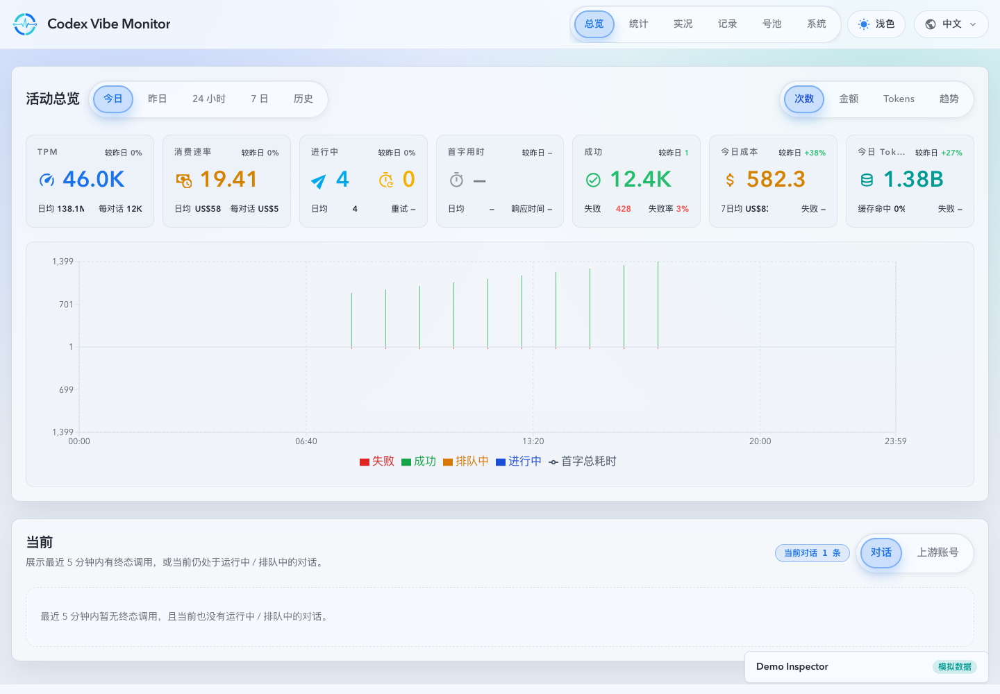
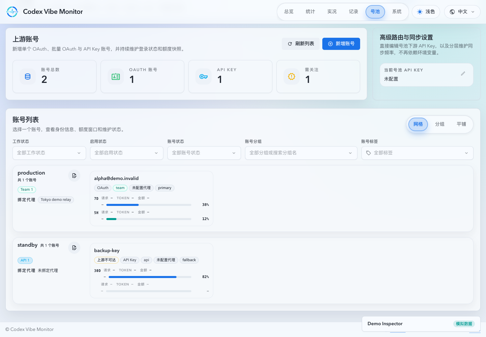
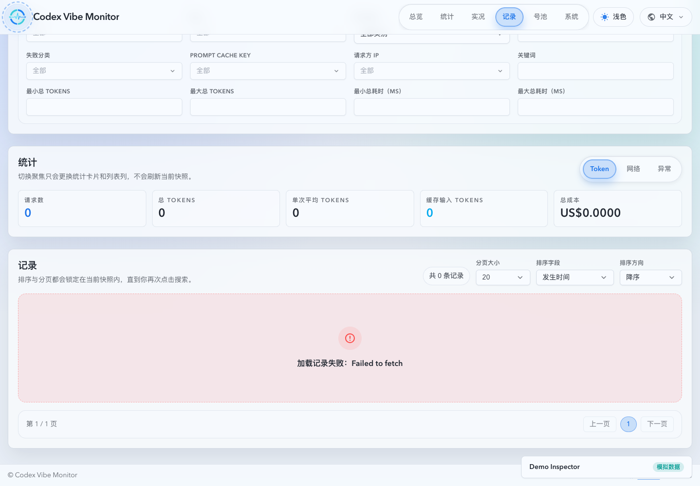
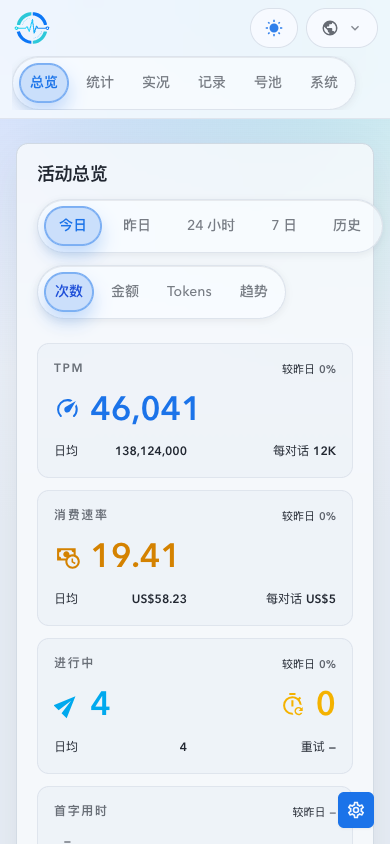
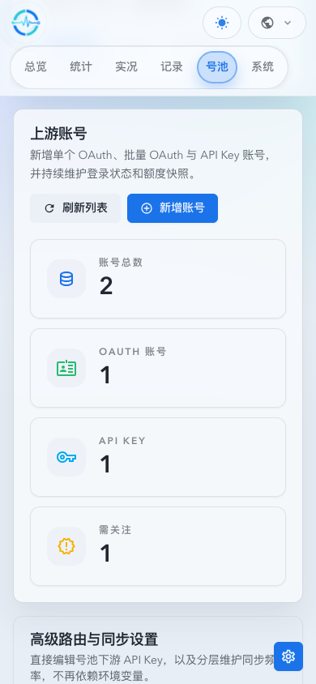
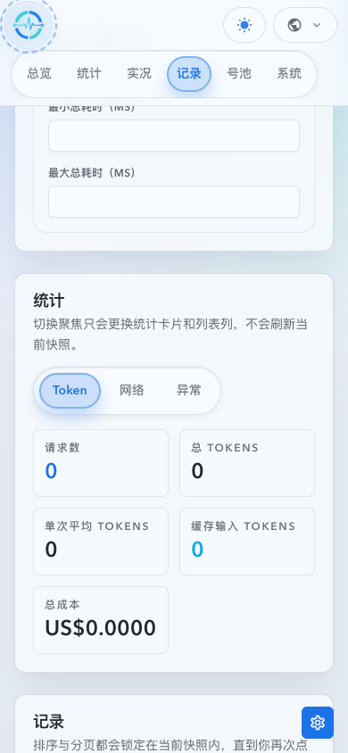

# 全产品路由 Web Demo（#ykhfu）

> 当前有效规范以本文为准；实现覆盖与当前状态见 `./IMPLEMENTATION.md`，关键演进原因见 `./HISTORY.md`。

## 背景 / 问题陈述

现有 Storybook 覆盖组件和页面片段，但不提供可通过正式应用路由体验完整产品流程的安全演示面。公开文档站已经承载 docs 和 Storybook，缺少一个不依赖真实代理、账号或数据库的全产品交互入口。

## 目标 / 非目标

### Goals

- 通过公开 GitHub Pages `/demo/` 提供复用正式 React App 与 HashRouter 路由树的 mock-only 演示面。
- 使用构建时 `VITE_APP_RUNTIME=demo` 启用 demo；路由与 URL 参数不得决定 live/demo 版本。
- 以虚构确定性数据覆盖正常、告警、空态和网络失败，并让安全写入在当前浏览器内存中即时回显。
- 为审查者提供不遮挡产品布局的 Inspector，用于场景、主题、故障、实时事件、reset 和分享链接。

### Non-goals

- 不修改 Rust API、SQLite、真实身份、OAuth、上游代理或生产账号数据。
- 不复制产品页面，也不把 Storybook 当作完整页面演示的替代品。
- 不把 demo runtime 做成可由 URL 路径、query 或公开环境变量连接真实服务的入口。

## 范围（Scope）

### In scope

- Dashboard、Stats、Live、Records、Account Pool、System 及其现有嵌套路由和 redirect。
- 浏览器端 MSW HTTP/SSE handlers、内存状态、模拟写入和虚构 fixtures。
- Pages 组装、公开 docs 导航、Inspector Storybook 覆盖，以及 mock-only UI evidence。

### Out of scope

- 后端端点或响应 schema 的改变。
- 真实 secret 的持久化、回显或网络传输。
- 新增独立 required CI check；demo E2E 进入现有 `Records Overlay E2E` job。

## 需求（Requirements）

### MUST

- `VITE_APP_RUNTIME` 只能接受 `live` 与 `demo`；默认 `live`，未知值必须在启动时失败。
- demo bootstrap 必须在 React render 前等待 MSW worker；失败时仅显示 demo 启动错误面，不能回退到真实请求。
- `VITE_DEPLOY_BASE` 仅控制 Vite assets 和 `mockServiceWorker.js` 的静态路径。
- demo 所有 API/SSE 由浏览器内 mock 提供；除了静态 assets，未处理请求必须失败，不能旁路到网络。
- 写操作只能更新内存 model，刷新或 Inspector reset 后恢复 scene seed；secret 类输入不得进入操作记录、URL、storage 或响应。
- Inspector scene/theme state 使用 HashRouter location search 的 `demoScene` / `demoTheme`，并保留当前正式 route。

### SHOULD

- Inspector 在宽屏为可收起浮层，在小屏为 drawer，复用现有组件、主题与无障碍语义。
- Demo fixtures 保持现有 API 类型和 Storybook 语义，特别是分段 hydrate 与 SSE 更新边界。

## 功能与行为规格（Functional/Behavior Spec）

### Core flows

- `/demo/` 打开为 demo runtime，并进入现有 `/dashboard` 默认 redirect。
- `operational`、`attention`、`empty`、`network-failure` 可在任一路由切换或通过分享链接恢复。
- Inspector 触发的模拟写入、实时事件和 reset 立即反映在正式产品组件中。

### Edge cases / errors

- MSW worker 注册失败、未知 runtime 值、未处理应用请求和 demo 内部异常必须显示安全错误面。
- OAuth、API key、代理 URL 等输入不进入 seed、URL、日志或持久化 storage；外部同步仅产生明确的 simulated 结果。
- 网络失败场景同时覆盖 API 和 SSE 的故障表达，不影响 live build。

## 接口契约（Interfaces & Contracts）

### 接口清单（Inventory）

| 接口（Name）       | 类型（Kind） | 范围（Scope） | 变更（Change） | 契约文档（Contract Doc） | 负责人（Owner） | 使用方（Consumers） | 备注（Notes）           |
| ------------------ | ------------ | ------------- | -------------- | ------------------------ | --------------- | ------------------- | ----------------------- |
| `VITE_APP_RUNTIME` | environment  | internal      | New            | None                     | web             | Vite bootstrap      | `live` or `demo` only   |
| `VITE_DEPLOY_BASE` | environment  | internal      | New            | None                     | web/pages       | Vite and MSW worker | static asset base only  |
| `demoScene`        | URL state    | internal      | New            | None                     | demo inspector  | demo routes         | does not select runtime |
| `demoTheme`        | URL state    | internal      | New            | None                     | demo inspector  | demo routes         | does not select runtime |

### 契约文档（按 Kind 拆分）

- None

## 验收标准（Acceptance Criteria）

- Given `VITE_APP_RUNTIME=demo`, when the application starts, then MSW is ready before React renders and no real backend is required.
- Given every official route and each supported scene, when navigation occurs, then the matching product page renders with deterministic mock data or intentional error state.
- Given a simulated write, when the user saves or changes state, then the formal UI reflects the change until reset without leaking the submitted secret.
- Given a Pages build, when the site is assembled, then `/demo/index.html`, demo assets and the MSW worker exist below the repository Pages base.

## 非功能性验收 / 质量门槛（Quality Gates）

### Testing

- Unit tests: runtime parsing, scene/model reset, redaction and route handlers.
- E2E tests: route matrix, Inspector sharing, simulated mutation and network failure inside the existing Playwright job.

### UI / Storybook (if applicable)

- Stories to add/update: `DemoInspector` fragment states.
- Docs pages / state galleries to add/update: Inspector autodocs gallery.
- `play` / interaction coverage to add/update: scene switch, reset and collapsed state.
- Visual regression baseline changes (if any): final full-page evidence comes from `ui_demo`.

### Quality checks

- `bun run lint`, `bun run test`, `bun run test-storybook`, demo build, Storybook build and Pages assembly smoke.

## Visual Evidence

- Evidence source: `ui_demo` mock-only runtime at `VITE_APP_RUNTIME=demo`; no login, real backend, account, secret or external service was used.
- Bound source revision: `8b0aa929b9738fd0d535784e4b89c75ce54e28ae`.
- Viewports: desktop `1440x1000`; mobile `390x844`. Chrome Control and its DevTools viewport endpoint were unavailable, so the isolated local renderer used the assembled Pages demo at its repository subpath for the final responsive captures.
- Edge whitespace normalization: checked; retained the original bounds because the gradient page edge did not provide an unambiguous removable border.

### Desktop

### Mobile

## Related PRs

- [#582 feat(web): add mock-only product demo](https://github.com/IvanLi-CN/codex-vibe-monitor/pull/582)

## 风险 / 开放问题 / 假设（Risks, Open Questions, Assumptions）

- Pages is public, so demo data is permanently fictional and deterministic.
- Existing production API contracts remain the source of truth for handler compatibility.

## 参考（References）

- `docs/solutions/performance/rollup-first-upstream-account-usage.md`
- `docs/solutions/workflow/list-body-state-contract.md`
- `docs-site/docs/development.md`
