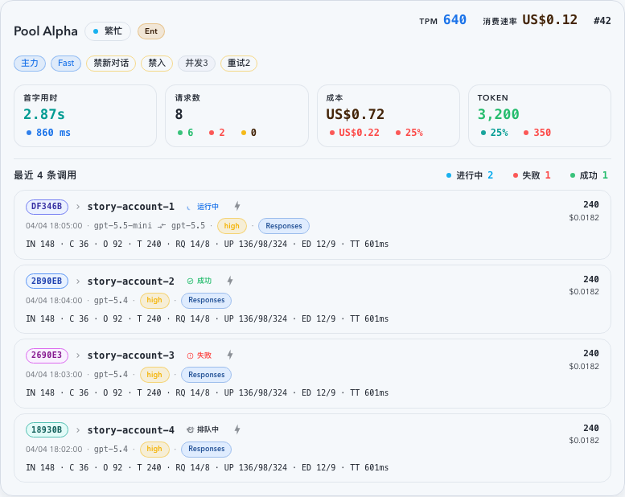

# Dashboard 工作区卡片双视图与上游账号活动聚合（#z6ysw）

> 当前有效规范以本文为准；实现覆盖与当前状态见 `./IMPLEMENTATION.md`，关键演进原因见 `./HISTORY.md`。

## 背景 / 问题陈述

- Dashboard 当前“工作中对话”区域只支持按对话查看，无法在同一块工作区里观察“当前活跃的上游账号”及其范围内聚合指标。
- 顶部总览已经拥有 `today / yesterday / 1d / 7d / usage` 的范围切换，但工作区部分没有共享这套状态，导致账号级视图无法与总览范围保持一致。
- Dashboard / account-scoped summary 现有 `inProgressConversationCount` / `inProgressRetryConversationCount` 仍沿用“按对话去重”的旧语义，与 owner-facing 认知中的“进行中的调用数”不一致。

## 目标 / 非目标

### Goals

- 把 Dashboard 当前“工作中对话”区域改成右上角 `对话 / 上游账号` 双 tabs，保留现有对话视图行为不变。
- 新增懒加载的 `上游账号` 视图，只展示当前所选 Dashboard 总览范围内有调用的账号，并跟随 `today / yesterday / 1d / 7d` 聚合。
- 提供一个 Dashboard 专用的后端批量读接口，一次返回账号级摘要与最近 4 条调用记录，禁止前端 fanout 账号详情或 `window-usage` 做 N+1 聚合。
- 把 summary 中现有 `inProgressConversationCount` / `inProgressRetryConversationCount` 语义统一改成 invocation-based，并同步更新 owner-facing 文案为“进行中调用 / 重试调用”。

### Non-goals

- 不把现有 `对话` tab 改成跟随总览范围；它继续保持当前 5 分钟工作集与现有 SSE patch 行为。
- 不把账号视图做成账号池 roster/table 的嵌入版，也不复用账号详情抽屉的整页布局。
- 不支持 `usage` 范围下的账号活动聚合，也不为此新增替代语义。
- 不引入账号卡展开态、二级 tabs、四小格内层卡片或额外 drill-down 交互。

## 范围（Scope）

### In scope

- `web/src/pages/Dashboard.tsx`：把 `DashboardActivityOverview` 的 range 状态提升为 Dashboard 共享状态，并接线到工作区 section。
- `web/src/components/DashboardActivityOverview.tsx`：支持 controlled range 输入，同时保留既有持久化 key 与独立复用能力。
- `web/src/components/DashboardWorkingConversationsSection.tsx` 及新增账号视图组件：右上 tabs、badge、usage disabled 回退、账号卡布局与最近 4 条调用记录。
- `web/src/hooks/useDashboardUpstreamAccountActivity.ts` 与 API 层：账号 tab 懒加载、范围跟随、激活态刷新预算。
- `src/api/slices/invocations_and_summary.rs`、`src/api/slices/settings_models_and_cache.rs`、`src/maintenance/hourly_rollups.rs`：新增 `GET /api/stats/upstream-account-activity`，并修正 summary in-progress 语义。
- 相关 Storybook、前后端测试与视觉证据。

### Out of scope

- 调整 Dashboard 顶部总览范围集合本身，或新增新的全局范围枚举。
- 改造 working conversations 的卡片结构、详情抽屉、抽屉路由或 5 分钟工作集筛选逻辑。
- 修改账号详情整页的布局范式。

## 需求（Requirements）

### MUST

- Dashboard 工作区区块右上必须新增 `对话 / 上游账号` tabs，默认保持在 `对话`。
- `上游账号` tab 首次打开前不得发请求；首次激活后才加载，并在 tab 未激活时不参与 SSE/records 刷新预算。
- `上游账号` 视图只展示当前共享 range 内“至少有 1 条调用”的账号；账号标题直接使用 `displayName`。
- `上游账号` 视图仅支持 `today / yesterday / 1d / 7d`；当共享 range 为 `usage` 时，该 tab 必须 disabled，且若当前停留在账号 tab，必须自动回退到 `对话`。
- 账号活动接口必须一次返回每个账号的 `upstreamAccountId`、`displayName`、`groupName`、`planType`、`requestCount`、`successCount`、`failureCount`、`nonSuccessCount`、`totalTokens`、`successTokens`、`nonSuccessTokens`、`failureTokens`、`cacheHitRate`、`tokensPerMinute`、`spendRate`、`totalCost`、`failureCost`、`firstByteAvgMs`、`avgTotalMs`、`inProgressInvocationCount`、`inProgressPhaseCounts`、`retryInvocationCount`、`effectiveRoutingRule` 与 `recentInvocations[4]`。
- `recentInvocations` 必须限制在当前所选范围内，按 `occurredAt DESC` 排序，并使用后端 bounded query 返回。
- `recentInvocations[]` 必须额外返回真实 `promptCacheKey?: string | null`，供账号卡 recent 行生成稳定的对话短 ID 与详情抽屉 selection。
- 账号卡不是折叠卡，也不是 `2 x 2` 小格子；它是单张放大卡片，桌面宽屏 `>=1660px` 时每行 2 张，其余断点为 1 列。
- 账号卡必须保持紧凑信息卡定位；在桌面宽屏下允许按放大卡呈现，但不得因为固定高度或装饰性留白把视觉效果拉成整页面板。
- 单账号卡标题行必须展示账号名、计划/状态、关键策略徽章、账号 ID，并把实时主指标 `进行中调用`、`TPM`、`消费速率` 作为文本型行内指标放在同一顶部区域；`进行中调用` 必须来自账号活动接口的 `inProgressInvocationCount`，当值为 `null` 时显示 `—`；标题区还必须用紧凑 chips 拆分展示 `排队中 / 请求中 / 响应中`，数值只取账号活动接口的 `inProgressPhaseCounts`，不得从卡内 `recentInvocations` 推导；不得用卡片型容器展示这些实时指标，且账号卡内不得再渲染 `渠道 xxx / 分组` 或顶部 `调用` 指标。
- 账号卡标题行的关键策略徽章必须来自 `effectiveRoutingRule`，仅显示 owner-facing 策略信号：`主力`、`兜底`、`禁新对话`、`禁出`、`禁入`、`补Fast`、`Fast`、`禁Fast`、`并发N`、`重试N`；普通系统 tag 名称不得进入该区域。
- 账号活动接口中的 `tokensPerMinute` 与 `spendRate` 必须使用响应窗口末端最近 5 分钟活跃尾段口径：以当前响应 `rangeEnd` 为 anchor，仅看最近 5 分钟，跳过窗口前置空闲分钟，并分别以第一个有 Token / Cost 的分钟作为有效分母起点；`requestCount`、`totalTokens`、`totalCost`、recent 调用与排序继续使用所选 range 的总量口径。
- 已选中上游账号的 pool running 调用必须在账号活动 live rows、账号卡 `inProgressInvocationCount` / `retryInvocationCount` 与 account-scoped summary 中归属到该账号；当 invocation payload 尚未写入 `upstreamAccountId` 时，可以用同 `invokeId` 的 `pool_upstream_request_attempts.upstream_account_id` 作为读侧 fallback，并且账号级 retry 计数必须基于该 fallback 后的账号重新判定。
- 单账号卡周期统计必须改为四组：`首字用时 + 响应时间`、`请求数 + 成功 / 失败 / 其他`、`成本 + 失败 / 失败成本比率(%)`、`Token + 缓存命中率 / 失败`。前者为主参数，后者为附加参数；成本组里的失败成本比率必须按 `failureCost / totalCost` 计算，不得复用请求失败率。
- 单账号卡四组周期统计必须以整张统计卡作为 hover / focus / click / long-press 的浮层触发区域；浮层顶部展示该卡主字段和值，下方按“当前字段 / 相关数据”分组明确列出字段名和值，不得只展示裸数值。
- 单账号卡四组周期统计的卡内分解段落不得再各自挂载独立 tooltip，避免在整卡 tooltip 内形成嵌套 trigger；recent 区标题行右侧状态分解不受此限制，继续保留自身 hover/title 行为。
- 单账号卡四组周期统计浮层的补充数据最多 3 项，且只能来自账号活动接口已有字段或前端可安全计算值；不得为了 tooltip 新增后端字段、接口或改变聚合口径。
- 四组周期统计与顶部实时指标中的所有数值必须使用 Dashboard 既有滚动数字效果；账号卡排序必须按 `totalTokens DESC`，再按最近调用时间与账号 ID 保持稳定。
- 摘要区不得加入低价值说明型文案；“按调用计数，不按对话去重”、“仍在重试链路中的调用”、“账号状态说明条”之类解释性文字不得出现在卡面常驻内容里。
- 请求数、成本与 Token 附加分解摘要在卡面常驻态只显示色点与数值；不得出现任何可见文字标签（包括单字、缩写、短标签）。完整 `label + value` 只通过 hover / title 暴露，不得额外占用版面。
- 账号卡内部所有结构性描边（外框、摘要格子、recent 行、分隔线）必须统一使用低对比中性边框，不得把主题主色、语义色或任意彩色边框用于结构分割；颜色只保留给状态点、数值与徽章等语义元素。
- recent bridge 作为 recent 区标题行右侧统计例外，必须显示完整状态文字；运行态必须拆成 `排队中 / 请求中 / 响应中`，数值来自账号级 `inProgressPhaseCounts`，终态继续使用账号级 `successCount / failureCount / nonSuccessCount`，并与左侧“最近 4 条调用”标题保持同一垂直对齐节奏。
- 单账号卡下半部分必须展示当前范围内最近 4 条调用记录，复用现有紧凑调用行语言，而不是再做卡中卡；4 条记录必须在卡内完整可见，不得依赖展开、滚动或裁切。
- 账号卡内每条 recent 调用记录的信息密度不得低于 Dashboard 对话卡片中的调用记录：至少需要覆盖状态、模型、endpoint、Token 用量摘要，以及 `RQ / UP / ED / TT` 时序摘要。
- 账号卡 recent 调用记录的主标识行必须改为“对话短 ID + 分隔符/图标 + 请求 ID”；其中对话短 ID 固定基于真实 `promptCacheKey` 走既有 working-conversation 哈希与格式化规则，展示值去掉 `WC-` 前缀；请求 ID 显示完整 `invokeId` 并允许单行截断。
- recent 行里的对话短 ID 必须渲染为轻量 identity chip，而不是独立彩色圆点；chip 以短码文本为主识别，颜色只作辅助 cue，不得与运行状态徽标争夺语义。
- 上游账号 recent 行中的 identity chip 必须作为独立“对话详情”入口；点击或在 chip 上按 `Enter / Space` 时，打开对应 `promptCacheKey` 的对话详情抽屉，不得退化成调用详情。
- identity chip 的颜色映射必须使用稳定离散槽位，而不是连续 hue；同一 `promptCacheKey` 在刷新、排序和 range 切换后应落到同一槽位，不同对话复用同一槽位可接受。
- identity chip 的槽位计算必须混合完整稳定 hash 的高低位；不得直接对展示短码片段做低位 `% 8` 取槽，避免真实数据因为低位偏置而出现成片撞色。
- 账号卡 recent 调用记录不得重复显示所属账号名；调用已嵌在账号大卡内时，账号名必须让位给请求标识、状态与时序摘要。
- 账号卡 recent 调用记录中的紧凑 badge 必须统一高度、字号、圆角、padding 与 line-height；至少 `reasoning effort`、endpoint 与 recent 行双模型显示要复用同一 compact recipe，不得再出现同一行内视觉尺寸不一致。
- 当 recent 调用记录的 `requestModel` 与 `responseModel` 规范化后仍不一致时，账号卡 recent 行必须同时显示“请求模型 + 模型切换图标 + 响应模型”；模型一致时继续显示单模型 badge。
- `StatsResponse.inProgressConversationCount` 与 `StatsResponse.inProgressRetryConversationCount` 必须保留 wire name，但语义改为 invocation-based；所有 Dashboard owner-facing 文案同步改成“进行中调用 / 重试调用”。
- `StatsResponse.inProgressPhaseCounts` 与账号活动接口的 `accounts[].inProgressPhaseCounts` 必须表示当前 live in-progress 调用的三阶段拆分：`queued` 表示尚未选定或开始上游请求，`requesting` 表示连接/发送请求/等待首字节，`responding` 表示已收到首字节并在流式响应中；该字段只代表当前 live 状态，不改写历史终态统计。
- `recentInvocations[]` 与共享 `ApiInvocation` / prompt-cache invocation preview 可带 `livePhase?: queued | requesting | responding | null`；前端展示运行态时必须优先使用后端 `livePhase`，缺失时才允许用 `status`、timing 与 attempt phase 兜底推断，终态成功/失败/HTTP 状态不得强行归入三阶段。
- `today / 1d / 7d` 的 `inProgressInvocationCount / retryInvocationCount` 允许使用 live augmentation 语义；`yesterday` 为 closed range，这两项必须返回 `null` 并在前端显示 `—`。

### SHOULD

- 账号视图的刷新应沿用现有 Dashboard reconcile budget，在 tab 激活时才对 `records` / SSE open 做节流 refresh，不增加逐条本地 SSE patch。
- 当前实现中，账号视图与 current summary 一样统一收口到 `5s` reconcile/open-resync 预算；任何更激进的 cadence 变更都必须先补充 slow-path 证据。
- 共享 range 状态应继续使用现有 localStorage key，避免打断用户已保存的 Dashboard 偏好。
- 账号卡内的最近调用记录应复用已有 invocation 语义 helper，保证状态、模型、耗时与账号 badge 文案一致。

### COULD

- `groupName` 与 `planType` 可作为 badge 或辅信息展示，但不得替代主标题 `displayName`。

## 功能与行为规格（Functional/Behavior Spec）

### Core flows

- Dashboard 页面加载后，顶部总览和工作区 section 共享同一个 `activeRange` 状态；总览的已有行为、持久化 key 与渲染顺序保持不变。
- Dashboard 工作区 `对话 / 上游账号` 视图必须记住用户上次主动选择的 tab；下次重新打开 Dashboard，或从其他页面切回总览页时，若该视图在当前 range 下仍可用，则默认恢复到该已记住的选择。
- `对话` tab 继续显示最近 5 分钟内有终态调用，或当前仍处于运行中 / 排队中的对话卡片。
- 用户首次切到 `上游账号` tab 时，前端发起一次账号活动批量请求；后续只在账号 tab 激活时，随共享 range 变化或节流 refresh 再次请求。
- `上游账号` 视图中的 badge 显示“当前活动账号数”；`对话` 视图中的 badge 继续显示“当前对话数”。
- 账号卡顶部显示 `displayName` 与必要 badge；主体显示账号级 KPI；底部显示最近 4 条调用记录。
- 账号卡摘要区保持两行 KPI 栅格，底部 recent 列表优先压缩行内密度而不是继续增加卡片高度。
- `yesterday` 账号视图中的 `进行中调用` 与 `重试调用` 显示 `—`，因为它是 closed range，不做 live augmentation。
- 当当前 range 为 `usage` 时，工作区可以临时强制显示 `对话` 作为降级视图，但不得覆盖用户上次主动选择的 tab 偏好；一旦切回支持账号活动的 range，若用户上次偏好是 `上游账号`，则必须自动恢复该视图。

### Edge cases / errors

- 当账号活动接口返回空列表时，账号 tab 需要显示空态而不是沿用对话列表占位。
- 当账号活动接口失败时，账号 tab 只在自身视图内显示错误态，不影响对话 tab 与顶部总览。
- 当用户停留在账号 tab，随后把范围切到 `usage`，UI 必须立即切回 `对话`，且不触发账号活动请求。
- 当某账号范围内只有失败 / 中断调用时，请求分解、Token 分解与最近 4 条记录仍需稳定显示，不得因为缺少 success 样本而隐藏整卡。
- 当 `cacheHitRate`、`firstByteAvgMs` 或 live augmentation 值缺失时，对应字段显示 `—`，但账号卡其余部分继续渲染。

## 接口契约（Interfaces & Contracts）

### 接口清单（Inventory）

| 接口（Name）                                           | 类型（Kind）        | 范围（Scope） | 变更（Change） | 契约文档（Contract Doc） | 负责人（Owner） | 使用方（Consumers）                       | 备注（Notes）                                                |
| ------------------------------------------------------ | ------------------- | ------------- | -------------- | ------------------------ | --------------- | ----------------------------------------- | ------------------------------------------------------------ |
| `GET /api/stats/upstream-account-activity`             | http-endpoint       | external      | Add            | None                     | backend/stats   | Dashboard account activity tab            | range 聚合 + effective routing rule + recent 4 bounded query |
| `StatsResponse.inProgressConversationCount`            | http-response-field | external      | Modify         | None                     | backend/stats   | Dashboard natural-day KPI, account detail | wire name 保留，语义改为 invocation-based                    |
| `StatsResponse.inProgressRetryConversationCount`       | http-response-field | external      | Modify         | None                     | backend/stats   | Dashboard natural-day KPI, account detail | wire name 保留，语义改为 invocation-based retry              |
| `StatsResponse.inProgressPhaseCounts`                  | http-response-field | external      | Add            | None                     | backend/stats   | Dashboard natural-day KPI, account detail | live invocation 三阶段拆分                                   |
| `UpstreamAccountActivityAccount.inProgressPhaseCounts` | http-response-field | external      | Add            | None                     | backend/stats   | Dashboard account activity tab            | 账号级 live invocation 三阶段拆分，不从 recent 列表推导      |
| `ApiInvocation.livePhase` / preview `livePhase`        | http-response-field | external      | Add            | None                     | backend/stats   | Dashboard, Live, Prompt Cache             | 单调用 live 阶段，终态为空                                   |
| `DashboardActivityOverview` range contract             | ui-component-prop   | internal      | Modify         | None                     | web/dashboard   | Dashboard page, account detail overview   | 支持 controlled / uncontrolled 双模式                        |
| `Dashboard workspace double-tab section`               | ui-component-prop   | internal      | Modify         | None                     | web/dashboard   | Dashboard page                            | `对话 / 上游账号` tabs + count badge                         |
| `useDashboardUpstreamAccountActivity`                  | ui-hook             | internal      | Add            | None                     | web/dashboard   | Dashboard account activity tab            | lazy load + tab-active refresh gate                          |

### 契约文档（按 Kind 拆分）

- `None`

### Shared preview contract notes

- `GET /api/stats/upstream-account-activity.recentInvocations[]` 复用现有 invocation preview wire shape，并额外包含 `promptCacheKey?: string | null`。
- `GET /api/stats/upstream-account-activity.accounts[].effectiveRoutingRule` 复用账号池现有 `EffectiveRoutingRule` wire shape，只用于 Dashboard 标题区关键策略徽章；普通系统 tag 仍不在账号活动接口中展示。
- 前端共享 `PromptCacheConversationInvocationPreview` 合同同步包含 `promptCacheKey?: string | null`；`DashboardWorkingConversationInvocationSelection.promptCacheKey` 语义不变，仍表示真实对话键。

## 验收标准（Acceptance Criteria）

- Given Dashboard 工作区加载完成，When 查看右上角，Then 可以看到 `对话 / 上游账号` tabs，默认激活 `对话`，且现有 working-conversation 卡片交互不变。
- Given 共享 range 为 `today / yesterday / 1d / 7d`，When 切到 `上游账号`，Then 账号集合与汇总指标随范围变化，且只包含该范围内至少有一条调用的账号。
- Given 当前在 `上游账号` tab，When 把共享 range 切到 `usage`，Then 账号 tab disabled，界面自动回退到 `对话`，且不会发账号活动请求。
- Given 用户上次主动选择了 `上游账号`，When 刷新页面、重新打开 Dashboard，或从其他页面切回 Dashboard，Then 在当前 range 允许账号视图时，工作区默认恢复到 `上游账号`。
- Given 用户上次主动选择了 `上游账号`，When 当前 range 临时切到 `usage` 后再切回 `today / yesterday / 1d / 7d`，Then 工作区应重新恢复到 `上游账号`，而不是把偏好永久改写成 `对话`。
- Given 从未打开过账号 tab，When 停留在 `对话` tab，Then 前端不会请求账号活动接口。
- Given 某账号有范围内调用，When 查看账号卡，Then 标题使用 `displayName`，顶部同一行包含关键策略徽章、文本型 `TPM`、`消费速率` 实时指标和账号 ID，且卡内不再出现 `渠道 xxx / 分组` 行或顶部 `调用` 指标。
- Given 账号活动接口返回的 `effectiveRoutingRule` 命中关键策略，When 账号卡渲染，Then 标题区显示对应策略徽章，至少覆盖 `主力`、`禁入`、`禁新对话`，且不显示普通系统 tag 名称。
- Given 查看账号卡周期统计，When 卡片渲染完成，Then 可见四组统计：`首字用时 + 响应时间`、`请求数 + 成功 / 失败 / 其他`、`成本 + 失败 / 失败成本比率(%)`、`Token + 缓存命中率 / 失败`，且所有数值使用滚动数字效果；当 `failureCost=0` 时，成本组失败成本比率显示为 `0%`。
- Given 查看账号卡四组周期统计，When 对任一统计卡 hover、focus、点击或移动端长按，Then 整张统计卡打开结构化浮层，浮层明确展示主字段名和值、卡面已有分解字段名和值，以及 0 到 3 个相关补充数据。
- Given 查看账号卡四组周期统计，When 卡片常驻态渲染完成，Then 卡内分解段落不再各自创建独立 tooltip trigger，避免和整卡浮层形成嵌套触发区域。
- Given 多个账号都有范围内调用，When 查看上游账号列表，Then 账号卡按 `totalTokens` 倒序排列；Token 相同再按最近调用时间和账号 ID 稳定排序。
- Given 某账号有至少 4 条范围内调用，When 查看账号卡底部，Then 只显示最近 4 条，按 `occurredAt DESC` 排序。
- Given 某账号 recent 调用记录存在真实 `promptCacheKey`，When 查看请求标识主行，Then 可见基于该键计算出的对话短 ID、分隔图标与完整请求 ID，且短 ID 展示值不带 `WC-` 前缀。
- Given 某账号 recent 调用记录渲染主标识行，When 查看对话短 ID，Then 它表现为轻量短码 chip，且颜色来自稳定离散辅助色槽位，而不是单独的状态样式圆点。
- Given 用户点击某账号 recent 行里的对话短 ID identity chip，When 交互发生，Then 只打开对应 `promptCacheKey` 的对话详情抽屉，不会误打开调用详情抽屉。
- Given 查看账号卡摘要区，When 卡片处于常驻态，Then 不出现解释性废话或状态说明条，请求数 / Token 分解只显示色点与数值，且不出现任何可见文字标签。
- Given 查看账号卡 recent 区标题行，When 右侧存在 recent bridge 统计，Then 显示完整状态文字，并与左侧“最近 4 条调用”标题保持同一垂直对齐。
- Given 查看账号卡内 recent 调用记录，When 与对话卡片调用记录对照，Then recent 行至少包含状态、模型、endpoint、Token 摘要与 `RQ / UP / ED / TT` 时序摘要，且 4 条记录完整留在卡内。
- Given 账号卡 recent 调用记录所在账号已由大卡标题表达，When 查看 recent 行辅助元信息，Then 不再重复渲染账号名。
- Given 账号卡 recent 调用记录的 `requestModel` 与 `responseModel` 规范化后不一致，When recent 行渲染模型区域，Then 同时显示请求模型、模型切换图标与响应模型；若两者等价，则只显示单模型。
- Given 点击账号卡 recent 调用记录打开详情，When 详情抽屉接收 selection，Then `selection.promptCacheKey` 必须等于真实 preview `promptCacheKey`，而不是 `invokeId`。
- Given Dashboard 顶部 KPI 使用 `StatsResponse.inProgressConversationCount` / `inProgressRetryConversationCount`，When 显示 owner-facing 文案，Then 标签为“进行中调用 / 重试调用”，并按 invocation-based 计数，而不是按 prompt-cache 对话去重。
- Given 后端账号活动接口需要账号摘要与最近 4 条记录，When 发起请求，Then 响应来自单个 batch endpoint，不依赖前端 fanout `upstream-account detail` 或 `window-usage`。

## 验收清单（Acceptance checklist）

- [x] 核心路径的长期行为已被明确描述。
- [x] 关键边界/错误场景已被覆盖。
- [x] 涉及的接口/契约已写清楚或明确为 `None`。
- [x] 相关验收条件已经可以用于实现与 review 对齐。

## 非功能性验收 / 质量门槛（Quality Gates）

### Testing

- Unit tests: 账号活动 hook / 账号视图组件 / Dashboard range 共享与回退行为。
- Integration tests: summary invocation-based 计数、账号活动接口 range + recent query、Dashboard 页面 tabs / lazy load / disabled 回退。
- E2E tests (if applicable): None。

### UI / Storybook (if applicable)

- Stories to add/update: `DashboardWorkingConversationsSection`、Dashboard page story、账号活动卡状态图库。
- Interaction coverage to add/update: 上游账号四组统计卡整卡 tooltip 的 hover/focus/click 入口与字段明细。
- Docs pages / state galleries to add/update: working conversations / account activity 双视图状态。
- `play` / interaction coverage to add/update: `today / yesterday / 1d / 7d / usage`、tab 切换、空态、错误态。
- Visual regression baseline changes (if any): 以本 spec 的 `## Visual Evidence` 为准。

### Quality checks

- `cargo test`（summary / account activity 相关 targeted tests）
- `cargo check`
- `cd web && bun run test`
- `cd web && bun run build`
- `cd web && bun run build-storybook`

## Visual Evidence

- source_type: storybook_canvas
  story_id_or_title: `dashboard-workingconversationssection--upstream-account-tab`
  scenario: `live phase split`
  evidence_note: 验证 Dashboard 上游账号卡标题区与最近调用标题右侧都按账号级 `inProgressPhaseCounts` 显示 `排队中 2 / 请求中 3 / 响应中 4`；Storybook fixture 中 recent 列表只有 4 条，证明该统计不从卡内列表 reduce。
  image:
  

- source_type: storybook_canvas
  story_id_or_title: `dashboard-workingconversationssection--upstream-account-tab`
  scenario: `account header in-progress invocations`
  evidence_note: 验证上游账号卡片标题区在关键策略徽章与实时 `TPM / 消费速率` 指标之间展示 `进行中调用` 文本型读数，值来自账号 `inProgressInvocationCount`，并保持同一行内紧凑扫描节奏。
  image:
  PR: include
  

- source_type: storybook_canvas
  story_id_or_title: `dashboard-workingconversationssection--upstream-account-metric-tooltips`
  scenario: `metric card whole-card tooltip`
  evidence_note: 验证上游账号四组统计卡支持整卡触发结构化浮层；截图保留成本卡打开态，浮层按主字段、当前字段与相关数据分层展示，并明确列出字段名和值。
  image:
  PR: include
  

- source_type: storybook_canvas
  story_id_or_title: `dashboard-workingconversationssection--upstream-account-tab`
  scenario: `account policy badges`
  evidence_note: 验证 Dashboard 上游账号卡片标题区显示来自 `effectiveRoutingRule` 的关键策略徽章，包括 `主力`、`Fast`、`禁新对话`、`禁入`、`并发3`、`重试2`，且普通系统 tag 不进入该区域。
  image:
  PR: include
  

- source_type: storybook_canvas
  story_id_or_title: `dashboard-workingconversationssection--upstream-account-tab`
  scenario: `desktop1660`
  evidence_note: 验证 Dashboard 工作区已切换到 `上游账号` tab，桌面宽屏下账号卡按 2 列紧凑放大布局展示账号级 KPI、轻量对话短码 identity chip + 请求 ID 主标识行，以及请求/响应模型不一致时的双模型切换展示。
  image:
  PR: include
  

- source_type: storybook_canvas
  story_id_or_title: `dashboard-workingconversationssection--upstream-account-tab`
  scenario: `mobile390`
  evidence_note: 验证相同账号 tab 在移动视口下收敛为单列卡片，并保留摘要区与最近 4 条调用记录。
  image:
  

- source_type: storybook_canvas
  story_id_or_title: `dashboard-workingconversationssection--upstream-account-tab`
  scenario: `first-response-byte-total desktop card`
  evidence_note: 验证账号卡“首字用时”主值使用 owner-facing 的首字总耗时口径；当后端同时返回阶段级 `firstByteAvgMs` 与显式 `firstResponseByteTotalAvgMs` 时，卡面主值显示秒级总耗时而不是被极小的上游首字节时延误导成 `0ms`。
  image:
  

- source_type: storybook_canvas
  story_id_or_title: `dashboard-workingconversationssection--upstream-account-tab`
  scenario: `remembered-workspace-view desktop`
  evidence_note: 验证 Dashboard 工作区右上 tabs 右贴边呈现；当浏览器已记住用户上次主动切到 `上游账号` 时，重新进入总览页会恢复该视图，且 `usage` 下的临时回退不会抹掉该偏好。
  image:
  

## Related PRs

- None

## 风险 / 开放问题 / 假设（Risks, Open Questions, Assumptions）

- 风险：账号活动接口若直接扫 live invocations，未来数据量继续增长时可能需要进一步下沉到 read-model / materialized rollup，但本轮先保证 bounded recent query 与单次聚合链路正确。
- 风险：summary wire field 保留旧名字但改语义，会要求所有 owner-facing 文案和测试同时更新；遗漏任何一处都可能造成“字段值对、文案错”的混乱。
- 风险：账号卡若继续通过增高固定高度容纳信息，会重新滑向“整页面板”观感；后续新增字段时应优先压缩行内布局与摘要表达，而不是继续加高卡片。
- 假设：recent 行 identity chip 仅在上游账号 tab 内收口为当前真相；对话 tab 主卡片与详情抽屉的短码呈现方式不在本 spec 本轮改动范围内。
- 假设：`today / 1d / 7d` 的进行中调用与重试调用使用 live augmentation 语义；`yesterday` closed range 返回 `null`。
- 假设：活动账号判定是“当前所选范围内至少有 1 条调用的账号”。
- 假设：`渠道名 = displayName`，`groupName / planType` 仅作辅信息。

## 参考（References）

- `docs/specs/gz5ns-dashboard-natural-day-kpi-semantics/SPEC.md`
- `docs/specs/t6d9r-account-detail-stats-read-model/SPEC.md`
- `docs/specs/5932d-sse-proxy-live-sync/SPEC.md`
- `docs/solutions/performance/realtime-dashboard-reconcile-budget.md`
