# 请求日志可观测性增强（IP / Cache Tokens / 分阶段耗时 / Prompt Cache Key / Body Logging Toggles）（#z9h7v）

## 背景 / 问题陈述

- 当前 `/api/invocations` 虽已包含 token 与成本，但缺少请求方来源信息（IP）、稳定请求标识（prompt cache key）与易读的阶段耗时展示。
- Web 端表格仅突出错误详情，无法在单次请求维度快速定位“慢在何处”。
- 代理链路已有 `payload` 与分阶段耗时字段落库能力，尚未系统化对外输出与前端展示。
- 远程压缩的新流量已迁移到 `/v1/responses` 内的 server-side compaction；只看 endpoint 已无法区分“启用了远程压缩 V2”与“最终真的触发了压缩响应”。
- 图片相关请求的运行时 `imageIntent` 已参与路由，但还未成为稳定的 invocation 对外可观测合同，导致 101 开日志时无法直接肉眼确认“图片工具”请求。

## 目标 / 非目标

### Goals

- 在不变更 SQLite 表结构的前提下，补齐请求级上下文字段：`requesterIp`、`promptCacheKey`、`endpoint`、`failureKind`。
- `/api/invocations` 向前端稳定返回分阶段耗时字段，支持“首字节 / 总耗时”与完整阶段详情展示。
- Live 与 Dashboard 共用表格统一升级，主表保持简洁，详情区保留完整诊断信息。
- 请求详情不再展示 `source`，也不把 `source` 当作代理名兜底；代理字段仅展示 payload 中已确认的 `proxyDisplayName`。
- 调用记录相关模型展示统一采用“响应模型优先”语义，并在请求模型与响应模型不一致时显示低干扰的上游路由差异图标。
- 号池尝试明细展示每次尝试实际落库的 `proxy_binding_key_snapshot`，用于失败链路诊断。
- `GET /api/settings` 与 `PUT /api/settings/proxy` 暴露两个独立布尔开关：`requestBodyLoggingEnabled`、`responseBodyLoggingEnabled`，默认都为 `true`。
- 关闭 body 记录时，仅停止新的 request/response 原文 body 落盘与响应 preview 持久化；结构化 payload、tokens、timing、routing/account、prompt cache key、reasoning/service tier 等字段继续写入。
- `/api/invocations` 与 SSE `records` 在不改 schema 的前提下额外返回 `compactionRequestKind` / `compactionResponseKind`，把原始 endpoint 与压缩语义解耦。
- `/api/invocations`、SSE `records` 与 Prompt Cache / Dashboard preview 在不改 schema 的前提下额外返回 `imageIntent`，使图片请求语义脱离 endpoint 和历史 raw body 存活状态而独立存在。
- `/api/invocations`、SSE `records`、Prompt Cache preview 与 Dashboard working conversations 在不改 schema 的前提下额外返回 `requestModel` / `responseModel`，用于区分请求模型与实际响应模型。
- 复用 invocation preview wire shape 的 owner-facing 列表在需要稳定对话关联时，必须继续返回真实 `promptCacheKey`；Dashboard 上游账号活动 recent 行不得再把 `invokeId` 当成对话键替代。
- Records 与 Dashboard 两个 owner-facing 列表同时显示独立“图片工具”徽标，避免同一条 invocation 在不同列表面出现语义漂移。
- Live 展开详情与 Dashboard 调用详情抽屉必须共用同一套调用详情组件，并按“快速排障”组织信息：请求身份、路由与模型、失败信号、细节保留、阶段耗时分组展示。
- 新 HTTP proxy invocation 的 `invokeId` 必须使用 10 位 NanoID 风格短格式，去掉历史 `proxy-...` 前缀、内部 counter 与时间戳尾巴；历史 `proxy-...` 记录继续兼容查询和展示。
- 账号详情“上游调用尝试”必须按真实 `pool_upstream_request_attempts` 行展示请求、重试、失败与成功；概览统计继续采用最终调用口径。
- 账号上游调用记录必须采用表格展示；每行仅表达一次真实上游调用，直接列出时间、上游尝试短 ID、请求模型与响应模型、结果/HTTP 状态、代理、连接/首字节/流式延迟和错误。不得显示 endpoint、重试序号、最终 invocation 的 tokens/费用或其他非本次调用字段。
- 结果列的 HTTP 值必须明确标记为上游 HTTP；仅当与上游不同才在当前记录下方的全宽诊断展开区显示下游 HTTP。错误主列显示失败分类与两行摘要；失败或状态不一致时以紧凑元数据带展示完整错误、复制命令、上游请求 ID、路由键与代理绑定键，不得挤在错误列角落或为正常成功行额外占用高度。
- 桌面保留完整诊断表；窄屏仍采用表格，首屏优先时间、调用/模型、结果和错误摘要，代理、三段延迟与完整错误证据收进可展开区。代理优先显示解析后的节点名，不能解析时显示截短绑定键并保留完整值提示。
- 新产生的路由调用事件必须携带精确 `attemptId`，健康与事件只能用该 ID 定位同账号的尝试；缺少 `attemptId` 的历史事件必须明确不可定位，不做 `invokeId` 模糊跳转。
- owner-facing attempt 标识统一使用持久化 8 位短 `attemptId`。该 ID 存于 `pool_upstream_request_attempts.attempt_public_id`，live 与 archive 都要求非空；内部数值主键仅保留给 DB join / FK / 维护逻辑，不得直接暴露。
- 尝试列表与定位只查询主库最近 7 天，按 `occurredAt DESC, id DESC` 稳定分页，不读取 archive。
- 尝试详情必须提供到 `/records?attemptId=...` 的全局调用总览入口，并自动展开该最终调用的完整尝试链；旧 `requestId` 型入口只保留兼容读取，不再作为新 UI 的 attempt 跳转合同。
- 账号详情调用记录中的 owner-facing 主入口必须显示 `attemptId` 而不是 `invokeId`；`invokeId` 如保留只能降级为诊断上下文，不能继续承担 attempt 主标识角色。
- 号池调用处于 `running` / `pending` 且已携带 `upstreamAccountName` 或 `upstreamAccountId` 时，所有共享 invocation 展示面必须用当前上游账号替代“号池路由中”fallback，并以蓝色呼吸文本表达正在路由中。
- Dashboard 当前时间范围新增按“响应模型 / 思考程度”分组的性能明细，覆盖 TPM、流式响应速率、平均响应时长、平均首字用时与累计使用时长；明细及对应 TPM、首字卡面仅统计成功且已计费调用。

### Non-goals

- 不新增独立请求详情页。
- 不改费用、token 明细和既有时序聚合的归集语义；仅 Dashboard 活动快照的 TPM、首字卡面及模型性能明细采用本规格定义的成功已计费完整周期口径。
- 不新增“总日志开关”。
- 不对历史 `.gz` / raw 文件做立即删除、迁移或重压缩。

## 范围（Scope）

### In scope

- `src/main.rs` 代理采集增强、`/api/invocations` 列表字段扩展。
- `src/main.rs` 启动阶段全量回填历史 proxy 记录中的 `payload.promptCacheKey`。
- `web/src/lib/api.ts` 类型对齐后端返回。
- `web/src/features/invocations/InvocationTable.tsx` 新增 cache/latency 列与通用详情展开区。
- `web/src/i18n/translations.ts` 新增中英文文案键。
- `proxy_model_settings` 单例新增 request/response body logging 持久化字段与 settings 页面双开关 UI。
- request raw / response raw / response preview 按设置开关 fail-soft 退化，详情页与历史回填接受“新记录没有 raw body”为正常状态。
- `GET /api/stats/dashboard-activity` 的全局与账号活动返回模型性能分组；Dashboard 总览与账号卡复用同一个桌面浮层/窄屏抽屉入口。

### Out of scope

- 除账户事件新增可空 `attempt_id` 外的数据库 schema 变更。
- Dashboard “历史”日历视图、模型筛选、导出与性能趋势图。
- 采集敏感头（如 `Authorization`）或原文脱敏策略重构。
- 统计页图表结构改造。

## 需求（Requirements）

### MUST

- requester IP 提取优先级固定：`x-forwarded-for` 首值 > `x-real-ip` > `Forwarded(for=...)` > peer ip 兜底。
- prompt cache key 提取优先级固定：请求体候选 JSON 指针（`/prompt_cache_key`、`/promptCacheKey`、`/metadata/prompt_cache_key`、`/metadata/promptCacheKey`）> 请求头候选键（`x-prompt-cache-key` 等）。
- `build_proxy_payload_summary` 在成功/失败路径都包含 `requesterIp` 与 `promptCacheKey`（缺失时为 null）。
- `/api/invocations` 返回新增字段：`requesterIp`、`promptCacheKey`、`endpoint`、`failureKind`。
- 前端主表新增 `Cache Tokens` 与 `Latency` 列（`First byte / Total`），详情区展示完整阶段耗时。
- 调用详情的“代理”字段只使用 `proxyDisplayName`；缺失时显示 `—`，即使 `source` 为 `xy` 或其他来源也不参与展示。
- 号池尝试明细每条尝试展示“代理/Proxy”：`proxyBindingKeySnapshot` 缺失时显示 `—`，值为 `__direct__` 时显示 `Direct`，其他值通过绑定节点解析为代理显示名；解析失败时显示紧凑 key，完整 key 仅保留在 hover title。
- 启动回填会将历史记录中的 `payload.codexSessionId` 移除，并写入 `payload.promptCacheKey`。
- `requestBodyLoggingEnabled=false` 时，新请求不再写入 `request_raw_path` / request raw 文件；相关 size/truncation 字段维持空值或零值语义，不把该情况视为损坏。
- `responseBodyLoggingEnabled=false` 时，新响应不再写入 `response_raw_path` / response raw 文件，同时 `raw_response` inline preview 也不再持久化。
- `responseBodyLoggingEnabled=false` 时，调用详情读取响应 body、异常 drawer 与历史回填链路必须返回既有 unavailable/fallback 语义，而不是 500 或“缺文件即损坏”语义。
- `/v1/responses/compact` 继续视为 `Compact`；不把它改名成 `V1`，也不把 `/v1/responses` 内的 V2 语义挤占到 endpoint 字段。
- `/v1/responses` 请求体含 `context_management[type=compaction][compact_threshold]` 时，运行态记录必须写入 `compactionRequestKind="remote_v2"`，且不依赖 request body raw logging。
- `/v1/responses` 终态只有在响应中实际检测到 compaction item 时才写入 `compactionResponseKind="remote_v2"`；“请求启用了 V2 但响应未触发”不得在终态列表误显示为 `远程压缩V2`。
- `imageIntent` 对外合同固定为四态：`"yes" | "direct_image" | "no" | "unknown"`；缺字段历史记录继续返回 `null` / 前端显示 `—`，本次不做历史 backfill。
- `/v1/responses` 请求若由 `gpt-image-*`、`image_generation` 或等价图片工具信号触发，必须持久化 `imageIntent="yes"`；`/v1/images/generations|edits` 必须持久化 `imageIntent="direct_image"`。
- `requestBodyLoggingEnabled=false` 时，`compactionRequestKind` 与 `imageIntent` 仍必须稳定落库并对外可见，不能依赖 request raw body 后读。
- 公开模型展示合同固定为：主显示值采用 `responseModel ?? model ?? requestModel`；只有在 `requestModel` 与 `responseModel` 同时存在、且忽略空白/大小写并按 dated alias/base-model 归并后仍不一致时，才显示“上游改路由”的差异图标。
- 调用详情必须固定展示“请求模型 / 响应模型”两个字段；旧记录若只有历史 `model` 字段，则回填到“响应模型”，请求模型显示 `—`。
- 新 HTTP proxy invocation 的 `invokeId` 必须匹配 `^[ABCDEFGHJKMNPQRSTUVWXYZ23456789]{10}$`，字符集固定为 `ABCDEFGHJKMNPQRSTUVWXYZ23456789`，不包含 `I`、`L`、`O`、`0`、`1`、连字符、业务前缀或时间戳。
- 内部 `proxy_request_id` 继续作为日志、路由预约、临时文件、并发控制与 pool replay 的 numeric ID；不得从短 `invokeId` 反向解析内部 ID。
- `pool_routing_reservation_key_for_invoke_id` 只对历史 `proxy-{numeric}-{timestamp}` 格式恢复 `pool-route-{numeric}`，新短格式不生成 reservation key。
- 运行态号池账号提示只在 `routeMode=pool`、状态为 `running` / `pending`、且存在非空账号名或有限数值账号 ID 时成立；显示值只允许为账号名或 `账号 #<id>`，不得添加“路由中”前缀。
- 运行态号池账号提示必须复用现有账号点击路径；存在账号 ID 时，Live、Records、Dashboard working conversations 与 Dashboard 调用详情抽屉中的账号文本仍可打开上游账号详情。
- 运行态号池账号提示必须是 text-only 蓝色语义状态，动画周期在 1500-2200ms 内；`prefers-reduced-motion: reduce` 下关闭呼吸动画但保留蓝色文本。
- Dashboard 模型性能明细的样本资格固定为：状态为 `success` 或 `completed`、失败分类为 `none`、且 `cost` 非空；`cost=0` 仍属于已计费。模型取 `responseModel`，思考程度为空时显示“未指定”。
- TPM 为合格调用总 token 除以当前完整选择范围的分钟数；流式响应速率为输出 token 除以上游流式响应时长；响应时长为首字至流结束的平均值；首字用时为收到调用请求至上游首字的平均值；模型行使用时长继续为各自行的端到端时长之和，总计行使用时长改为将同一范围内全部合格调用按 `intersection([occurred_at, occurred_at + t_total_ms), [range.start, range.end))` 取时间并集。缺少有效样本的单项显示 `—`。
- Dashboard 全局和账号 TPM 卡面必须使用对应模型性能总计；费用速率继续使用既有费用归集，但以完整选择范围为分母。
- 桌面端性能明细触发器必须支持 hover、键盘聚焦与点击保留；窄屏点击打开无横向滚动的详情抽屉。总计行置顶，模型行按累计使用时长降序；总计行允许小于模型行 `使用时长` 的算术和。
- `GET /api/invocations/locate` 必须按 `upstreamAccountId + requestId` 在 retained live records 与当前 runtime overlay 中精确定位，固定采用 `occurredAt DESC, id DESC`，返回目标所在的单个分页窗口、稳定 `snapshotId`、短生命周期 `anchorId`、`targetIndex` 与 `targetAbsoluteIndex`。
- 锚点定位未命中时必须返回结构化 `404`；不得为了定位查询 archive，也不得返回或预加载目标页之外的调用记录。

### SHOULD

- 历史/非代理记录缺字段时前端统一展示 `—`，不抛错。
- 不影响 SSE 通道协议与统计接口行为，仅将字段名由 `codexSessionId` 变更为 `promptCacheKey`。

### COULD

- 后续按需增加“导出详情”或独立详情页。

## 功能与行为规格（Functional/Behavior Spec）

### Core flows

- 请求进入 `/v1/chat/completions` 或 `/v1/responses` 采集路径时，后端提取 IP 与 prompt cache key，并随 payload 一并落库。
- `/api/invocations` 通过 `json_extract(payload, ...)` 投影扩展字段，不依赖新增列。
- Dashboard 活动快照从 retained live 调用按响应模型与思考程度聚合成功已计费性能样本，同时分别生成全局和账号级总计；原始费用、token 明细和调用列表聚合保持不变。
- Dashboard TPM、首字卡及每张账号卡的 TPM/费用速率均以当前选择范围完整周期计算。性能明细在桌面使用可保留的浮层，在窄屏使用详情抽屉；两个入口展示相同总计与模型行。
- 前端表格默认显示关键字段（token/cost/latency），用户展开后看到请求元信息与阶段耗时明细。
- 前端展开详情时隐藏 `source` 行，避免把来源分类误读成出站代理。
- `/api/invocations/{invoke_id}/pool-attempts` 读取 `pool_upstream_request_attempts.proxy_binding_key_snapshot` 并作为 `proxyBindingKeySnapshot` 返回。
- `GET /api/pool/upstream-accounts/{accountId}/call-attempts` 返回该账号最近 7 天主库尝试的分页列表；`GET .../call-attempts/locate?attemptId=...` 返回目标尝试所在页，未命中返回 `404`。
- 号池详情中，真实上游尝试与合成终态记录分开展示。`budget_exhausted_final` 或 `sameAccountRetryIndex <= 0` 仅作为号池终态说明，不作为普通尝试卡片展示，不显示同账号重试序号或阶段耗时。
- 启动阶段执行历史回填：读取 `request_raw_path` 指向的原始请求 JSON，提取 `prompt_cache_key` 后写回 payload。
- Settings 页面在现有 proxy card 内新增两个独立开关，文案明确区分“请求 body 记录”与“响应 body 记录”，并说明关闭仅影响新记录，旧记录继续走 retention。
- 关闭 request body logging 时，请求原文不会进入新的异步 raw writer；关闭 response body logging 时，响应原文异步 writer 与详情页 inline preview 同时关闭。

### Edge cases / errors

- 若 `x-forwarded-for` 首值不可解析，则回退到下一级来源，不中断请求。
- 若 prompt cache key 候选键全部未命中，返回 `null` 并在前端显示 `—`。
- 若阶段耗时缺失（旧记录），前端逐项显示 `—`。
- 若号池达到不同账号尝试上限，前端应明确说明终态记录未发起新的上游请求，并可保留上一失败账号与上一错误状态作为诊断上下文。
- 当 body logging 开关关闭导致新记录没有 raw 路径或 preview 时，详情页、回填与异常查看都要把它当作“未保留 body”，不是“raw 文件丢失”。

## 接口契约（Interfaces & Contracts）

### `GET /api/invocations` 记录对象（新增可选字段）

- `invokeId: string`，新 HTTP proxy 记录为 10 位短 ID；历史记录可能仍为 `proxy-...` 长 ID。
- `requesterIp?: string`
- `promptCacheKey?: string`
- `endpoint?: string`
- `failureKind?: string`

### `GET /api/invocations/{invokeId}/pool-attempts` 尝试对象

- `proxyBindingKeySnapshot?: string | null`

### Upstream account attempts

- `pool_upstream_account_events.attempt_id` 为可空精确关联；只为新产生且调用链路已拿到尝试主键的路由事件写入，不回填历史事件。
- `GET /api/pool/upstream-accounts/{accountId}/call-attempts` Query: `page?: number`、`pageSize?: number`；Response: `items`、`total`、`page`、`pageSize`。
- `GET /api/pool/upstream-accounts/{accountId}/call-attempts/locate` Query: `attemptId: string`、`pageSize?: number`；目标必须属于当前账号且处于 7 天主库窗口内。
- 尝试对象必须返回 `attemptId: string`，映射自持久化 `attempt_public_id`；不得返回纯数字主键作为 owner-facing attempt 标识。
- 尝试对象额外返回 `requestModel?: string | null` 与 `responseModel?: string | null`；两个字段从关联 invocation 的 `payload.requestModel` / `payload.responseModel` 投影，请求模型缺失时回退 `model`，缺少匹配 invocation 时保持空值。该查询不得依赖新增 SQLite 列。

### `GET /api/settings` / `PUT /api/settings/proxy` 新增字段

- `requestBodyLoggingEnabled: boolean`
- `responseBodyLoggingEnabled: boolean`

### `GET /api/invocations` / SSE `records` 记录对象（新增可选字段）

- `compactionRequestKind?: "compact" | "remote_v2" | null`
- `compactionResponseKind?: "compact" | "remote_v2" | null`
- `imageIntent?: "yes" | "direct_image" | "no" | "unknown" | null`
- `requestModel?: string | null`
- `responseModel?: string | null`

### Shared invocation preview object（沿用扩展字段）

- `promptCacheKey?: string | null`
- `requestModel?: string | null`
- `responseModel?: string | null`

### `GET /api/invocations` 记录对象（已存在并沿用）

- `tReqReadMs?`、`tReqParseMs?`、`tUpstreamConnectMs?`、`tUpstreamTtfbMs?`、`tUpstreamStreamMs?`、`tRespParseMs?`、`tPersistMs?`、`tTotalMs?`

### `GET /api/invocations/locate` 锚点分页

- Query: `requestId?: string`、`attemptId?: string`、`upstreamAccountId?: number`、`pageSize?: number`（默认 `50`）；至少提供一个定位键，显式 `attemptId` 优先用于解析父 invocation。
- Response: 沿用 `snapshotId`、`total`、`page`、`pageSize`、`records`，并增加 `anchorId: string`、`requestId: string`、`attemptId?: string | null`、`targetIndex: number` 与 `targetAbsoluteIndex: number`。
- 后续双向分页继续调用 `GET /api/invocations`，携带定位响应的 `snapshotId`、`anchorId`、相邻 `page`、相同 `pageSize` 与 `upstreamAccountId`；服务端用 `anchorId` 复现定位时冻结的 runtime overlay，令所有页边界一致。

## 验收标准（Acceptance Criteria）

- Given 请求携带 `x-forwarded-for` 与 `metadata.prompt_cache_key`，When 请求完成并查询 `/api/invocations`，Then 返回 `requesterIp`、`promptCacheKey`、`cacheInputTokens` 与阶段耗时字段。
- Given 请求无转发头且 body 无 prompt_cache_key，When 请求完成，Then 前端详情对应字段显示 `—` 且页面无错误。
- Given 成功或失败记录，When 用户展开表格详情，Then 可见 endpoint、failureKind 与完整阶段耗时。
- Given 旧记录或 `source=xy` 记录缺扩展字段，When 页面渲染，Then 不崩溃且缺值显示 `—`。
- Given 调用详情记录 `source=xy` 或其他非 proxy 值但缺少 `proxyDisplayName`，When 用户展开详情，Then 不显示 `source` 行且代理字段显示 `—`。
- Given 号池失败尝试存在 `proxyBindingKeySnapshot=fpb_...` 且绑定节点可解析，When 用户展开号池尝试明细，Then 该尝试显示“代理/Proxy”与对应代理显示名，不把完整内部 key 作为主视觉值。
- Given 号池失败尝试存在 `proxyBindingKeySnapshot=fpb_...` 但绑定节点不可解析，When 用户展开号池尝试明细，Then 该尝试显示紧凑 key，完整 key 仅保留在 hover title。
- Given 号池尝试 `proxyBindingKeySnapshot=__direct__`，When 用户展开号池尝试明细，Then 该尝试显示 `Direct`。
- Given 历史 proxy 记录存在 `request_raw_path` 且 payload 缺 `promptCacheKey`，When 服务启动完成，Then 字段被自动回填且不会重复更新已完成记录。
- Given `requestBodyLoggingEnabled=false` 且 `responseBodyLoggingEnabled=true`，When 新代理调用完成，Then invocation 记录保留结构化 payload / stats / timing，但 `request_raw_path` 与新 request raw 文件都不存在。
- Given `requestBodyLoggingEnabled=true` 且 `responseBodyLoggingEnabled=false`，When 新代理调用完成，Then invocation 记录保留结构化 payload / stats / timing，但 `response_raw_path` 为空，且 `raw_response` preview 为空字符串。
- Given 两个开关都关闭，When 新代理调用完成并打开详情，Then Settings 页面保存成功、调用记录仍可查询，且 body 读取接口返回既有 unavailable/fallback 语义而非 500。
- Given `/v1/responses` 请求启用了 remote compaction V2，When 记录处于 `running` 或 `pending`，Then 列表 badge 显示 `远程压缩V2`，详情同时显示原始 endpoint 与 `压缩请求=远程压缩V2`。
- Given `/v1/responses` 请求启用了 remote compaction V2 但响应未触发 compaction，When 记录进入终态，Then 列表 badge 回退为 `Responses`，详情显示 `压缩请求=远程压缩V2`、`压缩响应=—`。
- Given `/v1/responses` 响应出现 `response.output_item.added` 的 compaction item 或 `response.compaction` 负载，When 记录进入终态，Then 列表 badge 显示 `远程压缩V2`，详情显示 `压缩响应=远程压缩V2`。
- Given `/v1/responses` 请求命中图片工具意图，When Records 与 Dashboard 渲染该 invocation，Then 两个列表都显示独立的“图片工具”徽标，且不改写 endpoint badge。
- Given `/v1/images/generations` 或 `/v1/images/edits` 请求完成，When 用户打开详情，Then `图片工具` 字段显示 `direct_image`，同时保留原始 endpoint。
- Given 历史 invocation 缺少 `imageIntent`，When Records 或 Dashboard 渲染，Then 列表不显示图片徽标，详情字段显示 `—`。
- Given 新记录同时携带 `requestModel=gpt-5.4` 与 `responseModel=gpt-5.5`，When Records、InvocationTable 或 Dashboard working conversations 渲染，Then 主模型文本显示 `gpt-5.5`，并在模型 badge 前显示上游路由差异图标。
- Given `requestModel` 与 `responseModel` 仅大小写不同，或仅 dated alias/base-model 归并后等价，When 列表渲染，Then 不显示模型路由差异图标。
- Given 调用详情打开，When 记录存在双模型字段，Then 页面始终分别展示“请求模型 / 响应模型”，且 mismatch 时仅响应模型带差异图标。
- Given 历史记录仅存在 `model`，When 调用详情打开，Then 请求模型显示 `—`，响应模型显示该历史 `model` 值。
- Given Dashboard 上游账号 recent 行来源于共享 invocation preview，When 用户点击调用打开详情，Then selection 使用真实 `promptCacheKey` 建立对话关联，而不是退化成 `invokeId`。
- Given Live 表格展开详情或 Dashboard 调用详情抽屉打开，When 记录包含调用 ID、账号、端点、请求/响应模型、请求方 IP、重试和失败字段，Then 首屏按请求身份、路由与模型、失败信号、细节保留、阶段耗时分组展示，不再以无差别双列字段平铺呈现。
- Given 调用详情包含长 `invokeId`、`promptCacheKey`、endpoint、IPv6 或错误消息，When 页面在桌面和窄屏渲染，Then 文本在容器内换行或截断，不造成横向滚动或相邻内容遮挡。
- Given 新 HTTP proxy invocation 被创建，When 查询 `/api/invocations`、接收 SSE `records` 或打开 Live/Dashboard 详情，Then `invokeId` 为 10 位短 ID，且不含 `proxy`、连字符、时间戳或内部 counter。
- Given 历史 `proxy-9061-1783013997090` 记录存在，When 用户过滤、查询、展示或打开详情，Then 仍按完整历史 `invokeId` 兼容处理，不迁移、不回填。
- Given 健康与事件带有当前账号的 `attemptId`，When 用户点击上游尝试 ID，Then 账号详情立即进入上游调用尝试 tab，后端只返回该尝试所在页，目标记录展开诊断并短暂高亮。
- Given 账号详情展示上游调用，When 表格渲染，Then 每行直接显示时间、调用 ID、请求模型与响应模型、状态/HTTP、代理、三段延迟与错误；不得显示 endpoint、重试序号、tokens、费用或最终调用汇总。
- Given 上游 HTTP 为 500 且下游 HTTP 为 502，When 账号上游调用表渲染，Then 主列显示“上游 HTTP 500”，其下的全宽“诊断详情”展开区显示下游 HTTP 502、上游请求 ID、路由键与完整可复制错误。
- Given 账号上游调用表在 `mobile390` 渲染，When 用户查看失败行，Then 表格首屏显示时间、调用/模型、结果与错误摘要；展开同一行证据后可见代理、三段延迟和完整错误信息。
- Given 历史事件缺少 `attemptId` 或目标尝试已被 7 天 retention 清理，When 用户查看事件，Then 界面明确不可定位或显示结构化未找到提示，且不以 `invokeId` 模糊匹配。
- Given 号池调用仍处于 `running` 或 `pending` 且已有 `upstreamAccountName`，When Live、Records、Dashboard working conversations 或 Dashboard 调用详情抽屉渲染该 invocation，Then 账号位置显示该账号名并使用蓝色呼吸文本，不显示“号池路由中”。
- Given 号池运行态调用没有 `upstreamAccountName` 或 `upstreamAccountId`，When owner-facing 调用界面渲染，Then 继续显示既有“号池路由中”fallback，且不伪造账号、不启用呼吸状态。
- Given 号池调用已进入成功或失败等终态，When owner-facing 调用界面渲染其账号字段，Then 保持普通账号显示与点击行为，不启用运行态呼吸状态。
- Given 当前 Dashboard 范围内同时存在成功已计费、失败、运行中和未计费调用，When 请求模型性能明细，Then 仅成功已计费调用进入总计和模型行，且 `cost=0` 的成功调用仍保留；模型按响应模型归属，空思考程度显示“未指定”。
- Given owner 在桌面 hover、键盘聚焦或点击 Dashboard TPM、首字、账号 TPM 或费用速率入口，When 性能明细打开，Then 显示置顶总计与按累计使用时长降序的模型行，且总计 `使用时长` 按范围内合格调用的时间并集计算、可以小于模型行加总，缺失指标显示 `—`；Given 窄屏点击同一入口，Then 以无横向滚动的抽屉展示同一数据。

### Manual verification

- 启动 backend/frontend 后打开 `/dashboard` 与 `/#/live`，验证新增列与详情展开可用。

## Visual Evidence

- source_type: storybook_canvas
  story_id_or_title: Dashboard/ModelPerformanceTrigger/DesktopTooltip
  state: desktop model-performance tooltip with union-based total usage duration
  requested_viewport: 1440x1024
  viewport_strategy: browser-viewport
  evidence_note: verifies the desktop model-performance tooltip keeps the pinned total row while showing the union-based total duration (`2.2 min`) smaller than the model-row arithmetic sum (`2 min + 1.1 min`).
  PR: include
  target_program: mock-only
  capture_scope: element
  sensitive_exclusion: fixture-only Dashboard data
  submission_gate: approved
  image:
  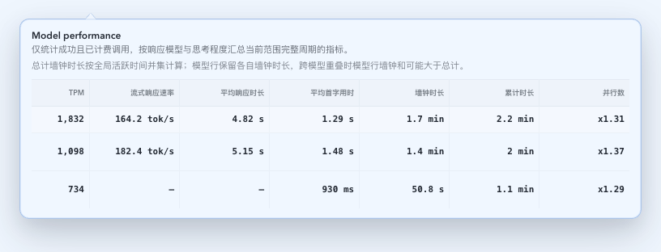

- source_type: storybook_canvas
  story_id_or_title: Dashboard/ModelPerformanceTrigger/MobileDrawer
  state: mobile model-performance drawer with union-based total usage duration
  requested_viewport: 390x844
  viewport_strategy: browser-viewport
  evidence_note: verifies the compact drawer keeps the stacked metric layout and shows the same union-based total duration (`2.2 min`) below the model-row sum, matching the desktop semantics.
  PR: include
  target_program: mock-only
  capture_scope: element
  sensitive_exclusion: fixture-only Dashboard data
  submission_gate: approved
  image:
  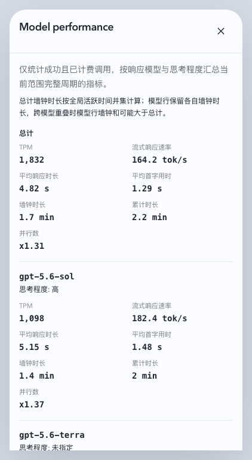

- source_type: storybook_canvas
  story_id_or_title: Account Pool/Pages/Upstream Accounts/Overlays/DetailDrawer
  state: upstream call-record table
  evidence_note: verifies the account drawer renders independent failed and successful upstream calls as table rows, labels upstream HTTP explicitly, resolves the proxy name, and exposes full error evidence in a full-width diagnostics row without endpoint, retry ordinals or final-invocation usage fields.
  PR: include
  target_program: mock-only
  capture_scope: element
  sensitive_exclusion: fixture-only account and request data
  submission_gate: approved
  image:
  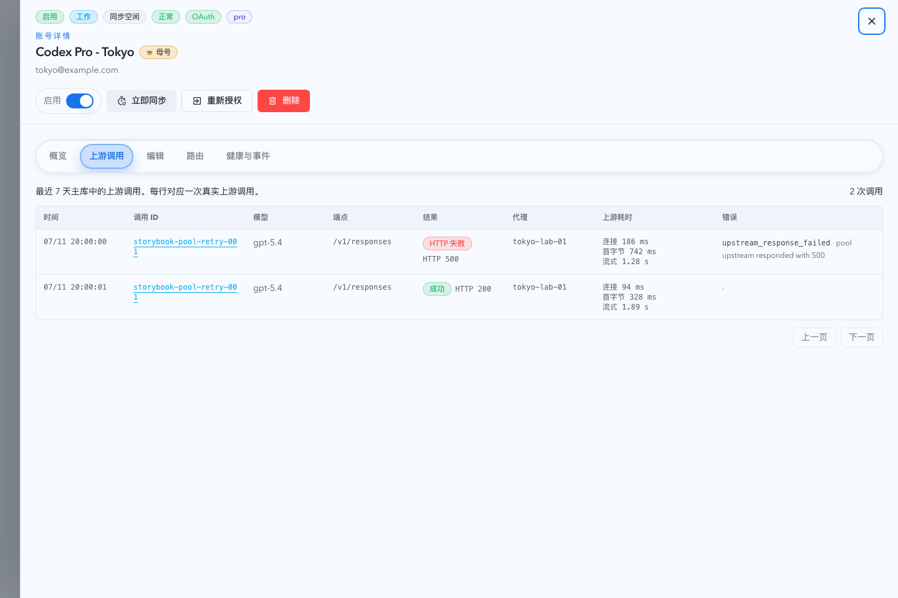

- source_type: storybook_canvas
  story_id_or_title: Account Pool/Pages/Upstream Accounts/Overlays/DetailDrawerRecordsMobile
  state: mobile upstream-call table with expanded failure evidence
  evidence_note: verifies the mobile table keeps time, call/model, result and error summary in the first row while the full-width diagnostics row exposes proxy, timings, route evidence and full error text without duplicating the model mapping.
  PR: include
  target_program: mock-only
  capture_scope: element
  sensitive_exclusion: fixture-only account and request data
  submission_gate: approved
  image:
  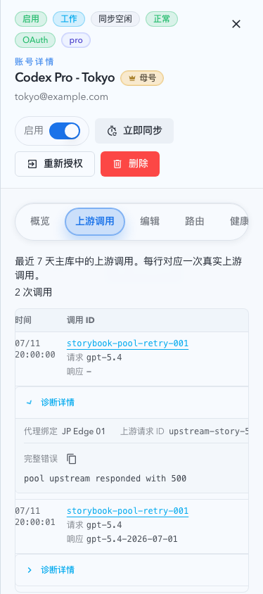

- source_type: storybook_canvas
  story_id_or_title: Account Pool/Pages/Upstream Accounts/Overlays/DetailDrawerEventLocatesAttempt
  state: event-located upstream attempt with diagnostics expanded
  evidence_note: verifies an account event opens the exact upstream attempt, highlights the failed row, and expands the full-width diagnostics evidence without manual disclosure interaction.
  requested_viewport: 1440x1024
  viewport_strategy: storybook-viewport
  PR: include
  target_program: mock-only
  capture_scope: element
  sensitive_exclusion: fixture-only account and request data
  submission_gate: approved
  image:
  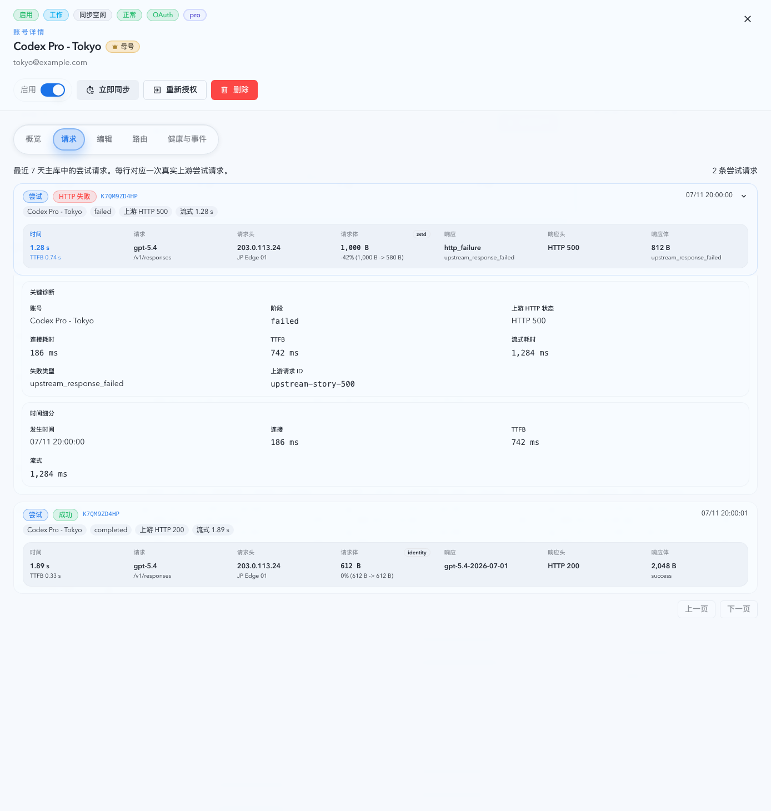

- source_type: storybook_canvas
  story_id_or_title: Settings/SettingsPage/Default
  state: proxy body logging toggles
  evidence_note: verifies the Settings page adds independent request body logging and response body logging switches with retention helper copy in the existing proxy settings card.
  image:
  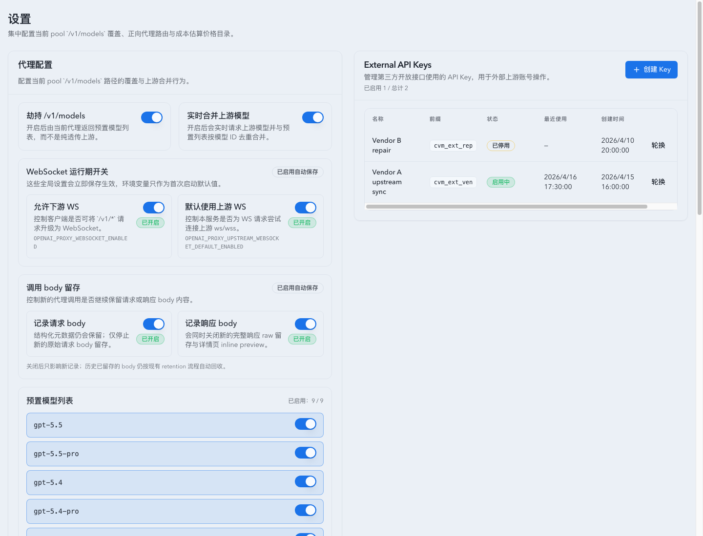

- source_type: storybook_canvas
  story_id_or_title: Monitoring/InvocationTable/PoolAttemptDetailLifecycle
  state: expanded pool attempt detail
  evidence_note: verifies the invocation detail hides `source` and the pool-attempt card renders a resolved proxy display name from `proxyBindingKeySnapshot`.
  image:
  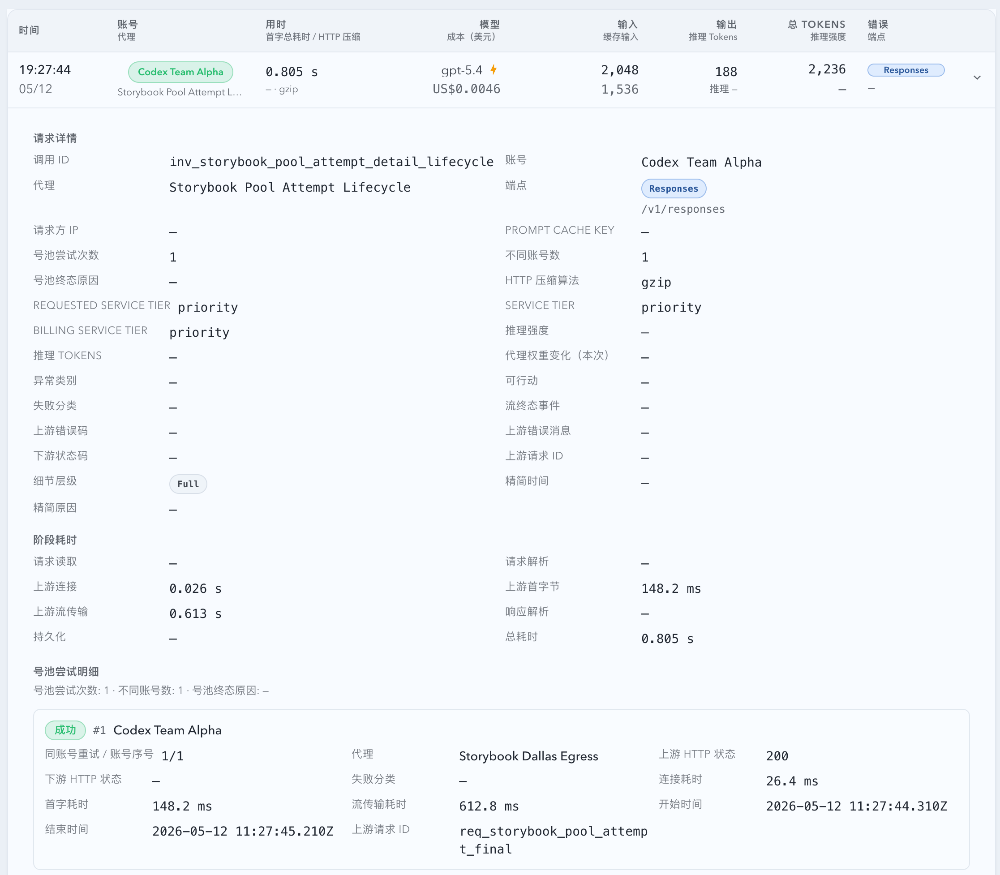
- source_type: storybook_canvas
  story_id_or_title: Records/InvocationRecordsTable/BudgetExhaustedTerminalRecord
  state: expanded pool attempt detail with synthetic terminal record
  evidence_note: verifies seven real pool attempts render as attempt cards while the `budget_exhausted_final` row renders as a separate terminal state with no retry index or timing labels.
  image:
  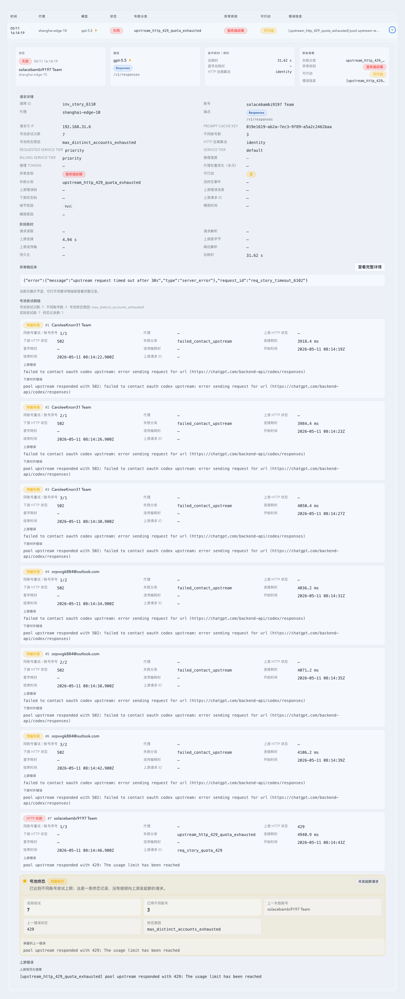
- source_type: storybook_canvas
  story_id_or_title: Dashboard/WorkingConversationsSection/ConversationHistoryDrawerOpen
  state: dashboard conversation history drawer
  evidence_note: verifies the dashboard conversation detail opens to the full retained call history drawer with no time-range selector, paginates the 316-record retained history snapshot, renders the zoomable and pannable activity chart, keeps records newest-first, and uses the dark floating tooltip surface.
  image:
  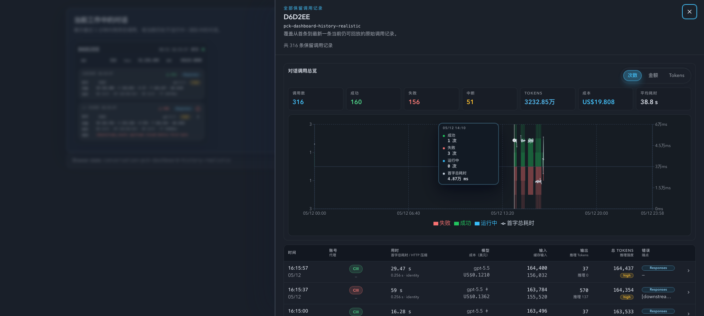
- source_type: storybook_canvas
  story_id_or_title: Monitoring/PromptCacheConversationTable/ShortSameDayDrawerOpen
  state: short same-day conversation history drawer
  evidence_note: verifies the retained-call activity chart uses the conversation's first and latest invocation timestamps instead of expanding the x-axis to the full local day.
  image:
  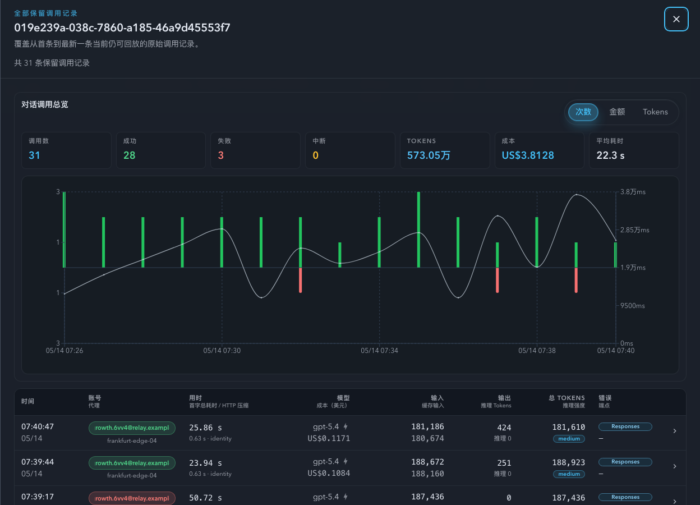

- source_type: storybook_canvas
  story_id_or_title: Monitoring/InvocationTable/EndpointBadgeStates
  state: endpoint badge matrix with remote compaction V2 semantics
  evidence_note: verifies `Compact` remains bound to `/v1/responses/compact`, while `/v1/responses` can surface `远程压缩V2` without overwriting the raw endpoint path.
  image:
  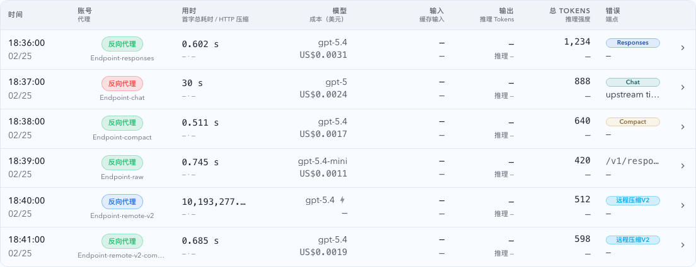

- source_type: storybook_canvas
  story_id_or_title: Monitoring/InvocationTable/EndpointBadgeStates
  state: mixed endpoint + image badge matrix
  evidence_note: verifies `imageIntent=yes|direct_image` renders an independent `图片工具` badge that can coexist with `远程压缩V2`, while legacy rows without `imageIntent` stay badge-free.
  image:
  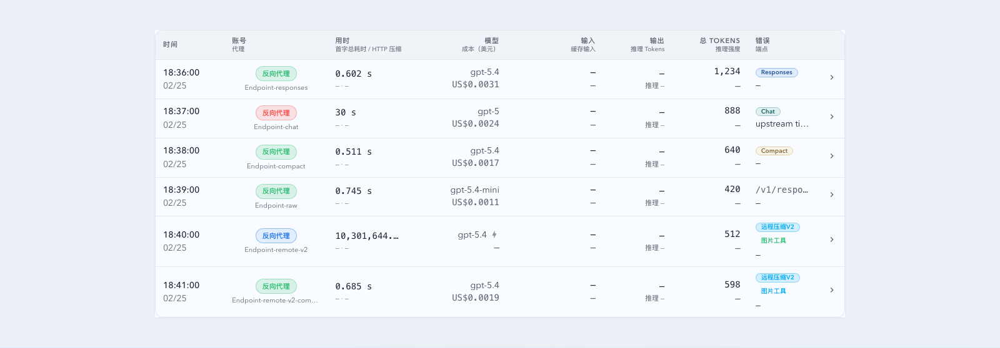

- source_type: storybook_canvas
  story_id_or_title: Dashboard/WorkingConversationsSection/TransportBadgeMixed
  state: dashboard image badge preview
  evidence_note: verifies Dashboard current/previous invocation slots mirror Records image-badge semantics and keep endpoint/path semantics unchanged.
  image:
  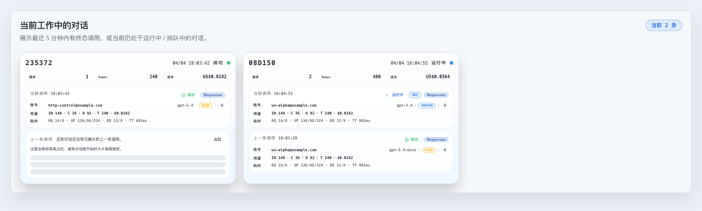

- source_type: storybook_canvas
  story_id_or_title: Monitoring/InvocationTable/ModelRoutingMismatch
  state: request/response model mismatch
  evidence_note: verifies the primary model badge follows the response model and adds the routed-model indicator only when normalized request/response models differ.
  image:
  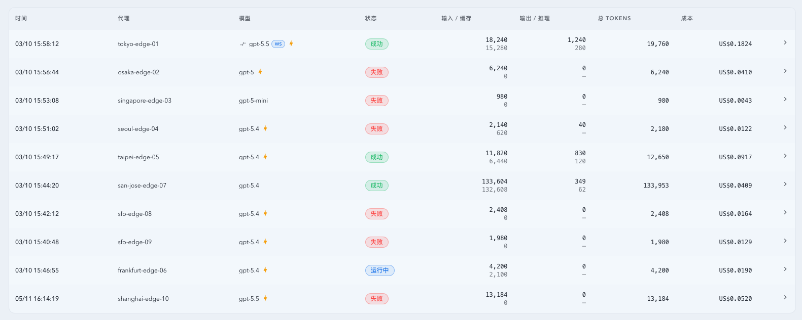

- source_type: storybook_canvas
  story_id_or_title: Records/InvocationRecordsTable/ModelRoutingMismatch
  state: expanded invocation detail with routed model summary
  evidence_note: verifies the expanded Records detail presents quick-triage cards, shows routed models as a visual chain, keeps endpoint information in the routing/model detail section, and preserves timing and pool-attempt boundaries.
  image:
  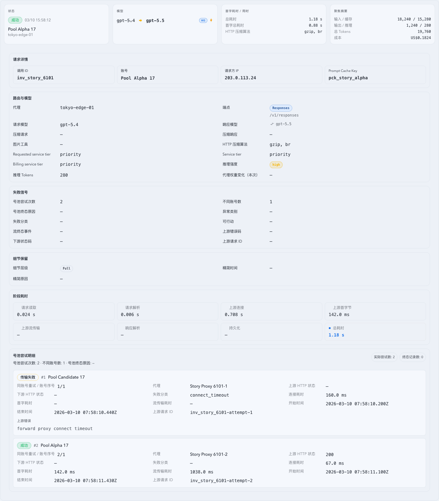

- source_type: storybook_canvas
  story_id_or_title: Records/InvocationRecordsTable/LegacyModelOnly
  state: legacy response-model fallback
  evidence_note: verifies legacy records without `requestModel`/`responseModel` still render the historical `model` value as the response-model display while request model degrades to `—`.
  image:
  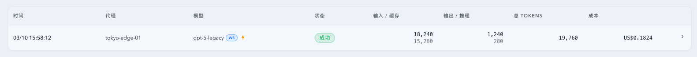

- source_type: storybook_canvas
  story_id_or_title: Records/InvocationRecordsTable/WarningSuccessStatus
  state: warning-success terminal row
  evidence_note: verifies future `pure_downstream_closed` rows render as the dedicated owner-facing `警告成功` status in Records, keep downstream diagnostics queryable, and remain visibly distinct from ordinary success rows.
  target_program: mock-only
  capture_scope: element
  sensitive_exclusion: fixture-only invocation data
  submission_gate: approved
  image:
  PR: include
  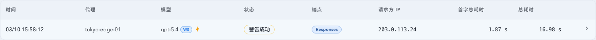

- source_type: storybook_canvas
  story_id_or_title: Dashboard/WorkingConversationsSection/PoolRoutingAccountStates
  state: dashboard running pool account routing states
  evidence_note: verifies Dashboard working conversation slots show the concrete upstream account as breathing primary text while the request is running, keep the no-account fallback as `号池路由中`, and leave terminal account text static.
  image:
  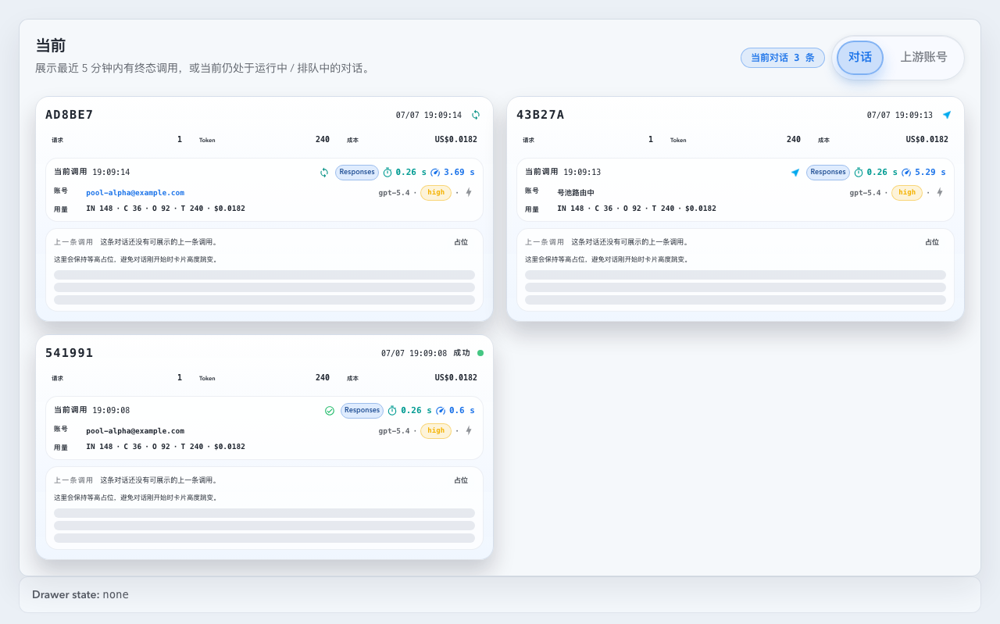

- source_type: storybook_canvas
  story_id_or_title: Monitoring/InvocationTable/PoolRoutingAccountStates
  state: invocation table running pool account routing states
  evidence_note: verifies the live invocation table renders the running concrete upstream account as blue text, preserves the no-account pool-routing fallback, and keeps terminal accounts as ordinary clickable account labels without changing row layout.
  image:
  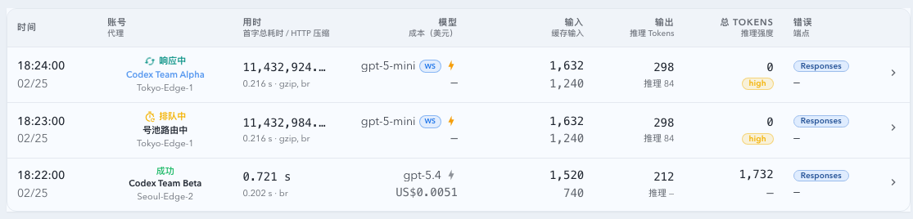

- source_type: storybook_canvas
  story_id_or_title: Records/InvocationRecordsTable/PoolRoutingAccountStates
  state: expanded records detail running pool account routing
  evidence_note: verifies the shared expanded invocation detail also consumes the running-account routing state, including account identity cards and request detail fields, without overlapping timing, model, or pool-attempt diagnostics.
  image:
  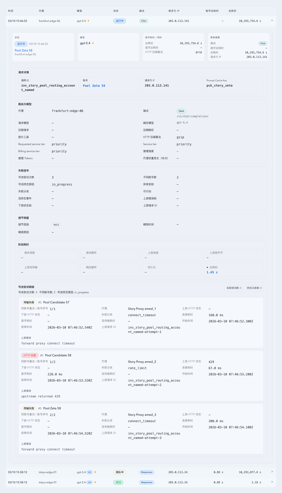

- source_type: storybook_canvas
  story_id_or_title: Account Pool/Pages/Upstream Accounts/Overlays/DetailDrawerHealthEventAttemptLink
  state: health event with a precise upstream attempt link
  evidence_note: verifies a new routing event exposes one clickable upstream attempt ID while adjacent historical events remain visibly non-locatable rather than rendering an empty final invocation ID.
  requested_viewport: 1280x720
  viewport_strategy: storybook-manager-canvas
  PR: include
  target_program: mock-only
  capture_scope: element
  sensitive_exclusion: fixture-only account and request data
  submission_gate: approved
  image:
  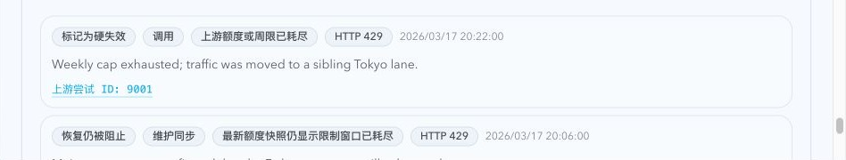

## 风险 / 开放问题 / 假设（Risks, Open Questions, Assumptions）

- 风险：上游请求不保证稳定携带 `prompt_cache_key`，仍可能出现正常缺失。
- 开放问题：是否后续在 SQLite 增加独立 `prompt_cache_key` 列（本次不做）。
- 假设：现有代理链路 payload 存储可承载新增上下文字段。
