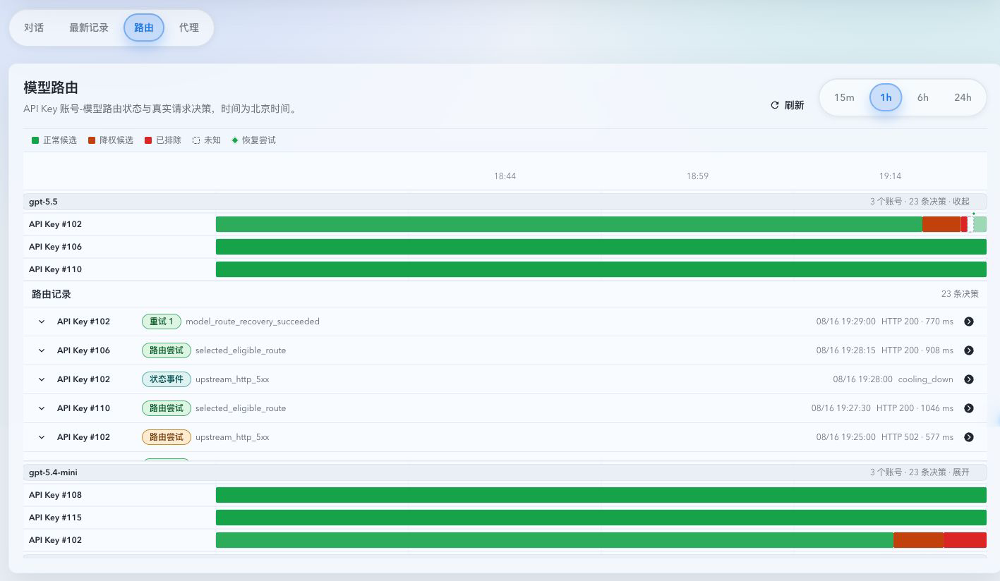
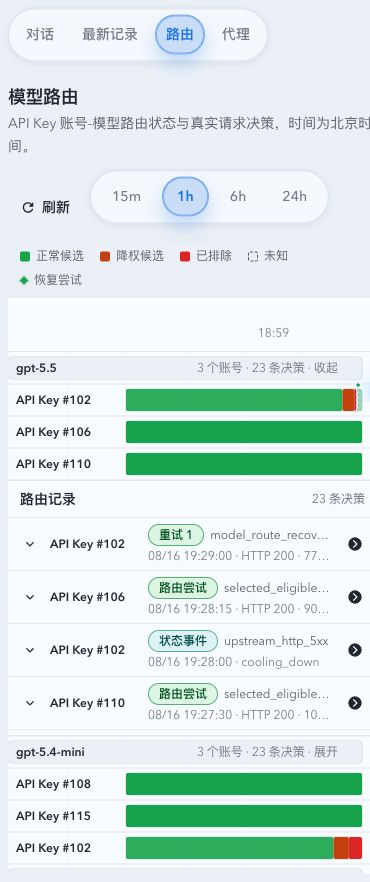

# API Key 上游按模型路由健康管理（#zr9jd）

> 当前有效规范以本文为准；实现覆盖与当前状态见 `./IMPLEMENTATION.md`，关键演进原因见 `./HISTORY.md`。

## 背景 / 问题陈述

API Key 上游账号当前以账号维度记录路由失败和冷却。单个模型不可用时，账号整体会被降级，导致同一账号上仍可用的模型无法继续承接请求。健康与事件视图也无法说明具体模型、路由优先级和恢复时间。

## 目标 / 非目标

### Goals

- 仅对 API Key 上游按请求中的精确模型名维护动态路由健康状态。
- 让模型失败只影响该账号与该模型组合，并保留其他模型的账号资格。
- 在账号详情健康与事件页展示模型路由状态、优先级、变更时间、预计恢复时间和具体变更事件。
- 在实况页的“路由”页签按模型展示全系统 API Key 模型路由当前状态、选择原因与真实恢复尝试。
- 让账号详情中的模型行按需展开最近 48 小时的逐次尝试和模型路由事件，并将登录健康摘要压缩为按需展开的诊断。
- 支持单模型手动恢复，且不覆盖静态模型规则或账号级禁用状态。
- 为 API Key 的精确 `(upstream_account_id, model)` 组合提供可选的缓存命中保护，在异常低命中时限制未来并行并通过单探针恢复。

### Non-goals

- 不改变 OAuth 上游的账号级健康语义。
- 不发送后台探测请求，不做历史调用回放或初始状态回填。
- 不合并基础模型名与日期快照，不绕过 `availableModels` 或 `systemDeniedModels`。

## 范围（Scope）

### In scope

- 模型状态表、事件字段、七天清理和候选排序。
- API Key 模型错误分类、真实调用成功/失败观察和并发时序保护。
- 全局缓存命中保护设置、组合级动态并行限制、缓存冷却与队列/改路溢出处理。
- 模型状态读取、单模型 reset API，以及账号详情健康与事件 UI。
- API Key 模型路由全局快照、账号模型 48 小时历史、受限实时订阅和实况页“路由”页签。
- Storybook 状态/交互覆盖和 mock-only `ui_demo` 视觉证据。

### Out of scope

- OAuth 模型级探测或状态表。
- 近七天以前的历史模型回填。
- 账号级认证、付费硬错误的既有分类调整。
- 修改当前请求的 retry/failover 预算或静态模型规则。
- 迁移既有账号临时失败状态或删除历史事件。

## 需求（Requirements）

### MUST

- 状态主键为 `account_id + exact_model`，仅由真实请求建立或更新，模型记录最后一次真实调用超过七天后清理。
- 状态为 `available/degraded/cooling_down`，优先级为 `normal/demoted/excluded`。
- 明确模型错误，以及具备精确请求模型的 API Key 5xx、429、逻辑过载和 transport/handshake/stream 临时失败：前四次降权，第五次或连续失败窗口达到 30 秒后进入冷却；冷却从 15 秒指数增长，最长 60 秒。
- API Key 临时失败不得写账号 `cooldown_until`、账号连续临时失败计数或账号级临时 action，也不得删除 sticky route。401/403/402 等明确认证或付费硬错误继续走账号级逻辑；OAuth 账号级健康语义与静态模型规则保持不变。
- API Key 调用缺少精确模型、HTTP 413、其他未列明非硬错误或后台同步临时失败时，只保留调用、尝试或同步诊断，不修改账号或模型健康，也不创建 `unknown` 模型。
- 继承后的 `statusChangeReasons` 开关继续控制同原因是否改变健康状态：对 API Key 可归属临时失败控制模型状态，对 OAuth 和明确账号硬错误控制账号状态；关闭时仅保留中性诊断事件。
- 仅状态、优先级、冷却、恢复或手动 reset 变化时写结构化事件。
- `GET/PUT /api/pool/routing-settings` 的 `cacheHitProtection` 为局部更新字段：默认 `enabled=false`、`lowHitRateThresholdPercent=10`、`overflowMode=queue`；阈值必须在 `1..=100`，溢出模式仅为 `queue` 或 `reroute`。
- 仅 API Key 成功请求、具备完整 usage、`input_tokens >= 3840` 且 `cache_input_tokens / input_tokens < threshold` 的严格低于阈值样本参与缓存保护。缺 usage、分母为零或小于样本下限时为未知观测。
- 首个低命中样本以当时在途数作为恢复上限，并将未来组合并行上限设为 `max(1, floor(active / 2))`；后续低命中继续减半，健康样本每次加一，到达恢复上限后解除限制。
- 组合处于最低并行时，连续第三个低命中样本进入 15/30/60 秒缓存冷却；开始冷却时重置最低并行计数。健康观测或手动 reset 清零缓存冷却阶梯。
- 任何模型冷却到期后只能原子放行一个探针。启用缓存保护时，探针仅在合格且不低命中时完全恢复；未知样本继续单探针，低命中样本从最低并行的连续第 1 次重新计数。禁用缓存保护时，HTTP 成功探针可按既有成功语义恢复。
- 超过组合上限的请求遵守既有总超时与无可用候选等待边界：`queue` 进入有界等待；`reroute` 排除该组合后继续选择其他合法候选。显式禁止切换、强制绑定或无替代候选时回退有界等待。粘性复用同样受组合上限约束。
- `queue` 的零上游审计必须统计本次可选集合内所有已达模型组合上限的候选，但仍等待排序第一的目标，不改变为 reroute。`nextEligibleAt` 只能来自本次因模型冷却被排除的候选，不得使用不可路由、策略排除或已排除账号的无关冷却时间。
- NoCandidate 的 Storybook 中英文、移动端与暗色证据必须显式注入 locale，且不得读写产品 locale 持久化状态；证据结果不得依赖 Story 或 meta 的浏览顺序。
- 关闭缓存保护或修改阈值时，仅清除缓存保护状态和缓存原因冷却，不清除仍有效的非缓存失败状态；仅修改溢出模式保留已学习的缓存保护状态。
- 账号级路由成功只能清除请求开始前已存在的失败。新写入的账号路由失败及由其派生的冷却截止时间必须基于同一时刻保留亚秒精度；兼容读取既有秒级时间，但秒级失败与请求开始落在同一秒时无法证明先后，必须保守拒绝恢复和可用性广播。
- 成功终态的缓存观测可以独立更新模型证据；仅当关联账号当前仍为 `active`、已启用、未软删除，且账号 route failure、cooldown 与连续失败 fence 均已清除时，模型容量增加才可发布全局 pool availability 信号。
- 任一会持久化账号或模型路由 failure 的终态，必须先完成该持久化操作，再释放 combination reservation 或发布由释放产生的 pool availability 信号；持久化报错也必须在该操作返回后才允许释放，但该无 fence 的释放不得发布 availability，避免等待者在 failure fence 前重选同一路由。
- 终态在 failure fence 持久化期间被取消时，必须释放 combination reservation 防止容量泄漏，但不得发布 availability；只有已完成并确认的 fence 或非 failure 的正常容量释放才能唤醒等待者。

### SHOULD

- 状态更新使用请求开始时间或等价版本保护，较晚完成的请求不得覆盖较新的失败状态。
- 冷却到期后允许作为受控单探针候选重新尝试；非缓存冷却成功后按既有规则恢复，缓存冷却依赖合格健康样本后才完全恢复。

## 功能与行为规格（Functional/Behavior Spec）

- 请求开始时记录精确模型的 `last_seen_at`；成功观察清除该模型动态失败状态。
- 成功终态使用请求原模型归属缓存 usage，避免上游响应模型别名改变组合边界；缓存动态上限只限制此后的预留，不伪造或中断已在途请求。
- 模型级失败更新该模型的失败计数、失败原因和路由状态，不修改账号级 `cooldown_until`、账号连续失败计数或 sticky route。
- 活跃缓存冷却期间才完成的在途请求只更新最近可观测命中率，不缩短冷却且不占用到期后的探针资格。
- 临时失败模型事件保留原始 HTTP 状态、reason code、failure kind、attempt 关联和精确模型；现有 JSON 字段与数据库 schema 保持兼容。
- reset 只清除指定 API Key 账号的指定模型动态状态，恢复 `available/normal`，并记录 `manual_reset` 事件。
- 健康页只展示近七天真实调用出现的模型；OAuth 账号不展示模型路由状态卡。
- `GET /api/pool/model-routing-live` 只返回 API Key 精确账号模型组合的当前状态和真实路由记录；默认窗口为最近一小时、最多 100 条，可选窗口为 15 分钟、1 小时、6 小时或 24 小时，并支持模型和状态过滤。实时快照和路由历史不返回账号分组字段；账号分组是账号池管理元数据，不是组合路由维度。timeline 必须以兼容 RFC3339 UTC 与既有上海本地 naive 时间的规范化 epoch 执行窗口、游标和顺序；读取不得改变分页、响应形状或 standalone 未关联事件语义。
- 实况页“路由”页签默认显示最近 1 小时，并可切换 15 分钟、6 小时或 24 小时。页面以模型为唯一分组；模型标题必须始终以文本显示模型名，图标只能补充、不得替代文字。页面只渲染一张标准二维甘特表：全局唯一的图例与连续北京时间轴，左侧固定模型/API Key 泳道列，右侧所有模型分组共用同一时间网格；模型仅是表内分组行，不得渲染独立图表、独立图例或重复时间标尺。每条泳道精确对应一个 `(upstream_account_id, model)` 组合，标识固定为 `API Key #<id>`，不得使用账号池显示名、所属分组或账号列表作为分类或第二层信息。Task 必须按 `modelRoutePriorityBefore/After` 重建随时间变化的 `normal/demoted/excluded` 优先级区段，并只通过区段颜色表达优先级；时间轴最右端的颜色表示当前等级，同一最高等级可包含多个下一请求候选。不得把账号、标签或账号组的静态配置优先级写入账号标签、模型标题或回填整段历史。`available` 区间颜色深浅按该时间窗内全部真实调用次数相对最繁忙可用区间的比例变化，并可在无障碍标签中读取实际调用数和占比；无法重建的状态或优先级间隔必须显示为透明虚线 `unknown` 区间，不得拿当前值反向填充没有证据的历史。菱形仅表示受控恢复状态下由真实业务流量触发的恢复尝试，不显示可用期间的普通请求；成功恢复标记位于恢复前状态与 `available` 的跃迁边界，不得落入可用区段内部。不得以堆叠柱状图、分类柱图或脱离时间比例的色块代替甘特图。色带下钻账号模型详情，菱形下钻关联调用。全部真实选择与重试仍保留在路由决策记录中；手动 reset 或无关联尝试的状态变更保留为状态事件，以更新相应色带，不展示请求内容、响应内容、凭据或原始错误文本。
- 每个模型分组行同时显示该模型在当前快照中的记录数和明确的展开/收起动作。展开后列出当前筛选时间窗内该模型返回的全部路由尝试、重试和状态事件；每条记录可继续展开候选比较、选择原因、状态与优先级迁移、HTTP 终态、延迟和调用关联。
- `GET /api/pool/upstream-accounts/:account_id/model-routing-events` 只读取该 API Key 账号和精确模型最近 48 小时的记录，使用稳定游标分页；账号详情默认不预取展开内容，不返回账号分组字段。
- `pool.model-routing-live` 实时主题只在实况页“路由”页签处于激活状态时订阅。它由真实选择、重试、终态写入和模型状态变化驱动；不得生成主动探测、恢复流量或更改路由选择。
- 实况页在共享摘要带下使用“对话 / 最新记录 / 路由 / 代理”四个内容宽度页签，默认选择“路由”并持久化用户选择；非激活页签不保留对应实时订阅，重新激活时重新获取快照。模型路由不得注册独立路由或主导航项，“路由”页签只渲染 API Key 模型路由状态、刷新与时间窗控制、甘特图及账号/调用下钻，不提供模型或路由状态筛选，也不渲染对话内容。
- 账号详情登录健康默认显示紧凑状态摘要；异常保持显式可见，低频诊断按需展开。模型健康默认显示一行摘要和操作，展开后显示模型 48 小时历史。
- 账号事件优先使用事件自身模型；缺失时从关联的上游尝试或调用记录回填请求模型。请求模型只说明触发事件的流量上下文，不改变事件原有的账号级或模型级影响边界。
- 健康事件不展示独立的请求模型标签。影响信息禁止使用自然语言整句，统一使用结构化 CHIP 字段：API Key 模型路由事件只展示“影响范围=模型、受影响模型=<模型名>”；OAuth 临时失败与认证/付费等账号级事件展示“影响范围=账号、受影响模型=全部”。影响 CHIP 与事件类型、来源、错误码和时间归入同一元信息行，宽度不足时整体自然换行。事件不得推断或展示其他模型的当前状态。

## 接口契约（Interfaces & Contracts）

### 接口清单（Inventory）

| 接口（Name）                                                       | 类型（Kind） | 范围（Scope） | 变更（Change） | 契约文档（Contract Doc） | 负责人（Owner） | 使用方（Consumers） | 备注（Notes）                                                                           |
| ------------------------------------------------------------------ | ------------ | ------------- | -------------- | ------------------------ | --------------- | ------------------- | --------------------------------------------------------------------------------------- |
| `GET /api/pool/upstream-accounts/:account_id/model-routing`        | HTTP         | external      | New            | None                     | backend         | account detail      | API Key only; returns seven-day states                                                  |
| `POST /api/pool/upstream-accounts/:account_id/model-routing/reset` | HTTP         | external      | New            | None                     | backend         | health tab          | Body contains exact `model`                                                             |
| `GET/PUT /api/pool/routing-settings`                               | HTTP         | external      | Modify         | None                     | backend/web     | settings/routing    | Adds `cacheHitProtection`; PUT remains partial and backward-compatible                  |
| `UpstreamAccountActionEvent` model-routing fields                  | JSON         | external      | Modify         | None                     | backend/web     | event list          | Model falls back through event, attempt, invocation; routing fields define impact scope |
| `GET /api/pool/model-routing-live`                                 | HTTP         | external      | New            | None                     | backend/web     | live routing tab    | API Key only; model-first state groups plus bounded real attempts and unlinked events   |
| `GET /api/pool/upstream-accounts/:account_id/model-routing-events` | HTTP         | external      | New            | None                     | backend/web     | account health      | API Key only; exact model, fixed 48-hour window and cursor pagination                   |
| `pool.model-routing-live`                                          | SSE          | external      | New            | None                     | backend/web     | live routing tab    | Versioned snapshot/delta topic; active only while the routing tab is visible            |

## 验收标准（Acceptance Criteria）

- Given one API Key has model A and B, When A reaches cooldown, Then B remains eligible and the account is not globally cooled down by A's model error.
- Given an API Key request with an exact model receives a 5xx, 429, logical overload, or transport-shaped failure, When it is recorded, Then only that exact model is degraded or cooled down and the account health fields and sticky route remain unchanged.
- Given the same API Key failure lacks an exact model, is HTTP 413, is another non-hard error, or comes from background sync, When it is recorded, Then diagnostics remain available without account/model health mutation or an `unknown` model row.
- Given a 401/403/402 hard failure or an OAuth failure, When it is recorded, Then the existing account-level behavior remains unchanged.
- Given the effective status-change reason toggle is disabled, When the matching temporary API Key failure occurs, Then the model state remains unchanged and only a neutral diagnostic event is recorded.
- Given an account event is linked to an attempt or invocation with a known request model, When event detail or the global event list is read, Then the event exposes that request model even if the event row itself has no model.
- Given an OAuth or hard account-level event has a request model, When the health tab renders it, Then the UI exposes structured impact fields `scope=account` and `affected models=all` without displaying a separate request-model label or an empty model-route transition.
- Given an API Key 502 model-routing event is rendered, Then the UI exposes `scope=model`, the exact affected model and the original HTTP/failure evidence without claiming all models are affected.
- Given a model-routing event has an affected model, When the health tab renders it, Then the UI exposes only the structured impact fields `scope=model` and `affected model=<name>` without a natural-language impact sentence or any claim about other models.
- Given a model-routing event carries route transition fields, When the health tab renders it, Then the UI identifies the affected model through the structured impact fields and shows the concrete route transition.
- Given a recent account event contains known action, source, reason, route-state, or priority protocol values, When the health tab renders it, Then every value uses the active locale dictionary and the raw protocol value is never displayed; unknown values render as the localized unknown label, and raw backend reason messages do not duplicate localized reason chips.
- Given model routing health contains a known failure kind, When the health card renders it, Then it shows the localized failure-kind label and never renders the raw failure kind or backend failure message.
- Given a successful, informational, recovered, or reset event has no active routing failure, When the health tab renders it, Then the UI omits the impact fields instead of claiming an active impact; model recovery/reset events still identify the affected model in their routing transition.
- Given a model is in a degraded or cooling state, When reset is called, Then only that model becomes `available/normal`, its ETA is cleared, and a structured reset event appears.
- Given no call for a model for seven days, When model retention runs, Then that model state is removed.
- Given the health tab is rendered on desktop or mobile, Then model status, change time, ETA, failure summary, and reset action remain readable without overflow.
- Given a successful API Key request has 3839 input tokens, exactly the configured hit rate, or incomplete usage, When it completes, Then it does not trigger a low-hit transition; a 3840-token request strictly below the threshold does.
- Given repeated low-hit samples for one account/model combination, When its future concurrency reaches one, Then the third consecutive low-hit sample enters 15/30/60-second cache cooldown and an expired cooldown admits exactly one controlled real business request.
- Given a limited combination has a legal alternative and `overflowMode=reroute`, When its limit is full, Then routing can select the alternative; with `queue`, forced binding, no-switch, or no alternative, it waits only within existing bounded request deadlines.
- Given the live routing tab is active, When a route selection, retry, terminal result or model-state transition occurs, Then the API Key model Gantt updates its corresponding state band, available-period allocation intensity, or controlled-recovery marker on the affected combination lane through the bounded `pool.model-routing-live` view without creating new upstream traffic.
- Given a route attempt has retries, When the global or account model history renders, Then every retry remains a separate time-ordered record with its routing selection audit and normalized terminal evidence.
- Given an operator opens an API Key account's model details, When the model row expands, Then the first page contains only that model's last 48 hours of history and older records load by cursor without duplication.
- Given the live timeline contains mixed RFC3339 UTC and Shanghai local naive timestamps plus linked and standalone events, When a 15-minute snapshot or a cursor page is read, Then its returned records and ordering retain the existing UTC-normalized behavior while the query plan uses indexed time ranges, the latest linked-event lookup uses its `attempt_id` index, and neither timeline source needs a temporary sort.
- Given the live page loads without a persisted tab, When it renders on desktop or mobile, Then the shared summary precedes content-width tabs in the order “对话 / 最新记录 / 路由 / 代理”, with “路由” selected; inactive tabs do not retain their real-time subscription, and no standalone model-routing route or main-navigation item exists.
- Given the live routing tab renders at desktop or mobile widths, Then one standards-compliant 24-hour Gantt table has a fixed model/API Key lane column and one shared Beijing-time axis across every model group; Task color changes over time with recorded `normal/demoted/excluded` model-route priority, the right edge exposes the current candidate level, `available` color intensity remains proportional to real call allocation, unknown intervals are transparent and dashed, and controlled-recovery markers remain separate. Static priority text, account display names, account groups, account-list layouts, per-model charts and stacked/category-bar charts are absent.
- Given the account health tab renders at 1440px with the existing fixture, When its login-health detail is collapsed, Then the login-health summary height is at most 30% of the previous fixture while warning state remains visible.
- Given cache protection is enabled but an expired model cooldown originated from an ordinary upstream failure, When the first successful HTTP or WebSocket terminal arrives, Then the route atomically returns to `available/normal`, clears the cooldown and concurrency clamp, and wakes waiting routing requests.
- Given a cache-owned route lacks usable cache usage at a successful terminal, When the observation is first missing or below the minimum sample threshold, Then it remains constrained, persists `cacheUsageMissingSince` and `cacheUsageMissingReason`, and emits one `model_route_cache_observation_missing` event; a valid sample, manual reset, or protection disable clears both fields.
- Given an account failure is committed after a request starts, including within the same wall-clock second, When that request later succeeds, Then the success leaves the newer failure intact and does not publish pool availability; an ambiguous legacy second-precision timestamp in that same second also fails closed.
- Given an HTTP or WebSocket success terminal contains valid cache usage that increases model capacity, When the associated account still has a route failure fence, Then the model observation may persist but no global pool availability signal is published.

## 验收清单（Acceptance checklist）

- [x] 模型状态与账号级状态隔离。
- [x] 冷却、恢复、并发时序和七天清理已覆盖测试。
- [x] API 与事件字段已稳定。
- [x] 健康与事件 UI、Storybook 和视觉证据已覆盖。
- [x] 缓存低命中限流、缓存冷却与单探针恢复已覆盖。
- [x] API Key 模型路由全局视图、48 小时历史和实时主题已覆盖。
- [x] 实况四页签、路由页签甘特图、紧凑登录健康与可展开模型历史已覆盖。

## 非功能性验收 / 质量门槛（Quality Gates）

### Testing

- Rust unit/stateful tests for classification, state transitions, candidate selection, reset, retention, global bounded route views and 48-hour cursor history.
- Frontend Vitest/RTL tests for mixed model states, reset/error flows, tab persistence, inactive subscriptions and route drill-down.

### UI / Storybook (if applicable)

- Add a docs-first model-routing state gallery with available, degraded, cooling, controlled-recovery, empty, reset-error and expanded-history states.
- Add `play` coverage for successful and failed reset interactions, history expansion, route time-window switching and route-record drill-down.

### Quality checks

- `cargo fmt --check`, `cargo check`, `cargo test`, `cd web && bun run test`, `bun run test-storybook`, and web build.

## Visual Evidence

Storybook覆盖=通过
视觉证据目标源=ui_demo
视觉证据=存在
视觉比较=一致（无可读历史基线；owner 已确认当前候选）
聊天回图=已展示
证据落盘=已落盘
submission_gate=owner-approved
target_program=mock-only
capture_scope=element-first live routing tab and model routing panel
viewport_strategy=devtools-emulate
sensitive_exclusion=N/A

页面流使用登录豁免、纯前端、确定性 MSW fixture 的 `ui_demo`；组件级 Storybook play 覆盖甘特图状态与钻取。页面证据从 `/#/live?demoScene=operational&demoTheme=light&demoEmbed=1` 的“路由”页签，以 `devtools-emulate` 受控 `1440×900` 和 `393×852` CSS 视口、元素优先范围采集，不访问真实后端。候选图已通过 `trim_only` 页面规范化，并经 owner 确认后落盘。

- source_type: `ui_demo`; capture_scope: `element-first`; requested_viewport: `1440x900`; viewport_strategy: `devtools-emulate`; margin_policy: `trim_only`; evidence_surface: `page`; target_program: `mock-only`; sensitive_exclusion: `N/A`; submission_gate: `owner-approved`
  PR: none
  
- source_type: `ui_demo`; capture_scope: `element-first`; requested_viewport: `393x852`; viewport_strategy: `devtools-emulate`; margin_policy: `trim_only`; evidence_surface: `page`; target_program: `mock-only`; sensitive_exclusion: `N/A`; submission_gate: `owner-approved`
  PR: none
  

## Related PRs

- None

## 风险 / 开放问题 / 假设（Risks, Open Questions, Assumptions）

- 动态模型状态不得覆盖静态路由规则或账号级认证/禁用状态。
- 未做历史回填意味着部署后模型列表从新请求开始建立。

## 参考（References）

- `docs/specs/r4p9x-upstream-account-policy-inheritance/SPEC.md`
- `docs/specs/ykhfu-web-demo/SPEC.md`
- `src/upstream_accounts/routing/failure_recording.rs`
