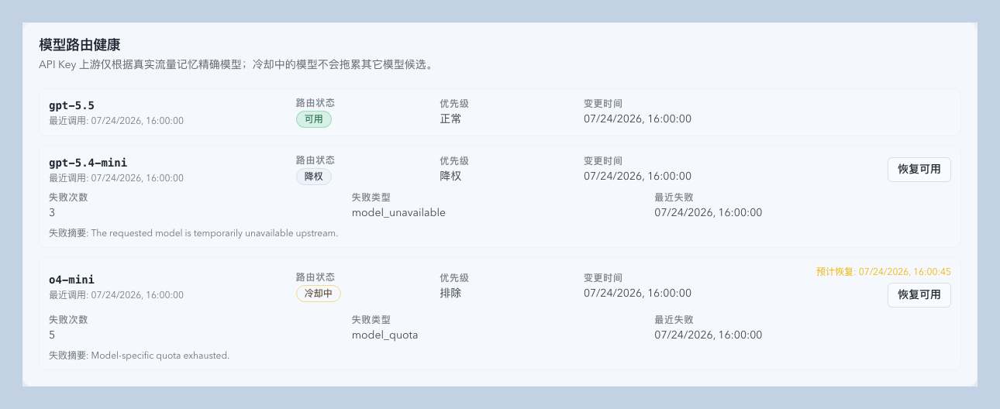
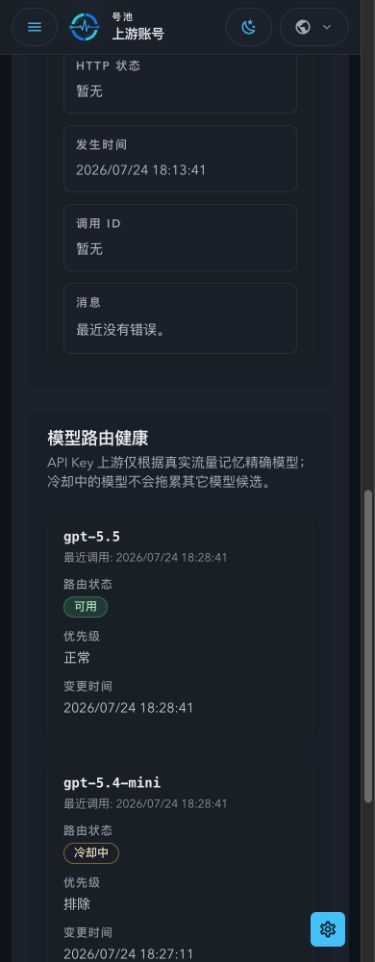
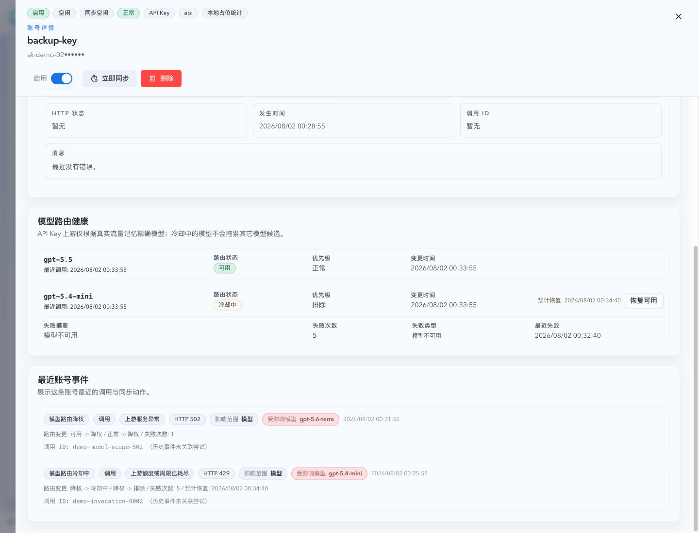
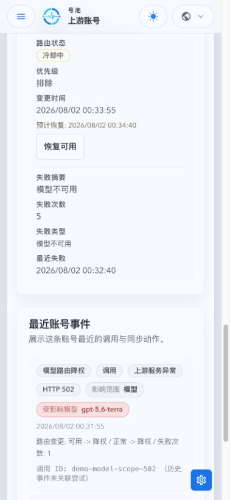

# API Key 上游按模型路由健康管理（#zr9jd）

> 当前有效规范以本文为准；实现覆盖与当前状态见 `./IMPLEMENTATION.md`，关键演进原因见 `./HISTORY.md`。

## 背景 / 问题陈述

API Key 上游账号当前以账号维度记录路由失败和冷却。单个模型不可用时，账号整体会被降级，导致同一账号上仍可用的模型无法继续承接请求。健康与事件视图也无法说明具体模型、路由优先级和恢复时间。

## 目标 / 非目标

### Goals

- 仅对 API Key 上游按请求中的精确模型名维护动态路由健康状态。
- 让模型失败只影响该账号与该模型组合，并保留其他模型的账号资格。
- 在账号详情健康与事件页展示模型路由状态、优先级、变更时间、预计恢复时间和具体变更事件。
- 支持单模型手动恢复，且不覆盖静态模型规则或账号级禁用状态。

### Non-goals

- 不改变 OAuth 上游的账号级健康语义。
- 不发送后台探测请求，不做历史调用回放或初始状态回填。
- 不合并基础模型名与日期快照，不绕过 `availableModels` 或 `systemDeniedModels`。

## 范围（Scope）

### In scope

- 模型状态表、事件字段、七天清理和候选排序。
- API Key 模型错误分类、真实调用成功/失败观察和并发时序保护。
- 模型状态读取、单模型 reset API，以及账号详情健康与事件 UI。
- Storybook 状态/交互覆盖和 mock-only `ui_demo` 视觉证据。

### Out of scope

- OAuth 模型级探测或状态表。
- 近七天以前的历史模型回填。
- 账号级认证、付费硬错误的既有分类调整。
- 修改当前请求的 retry/failover 预算或静态模型规则。
- 迁移既有账号临时失败状态或删除历史事件。

## 需求（Requirements）

### MUST

- 状态主键为 `account_id + exact_model`，仅由真实请求建立或更新，模型记录最后一次真实调用超过七天后清理。
- 状态为 `available/degraded/cooling_down`，优先级为 `normal/demoted/excluded`。
- 明确模型错误，以及具备精确请求模型的 API Key 5xx、429、逻辑过载和 transport/handshake/stream 临时失败：前四次降权，第五次或连续失败窗口达到 30 秒后进入冷却；冷却从 15 秒指数增长，最长 60 秒。
- API Key 临时失败不得写账号 `cooldown_until`、账号连续临时失败计数或账号级临时 action，也不得删除 sticky route。401/403/402 等明确认证或付费硬错误继续走账号级逻辑；OAuth 账号级健康语义与静态模型规则保持不变。
- API Key 调用缺少精确模型、HTTP 413、其他未列明非硬错误或后台同步临时失败时，只保留调用、尝试或同步诊断，不修改账号或模型健康，也不创建 `unknown` 模型。
- 继承后的 `statusChangeReasons` 开关继续控制同原因是否改变健康状态：对 API Key 可归属临时失败控制模型状态，对 OAuth 和明确账号硬错误控制账号状态；关闭时仅保留中性诊断事件。
- 仅状态、优先级、冷却、恢复或手动 reset 变化时写结构化事件。

### SHOULD

- 状态更新使用请求开始时间或等价版本保护，较晚完成的请求不得覆盖较新的失败状态。
- 冷却到期后允许作为降权候选重新尝试，成功后清零失败计数并恢复正常优先级。

## 功能与行为规格（Functional/Behavior Spec）

- 请求开始时记录精确模型的 `last_seen_at`；成功观察清除该模型动态失败状态。
- 模型级失败更新该模型的失败计数、失败原因和路由状态，不修改账号级 `cooldown_until`、账号连续失败计数或 sticky route。
- 临时失败模型事件保留原始 HTTP 状态、reason code、failure kind、attempt 关联和精确模型；现有 JSON 字段与数据库 schema 保持兼容。
- reset 只清除指定 API Key 账号的指定模型动态状态，恢复 `available/normal`，并记录 `manual_reset` 事件。
- 健康页只展示近七天真实调用出现的模型；OAuth 账号不展示模型路由状态卡。
- 账号事件优先使用事件自身模型；缺失时从关联的上游尝试或调用记录回填请求模型。请求模型只说明触发事件的流量上下文，不改变事件原有的账号级或模型级影响边界。
- 健康事件不展示独立的请求模型标签。影响信息禁止使用自然语言整句，统一使用结构化 CHIP 字段：API Key 模型路由事件只展示“影响范围=模型、受影响模型=<模型名>”；OAuth 临时失败与认证/付费等账号级事件展示“影响范围=账号、受影响模型=全部”。影响 CHIP 与事件类型、来源、错误码和时间归入同一元信息行，宽度不足时整体自然换行。事件不得推断或展示其他模型的当前状态。

## 接口契约（Interfaces & Contracts）

### 接口清单（Inventory）

| 接口（Name）                                                       | 类型（Kind） | 范围（Scope） | 变更（Change） | 契约文档（Contract Doc） | 负责人（Owner） | 使用方（Consumers） | 备注（Notes）                                                                           |
| ------------------------------------------------------------------ | ------------ | ------------- | -------------- | ------------------------ | --------------- | ------------------- | --------------------------------------------------------------------------------------- |
| `GET /api/pool/upstream-accounts/:account_id/model-routing`        | HTTP         | external      | New            | None                     | backend         | account detail      | API Key only; returns seven-day states                                                  |
| `POST /api/pool/upstream-accounts/:account_id/model-routing/reset` | HTTP         | external      | New            | None                     | backend         | health tab          | Body contains exact `model`                                                             |
| `UpstreamAccountActionEvent` model-routing fields                  | JSON         | external      | Modify         | None                     | backend/web     | event list          | Model falls back through event, attempt, invocation; routing fields define impact scope |

## 验收标准（Acceptance Criteria）

- Given one API Key has model A and B, When A reaches cooldown, Then B remains eligible and the account is not globally cooled down by A's model error.
- Given an API Key request with an exact model receives a 5xx, 429, logical overload, or transport-shaped failure, When it is recorded, Then only that exact model is degraded or cooled down and the account health fields and sticky route remain unchanged.
- Given the same API Key failure lacks an exact model, is HTTP 413, is another non-hard error, or comes from background sync, When it is recorded, Then diagnostics remain available without account/model health mutation or an `unknown` model row.
- Given a 401/403/402 hard failure or an OAuth failure, When it is recorded, Then the existing account-level behavior remains unchanged.
- Given the effective status-change reason toggle is disabled, When the matching temporary API Key failure occurs, Then the model state remains unchanged and only a neutral diagnostic event is recorded.
- Given an account event is linked to an attempt or invocation with a known request model, When event detail or the global event list is read, Then the event exposes that request model even if the event row itself has no model.
- Given an OAuth or hard account-level event has a request model, When the health tab renders it, Then the UI exposes structured impact fields `scope=account` and `affected models=all` without displaying a separate request-model label or an empty model-route transition.
- Given an API Key 502 model-routing event is rendered, Then the UI exposes `scope=model`, the exact affected model and the original HTTP/failure evidence without claiming all models are affected.
- Given a model-routing event has an affected model, When the health tab renders it, Then the UI exposes only the structured impact fields `scope=model` and `affected model=<name>` without a natural-language impact sentence or any claim about other models.
- Given a model-routing event carries route transition fields, When the health tab renders it, Then the UI identifies the affected model through the structured impact fields and shows the concrete route transition.
- Given a recent account event contains known action, source, reason, route-state, or priority protocol values, When the health tab renders it, Then every value uses the active locale dictionary and the raw protocol value is never displayed; unknown values render as the localized unknown label, and raw backend reason messages do not duplicate localized reason chips.
- Given model routing health contains a known failure kind, When the health card renders it, Then it shows the localized failure-kind label and never renders the raw failure kind or backend failure message.
- Given a successful, informational, recovered, or reset event has no active routing failure, When the health tab renders it, Then the UI omits the impact fields instead of claiming an active impact; model recovery/reset events still identify the affected model in their routing transition.
- Given a model is in a degraded or cooling state, When reset is called, Then only that model becomes `available/normal`, its ETA is cleared, and a structured reset event appears.
- Given no call for a model for seven days, When model retention runs, Then that model state is removed.
- Given the health tab is rendered on desktop or mobile, Then model status, change time, ETA, failure summary, and reset action remain readable without overflow.

## 验收清单（Acceptance checklist）

- [x] 模型状态与账号级状态隔离。
- [x] 冷却、恢复、并发时序和七天清理已覆盖测试。
- [x] API 与事件字段已稳定。
- [x] 健康与事件 UI、Storybook 和视觉证据已覆盖。

## 非功能性验收 / 质量门槛（Quality Gates）

### Testing

- Rust unit/stateful tests for classification, state transitions, candidate selection, reset and retention.
- Frontend Vitest/RTL tests for mixed model states and reset/error flows.

### UI / Storybook (if applicable)

- Add a docs-first model-routing state gallery with available, degraded, cooling, empty, and reset-error states.
- Add `play` coverage for successful and failed reset interactions.

### Quality checks

- `cargo fmt --check`, `cargo check`, `cargo test`, `cd web && bun run test`, `bun run test-storybook`, and web build.

## Visual Evidence

Storybook覆盖=通过（组件级）；页面级使用 ui_demo
视觉证据目标源=ui_demo
视觉证据=存在
空白裁剪=无需裁剪（`trim_only`；视口截图边缘无可安全裁剪空白）
聊天回图=已展示
证据落盘=已落盘
证据绑定sha=本次变更提交（提交后回填）
requested_viewport=desktop 1440x1100; mobile 393x852
viewport_strategy=ui-demo-source（Chrome viewport override）
capture_scope=mock-only demo 中账号详情“健康与事件”页面视口

页面级视觉证据目标源=mock-only ui_demo
页面级视觉证据=存在
页面级聊天回图=已展示
页面级 requested_viewport=desktop 1440x1100; mobile 393x852
页面级 capture_scope=API Key 账号详情“健康与事件”，HTTP 502 事件显示影响范围为模型、受影响模型为 gpt-5.6-terra，不声明账号或全部模型受影响

PR: include

PR: include

## Related PRs

- None

## 风险 / 开放问题 / 假设（Risks, Open Questions, Assumptions）

- 动态模型状态不得覆盖静态路由规则或账号级认证/禁用状态。
- 未做历史回填意味着部署后模型列表从新请求开始建立。

## 参考（References）

- `docs/specs/r4p9x-upstream-account-policy-inheritance/SPEC.md`
- `docs/specs/ykhfu-web-demo/SPEC.md`
- `src/upstream_accounts/routing/failure_recording.rs`
