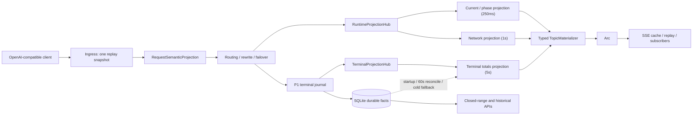

# 系统设计概览

本项目通过 OpenAI 兼容 `/v1/*` HTTP 代理与可选 WebSocket 代理采集运行事实，以 SQLite 保存 durable terminal/history，并通过 REST 与 SSE 向 Web App 提供历史和实时视图。高频运行数据面遵循 ingress、projection、delivery、persistence/reconcile 五层边界；SQLite 不是 Dashboard 当前态的请求内事实源。

## 1. 数据面总览

### 强制依赖方向

- ingress 只生成一份 replay snapshot 与一份不可变语义投影；路由、raw capture 和上游准备复用它们。
- projection 接收事件并渲染当前态；健康 `DashboardLiveProjection::snapshot()` 不接受数据库连接。
- delivery 只接收已序列化的不可变 frame；cache、replay、broadcast 与 subscriber 不构建业务 payload。
- persistence/reconcile 负责 durable terminal、启动恢复、周期对账、closed-range exact 与明确冷回退。
- System Status 的 runtime health 只读取内存计数器，不为诊断新增 SQL。

## 2. 代理请求入口

- `/v1/*` 请求先建立 `PoolReplayBodySnapshot`。不超过 `1 MiB` 时可驻留内存，超过阈值必须 file-backed；请求总上限保持 `256 MiB`。
- 单次 `RequestSemanticProjection` 提取 model、stream、sticky/prompt-cache key、reasoning、service tier、encrypted/image/compaction 与 rewrite 需求。
- 需要 `include_usage` 等 rewrite 时，使用有界流式转换，业务缓冲不超过 `64 KiB`。失败沿用原始 body 的 fail-open 行为并记录原因。
- response raw capture、terminal journal 与 runtime projection 均不得阻塞已经可转发的代理响应。

## 3. 运行态与 Terminal 投影

- `RuntimeProjectionHub` 保存 current-state：在途调用、phase、network、账号 metadata，以及 Dashboard 所需 live overlay。
- `TerminalProjectionHub` 保存 terminal admission/P1 ACK 与消费者 cursor，供 Dashboard totals、长期统计和 timeseries 增量物化。
- P1 只保障 raw terminal 与 journal ACK；派生 rollup 和 repair 通过 P2 并受 SQLite pressure gate 控制。
- writer queue 的 depth/bytes 由单一 accounting owner 管理。P1 生成 P2 工作时必须转移 ownership，不得跨阶段裸减计数。
- 代理热写由 `ProxySqliteWriteCoordinator` 单点仲裁，优先级为 P1 terminal、同步 attempt/route、P2 derived、retention maintenance。同步写仍等待并返回原结果，但不得绕过协调器直接竞争 SQLite writer；retention 只在高优先级空闲时正常提交，持续饥饿时也只能按受限 fairness token 提交一个短事务。expiry/manifest、raw owner reference、backfill wake 与 raw inventory reset 都属于同一 maintenance 域，并按各自预算切片。
- P1 使用 20ms admission、最多 32 条或 4 MiB 的短批次；busy/locked 批次完整保留并按 250ms、500ms、1s、2s、5s 退避。只有事务提交后才能推进 journal 与 projection ACK。
- P2 仅在 P1 与同步等待者为空时运行；首个派生事件建立固定 250ms 合并 deadline，后续事件不延长。pressure cooldown 按 gate 剩余时间休眠，background eligibility 变化或实际 SQLite 失败退避才再次唤醒，禁止复用 P1 的 20ms ticker 轮询。rollup cursor 每次只推进一个有界 chunk，剩余工作重新排队。
- `prompt-cache.window` 与 `prompt-cache.sticky.window` 在 owner 订阅期间维护 topic-scoped 内存投影。通用 Records 只追加去重 delta，500ms 固定 deadline 从 last-good baseline 更新 lifetime、账号、recent 和 24h points；初始订阅、60 秒 pressure-gated reconcile 与 dirty 恢复才允许完整 hydrate。

## 4. Dashboard 与 SSE

- Dashboard current/phase、network/rate、terminal totals 分别以 `250ms`、`1s`、`5s` 固定 deadline 合并，SQLite baseline 每 `60s` 对账。各切片独立推进 revision，network 更新不得唤醒完整 activity/summary projection。
- 健康 `today / 1d / 7d` live render 只读 Runtime/Terminal Projection；已有 last-good 时失败不会在订阅请求链同步查库。
- 高频 runtime mutation 统一进入 typed event bus；router 先按活跃 topic 依赖筛选 `TopicWork`，再由 projection/materializer 处理。`ApiInvocation`、通用 JSON 和完整 topic snapshot 不得进入热总线。
- startup backfill 由 terminal/archive/payload/coverage 事件唤醒并持有动态 `next_due`；无 actionable work 不查询数据库、不写 `system_task_runs`，source-unavailable 任务仅每日做有界复检。
- `yesterday / previous7d / usage` 与其他 closed-range 查询继续使用 exact DB builder。
- typed materializer 根据 topic dependency revision tuple 生成一个 `Arc<SerializedTopicFrame>`。delivery 不接收完整业务 snapshot 或通用 JSON overlay；subscriber 数量只增加引用，不增加 builder 或 serialization 次数。
- Activity、summary 与 network topic 已使用 typed materializer；working-conversations、parallel-work open range 与 open-window timeseries 仍是待迁移的 Dashboard HotProjection。在迁移完成前，它们不得被视为健康高频数据面的已完成部分，具体合同见 [`dashboard-hot-topic-projection`](./specs/dashboard-hot-topic-projection/SPEC.md)。
- 第一位 owner subscriber 激活 producer；无 owner subscriber 时停止周期构建并标记 dirty，重新订阅时恢复 fresh snapshot/replay 语义。

## 5. 持久化与历史数据

- `codex_invocations` 保存 live/retained invocation durable facts，并通过 `source` 区分历史 `xy` 与当前 `proxy`。
- SQLite rollup 保存长期统计、账号活动、usage breakdown、timeseries 与 parallel-work 的可恢复聚合；archive 承担超出 live retention 的历史详情。
- 历史 HTTP API 从 rollup、archive 与 exact boundary 查询构建；不得把历史重建工作放回 Dashboard 当前态热路径。
- 价格、归属、archive rewrite/restore 等修正通过目标桶 repair 收敛，而不是周期性重扫宽时间窗。
- 账号窗口 hydrate 使用私有 StoragePlane。新 terminal 将账号归属持久化到 `codex_invocations.upstream_account_id`；读侧先按账号和窗口范围合并 minute/hourly rollup，再读取范围边界、明确 coverage hole 或 cursor 后 tail。ID cursor 不能代替时间桶 coverage；同账号的 sibling window coverage 也不能吞掉 partial-hour exact tail。缺 hourly coverage 的完整小时只使用其精确 raw bucket，不能同时折叠已有 partial minute rollup。schema-startup 的 legacy readiness marker 使 owner 请求不扫描 payload；rolling、reset-anchored 与 future-reset 回填使用互不别名的 progress identity，并通过 maintenance admission 执行受预算约束的 hourly rebuild。legacy archive 缺少结构化账号列时从 payload 恢复归属；archive exact fallback 与 bootstrap rebuild 都必须验证 manifest hash。无准确 baseline 或无法验证配置时显式返回 `202 preparing`，不能以全窗 raw/archive 读取或不兼容 last-good 换取表面的成功响应。

## 6. 健康与回退

- typed runtime mutation bus 是 Dashboard 与 Prompt Cache 的唯一生产热路径；`DASHBOARD_RUNTIME_PROJECTION_MODE=legacy` 和 `PROMPT_CACHE_TOPIC_PROJECTION_MODE=legacy` 不再可用，不能重新启用完整记录广播或全窗 topic 重建。
- `PROXY_REQUEST_SEMANTIC_PIPELINE_MODE=auto|legacy` 控制请求语义流水线；默认 `auto`。
- `PROXY_SQLITE_WRITE_COORDINATOR_MODE=coordinated|legacy` 控制代理热写协调器；默认 `coordinated`，legacy 只保留一个发布周期用于显式回滚。
- `GET /api/system/status` 的 additive `runtimePressureHealth` 展示 Dashboard producer、request parsing/materialization、RSS/Swap、allocator 与 writer accounting 健康。
- `runtimePressureHealth.storagePlane` 仅从内存 counters 显示账号窗口的 selection、singleflight、coverage、backfill 与 last-good 健康；状态页不得因该诊断新增 SQL。
- accounting violation、live-path DB read、whole-body materialization、cadence miss、subscription lag/skipped 或重复 serialization 必须改变健康状态并可被结构化 telemetry 判责。
- 运行镜像默认 `MALLOC_ARENA_MAX=8`，部署可显式覆盖；该设置只限制 glibc arena 保留，不改变业务并发。

## 7. 对外接口

- `GET /api/invocations` 与 `/api/stats*` 提供历史、summary、timeseries、Dashboard/account activity 与长期统计。
- `GET /events` 提供 topic-based `snapshot / replay / live` SSE。
- `GET /api/system/status` 提供系统、projection、raw metrics 与 runtime pressure 的只读健康信息。
- Dashboard、统计、raw detail 与 SSE 的既有字段、topic、排序、range 和 recent 语义保持兼容；仅 System Status health 允许 additive 扩展。

## 8. 性能门槛

- 10,000 次 runtime mutation 后健康 live render 的数据库查询数为零。
- 同 topic 1 到 N 个 subscriber 不增加 builder 或 serialization 次数。
- `16/64 MiB` file-backed 请求只有一次语义解析，业务峰值缓冲不超过 `64 KiB`。
- Dashboard current-state 更新 p95 不超过 `400ms`；terminal totals 在 `5s` 内可见。
- 生产 Dashboard tab A/B 的 CPU 增量不超过 10 个百分点；连续 12 小时 RSS p95 不超过 `2 GiB` 且 Swap 不持续增长。

实现细节、迁移状态和测试证据见 [`docs/specs/high-frequency-runtime-data-plane`](./specs/high-frequency-runtime-data-plane/SPEC.md)。
