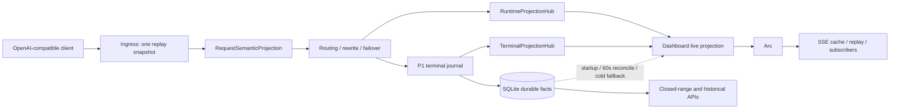

# 系统设计概览

本项目通过 OpenAI 兼容 `/v1/*` HTTP 代理与可选 WebSocket 代理采集运行事实，以 SQLite 保存 durable terminal/history，并通过 REST 与 SSE 向 Web App 提供历史和实时视图。高频运行数据面遵循 ingress、projection、delivery、persistence/reconcile 五层边界；SQLite 不是 Dashboard 当前态的请求内事实源。

## 1. 数据面总览

### 强制依赖方向

- ingress 只生成一份 replay snapshot 与一份不可变语义投影；路由、raw capture 和上游准备复用它们。
- projection 接收事件并渲染当前态；健康 `DashboardLiveProjection::snapshot()` 不接受数据库连接。
- delivery 只接收已序列化的不可变 frame；cache、replay、broadcast 与 subscriber 不构建业务 payload。
- persistence/reconcile 负责 durable terminal、启动恢复、周期对账、closed-range exact 与明确冷回退。
- System Status 的 runtime health 只读取内存计数器，不为诊断新增 SQL。

## 2. 代理请求入口

- `/v1/*` 请求先建立 `PoolReplayBodySnapshot`。不超过 `1 MiB` 时可驻留内存，超过阈值必须 file-backed；请求总上限保持 `256 MiB`。
- 单次 `RequestSemanticProjection` 提取 model、stream、sticky/prompt-cache key、reasoning、service tier、encrypted/image/compaction 与 rewrite 需求。
- 需要 `include_usage` 等 rewrite 时，使用有界流式转换，业务缓冲不超过 `64 KiB`。失败沿用原始 body 的 fail-open 行为并记录原因。
- response raw capture、terminal journal 与 runtime projection 均不得阻塞已经可转发的代理响应。

## 3. 运行态与 Terminal 投影

- `RuntimeProjectionHub` 保存 current-state：在途调用、phase、network、账号 metadata，以及 Dashboard 所需 live overlay。
- `TerminalProjectionHub` 保存 terminal admission/P1 ACK 与消费者 cursor，供 Dashboard totals、长期统计和 timeseries 增量物化。
- P1 只保障 raw terminal 与 journal ACK；派生 rollup 和 repair 通过 P2 并受 SQLite pressure gate 控制。
- writer queue 的 depth/bytes 由单一 accounting owner 管理。P1 生成 P2 工作时必须转移 ownership，不得跨阶段裸减计数。

## 4. Dashboard 与 SSE

- Dashboard current-state 以 `250ms` 固定 deadline 合并，terminal totals 以 `5s` 合并，SQLite baseline 每 `60s` 对账。
- 健康 `today / 1d / 7d` live render 只读 Runtime/Terminal Projection；已有 last-good 时失败不会在订阅请求链同步查库。
- `yesterday / previous7d / usage` 与其他 closed-range 查询继续使用 exact DB builder。
- 每个 topic revision 生成一个 `Arc<SerializedTopicFrame>`。subscriber 数量只增加引用，不增加 builder 或 serialization 次数；fingerprint 未变化时不推进 cursor。
- 第一位 owner subscriber 激活 producer；无 owner subscriber 时停止周期构建并标记 dirty，重新订阅时恢复 fresh snapshot/replay 语义。

## 5. 持久化与历史数据

- `codex_invocations` 保存 live/retained invocation durable facts，并通过 `source` 区分历史 `xy` 与当前 `proxy`。
- SQLite rollup 保存长期统计、账号活动、usage breakdown、timeseries 与 parallel-work 的可恢复聚合；archive 承担超出 live retention 的历史详情。
- 历史 HTTP API 从 rollup、archive 与 exact boundary 查询构建；不得把历史重建工作放回 Dashboard 当前态热路径。
- 价格、归属、archive rewrite/restore 等修正通过目标桶 repair 收敛，而不是周期性重扫宽时间窗。

## 6. 健康与回退

- `DASHBOARD_RUNTIME_PROJECTION_MODE=auto|legacy` 控制 Dashboard 投影路径；默认 `auto`。
- `PROXY_REQUEST_SEMANTIC_PIPELINE_MODE=auto|legacy` 控制请求语义流水线；默认 `auto`。
- `GET /api/system/status` 的 additive `runtimePressureHealth` 展示 Dashboard producer、request parsing/materialization、RSS/Swap、allocator 与 writer accounting 健康。
- accounting violation、live-path DB read、whole-body materialization、持续 stale 或重复 serialization 必须可被结构化 telemetry 判责。
- 运行镜像默认 `MALLOC_ARENA_MAX=8`，部署可显式覆盖；该设置只限制 glibc arena 保留，不改变业务并发。

## 7. 对外接口

- `GET /api/invocations` 与 `/api/stats*` 提供历史、summary、timeseries、Dashboard/account activity 与长期统计。
- `GET /events` 提供 topic-based `snapshot / replay / live` SSE。
- `GET /api/system/status` 提供系统、projection、raw metrics 与 runtime pressure 的只读健康信息。
- Dashboard、统计、raw detail 与 SSE 的既有字段、topic、排序、range 和 recent 语义保持兼容；仅 System Status health 允许 additive 扩展。

## 8. 性能门槛

- 10,000 次 runtime mutation 后健康 live render 的数据库查询数为零。
- 同 topic 1 到 N 个 subscriber 不增加 builder 或 serialization 次数。
- `16/64 MiB` file-backed 请求只有一次语义解析，业务峰值缓冲不超过 `64 KiB`。
- Dashboard current-state 更新 p95 不超过 `400ms`；terminal totals 在 `5s` 内可见。
- 生产 Dashboard tab A/B 的 CPU 增量不超过 10 个百分点；连续 12 小时 RSS p95 不超过 `2 GiB` 且 Swap 不持续增长。

实现细节、迁移状态和测试证据见 [`docs/specs/high-frequency-runtime-data-plane`](./specs/high-frequency-runtime-data-plane/SPEC.md)。
